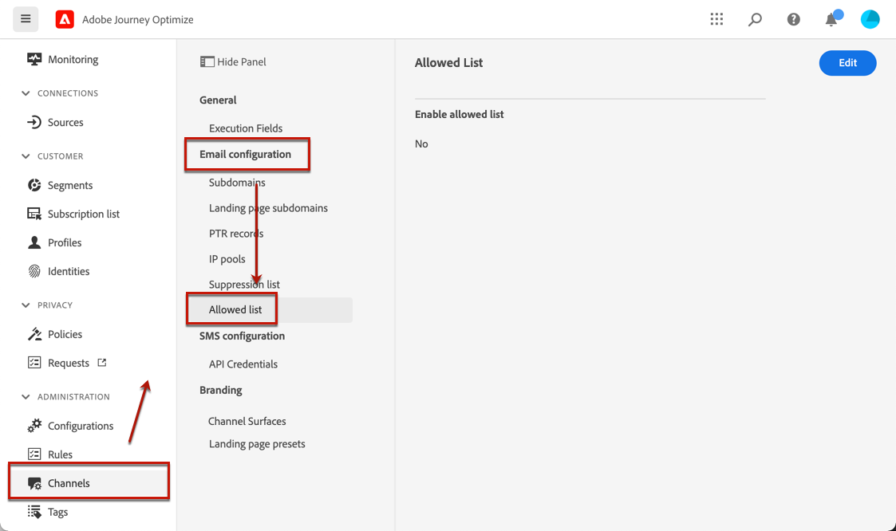
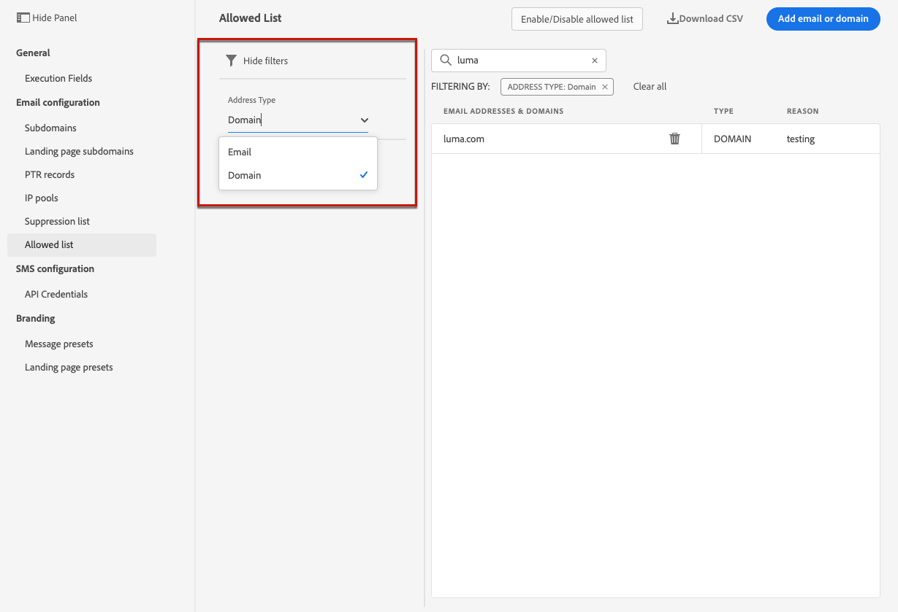
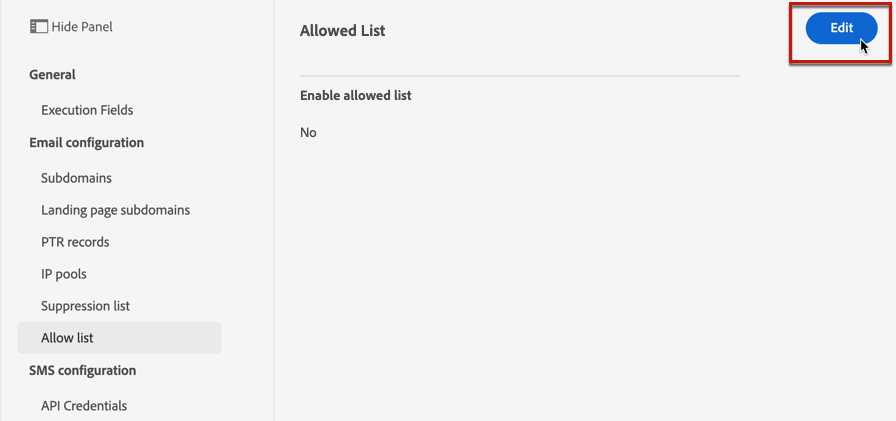
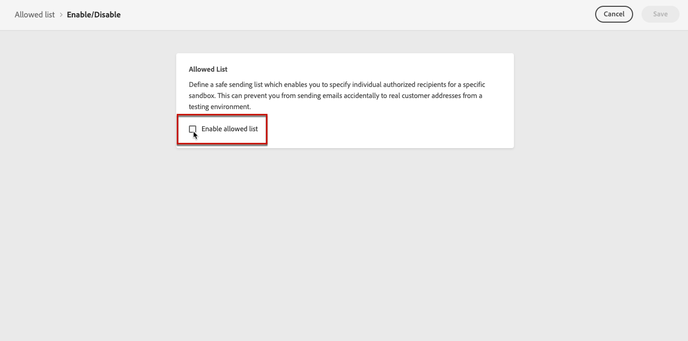
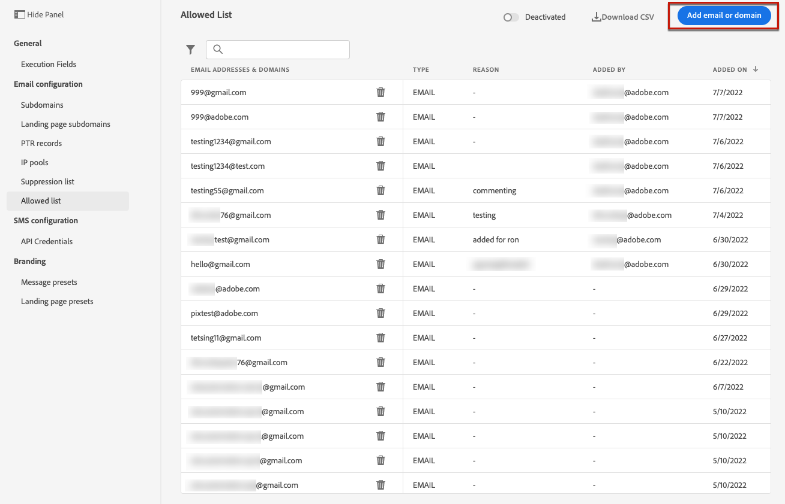
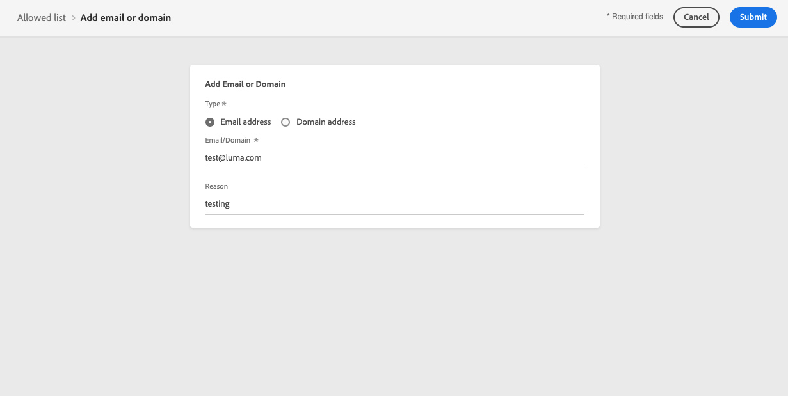

# Allowed list {#allow-list}

It is possible to define a specific sending-safe list at the [sandbox](../administration/sandboxes.md) level, to have a secured environment for testing purpose.

For example, on a non-production instance, where mistakes can occur, the allowed list ensures you have no risk of sending out unwanted messages to your customers.

>[!NOTE]
>
>This feature is available on production and non-production sandboxes.

The allowed list enables you to specify individual email addresses or domains that will be the only recipients or domains authorized to receive the emails you are sending from a specific sandbox. This can prevent you from sending emails accidentally to real customer addresses when you are in a testing environment.

>[!CAUTION]
>
>This feature only applies to the email channel.

## Access the allowed list {#access-allowed-list}

To access the detailed list of allowed email addresses and domains, go to **[!UICONTROL Administration]** > **[!UICONTROL Channels]** > **[!UICONTROL Email configuration]**, and select **[!UICONTROL Allowed list]**.



>[!CAUTION]
>
>Permissions to view, export and manage the allowed list are restricted to [Journey Administrators](../administration/ootb-product-profiles.md#journey-administrator). Learn more on managing [!DNL Journey Optimizer] users' access rights in [this section](../administration/permissions-overview.md).

To export the allowed list as a CSV file, select the **[!UICONTROL Download CSV]** button.

Use the **[!UICONTROL Delete]** button to permanently remove an entry.

You can search on the email addresses or domains, and filter on the **[!UICONTROL Address type]**. Once selected, you can clear the filter displayed on top of the list.



## Enable the allowed list {#enable-allow-list}

To enable the allowed list, follow the steps below.

1. Access the  **[!UICONTROL Channels]** > **[!UICONTROL Email configuration]** > **[!UICONTROL Allow list]** menu.

1. Click **[!UICONTROL Enable/Disable allowed list]**.

    

1. Select **[!UICONTROL Enable allowed list]**.

    

1. Click **[!UICONTROL Save]**. The allowed list is enabled.

The allowed list logic applies when the feature is enabled. Learn more in [this section](#logic).

>[!NOTE]
>
>When enabled, the allowed list feature is honored when executing journeys, but also when testing messages with [proofs](../design/preview.md#send-proofs) and testing journeys using the [test mode](../building-journeys/testing-the-journey.md).

## Add entities to the allowed list {#add-entities}

To add new email addresses or domains to the allowed list for a specific sandbox, you can either [manually populate the list](#manually-populate-list), or use an [API call](#api-call-allowed-list).

>[!NOTE]
>
>The allowed list can contain up to 1,000 entries.

### Manually populate the allowed list {#manually-populate-list}

>[!CONTEXTUALHELP]
>id="ajo_admin_allowed_list_add"
>title="Add addresses or domains to the allowed list"
>abstract="You can manually add new email addresses or domains to the allowed list by selecting them one by one."

You can manually populate the [!DNL Journey Optimizer] allowed list by adding an email address or a domain through the user interface.

>[!NOTE]
>
>You can only add one email address or domain at a time.

To do this, follow the steps below.

1. Select the **[!UICONTROL Add email or domain]** button.

    

1. Choose the address type: **[!UICONTROL Email address]** or **[!UICONTROL Domain address]**.

1. Enter the email address or domain you want to send emails to.

    >[!NOTE]
    >
    >Make sure you enter a valid email address (such as abc@company.com) or domain (such as abc.company.com).

1. Specify a reason if needed.

    

    >[!NOTE]
    >
    >All ASCII characters comprised between 32 and 126 are allowed in the **[!UICONTROL Reason]** field. The full list can be found on [this page](https://en.wikipedia.org/wiki/Wikipedia:ASCII#ASCII_printable_characters){target="_blank"} for example.

1. Click **[!UICONTROL Submit]**.

### Add entities using an API call {#api-call-allowed-list}

To populate the allowed list, you can also call the suppression API with the `ALLOWED` value for the `listType` attribute. For example:


You can perform the **Add**, **Delete** and **Get** operations.

Learn more on making API calls in the [Adobe Experience Platform APIs](https://experienceleague.adobe.com/docs/experience-platform/landing/platform-apis/api-guide.html){target="_blank"} reference documentation.

## Allowed list logic {#logic}

When the allowed list is [enabled](#enable-allow-list), the following logic applies:

* If the allowed list is **empty**, no email will be sent out.

* If an entity is **on the allowed list**, and not on the suppression list, the email can be sent to the corresponding recipient(s). However, if the entity is also on the [suppression list](../reports/suppression-list.md), the corresponding recipient(s) will not receive the email, the reason being **[!UICONTROL Suppressed]**.

* If an entity is **not on the allowed list** (and not on the suppression list), the corresponding recipient(s) will not receive the email, the reason being **[!UICONTROL Not allowed]**.

>[!NOTE]
>
>The profiles with **[!UICONTROL Not allowed]** status are excluded during the message sending process. Therefore, while the **Journey reports** will show these profiles as having moved through the journey ([Read Segment](../building-journeys/read-segment.md) and [message activities](../building-journeys/journeys-message.md)), the **Email reports** will not include them in the **[!UICONTROL Sent]** metrics as they are filtered out prior to email sending.
>
>Learn more on the [Live Report](../reports/live-report.md) and [Global Report](../reports/global-report.md).

## Exclusion reporting {#reporting}

When this feature is enabled on a non-production sandbox, you can retrieve email addresses or domains that were excluded from a sending because they were not on the allowed list. To do this, you can use the [Adobe Experience Platform Query Service](https://experienceleague.adobe.com/docs/experience-platform/query/api/getting-started.html){target="_blank"} to make the API calls below.

To get the **number of emails** that were not sent because the recipients were not on the allowed list, use the following query:

```sql
SELECT count(distinct _id) from cjm_message_feedback_event_dataset WHERE
_experience.customerJourneyManagement.messageExecution.messageExecutionID = '<MESSAGE_EXECUTION_ID>' AND
_experience.customerJourneyManagement.messageDeliveryfeedback.feedbackStatus = 'exclude' AND
_experience.customerJourneyManagement.messageDeliveryfeedback.messageExclusion.reason = 'EmailNotAllowed'
```

To get the **list of email addresses** that were not sent because the recipients were not on the allowed list, use the following query:

```sql
SELECT distinct(_experience.customerJourneyManagement.emailChannelContext.address) from cjm_message_feedback_event_dataset WHERE
_experience.customerJourneyManagement.messageExecution.messageExecutionID IS NOT NULL AND
_experience.customerJourneyManagement.messageDeliveryfeedback.feedbackStatus = 'exclude' AND
_experience.customerJourneyManagement.messageDeliveryfeedback.messageExclusion.reason = 'EmailNotAllowed'
```
