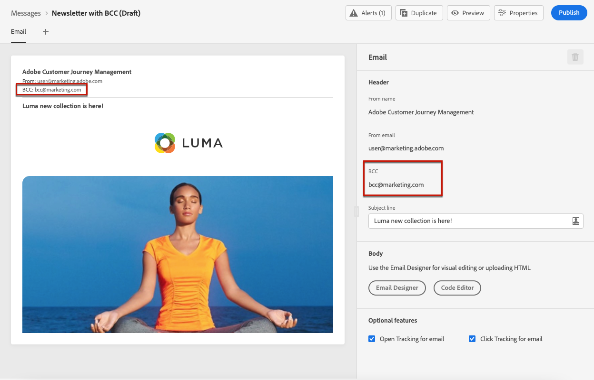
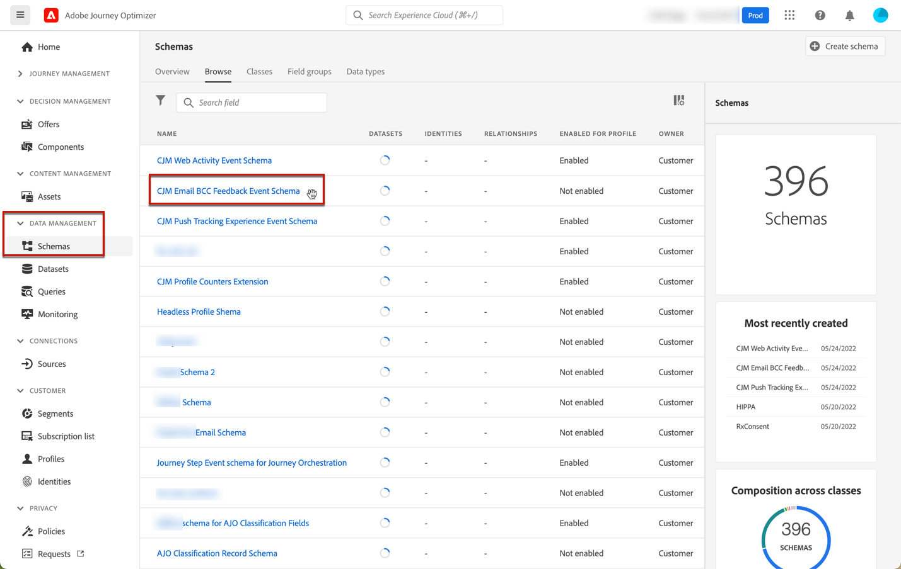
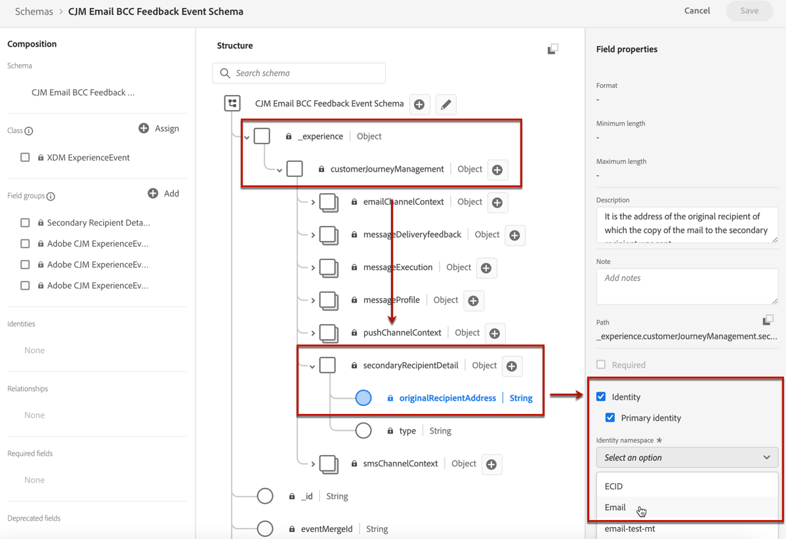
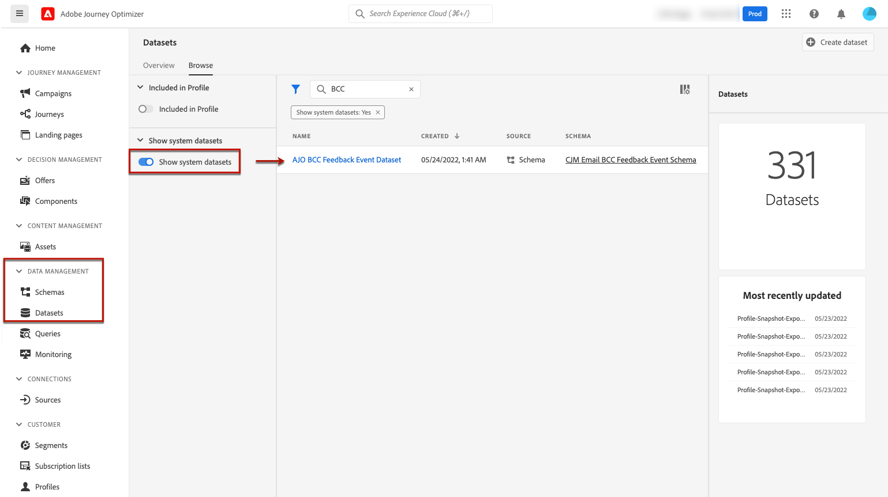
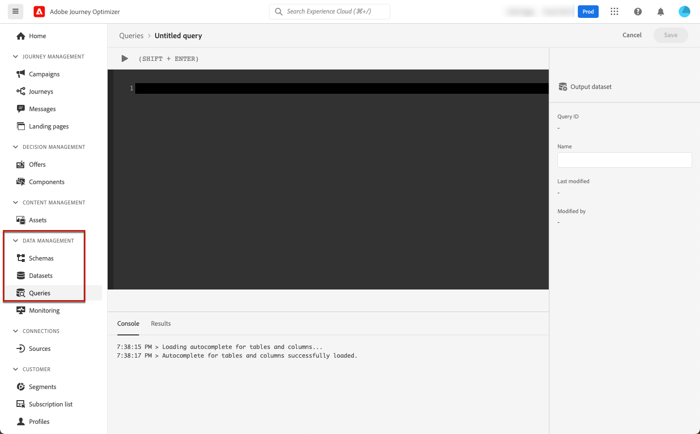
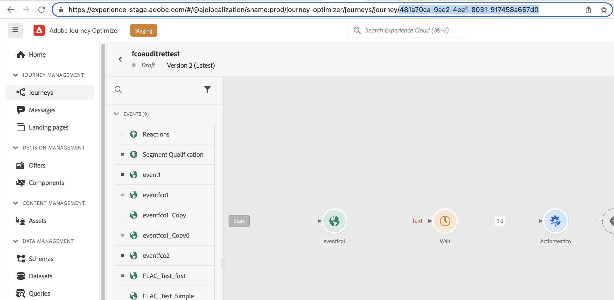

# Support for archiving {#archiving-support}

## How to archive messages {#about-archiving}

Regulations such as HIPAA require that [!DNL Journey Optimizer] should provide a way to archive messages sent to individuals. Indeed, if your customers raise a claim, they should have the ability to get a copy of the sent message for verification purpose.

* For the email channel, [!DNL Journey Optimizer] provides a built-in BCC email capability. [Learn more](#bcc-email)

* Additionnaly, for all channels, you can use the 'Template' field in the **Entity Dataset**, which contains the details of the non-personalized message templates. Export the dataset with this field to save metadata such as: who sent the message, to whom and when. Note that personalized data is not exported - only the template (format and structure of the message) is taken into account. [Learn more](../start/datasets-query-examples.md#entity-dataset)

>[!NOTE]
>
>[!DNL Journey Optimizer] does not own support for SMS archival requirement. For dedicated archival support, work with your SMS vendor (Synch or Twilio).

## How to use BCC for emails {#bcc-email}

>[!CONTEXTUALHELP]
>id="ajo_admin_preset_bcc"
>title="Define a BCC email address"
>abstract="You can keep a copy of sent emails by sending them to a BCC inbox. Enter the email address of your choice so that every email sent is blind-copied to this BCC address. Note that the BCC address domain should not be same as any subdomain delegated to Adobe. This feature is optional."

You can send an identical copy (or blind carbon copy) of an email sent by [!DNL Journey Optimizer] to a BCC inbox. This optional feature allows you to retain copies of email communications you send to your users for compliance and/or archival purposes. This will be invisible to the delivery recipients.

### Enable BCC email {#enable-bcc}

To enable the **[!UICONTROL BCC email]** option, enter the email address of your choice in the dedicated field of the [channel surface](channel-surfaces.md) (i.e. message preset). You can specify any external address in correct format, except an email address defined on a subdomain delegated to Adobe. For example, if you delegated the *marketing.luma.com* subdomain to Adobe, any address like *abc@marketing.luma.com* is prohibited.

>[!CAUTION]
>
>You can only define one BCC email address. Make sure the BCC address has enough reception capacity to store all the emails that are sent using the current channel surface.
>
>More recommendations are listed in [this section](#bcc-recommendations-limitations).

>[!NOTE]
>
>If you have purchased the Healthcare Shield add-on offering, you must ensure that your BCC addresse's ISP supports the TLS 1.2 protocol.


All email messages using this surface will be blind-copied to the BCC email address you entered. From there, they can be processed and archived using an external system.

>[!CAUTION]
>
>Your BCC feature usage will be counted against the number of messages you are licensed for. Hence, only enable it in the surfaces used for critical communications that you wish to archive. Check your contract for licensed volumes.

The BCC email address setting is immediately saved and processed at the surface level. When you [create a new message](../messages/get-started-content.md) using this surface, the BCC email address is automatically displayed.



However, the BCC address gets picked up for sending communications following the logic below:

* For batch and burst journeys, it does not apply to batch or burst execution that had already started before the BCC setting is made. The change will be picked up at the next recurrence or new execution.

* For transactional messages, the change is picked up immediately for the next communication (up to one minute delay).

>[!NOTE]
>
>You do not need to republish your journey for the BCC setting to be picked up.

### Recommendations and limitations {#bcc-recommendations-limitations}

* To ensure your privacy compliance, BCC emails must be processed by an archiving system capable of storing securely personally identifiable information (PII).

* As messages can contain sensitive or private data, such as personally identifiable information (PII), make sure the BCC address is correct, and secure the access to messages.

* Your inbox used for BCC should be properly managed for space and delivery. If the inbox returns bounces, some emails may not be received and therefore will fail to get archived.

* Messages may be delivered to the BCC email address before the target recipients. BCC messages can also been sent even though the original messages may have [bounced](../reports/suppression-list.md#delivery-failures).

    <!--OR: Only successfully sent emails are taken in account. [Bounces](../reports/suppression-list.md#delivery-failures) are not. TO CHECK -->

* Do not open or click through the emails sent to the BCC address as it is taken into account in the total opens and clicks from the send analysis, which could cause some miscalculations in [reports](../reports/global-report.md). 

* Do not mark messages as spam in the BCC inbox, as it will impact all the other emails sent to this address.


>[!CAUTION]
>
>Do not click the unsubscribe link in the emails sent to the BCC address as you will immediately unsubscribe the corresponding recipients.

### GDPR compliance {#gdpr-compliance}

Regulations such as GDPR state that Data Subjects should be able to modify their consent at any time. Because the BCC emails you are sending with Journey Optimizer include securely personally identifiable information (PII), you must edit the **[!UICONTROL CJM Email BCC Feedback Event Schema]** to be able to manage these PII in compliance with GDPR and similar regulations.

To do this, follow the steps below.

1. Go to **[!UICONTROL Data management]** > **[!UICONTROL Schemas]** > **[!UICONTROL Browse]** and select **[!UICONTROL CJM Email BCC Feedback Event Schema]**.

    

1. Click to expand **[!UICONTROL _experience]**, **[!UICONTROL customerJourneyManagment]** then **[!UICONTROL secondaryRecipientDetail]**.

1. Select **[!UICONTROL originalRecipientAddress]**.

1. In the **[!UICONTROL Field properties]** on the right, scroll down to the **[!UICONTROL Identity]** checkbox.

1. Select it and also select **[!UICONTROL Primary identity]**.

1. Select a namespace from the drop-down list.

    

1. Click **[!UICONTROL Apply]**.

>[!NOTE]
>
>Learn more on managing Privacy and the applicable regulations in the [Experience Platform documentation](https://experienceleague.adobe.com/docs/experience-platform/privacy/home.html){target="_blank"}.

### BCC reporting data {#bcc-reporting}

Reporting as such on BCC is not available in the journey and message reports. However, information is stored on a system dataset called **[!UICONTROL AJO BCC Feedback Event Dataset]**. You can run queries against this dataset to find useful information for debugging purpose for example.

You can access this dataset through the user interface. Select **[!UICONTROL Data management]** > **[!UICONTROL Datasets]** > **[!UICONTROL Browse]** and enable the **[!UICONTROL Show system datasets]** toggle from the filter to display the system-generated datasets. Learn more on how to access datasets in [this section](../start/get-started-datasets.md#access-datasets).



To run queries against this dataset, you can use the Query Editor provided by the [Adobe Experience Platform Query Service](https://experienceleague.adobe.com/docs/experience-platform/query/api/getting-started.html){target="_blank"}. To access it, select **[!UICONTROL Data management]** > **[!UICONTROL Queries]** and click **[!UICONTROL Create query]**. [Learn more](../start/get-started-queries.md)



Depending on what information you are looking for, you can run the following queries.

1. For all the other queries below, you will need the journey action ID. Run this query to fetch all action IDs associated with a particular journey version ID within the last 2 days:

        ```
        SELECT
        DISTINCT
        CAST(TIMESTAMP AS DATE) AS EventTime,
        _experience.journeyOrchestration.stepEvents.journeyVersionID,
        _experience.journeyOrchestration.stepEvents.actionName, 
        _experience.journeyOrchestration.stepEvents.actionID 
        FROM journey_step_events 
        WHERE 
        _experience.journeyOrchestration.stepEvents.journeyVersionID = '<journey version id>' AND 
        _experience.journeyOrchestration.stepEvents.actionID is not NULL AND 
        TIMESTAMP > NOW() - INTERVAL '2' DAY 
        ORDER BY EventTime DESC;
        ```

    >[!NOTE]
    >
    >To get the `<journey version id>`parameter, select the corresponding [journey version](../building-journeys/journey.md#journey-versions) from the **[!UICONTROL Journey management]** > **[!UICONTROL Journeys]** menu. The journey version ID is displayed at the end of the URL displayed in your web browser.
    >
    >

1. Run this query to fetch all message feedback events (especially feedback status) generated for a particular message targeted to a specific user within the last 2 days:

        ```
        SELECT  
        _experience.customerJourneyManagement.messageExecution.journeyVersionID AS JourneyVersionID, 
        _experience.customerJourneyManagement.messageExecution.journeyActionID AS JourneyActionID, 
        timestamp AS EventTime, 
        _experience.customerJourneyManagement.emailChannelContext.address AS RecipientAddress, 
        _experience.customerjourneymanagement.messagedeliveryfeedback.feedbackStatus AS FeedbackStatus,
        CASE _experience.customerjourneymanagement.messagedeliveryfeedback.feedbackStatus
            WHEN 'sent' THEN 'Sent'
            WHEN 'delay' THEN 'Retry'
            WHEN 'out_of_band' THEN 'Bounce' 
            WHEN 'bounce' THEN 'Bounce'
        END AS FeedbackStatusCategory
        FROM cjm_message_feedback_event_dataset 
        WHERE  
            timestamp > now() - INTERVAL '2' day  AND
            _experience.customerJourneyManagement.messageExecution.journeyVersionID = '<journey version id>' AND 
            _experience.customerJourneyManagement.messageExecution.journeyActionID = '<journey action id>' AND  
            _experience.customerJourneyManagement.emailChannelContext.address = '<recipient email address>'
            ORDER BY EventTime DESC;
        ```

    >[!NOTE]
    >
    >To get the `<journey action id>` parameter, run the first query described above using the journey version id. The `<recipient email address>` parameter is the targeted or actual recipient's email address.

1. Run this query to fetch all BCC message feedback events generated for a particular message targeted to a specific user within the last 2 days:

    ```
    SELECT   
    _experience.customerJourneyManagement.messageExecution.journeyVersionID AS JourneyVersionID, 
    _experience.customerJourneyManagement.messageExecution.journeyActionID AS JourneyActionID, 
    _experience.customerJourneyManagement.emailChannelContext.address AS BccEmailAddress,
    timestamp AS EventTime, 
    _experience.customerJourneyManagement.secondaryRecipientDetail.originalRecipientAddress AS RecipientAddress, 
    _experience.customerjourneymanagement.messagedeliveryfeedback.feedbackStatus AS FeedbackStatus,
    CASE _experience.customerjourneymanagement.messagedeliveryfeedback.feedbackStatus
                WHEN 'sent' THEN 'Sent'
                WHEN 'delay' THEN 'Retry'
                WHEN 'out_of_band' THEN 'Bounce' 
                WHEN 'bounce' THEN 'Bounce'
            END AS FeedbackStatusCategory 
    FROM ajo_bcc_feedback_event_dataset  
    WHERE  
    timestamp > now() - INTERVAL '2' day  AND
    _experience.customerJourneyManagement.messageExecution.journeyVersionID = '<journey version id>' AND 
    _experience.customerJourneyManagement.messageExecution.journeyActionID = '<journeyaction id>' AND 
    _experience.customerJourneyManagement.secondaryRecipientDetail.originalRecipientAddress = '<recipient email address>'
    ORDER BY EventTime DESC;
    ```

1. Run this query to fetch all recipient addresses who have not received the message whereas its BCC entry exists within the last 30 days:

   ```
    SELECT
        DISTINCT 
    bcc._experience.customerJourneyManagement.secondaryRecipientDetail.originalRecipientAddress AS RecipientAddressesNotRecievedMessage
    FROM ajo_bcc_feedback_event_dataset bcc
    LEFT JOIN cjm_message_feedback_event_dataset mfe
    ON 
   bcc._experience.customerJourneyManagement.messageExecution.journeyVersionID =
            mfe._experience.customerJourneyManagement.messageExecution.journeyVersionID AND    bcc._experience.customerJourneyManagement.messageExecution.journeyActionID = mfe._experience.customerJourneyManagement.messageExecution.journeyActionID AND 
   bcc._experience.customerJourneyManagement.secondaryRecipientDetail.originalRecipientAddress = mfe._experience.customerJourneyManagement.emailChannelContext.address AND
   mfe._experience.customerJourneyManagement.messageExecution.journeyVersionID = '<journey version id>' AND 
   mfe._experience.customerJourneyManagement.messageExecution.journeyActionID = '<journey action id>' AND
   mfe.timestamp > now() - INTERVAL '30' DAY AND
   mfe._experience.customerjourneymanagement.messagedeliveryfeedback.feedbackstatus IN ('bounce', 'out_of_band') 
    WHERE bcc.timestamp > now() - INTERVAL '30' DAY;
   ```
