# Set up channel surfaces {#set-up-channel-surfaces}

>[!CONTEXTUALHELP]
>id="ajo_admin_channel_surfaces"
>title="Surface"
>abstract="A surface is a configuration which has been defined by a System Administrator. It contains all the technical parameters for sending the message, such as header parameters, subdomain, mobile apps, etc."

With [!DNL Journey Optimizer], you can set up channel surfaces (i.e. message presets) that define all the technical parameters required for your messages: email type, sender email and name, mobile apps, SMS configuration, and more. 

>[!CAUTION]
>
> * To create, edit and delete channel surfaces, you must have the [Manage channel surface](../administration/high-low-permissions.md#manage-channel-surface) permission.
>
> * You must perform the [Email configuration](../email/get-started-email-config.md), [Push configuration](../push/push-configuration.md) and [SMS configuration](../sms/sms-configuration.md) steps before creating channel surfaces.

Once channel surfaces have been configured, you will be able to select them when creating messages from a journey or a campaign.

<!--
➡️ [Learn how to create and use email surfaces in this video](#video-presets)
-->

## Create a channel surface {#create-channel-surface}

>[!CONTEXTUALHELP]
>id="ajo_admin_message_presets_header"
>title="Channel surface settings"
>abstract="When setting up a channel surface, select the channel it applies to, and define all the technical parameters required for your sending, such as email type, sender name, mobile apps, SMS configuration, and more."

>[!CONTEXTUALHELP]
>id="ajo_admin_message_presets"
>title="Channel surface settings"
>abstract="To be able to create actions such as emails from a journey or a campaign, you must first create a channel surface that defines all the technical settings required for your messages. You must have the Manage channel surface permission to create, edit and delete channel surfaces."

To create a channel surface, follow these steps:

1. Access the **[!UICONTROL Channels]** > **[!UICONTROL Branding]** > **[!UICONTROL Channel surfaces]** menu, then click **[!UICONTROL Create channel surface]**.

    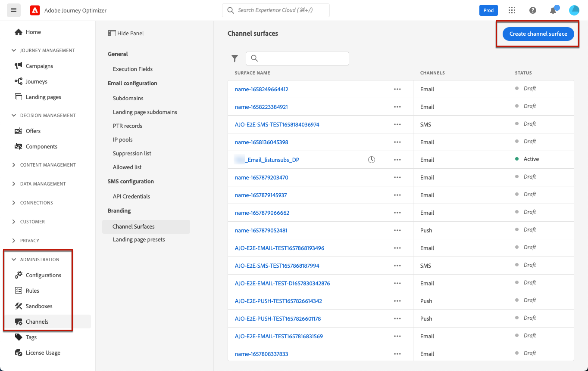

1. Enter a name and a description (optional) for the surface, then select the channel(s) to configure.

    

    >[!NOTE]
    >
    > Names must begin with a letter (A-Z). It can only contain alpha-numeric characters. You can also use underscore `_`, dot`.` and hyphen `-` characters. 

1. If you selected the **[!UICONTROL Email]** channel, configure your settings as described in [this section](../email/email-settings.md).

    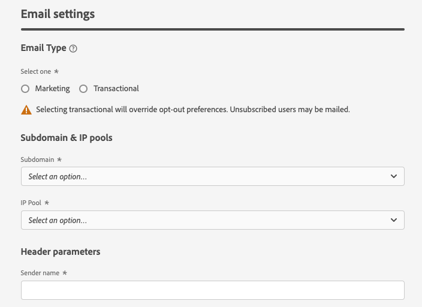

1. For the **[!UICONTROL Push Notification]** channel, select at least one platform  -  **iOS** and/or **Android** -, and the mobile applications to use for each platform.

    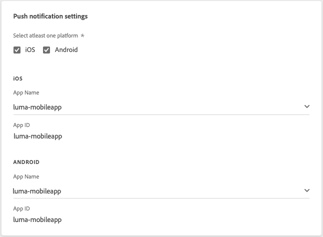
        
    >[!NOTE]
    >
    >For more on how to configure your environment to send push notifications, refer to [this section](../push/push-gs.md).

1. For the **[!UICONTROL SMS]** channel, define your settings as detailed in [this section](../sms/sms-configuration.md#message-preset-sms).

    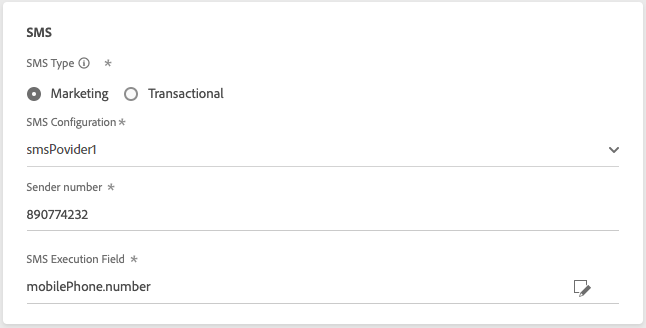

    >[!NOTE]
    >
    >For more on how to configure your environment to send SMS messages, refer to [this section](../sms/sms-configuration.md).

1. Once all the parameters have been configured, click **[!UICONTROL Submit]** to confirm. You can also save the channel surface as draft and resume its configuration later on.

    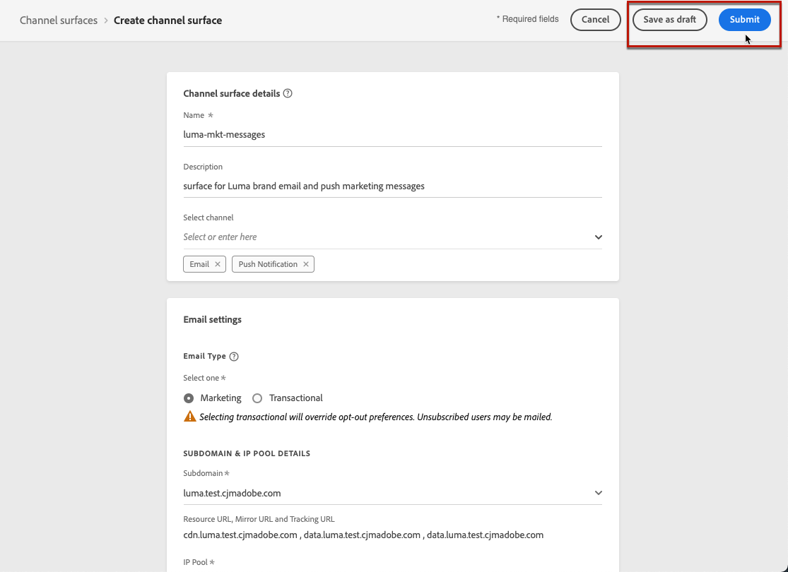

    >[!NOTE]
    >
    >You cannot proceed with surface creation while the selected IP pool is under [edition](ip-pools.md#edit-ip-pool) (**[!UICONTROL Processing]** status), and has never been associated with the selected subdomain. [Learn more](#subdomains-and-ip-pools)
    >
    >Save the surface as draft and wait until the IP pool has the **[!UICONTROL Success]** status to resume surface creation.
    
1. Once the channel surface has been created, it displays in the list with the **[!UICONTROL Processing]** status.

    During this step, several checks will be performed to verify that it has been configured properly. <!--The processing time is around **48h-72h**, and can take up to **7-10 business days**.-->

    >[!NOTE]
    >When creating the first email surface for a given subdomain, the processing time can take **10 minutes to 10 days**. If the selected subdomain is already used in another email surface, it will take only up to 3 hours.

    These checks include configuration and technical tests that are performed by the Adobe team:

    * SPF validation
    * DKIM validation
    * MX record validation
    * Check IPs denylisting
    * Helo host check
    * IP pool verification
    * A/PTR record, t/m/res subdomain verification
    * FBL registration (this check will be performed only the first time an email surface is created for a given subdomain)

    >[!NOTE]
    >
    >If the checks are not successful, learn more on the possible failure reasons in [this section](#monitor-channel-surfaces).  

1. Once the checks are successful, the channel surface gets the **[!UICONTROL Active]** status. It is ready to be used to deliver messages.

    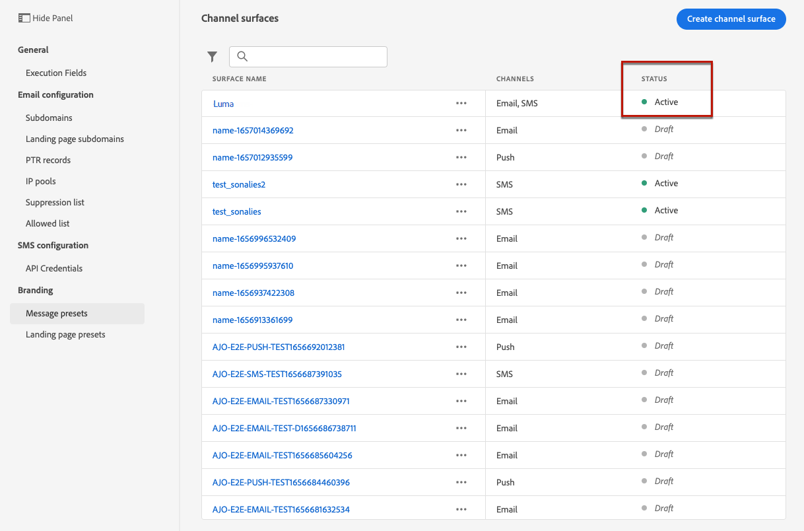

## Monitor channel surfaces {#monitor-channel-surfaces}

All your channel surfaces display in the **[!UICONTROL Channels]** > **[!UICONTROL Channel surfaces]** menu. Filters are available to help you browse through the list (channel, user, status).

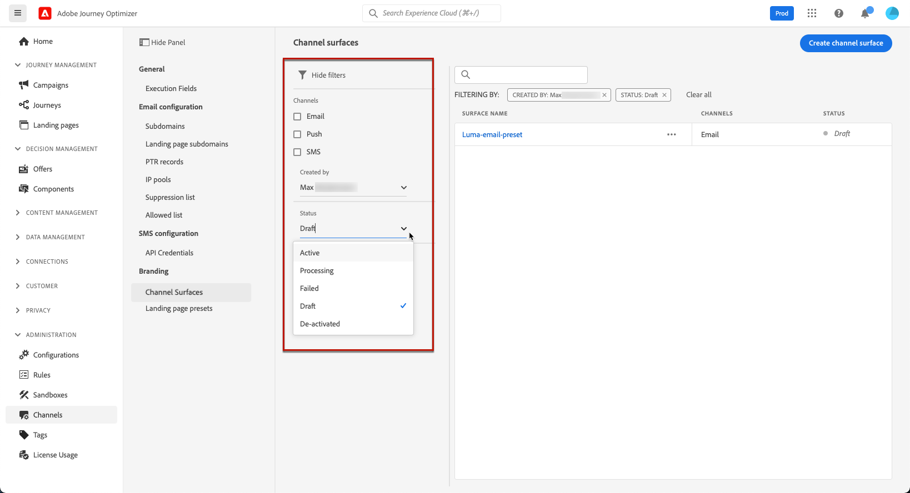

Once created, channel surfaces can have the following statuses:

* **[!UICONTROL Draft]**: The channel surface has been saved as a draft and has not been submitted yet. Open it to resume the configuration.
* **[!UICONTROL Processing]**: The channel surface has been submitted and is going through several verifications steps.
* **[!UICONTROL Active]**: The channel surface has been verified and can be selected to create messages.
* **[!UICONTROL Failed]**: One or several checks have failed during the channel surface verification.
* **[!UICONTROL Deactivated]**: The channel surface is deactivated. It cannot be used to create new messages.

In case a channel surface creation fails, the details on each possible failure reason are described below.

If one of these errors occurs, contact [Adobe Customer Care](https://helpx.adobe.com/enterprise/admin-guide.html/enterprise/using/support-for-experience-cloud.ug.html){target="_blank"} to get assistance.

* **SPF validation failed**: SPF (Sender Policy Framework) is an email authentication protocol that allows to specify authorized IPs that can send emails from a given subdomain. SPF validation failure means that the IP addresses in the SPF record do not match the IP addresses used for sending emails to the mailbox providers. 

* **DKIM validation failed**: DKIM (DomainKeys Identified Mail) allows the recipient server to verify that the received message was sent by the genuine sender of the associated domain and that the content of the original message was not altered on its way. DKIM validation failure means that the receiving mail servers are unable to verify the authenticity of the message content and its association with the sending domain.:

* **MX record validation failed**: MX (Mail eXchange) record validation failure means that the mail servers responsible for accepting inbound emails on behalf of a given subdomain are not correctly configured.

* **Deliverability configurations failed**: Deliverability configurations failure can happen due to any of the following reasons:
    * Blocklisting of the allocated IPs
    * Invalid `helo` name
    * Emails being sent from IPs other than the ones specified in the IP pool of the corresponding surface
    * Unable to deliver emails to inboxes of major ISPs

## Edit a channel surface {#edit-channel-surface}

To edit a channel surface, follow the steps below.

>[!NOTE]
>
>You cannot edit the **[!UICONTROL Push notification settings]**. If a channel surface is only configured for the Push notification channel, it is not editable.

1. From the list, click a channel surface name to open it.

    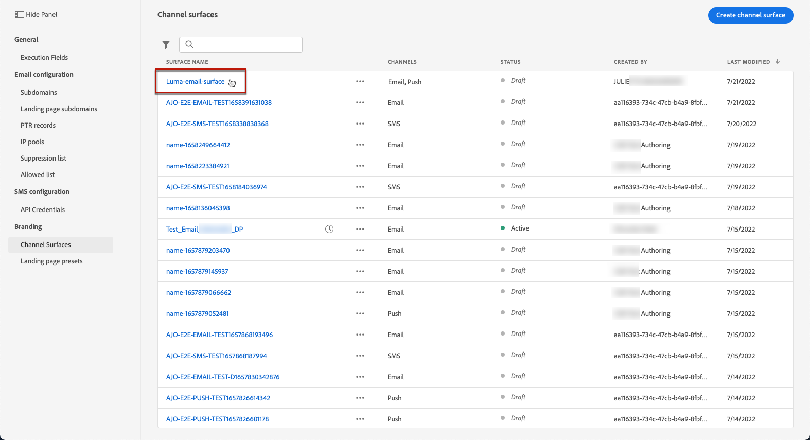

1. Edit its properties as desired.

    >[!NOTE]
    >
    >If a channel surface has the **[!UICONTROL Active]** status, the **[!UICONTROL Name]**, **[!UICONTROL Select channel]** and **[!UICONTROL Subdomain]** fields are greyed out and cannot be edited.

1. Click **[!UICONTROL Submit]** to confirm your changes.

    >[!NOTE]
    >
    >You can also save the channel surface as draft and resume update later on.

Once the changes are submitted, the channel surface will go through a validation cycle similar to the one in place when [creating a channel surface](#create-channel-surface). The edition processing time can take up to **3 hours**.

>[!NOTE]
>
>If you only edit the **[!UICONTROL Description]**, **[!UICONTROL Email type]** and/or **[!UICONTROL Email retry parameters]** fields, the update is instantaneous.

### Update details {#update-details}

For channel surfaces that have the **[!UICONTROL Active]** status, you can check the details of the update. To do so:

Click the **[!UICONTROL Recent update]** icon that is displayed next to the active surface name.

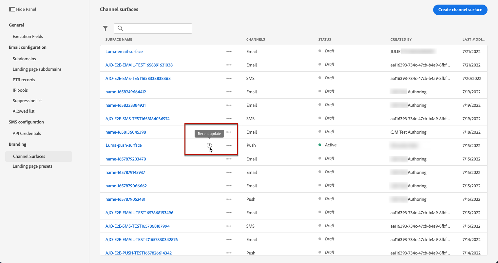

<!--You can also access the update details from an active channel surface while update is in progress.-->

On the **[!UICONTROL Recent update]** screen, you can see information such as the update status, and the list of requested changes.

<!--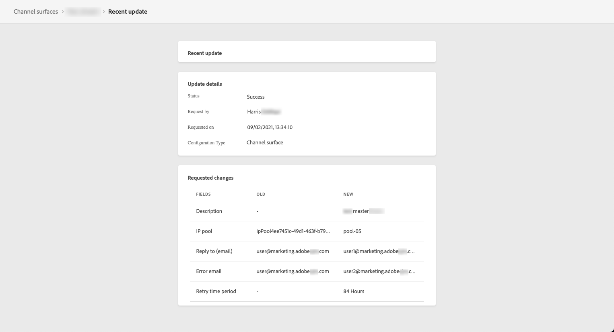-->

### Update statuses {#update-statuses}

A channel surface update can have the following statuses:

* **[!UICONTROL Processing]**: The channel surface update has been submitted and is going through several verifications steps.
* **[!UICONTROL Success]**: The updated channel surface has been verified and can be selected to create messages.
* **[!UICONTROL Failed]**: One or several checks have failed during the channel surface update verification.

Each status is detailed below.

#### Processing {#surface-processing}

Several deliverability checks will be performed to verify that the surface has been updated properly.

>[!NOTE]
>
>If you only edit the **[!UICONTROL Description]**, **[!UICONTROL Email type]** and/or **[!UICONTROL Email retry parameters]** fields, the update is instantaneous.

The processing time can take up to **3 hours**. Learn more on the checks performed during the validation cycle in [this section](#create-channel-surface).

If you edit a surface that was already active:

* Its status remains **[!UICONTROL Active]** while the validation process is in progress.

* The **[!UICONTROL Recent update]** icon displays next to the name of the surface in the channel surfaces list.

* During the validation process, the messages configured using this surface are still using the older version of the surface.

>[!NOTE]
>
>You cannot modify a channel surface while update is in progress. You can still click its name, but all the fields are greyed out. The changes will not be reflected until the update is successful.

#### Success {#success}

Once the validation process is successful, the new version of the surface is automatically used in all messages using this surface. However, you may have to wait:
* a few minutes before it is consumed by the unitary messages,
* until the next batch for the surface to be effective in batch messages.

#### Failed {#failed}

If the validation process fails, the older version of the surface will still be used.

Learn more on the possible failure reasons in [this section](#monitor-channel-surfaces).

Upon update failing, the surface becomes editable again. You can click its name and update the settings that need to be fixed.

## Deactivate a channel surface {#deactivate-a-surface}

To make an **[!UICONTROL Active]** channel surface unavailable to create new messages, you can deactivate it. However, journeys' messages currently using this surface will not be affected and will continue working.

>[!NOTE]
>
>You cannot deactivate a channel surface while an update is processing. You must wait until the update is successful or has failed. Learn more on [editing channel surfaces](#edit-channel-surface) and on the [update statuses](#update-statuses).

1. Access the channel surfaces list.

1. For the active surface of your choice, click the **[!UICONTROL More actions]** button.

1. Select **[!UICONTROL Deactivate]**.

    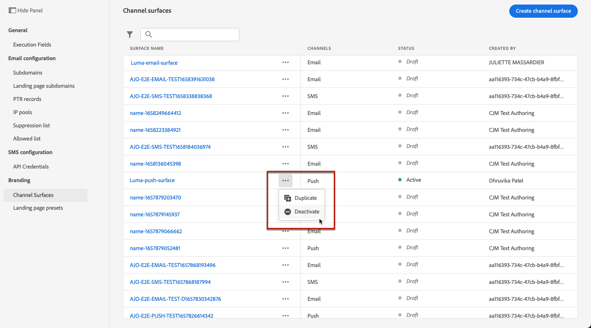

>[!NOTE]
>
>Deactivated channel surfaces cannot be deleted to avoid any issue in journeys using these surfaces to send messages.

You cannot directly edit a deactivated channel surface. However, you can duplicate it and edit the copy to create a new version that you will use to create new messages. You can also activate it again, and wait until the update is successful to edit it.

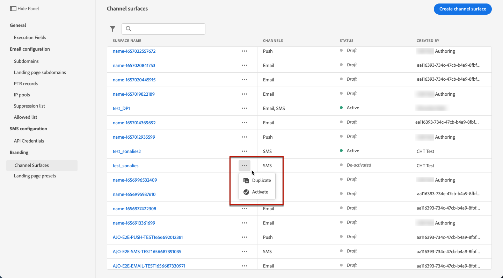

<!--
## How-to video{#video-presets}

Learn how to create channel surfaces, how to use them and how to delegate a subdomain and create an IP pool.

>[!VIDEO](https://video.tv.adobe.com/v/334343?quality=12)
-->
