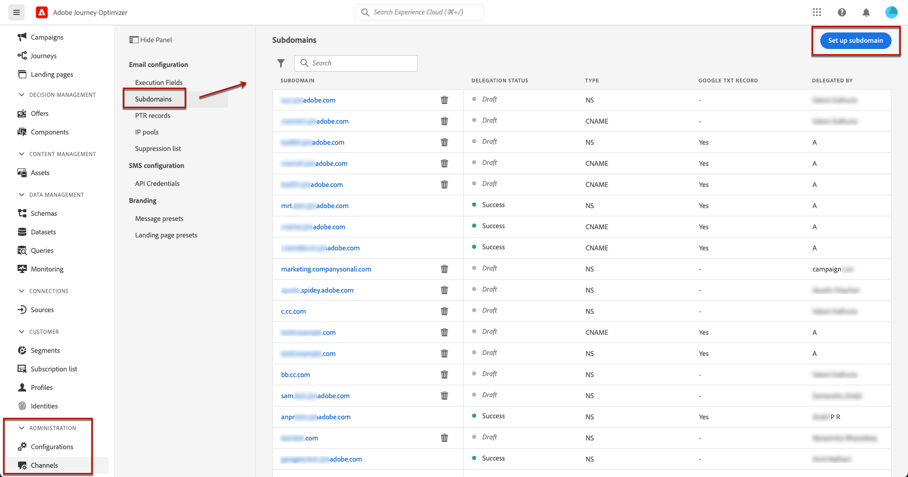
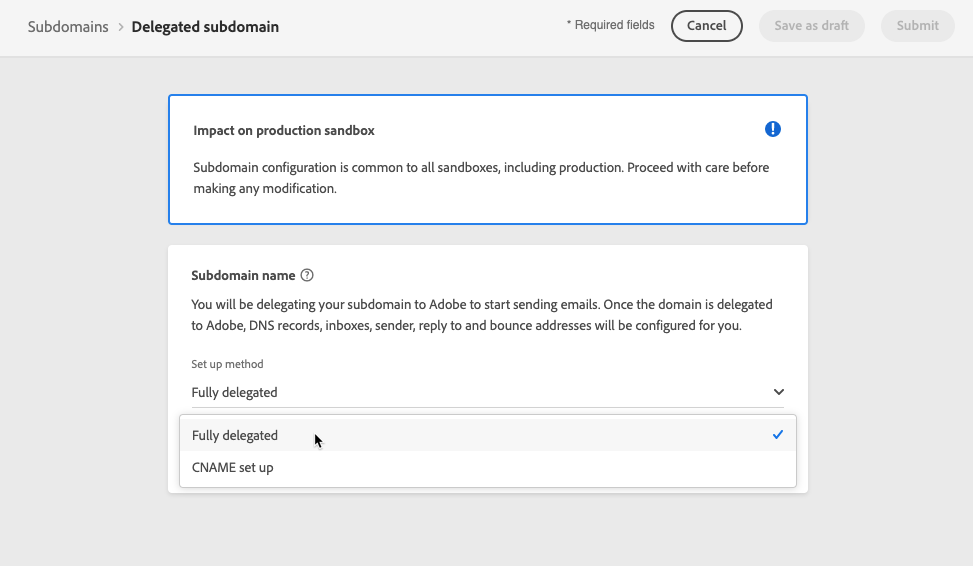
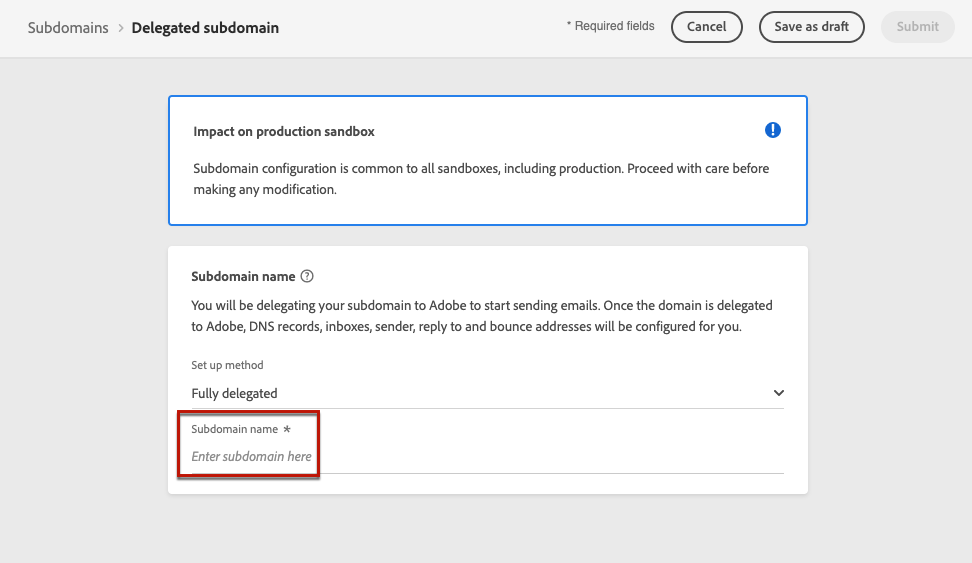
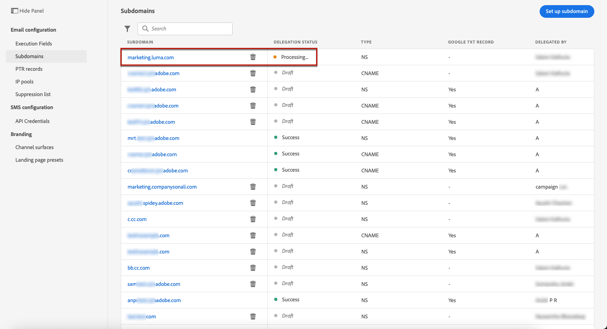
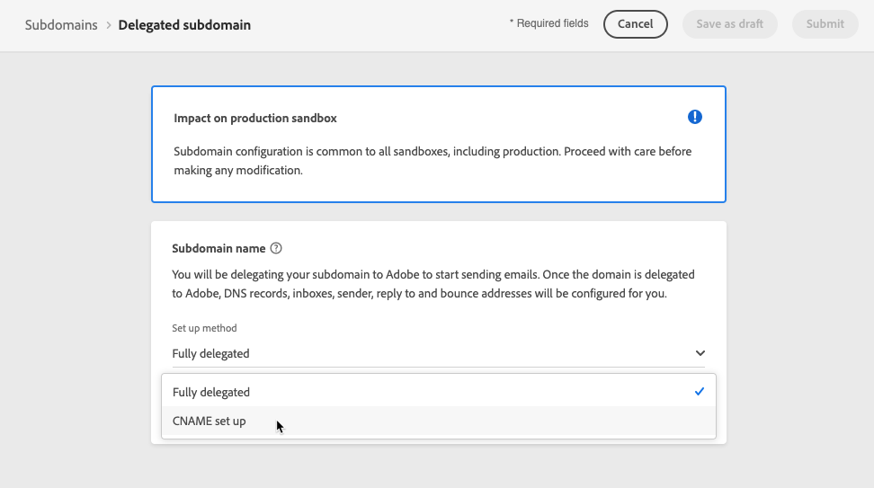
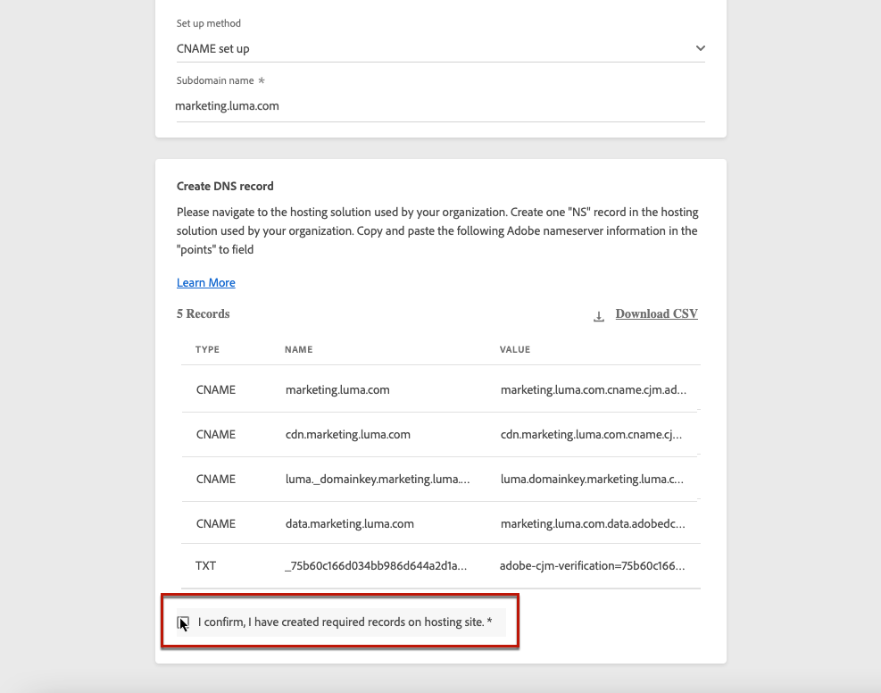

# Delegate a subdomain {#delegate-subdomain}

>[!CONTEXTUALHELP]
>id="ajo_admin_subdomainname"
>title="Subdomain delegation"
>abstract="Journey Optimizer allows you to delegate your subdomains to Adobe. You can fully delegate a subdomain to Adobe, which is the recommended method. You can also create a subdomain using CNAMEs to point to Adobe-specific records, but this approach requires you to maintain and manage DNS records on your own."
>additional-url="https://experienceleague.adobe.com/docs/journey-optimizer/using/configuration/delegate-subdomains/about-subdomain-delegation.html#subdomain-delegation-methods" text="Subdomain configuration methods"

>[!CONTEXTUALHELP]
>id="ajo_admin_subdomainname_header"
>title="Subdomain delegation"
>abstract="To start sending emails, you will be delegating your subdomain to Adobe. Once done, DNS records, inboxes, sender, reply to and bounce addresses will be configured for you."

Domain name delegation is a method that allows the owner of a domain name (technically: a DNS zone) to delegate a subdivision of it (technically: a DNS zone under it, which can be called a sub-zone) to another entity. Basically, as a customer, if you are handling the "example.com" zone, you can delegate the sub-zone "marketing.example.com" to Adobe. Learn more on [subdomain delegation](about-subdomain-delegation.md)

>[!NOTE]
>
>By default, [!DNL Journey Optimizer] license contract allows you to delegate up to 10 subdomains. Reach out to your Adobe contact if you want to increase this limitation.

You can fully delegate a subdomain, or create a subdomain using CNAMEs to point to Adobe-specific records.

>[!CAUTION]
>
>The full subdomain delegation is the recommended method. Learn more on the differences between both [subdomain configuration methods](about-subdomain-delegation.md#subdomain-delegation-methods).
>
>Subdomain configuration is common to all environments. Therefore any modification to a subdomain will also impact the production sandboxes.

## Full subdomain delegation {#full-subdomain-delegation}

>[!CONTEXTUALHELP]
>id="ajo_admin_subdomain_dns"
>title="Generate the matching DNS records"
>abstract="To fully delegate a new subdomain to Adobe, you need to copy-paste the Adobe nameserver information displayed in the Journey Optimizer interface into your domain-hosting solution to generate the matching DNS records. To delegate a subdomain using CNAMEs, you also need to copy-paste the SSL CDN URL validation record. Once the checks are successful, the subdomain is ready to be used to deliver messages."
>additional-url="https://experienceleague.adobe.com/docs/journey-optimizer/using/configuration/delegate-subdomains/delegate-subdomain.html#cname-subdomain-delegation" text="CNAME subdomain delegation"

[!DNL Journey Optimizer] allows you to fully delegate your subdomains to Adobe directly from the product interface. By doing so, Adobe will be able to deliver messages as a managed service by controlling and maintaining all aspects of DNS that are required for delivering, rendering and tracking of email campaigns.

You can rely on Adobe to maintain the DNS infrastructure required to meet industry-standard deliverability requirements for your email marketing sending domains, while continuing to maintain and control DNS for your internal email domains.

To fully delegate a new subdomain to Adobe, follow the steps below:

1. Access the **[!UICONTROL Administration]** > **[!UICONTROL Channels]** > **[!UICONTROL Subdomains]** menu, then click **[!UICONTROL Set up subdomain]**.

    

1. Select **[!UICONTROL Fully delegated]** from the **[!UICONTROL Set up method]** section.

    

1. Specify the name of the subdomain to delegate.

    

    >[!CAUTION]
    >
    >Delegating an invalid subdomain to Adobe is not allowed. Make sure you enter a valid subdomain which is owned by your organization, such as marketing.yourcompany.com.

    <!--Capital letters are not allowed in subdomains. TBC by PM-->

1. The list of records to be placed in your DNS servers displays. Copy these records, either one by one, or by downloading a CSV file, then navigate to your domain hosting solution to generate the matching DNS records.

1. Make sure that all the DNS records have been generated into your domain hosting solution. If everything is configured properly, check the box "I confirm...".

    

1. Set up DMARC record. If the subdomain has an existing DMARC record, and if it is fetched by [!DNL Journey Optimizer], you can use the same values or change them as needed. If you do not add any values, the default values will be used. [Learn more](dmarc-record.md)

    

1. Click **[!UICONTROL Submit]**. 

    >[!NOTE]
    >
    >You can create the records and submit the subdomain configuration later on using the **[!UICONTROL Save as draft]** button. You will then be able to resume the subdomain delegation by opening it from the subdomains list.
    
1. The subdomain displays in the list with the **[!UICONTROL Processing]** status. For more on subdomains' statuses, refer to [this section](about-subdomain-delegation.md#access-delegated-subdomains).

    

    Before being able to use that subdomain to send messages, you must wait until Adobe performs the required checks, which can take up to 3 hours. Learn more in [this section](#subdomain-validation).

    >[!NOTE]
    >
    >Any missing records, meaning the records not yet created on your hosting solution, will be listed out.

1. Once the checks are successful, the subdomain gets the **[!UICONTROL Success]** status. It is ready to be used to deliver messages.

    >[!NOTE]
    >
    >The subdomain will be marked as **[!UICONTROL Failed]** if you fail to create the validation record on your hosting solution.

Once a subdomain is delegated to Adobe in [!DNL Journey Optimizer], a PTR record is automatically created and associated with this subdomain. [Learn more](ptr-records.md)

>[!CAUTION]
>
>Parallel execution of subdomains is currently not supported in [!DNL Journey Optimizer]. If you try to submit a subdomain for delegation when another one has the **[!UICONTROL Processing]** status, you will get an error message.

## CNAME subdomain set up {#cname-subdomain-delegation}

>[!CONTEXTUALHELP]
>id="ajo_admin_subdomain_dns_cname"
>title="Generate the matching DNS and validation records"
>abstract="To delegate a subdomain using CNAMEs, you need to copy-paste the Adobe nameserver information and the SSL CDN URL validation record displayed in the Journey Optimizer interface into your hosting platform. Once the checks are successful, the subdomain is ready to be used to deliver messages."

>[!CONTEXTUALHELP]
>id="ajo_admin_subdomain_cdn_cname"
>title="Copy the validation record"
>abstract="Adobe generates a validation record. You need to create the corresponding record on your hosting platform for CDN URL validation."

If you have domain-specific restriction policies and you want Adobe to have only partial control over DNS, you can choose to carry out all DNS-related activities on your side.

CNAME subdomain set up enables you to create a subdomain and use CNAMEs to point to Adobe-specific records. Using this configuration, both you and Adobe share responsibility for maintaining DNS in order to setup environment for sending, rendering and tracking emails.

>[!CAUTION]
>
>The CNAME method is recommended if your organization's policies restrict the full subdomain delegation method. This approach requires you to maintain and manage DNS records on your own. Adobe will not be able to assist in changing, maintaining or managing DNS for a subdomain configured through the CNAME method.

➡️ [Learn how to create a subdomain using CNAME to point to Adobe-specific records in this video](#video)

To set up a subdomain using CNAMEs, follow the steps below:

1. Access the **[!UICONTROL Administration]** > **[!UICONTROL Channels]** > **[!UICONTROL Subdomains]** menu, then click **[!UICONTROL Set up subdomain]**.

1. Select the **[!UICONTROL CNAME set up]** method.

    

1. Specify the name of the subdomain to delegate.

    >[!CAUTION]
    >
    >Delegating an invalid subdomain to Adobe is not allowed. Make sure you enter a valid subdomain which is owned by your organization, such as marketing.yourcompany.com.

    <!--Capital letters are not allowed in subdomains. TBC by PM-->

1. The list of records to be placed in your DNS servers displays. Copy these records, either one by one, or by downloading a CSV file, then navigate to your domain hosting solution to generate the matching DNS records.

1. Make sure that all the DNS records have been generated into your domain hosting solution. If everything is configured properly, check the box "I confirm...".

    

1. Set it up DMARC record. If the subdomain has an existing DMARC record, and if it is fetched by [!DNL Journey Optimizer], you can use the same values or change them as needed. If you do not add any values, the default values will be used. [Learn more](dmarc-record.md)

    

1. Click **[!UICONTROL Continue]**. 

    >[!NOTE]
    >
    >You can create the records later on using the **[!UICONTROL Save as draft]** button. You will then be able to resume the subdomain delegation at this stage by opening it from the subdomains list.

1. Wait until Adobe verifies that the records are generated without errors on your hosting solution. This process can take up to 2 minutes.

    >[!NOTE]
    >
    >Any missing records, meaning the records not yet created on your hosting solution, will be listed out.

1. Adobe generates an SSL CDN URL validation record. Copy this validation record into your hosting platform. If you have properly created this record on your hosting solution, check the box "I confirm...", then click **[!UICONTROL Submit]**.

    <!---->

1. Once the CNAME subdomain delegation has been submitted, the subdomain displays in the list with the **[!UICONTROL Processing]** status. For more on subdomains' statuses, refer to [this section](about-subdomain-delegation.md#access-delegated-subdomains).

    

    Before being able to use that subdomain to send messages, you must wait until Adobe performs the required checks, which usually takes 2 to 3 hours. Learn more in [this section](#subdomain-validation).

1. Once the checks are successful<!--i.e Adobe validates the record you created and installs it-->, the subdomain gets the **[!UICONTROL Success]** status. It is ready to be used to deliver messages.

    >[!NOTE]
    >
    >The subdomain will be marked as **[!UICONTROL Failed]** if you fail to create the validation record on your hosting solution.

Upon validating the record and installing the certificate, Adobe automatically creates the PTR record for the CNAME subdomain. [Learn more](ptr-records.md)

>[!CAUTION]
>
>Parallel execution of subdomains is currently not supported in [!DNL Journey Optimizer]. If you try to submit a subdomain for delegation when another one has the **[!UICONTROL Processing]** status, you will get an error message.

## Subdomain validation {#subdomain-validation}

The checks and actions below will be performed until the subdomain is verified and can be used to send messages.
    
>[!NOTE]
>
>These steps are performed by Adobe and can take up to 3 hours.

1. **Pre-validate**: Adobe checks whether the subdomain has been delegated to Adobe DNS (NS record, SOA record, Zone setup, ownership record). If the pre-validation step fails, an error is returned along with the corresponding reason, otherwise Adobe proceeds to the next step.

1. **Configure DNS for the domain**:

    * **MX record**: Mail eXchange record - Mail server record that processes inbound emails sent to the subdomain.
    * **SPF record**: Sender Policy Framework record - Lists the mail servers' IPs that can send emails from the subdomain.
    * **DKIM record**: DomainKeys Identified Mail standard record - Uses public-private key encryption to authenticate the message to avoid spoofing.
    * **A**: Default IP mapping.
    * **CNAME**: A Canonical Name or CNAME record is a type of DNS record that maps an alias name to a true or canonical domain name. 

1. **Create tracking and mirror URLs**: if the domain is email.example.com, the tracking/mirror domain will be data.email.example.com. It is secured by installing the SSL certificate.

1. **Provision CDN CloudFront**: if CDN is not setup already, Adobe provisions it for the your organization's ID.

1. **Create CDN domain**: if the domain is email.example.com, the CDN domain will be cdn.email.example.com.
    
1. **Create and attach CDN SSL certificate**: Adobe creates the CDN certificate for the CDN domain and attaches the certificate to the CDN domain.

1. **Create forward DNS**: if this is the first subdomain that you are delegating, Adobe will create the forward DNS which is required to create PTR records - one for each of your IPs.

1. **Create PTR record**: PTR record, also known as reverse DNS record, is required by the ISPs so that they do not mark the emails as spam. Gmail also recommends having PTR records for each IP. Adobe creates PTR records only when you delegate a subdomain for the first time, one for each IP, all IPs pointing that subdomain. For example, if the IP is *192.1.2.1* and the subdomain is *email.example.com*, the PTR record will be: *192.1.2.1  PTR r1.email.example.com*. You can update the PTR record afterwards to point to the new delegated domain. [Learn more on PTR records](ptr-records.md)

## How-to video{#video}

Learn how to create a subdomain using CNAME to point to Adobe-specific records.

>[!VIDEO](https://video.tv.adobe.com/v/339484?quality=12)
