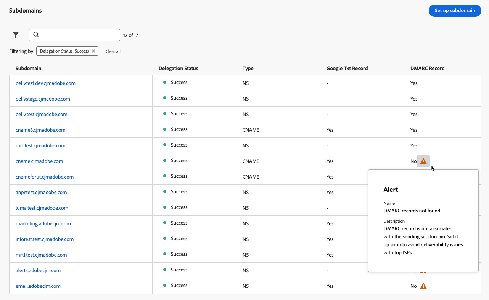
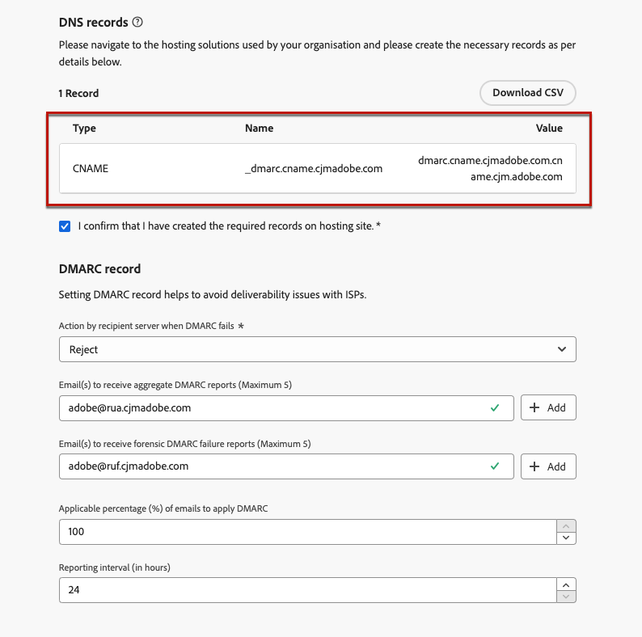
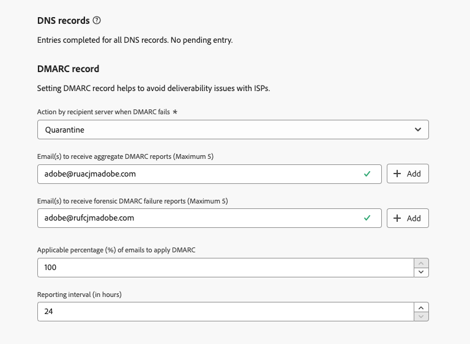
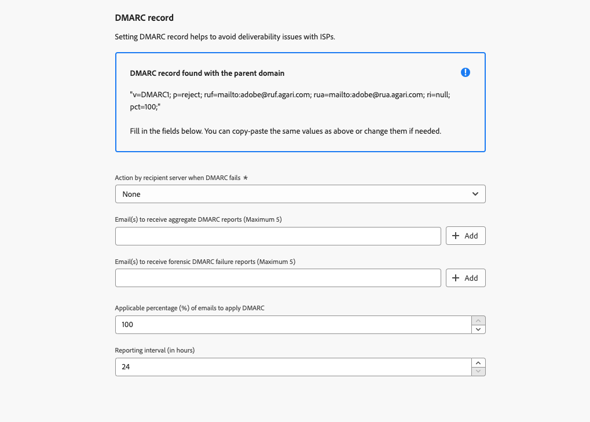

# DMARC record {#dmarc-record}

>[!CONTEXTUALHELP]
>id="ajo_admin_dmarc_record"
>title="Set DMARC record"
>abstract="DMARC is an email authentication method that allows domain owners to protect their domain from unauthorized use and avoid deliverability issues with mailbox providers. As part of their enforcing industry best practices, Google and Yahoo are both requiring that you have a DMARC record for any domain you use to send email to them."

## What is DMARC? {#what-is-dmarc}

Domain-based Message Authentication, Reporting, and Conformance (DMARC) is an email authentication method that allows domain owners to protect their domain from unauthorized use. By offering a clear policy to email providers/ISPs, it helps prevent malicious actors from sending emails claiming to be from your domain. Implementing DMARC reduces the risk of legitimate emails being marked as spam or rejected, and improve your email deliverability.

DMARC also offers reporting on messages that fail authentication, along with control over the handling of emails that do not pass DMARC validation. Depending on the implemented [DMARC policy](#dmarc-policies), these emails can be monitored, quarantined, or rejected. These capabilities empower you to take actions to mitigate and address potential errors.

<!--To help you prevent deliverability issues by allowing ISPs to authenticate your sending domains - while gaining visibility and control over mail that fail this authentication, [!DNL Journey Optimizer] will soon be supporting the DMARC technology directly in its administration interface.-->

To help you prevent deliverability issues while gaining control over mail that fail authentication, [!DNL Journey Optimizer] will soon be supporting the DMARC technology directly in its administration interface. [Learn more](#implement-dmarc)

### How does DMARC work? {#how-dmarc-works}

SPF and DKIM are both used to associate an email with a domain and work together to authenticate email. DMARC takes this one step further and helps to prevent spoofing by matching the domain checked by DKIM and SPF.

>[!NOTE]
>
>In Journey Optimizer, SPF and DKIM are configured for you.

To pass DMARC, a message must pass SPF or DKIM:

* SPF (Sender Policy Framework) helps verify that the email message comes from an authorized source by checking the sending server's IP address against a list of authorized IP addresses for the domain.
* DKIM (DomainKeys Identified Mail) adds a digital signature to email messages, allowing the recipient to verify the message's integrity and authenticity.

If both or either of these fail authentication, DMARC will fail, and the email will be delivered according to your selected DMARC policy.

<!--DMARC requires alignment between the 'From" and 'Return-Path' address.-->

### DMARC policies {#dmarc-policies}

If an email fails DMARC authentication, you can decide which action will be applied to that message. DMARC has three policy options:

* Monitor (p=none): Instructs the mailbox provider/ISP to do whatever they would normally do to the message.
* Quarantine (p=quarantine): Instructs the mailbox provider/ISP to deliver mail that does not pass DMARC to the recipient's spam or junk folder.
* Reject (p=reject): Instructs the mailbox provider/ISP to block mail that does not pass DMARC resulting in a bounce.

>[!NOTE]
>
>Learn how to set the DMARC policy with [!DNL Journey Optimizer] in [this section](#set-up-dmarc).

## DMARC requirement update {#dmarc-update}

As part of their enforcing industry best practices, Google and Yahoo will both be requiring that you have a **DMARC record** for any domain you use to send email to them. This new requirement is starting on **February 1st, 2024**.

Learn more on Google and Yahoo's requirement in [this section](https://experienceleague.adobe.com/docs/deliverability-learn/deliverability-best-practice-guide/additional-resources/guidance-around-changes-to-google-and-yahoo.html#dmarc){target="_blank"}.

>[!CAUTION]
>
>Failing to comply with this new requirement from Gmail and Yahoo is expected to result in emails landing into the spam folder or getting blocked. [Learn more](https://experienceleague.adobe.com/docs/deliverability-learn/deliverability-best-practice-guide/additional-resources/guidance-around-changes-to-google-and-yahoo.html#how-will-this-impact-me-as-a-marketer%3F){target="_blank"}

Consequently, Adobe strongly recommends you take the following actions:

* Make sure to have **DMARC record** set up for **all the subdomains that you have already delegated** to Adobe in [!DNL Journey Optimizer]. [Learn how](#check-subdomains-for-dmarc)

* When **delegating any new subdomain** to Adobe, you will soon be able to **set up DMARC** directly **in the [!DNL Journey Optimizer] administration interface**. [Learn how](#implement-dmarc)

## Implement DMARC in [!DNL Journey Optimizer] {#implement-dmarc}

The [!DNL Journey Optimizer] administration interface allows you to set up DMARC record for all the subdomains that you have already delegated or are delegating to Adobe. The detailed steps are described below.

### Check your existing subdomains for DMARC {#check-subdomains-for-dmarc}

To make sure that you have DMARC record set up for all the subdomains that you have delegated in [!DNL Journey Optimizer], follow the steps below.

1. Access the **[!UICONTROL Administration]** > **[!UICONTROL Channels]** > **[!UICONTROL Subdomains]** menu, then click **[!UICONTROL Set up subdomain]**.

1. For each delegated subdomain, check the **[!UICONTROL DMARC Record]** column. If no record was found for a given subdomain, an alert is diplayed.
    
    

    >[!CAUTION]
    >
    >To comply with the new requirement from Gmail and Yahoo, and avoid deliverability issues with top ISPs, it is recommended to set up DMARC record for all delegated subdomains. [Learn more](dmarc-record-update.md)

1. Select a subdomain with no DMARC record associated and fill in the **[!UICONTROL DMARC record]** section according to your organization's needs. The steps to populate the DMARC record fields are detailed in [this section](#implement-dmarc).

1. Consider the two options below:

    * If you are editing a subdomain set up with [CNAME](delegate-subdomain.md#cname-subdomain-delegation), you must copy the DNS record for DMARC into your hosting solution to generate the matching DNS records.

        

        Make sure that the DNS record has been generated into your domain hosting solution and check the box "I confirm...".

    * If you are editing a subdomain [fully delegated](delegate-subdomain.md#full-subdomain-delegation) to Adobe, simply fill in the **[!UICONTROL DMARC record]** fields detailed in [this section](#implement-dmarc). No further action is required.

        

1. Save your changes.

### Set up DMARC for new subdomains {#set-up-dmarc}

When delegating new subdomains to Adobe in [!DNL Journey Optimizer], a DMARC record will be created in DNS for your domain. Follow the steps below to implement DMARC.

>[!CAUTION]
>
>To comply with the new requirement from Gmail and Yahoo, and avoid deliverability issues with top ISPs, it is recommended to set up DMARC record for all delegated subdomains. [Learn more](dmarc-record-update.md)

<!--If you fail to comply with the new requirement from Gmail and Yahoo to have DMARC record for all sending domains, your emails are expected to land into the spam folder or to get blocked.-->

1. Set up a new subdomain. [Learn how](delegate-subdomain.md)

1. Go to the **[!UICONTROL DMARC record]** section.

    If the subdomain has an existing DMARC record, and if it is fetched by [!DNL Journey Optimizer], you can use the same values as highlighted in the interface, or change them as needed.

    

    >[!NOTE]
    >
    >If you do not add any values, the pre-filled default values will be used.

1. Define the action that the recipient server will perform if DMARC fails. Depending on the [DMARC policy](#dmarc-policies) you want to apply, select one of the three options:

    * **[!UICONTROL None]** (default value): Tells the receiver to perform no actions against messages that fail DMARC authentication, but still send email reports to the sender.
    * **[!UICONTROL Quarantine]**: Tells the receiving email server to quarantine email that fails DMARC authentication - this generally means placing those messages in the recipient's spam or junk folder.
    * **[!UICONTROL Reject]**: Tells the receiver to completely deny (bounce) any email for the domain that fails authentication. With this policy enabled, only email that is verified as 100% authenticated by your domain will even have a chance at inbox placement.

    >[!NOTE]
    >
    >As a best practice, it is recommended to slowly roll out DMARC implementation by escalating your DMARC policy from **None**, to **Quarantine**, to **Reject** as you gain understanding of DMARC's potential impact.

1. Optionnally, add one or more email addresses of your choice to indicate where **DMARC reports** on emails that [fail authentication](#how-dmarc-works) should go within your organization. You can add up to five addresses for each report.

    >[!NOTE]
    >
    >Make sure you have a genuine inbox (not Adobe) in your control where you can receive those reports.

    There are two different reports generated by ISPs that senders can receive through the RUA/RUF tags in their DMARC policy:

    * **Aggregate reports** (RUA): They do not contain any PII (Personally Identifiable Information) that could be GDPR-sensitive.
    * **Forensic failure reports** (RUF): They contain GDPR-sensitive email addresses. Before utilizing, check internally how to deal with information that needs to be GDPR-compliant.

    >[!NOTE]
    >
    >These highly technical reports provide an overview of emails that are attempted spoofing. They are best digested through a third-party tool.

1. Select the **applicable percentage** of emails for DMARC.

    This percentage depends on your confidence in your email infrastructure and the tolerance for false positives (legitimate emails being marked as fraudulent). It is common for organizations to start with DMARC policy set to **None**, gradually increase the DMARC policy percentage, and closely monitor the impact on legitimate email delivery.
    
    >[!NOTE]
    >
    >Work with your email administrators and IT team to gradually increase the percentage as you gain confidence in your email authentication practices.

    As a best practice, aim for a high DMARC compliance rate, ideally close to 100%, to maximize the security benefits while minimizing the risk of false positives.

1. Select a **reporting interval** between 24 and 168 hours. It allows domain owners to receive regular updates on email authentication results and take necessary actions to improve email security.

    <!--The DMARC reporting interval is specified in the DMARC policy published in the DNS (Domain Name System) records for a domain. The reporting interval can be set to daily, weekly, or another specified frequency, depending on the domain owner's preferences.

    The default value (24 hours) is generally the email providers' expectation.-->

<!--

Setting up a DMARC record involves adding a DNS TXT record to your domain's DNS settings. This record specifies your DMARC policy, such as whether to quarantine or reject messages that fail authentication. Implementing DMARC is a proactive step towards enhancing email security and protecting both your organization and your recipients from email-based threats.

DMARC helps prevent malicious actors from sending emails that appear to come from your domain. By setting up DMARC, you can specify how email providers should handle messages that fail authentication checks, reducing the likelihood that phishing emails will reach recipients.

DMARC helps improve email deliverability by providing a clear policy for email providers to follow when encountering messages claiming to be from your domain. This can reduce the chances of legitimate emails being marked as spam or rejected.

DMARC helps protect against email spoofing, phishing, and other fraudulent activities.

It allows you to decide how a mailbox provider should handle emails that fail SPF and DKIM checks, providing a way to authenticate the sender's domain and prevent unauthorized use of the domain for malicious purposes.

## What are the benefits of DMARC? {#dmarc-benefits}

The key benefits or DMARC are as folllows:

* DMARC allows email receivers to easily identify the authentication of emails, which could potentially improve delivery.

* It offers reporting on which messages fail SPF and/or DKIM, enabling senders to gain visibility.

* This increased visibility allows for steps to be taken to mitigate further errors. It gives senders a degree of control over what happens with mail that does not pass either of these authentication methods.

-->

