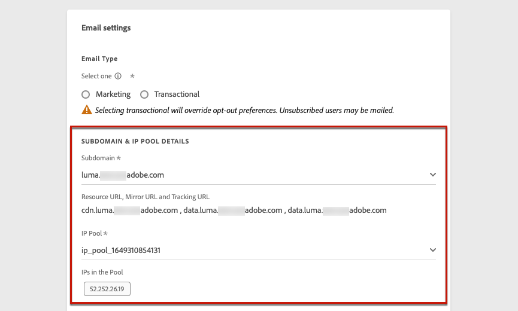
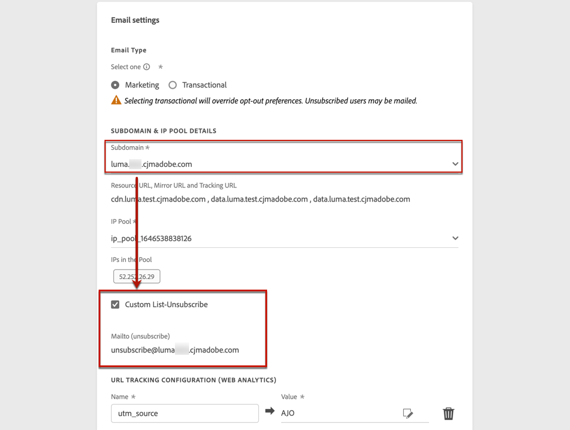
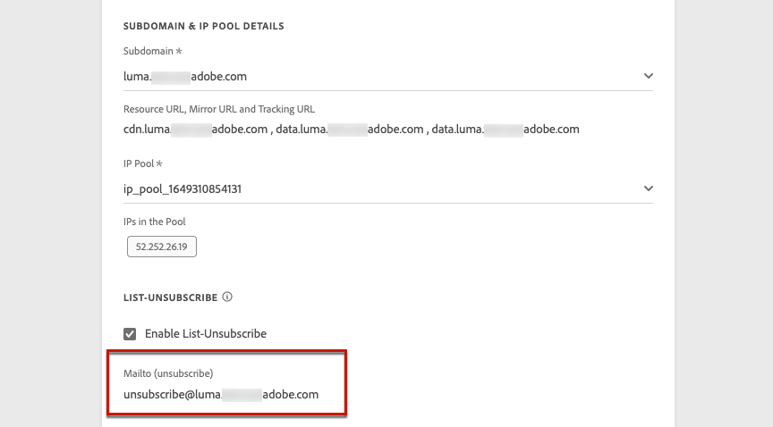
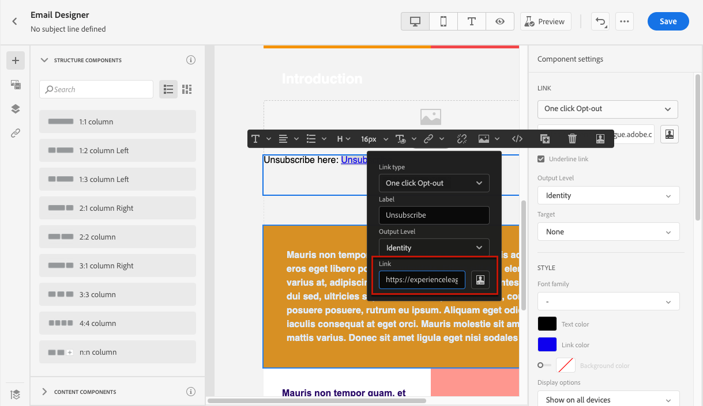
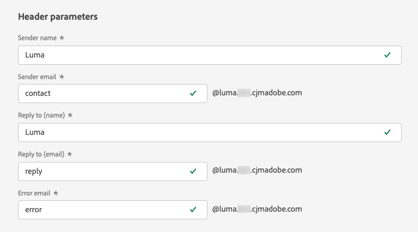
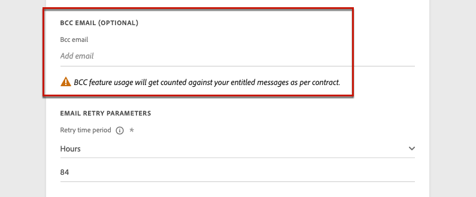
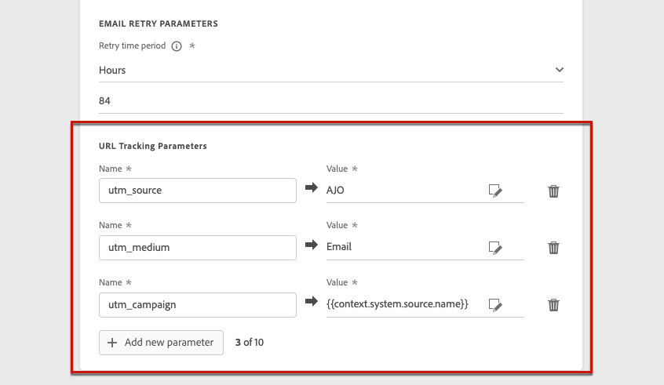
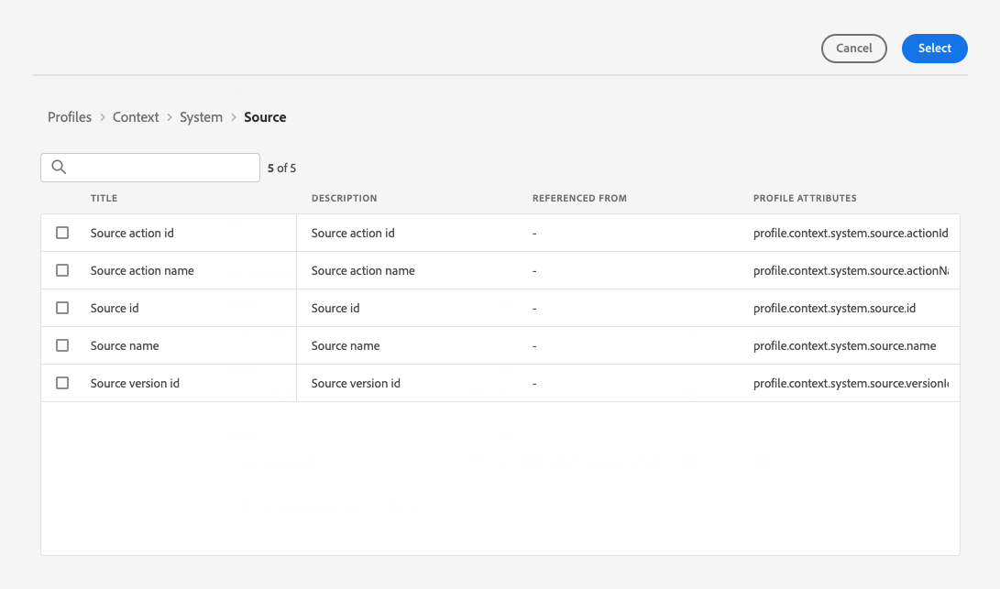
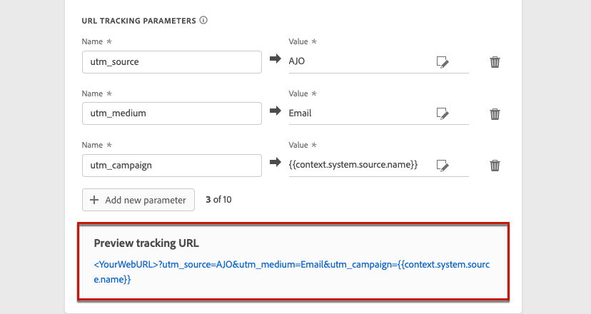

# Configure email settings {#email-settings}

Define the email settings in the dedicated section of the channel surface (i.e. message preset) configuration. Learn how to create surfaces in [this section](message-presets.md).

## Type of email {#email-type}

>[!CONTEXTUALHELP]
>id="ajo_admin_presets_emailtype"
>title="Define the email category"
>abstract="Select the type of messages that will be sent when using this surface: Marketing for promotional messages, which require user consent, or Transactional for non-commercial messages, that can also be sent to unsubscribed profiles in specific contexts."

In the **EMAIL TYPE** section, select the type of message that will be sent with the surface: **Marketing** or **Transactional**.

* Choose **Marketing** for promotional email: these messages require user consent.

* Choose **Transactional** for non-commercial email such as order confirmation, password reset notifications, or delivery information for example.

>[!CAUTION]
>
>**Transactional** emails can be sent to profiles who unsubscribed from marketing communications. These messages can only be sent in specific contexts.

When [creating a message](../messages/get-started-content.md#create-new-message), you must choose a valid channel surface matching the category you selected for your email.

## Subdomain & IP pool {#subdomains-and-ip-pools}

In the **SUBDOMAIN & IP POOL DETAILS** section, you must:

1. Select the subdomain to use to send the emails. [Learn more](about-subdomain-delegation.md)

1. Select the IP pool to associate with the surface. [Learn more](ip-pools.md)

You cannot proceed with surface creation while the selected IP pool is under [edition](ip-pools.md#edit-ip-pool) (**[!UICONTROL Processing]** status) and has never been associated with the selected subdomain. Otherwise, the oldest version of the IP pool/subdomain association will still be used. If this is the case, save the surface as draft and retry once the IP pool has the **[!UICONTROL Success]** status.

>[!NOTE]
>
>For non-production environments, Adobe does not create out-of-the-box test subdomains nor grant access to a shared sending IP pool. You need to [delegate your own subdomains](delegate-subdomain.md) and use the IPs from the pool assigned to your organization.

## List-Unsubscribe {#list-unsubscribe}

Upon [selecting a subdomain](#subdomains-and-ip-pools) from the list, the **[!UICONTROL Enable List-Unsubscribe]** option displays.

This option is enabled by default.

If you leave it enabled, an unsubscribe link will automatically be included into the email header, such as:

If you disable this option, no unsubscribe link will display in the email header.

The unsubscribe link consists in two elements:

* An **unsubscribe email address**, which all unsubscribe requests are sent to.

    In [!DNL Journey Optimizer], the unsubscribe email address is the default **[!UICONTROL Mailto (unsubscribe)]** address displayed in the channel surface, based on the [selected subdomain](#subdomains-and-ip-pools).

    

* The **unsubscribe URL**, which is the URL of the landing page where the user will be redirected once unsubscribed.

    If you add a [one-click opt-out link](../messages/consent.md#one-click-opt-out) to a message created using this surface, the unsubscribe URL will be the URL defined for the one-click opt-out link.

    

    >[!NOTE]
    >
    >If you do not add a one-click opt-out link into your message content, no landing page will be displayed to the user.

Learn more on adding a header unsubscribe link to your messages in [this section](../messages/consent.md#unsubscribe-header).

<!--Select the **[!UICONTROL Custom List-Unsubscribe]** option to enter your own Unsubscribe URL and/or your own Unsubscribe email address.(to add later)-->

## Header parameters{#email-header}

In the **[!UICONTROL HEADER PARAMETERS]** section, enter the sender names and email addresses associated to the type of emails sent using that surface.

>[!CAUTION]
>
>The email addresses must use the current selected [delegated subdomain](about-subdomain-delegation.md).

* **[!UICONTROL Sender name]**: The name of the sender, such as your brand's name.

* **[!UICONTROL Sender email]**: The email address you want to use for your communications. For example, if the delegated subdomain is *marketing.luma.com*, you can use *contact@marketing.luma.com*.

* **[!UICONTROL Reply to (name)]**: The name that will be used when the recipient clicks the **Reply** button in their email client software.

* **[!UICONTROL Reply to (email)]**: The email address that will be used when the recipient clicks the **Reply** button in their email client software. You must use an address defined on the delegated subdomain (for example, *reply@marketing.luma.com*), otherwise the emails will be dropped.

* **[!UICONTROL Error email]**: All errors generated by ISPs after a few days of mail being delivered (asynchronous bounces) are received on this address.

>[!NOTE]
>
>Addresses must begin with a letter (A-Z) and can only contain alpha-numeric characters. You can also use underscore `_`, dot`.` and hyphen `-` characters.

### Forward email {#forward-email}

If you want to forward to a specific email address all emails received by [!DNL Journey Optimizer] for the delegated subdomain, contact Adobe Customer Care. You will need to provide:

* The forward email address of your choice. Note that the forward email address domain cannot match any subdomain delegated to Adobe.
* Your sandbox name.
* The surface name for which the forward email address will be used.
* The current **[!UICONTROL Reply to (email)]** address set at the channel surface level.

>[!NOTE]
>
>There can be only one forward email address per subdomain. Consequently, if multiple surfaces use the same subdomain, the same forward email address must be used for all of them.

The forward email address will be set up by Adobe. This can take 3 to 4 days.

## BCC email {#bcc-email}

You can send an identical copy (or blind carbon copy) of emails sent by [!DNL Journey Optimizer] to a BCC inbox where they will be stored for compliance or archival purposes.

To do this, enable the **[!UICONTROL BCC EMAIL]** optional feature at the channel surface level. [Learn more](bcc-email.md)

## Email retry parameters {#email-retry}

>[!CONTEXTUALHELP]
>id="ajo_admin_presets_retryperiod"
>title="Adjust the retry time period"
>abstract="Retries are performed for 3.5 days (84 hours) when an email delivery fails due to a temporary soft bounce error. You can adjust this default retry time period to better suit your needs."
>additional-url="https://experienceleague.adobe.com/docs/journey-optimizer/using/configuration/configuration-message/email-configuration/monitor-reputation/retries.html" text="About retries"

You can configure the **EMAIL RETRY PARAMETERS**.

By default, the [retry time period](retries.md#retry-duration) is set to 84 hours, but you can adjust this setting to better suit your needs.

You must enter an integer value (in hours or minutes) within the following range:

* For marketing emails, the minimum retry period is 6 hours.
* For transactional emails, the minimum retry period is 10 minutes.
* For both email types, the maximum retry period is 84 hours (or 5040 minutes).

Learn more on retries in [this section](retries.md).

## URL tracking {#url-tracking}

>[!CONTEXTUALHELP]
>id="ajo_admin_preset_utm"
>title="Define URL tracking parameters"
>abstract="Use this section to automatically append tracking parameters to the URLs present in your email content. This feature is optional."

>[!CONTEXTUALHELP]
>id="ajo_admin_preset_url_preview"
>title="Preview URL tracking parameters"
>abstract="Review how tracking parameters will be appended to the URLs present in your email content."

You can use **[!UICONTROL URL TRACKING PARAMETERS]** to measure the effectiveness of your marketing efforts across channels. This feature is optional.

The parameters defined in this section will be appended to the end of the URLs included in your email message content. You can then capture these parameters in web analytics tools such as Adobe Analytics or Google Analytics, and create various performance reports.

Three URL tracking parameters are auto-populated as an example when you create a channel surface. You can edit these and add up to 10 tracking parameters using the **[!UICONTROL Add new parameter]** button.

To configure a URL tracking parameter, you can directly enter the desired values in the **[!UICONTROL Name]** and **[!UICONTROL Value]** fields.

<!--You can also choose from a list of predefined values by navigating to the following objects:
* Journey attributes: **Source id**, **Source name**, **Source version id**
* Action attributes: **Action id**, **Action name**
* Offer decisioning attributes: **Offer id**, **Offer name**

>[!CAUTION]
>
>Do not select a folder: make sure to browse to the necessary folder and select a profile attribute to use as a tracking parameter value.-->

You can also edit each **[!UICONTROL Value]** field using the [Expression Editor](../personalization/personalization-build-expressions.md). Click the edition icon to open the Expression Editor. From there, you can select the contextual attributes of your choice and/or directly edit the text.

<!--You can drag and drop the parameters to reorder them.-->

Below are examples of Adobe Analytics and Google Analytics compatible URLs.

* Adobe Analytics compatible URL: `www.YourLandingURL.com?cid=email_AJO_{{context.system.source.id}}_image_{{context.system.source.name}}`

* Google Analytics compatible URL: `www.YourLandingURL.com?utm_medium=email&utm_source=AJO&utm_campaign={{context.system.source.id}}&utm_content=image`

>[!NOTE]
>
>You can combine typing text values and using contextual attributes from the Expression Editor. Each **[!UICONTROL Value]** field can contain up to 255 characters in total.

You can dynamically preview the resulting tracking URL. Each time you add, edit or remove a parameter, the preview is automatically updated.

