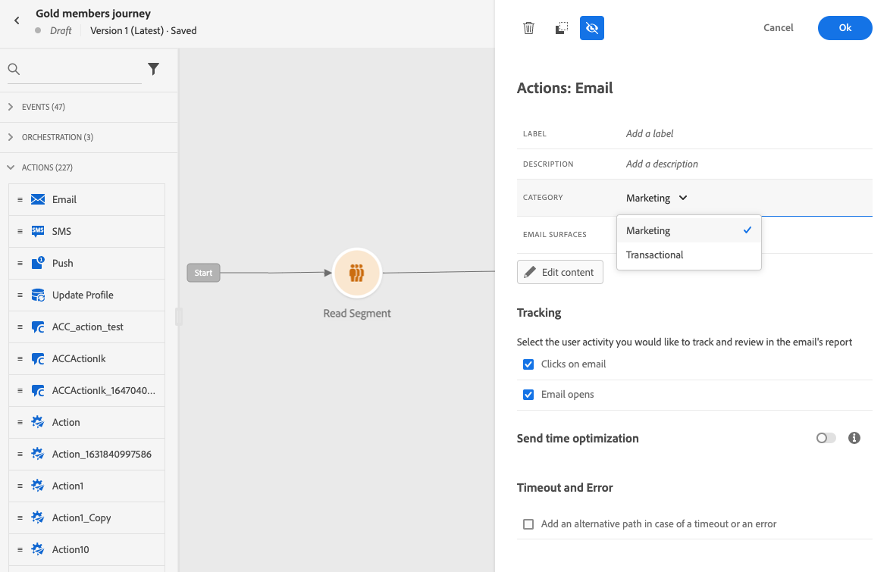

# Message frequency rules {#frequency-rules}

[!DNL Journey Optimizer] allows you to control how often users will receive a message or enter into a journey by setting cross-channel rules that will automatically exclude over-solicited profiles from messages and actions.

For example, you don't want your brand to send more than 3 marketing messages per month to their customers.
 
To do this, you can use a frequency rule which will cap the number of messages sent based on one or more channels during a monthly calendar period.

>[!NOTE]
>
>Message frequency rules are different from opt-out management, which allows users to unsubscribe from receiving communications from a brand. [Learn more](../privacy/opt-out.md#opt-out-management)

➡️ [Discover this feature in video](#video)

## Access rules {#access-rules}

Rules are available from the **[!UICONTROL Administration]** > **[!UICONTROL Rules]** menu. All rules are listed, sorted by modification date.

Use the filter icon to filter on the category, status, and/or channel. You can also search on the message label.

### Permissions{#permissions-frequency-rules}

To access, create, edit or delete message frequency rules, you must have the **[!UICONTROL Manage frequency rules]** permission. 

Users with the **[!UICONTROL View frequency rules]** permission are able to view rules, but not to modify or delete them.

Learn more about permissions in [this section](../administration/high-low-permissions.md).

## Create a rule {#create-new-rule}

To create a new rule, follow the steps below.

1. Access the **[!UICONTROL Message frequency rules]** list, then click **[!UICONTROL Create rule]**.

    

1. Define the rule name.

    

1. Select the message rule category.

   >[!NOTE]
   >
   >Currently only the **[!UICONTROL Marketing]** category is available.

1. Set the capping for your rule, meaning the maximum number of messages that can be sent to an individual user profile each month.

   

   >[!NOTE]
   >
   >Frequency cap is based on a monthly calendar period. It is reset at the beginning of each month.

1. Select the channel you want to use for this rule: **[!UICONTROL Email]** or **[!UICONTROL Push notification]**.

   

   >[!NOTE]
   >
   >You must select at least one channel to be able to create the rule.

1. Select several channels if you want to apply capping across all selected channels as a total count.

   For example, set capping to 15, and select both the email and push channels. If a profile has already received 10 marketing emails and 5 marketing push notifications, this profile will be excluded from the very next delivery of any marketing email or push notification.

1. Click **[!UICONTROL Save as draft]** to confirm the rule creation. Your message is added to the rule list, with the **[!UICONTROL Draft]** status.

   

## Activate a rule {#activate-rule}

When created, a message frequency rule has the **[!UICONTROL Draft]** status and is not yet impacting any message. To enable it, click the ellipsis next to the rule and select **[!UICONTROL Activate]**.

   

Activating a rule will impact any messages it applies to on their next execution. Learn how to [apply a frequency rule to a message](#apply-frequency-rule).

>[!NOTE]
>
>It can take up to 10 minutes for a rule to be fully activated. You do not need to modify messages or republish journeys for a rule to take effect.

To deactivate a message frequency rule, click the ellipsis next to the rule and select **[!UICONTROL Deactivate]**.

   
The rule's status will change to **[!UICONTROL Inactive]** and the rule will not apply to future message executions. Any messages currently in execution will not be affected.

>[!NOTE]
>
>Deactivating a rule does not affect or reset any counts on individual profiles.

## Apply a frequency rule to a message {#apply-frequency-rule}
 
To apply a frequency rule to a message, follow the steps below.

1. [Create a message](../messages/get-started-content.md#create-new-message) by selecting one of the channels you defined for your rule.

1. Select the category you defined for the [rule you created](#create-new-rule).

   

   >[!NOTE]
   >
   >Currently only the **[!UICONTROL Marketing]** category is available for message frequency rules.

   <!--
   1. You can click the **[!UICONTROL Frequency rule]** link to view the frequency rules that will apply for the selected category and channel(s). A new tab will open to display the matching message frequency rules.-->

1. All the frequency rules matching the selected category and channel(s) will be automatically applied to this message.

   >[!NOTE]
   >
   >Messages <!--that do not have any selected category or messages -->where the category selected is **[!UICONTROL Transactional]** will not be evaluated against frequency rules.

   <!--Clicking the link out button next to the category selector will jump you over to the rules inventory screen to see which rules will be applied to the message.-->

1. You can view the number of profiles excluded from delivery in the [Global report](../reports/global-report.md), and in the [Live report](../reports/live-report.md), where frequency rules will be listed as a possible reason for users excluded from delivery.

>[!NOTE]
>
>Several rules can apply to the same channel, but once the lower cap is reached, the profile will be excluded from the next deliveries.

## Example: combine several rules {#frequency-rule-example}

You can combine several message frequency rules, such as described in the example below.

1. [Create a rule](#create-new-rule) called *Overall Marketing Capping*:

   * Select Email and Push channels.
   * Set capping to 12.

   

1. To further restrict the number of marketing-based push notifications that a user is sent, create a second rule called *Push Marketing Cap*:

   * Select Push channel.
   * Set capping to 4.

   

1. Save and [activate](#activate-rule) the rule.

1. Create an email and select the **[!UICONTROL Marketing]** category for that message. [Learn more](../messages/get-started-content.md#create-new-message)

1. Create a push notification and select the **[!UICONTROL Marketing]** category for that message. [Learn more](../messages/get-started-content.md#create-new-message)

In this scenario, an individual profile:
* can receive up to 12 marketing messages per month;
* but will be excluded from marketing push notifications after they have received 4 push notifications.

>[!NOTE]
>
>When testing frequency rules, it is recommended to use a newly created [test profile](../segment/creating-test-profiles.md), because once a profile's frequency cap is reached, there is no way to reset the counter until the next month. Deactivating a rule will allow capped profiles to receive messages, but it will not remove or delete any counter increments.

## How-to video {#video}

Learn how to create, activate, test, and report on frequency rules.

>[!VIDEO](https://video.tv.adobe.com/v/344451?quality=12)
