# Message frequency rules {#frequency-rules}

[!DNL Journey Optimizer] allows you to control how often users will receive a message or enter into a journey by setting cross-channel rules that will automatically exclude over-solicited profiles from messages and actions.

For example, for a brand, a rule could be not to send more than 3 marketing messages per month to their customers. To do this, you can use a frequency rule which will cap the number of messages sent based on one or more channels during a monthly calendar period.

>[!NOTE]
>
>Message frequency rules are different from opt-out management, which allows users to unsubscribe from receiving communications from a brand. [Learn more](../privacy/opt-out.md#opt-out-management)

➡️ [Discover this feature in video](#video)

## Access rules {#access-rules}

Rules are available from the **[!UICONTROL Administration]** > **[!UICONTROL Rules]** menu. All rules are listed, sorted by modification date.

Use the filter icon to filter on the category, status, and/or channel. You can also search on the message label.

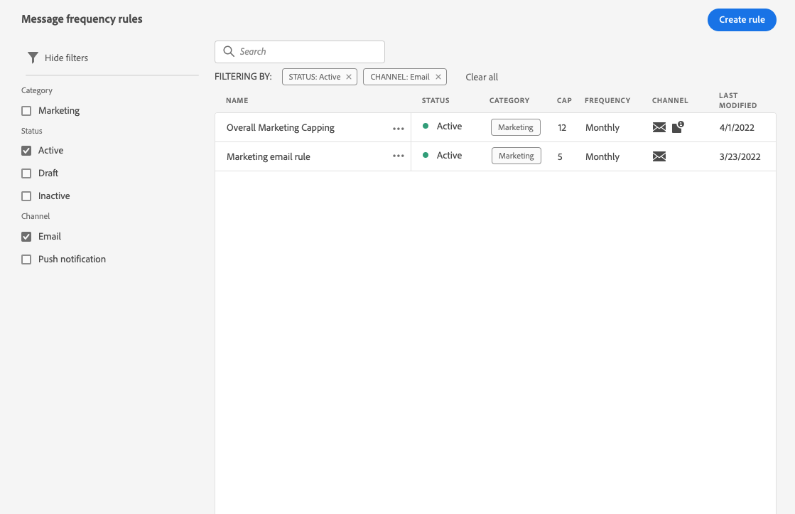

### Permissions{#permissions-frequency-rules}

To access, create, edit or delete message frequency rules, you must have the **[!UICONTROL Manage frequency rules]** permission. 

Users with the **[!UICONTROL View frequency rules]** permission are able to view rules, but not to modify or delete them.

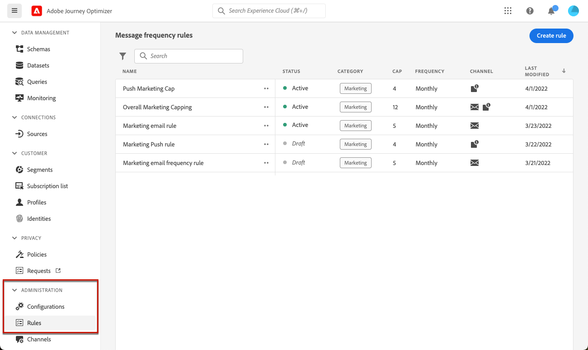

Learn more about permissions in [this section](../administration/high-low-permissions.md).

## Create a rule {#create-new-rule}

>[!CONTEXTUALHELP]
>id="ajo_rules_category"
>title="Select the message rule category"
>abstract="When activated and applied to a message, all the frequency rules matching the selected category will be automatically applied to this message. Currently only the Marketing category is available."

>[!CONTEXTUALHELP]
>id="ajo_rules_capping"
>title="Set the capping for your rule"
>abstract="Specify the maximum number of messages sent to a customer profile each month. Frequency cap will be based on a monthly calendar period and will be reset at the beginning of each month."

>[!CONTEXTUALHELP]
>id="ajo_rules_channel"
>title="Define the channel(s) the rule applies to"
>abstract="Select at least one channel. Capping applies across channels as a total count."

To create a new rule, follow the steps below.

1. Access the **[!UICONTROL Message frequency rules]** list, then click **[!UICONTROL Create rule]**.

    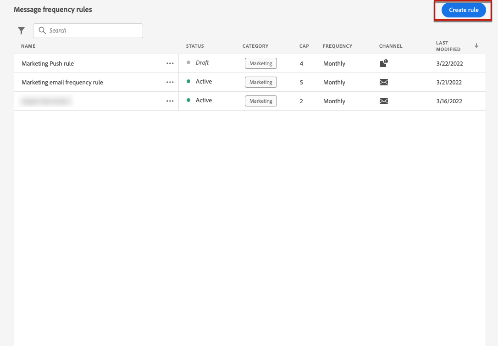

1. Define the rule name.

    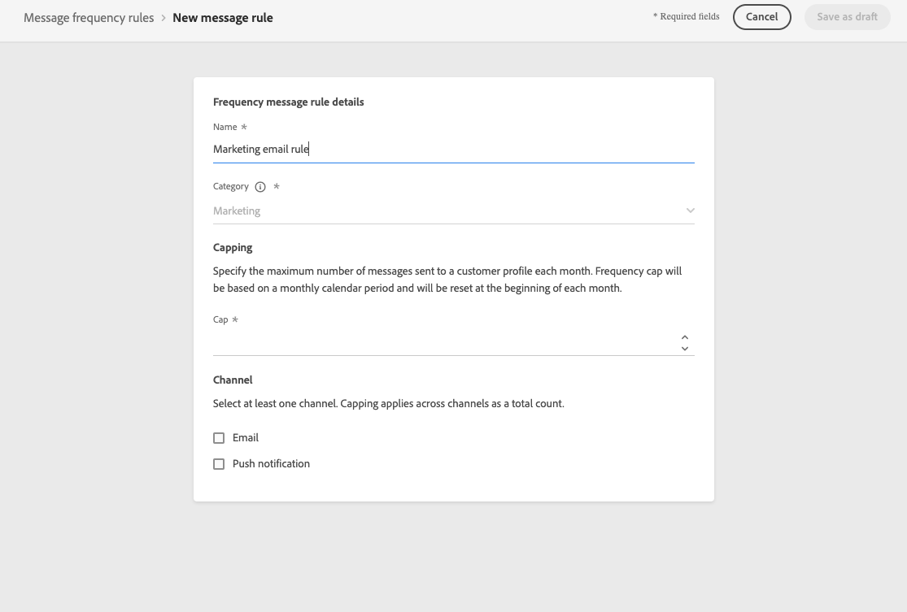

1. Select the message rule category.

   >[!NOTE]
   >
   >Currently only the **[!UICONTROL Marketing]** category is available.

1. Select a time frame for the capping to be applied.

   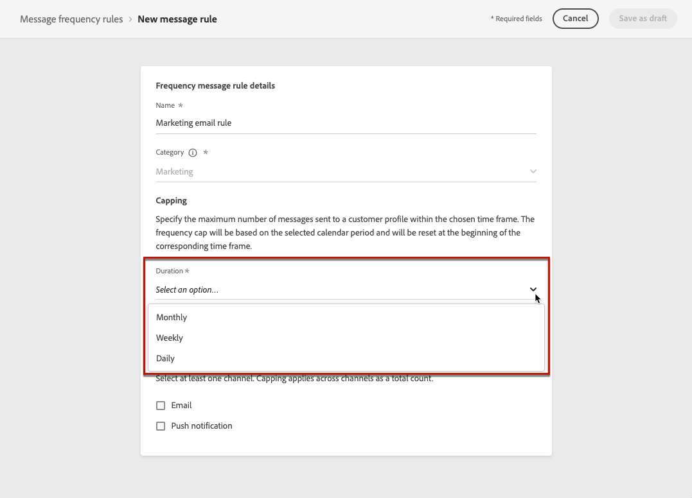

   Frequency cap is based on the selected calendar period. It is reset at the beginning of the corresponding time frame.

   The expiry of the counter for each period is as follows:

   * **[!UICONTROL Daily]**: The frequency cap is valid for the day until 23:59:59 UTC and resets to 0 at the start of the next day.

   * **[!UICONTROL Weekly]**: The frequency cap is valid until Saturday 23:59:59 UTC of that week as the calendar week starts on Sunday. The expiry is irrespective of the rule creation. For example, if the rule is created on Thursday, this rule is valid until Saturday at 23:59:59.
   
   * **[!UICONTROL Monthly]**: The frequency cap is valid until the last day of the month at 23:59:59 UTC. For example, the monthly expiration for January is 01-31 23:59:59 UTC.

   >[!NOTE]
   >
   >When dealing with [batch segmentation](https://experienceleague.adobe.com/docs/experience-platform/segmentation/home.html#batch){target="_blank"}, the daily counters may not accurately reflect the current values as the daily counter snapshot is taken at midnight UTC the night before. Consequently, relying on daily counters in this scenario becomes impractical, as the snapshot does not reflect the most up-to-date counter values on the profile. To ensure accuracy for daily frequency capping rules, the use of [streaming segmentation](https://experienceleague.adobe.com/docs/experience-platform/segmentation/ui/streaming-segmentation.html){target="_blank"} is recommended. <!--Learn more on audience evaluation methods in [this section](using/audience/about-audiences.md#evaluation-method-in-journey-optimizer).-->

1. Set the capping for your rule, meaning the maximum number of messages that can be sent to an individual user profile each month, week, or day - according to your selection above.

   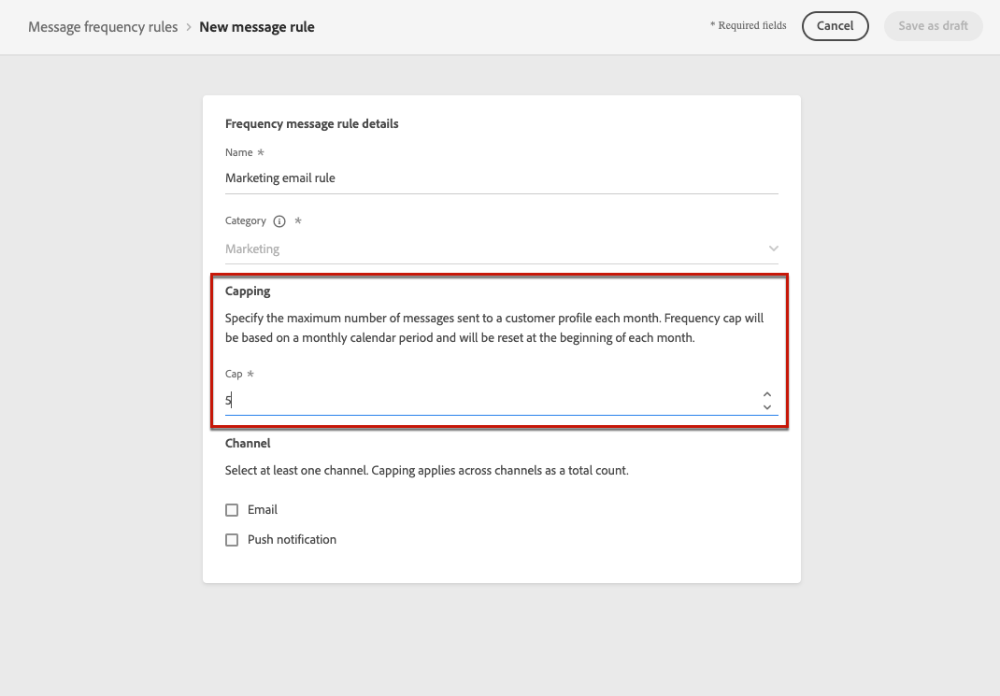

1. Select the channel you want to use for this rule: **[!UICONTROL Email]** or **[!UICONTROL Push notification]**.

   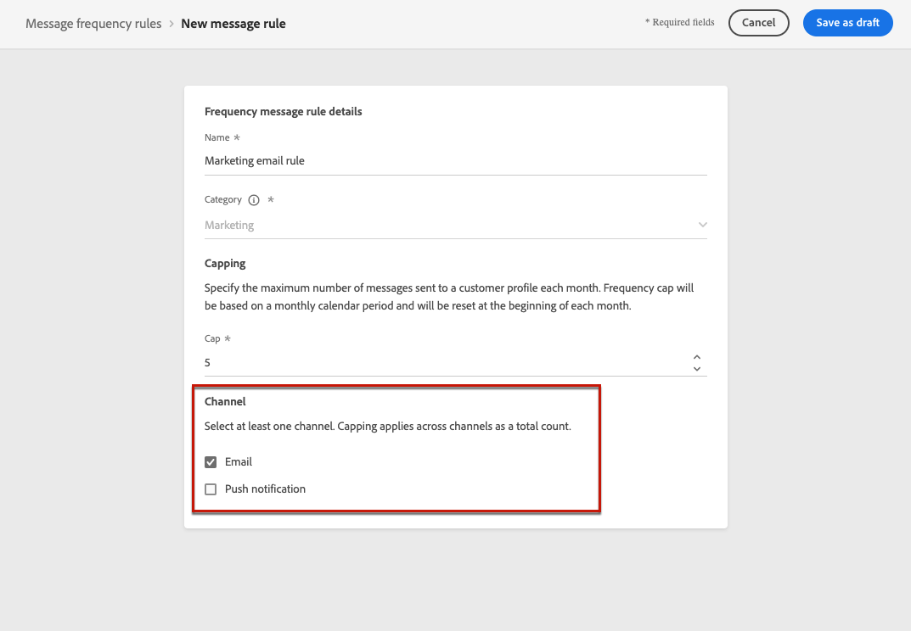

   >[!NOTE]
   >
   >You must select at least one channel to be able to create the rule.

1. Select several channels if you want to apply capping across all selected channels as a total count.

   For example, set capping to 15, and select both the email and push channels. If a profile has already received 10 marketing emails and 5 marketing push notifications for the selected period, this profile will be excluded from the very next delivery of any marketing email or push notification.

1. Click **[!UICONTROL Save as draft]** to confirm the rule creation. Your message is added to the rule list, with the **[!UICONTROL Draft]** status.

   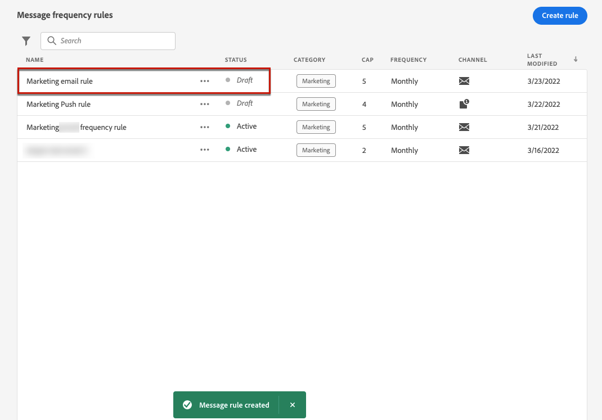

## Activate a rule {#activate-rule}

When created, a message frequency rule has the **[!UICONTROL Draft]** status and is not yet impacting any message. To enable it, click the ellipsis next to the rule and select **[!UICONTROL Activate]**.

   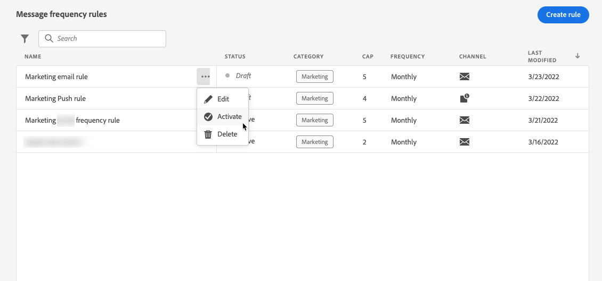

Activating a rule will impact any messages it applies to on their next execution. Learn how to [apply a frequency rule to a message](#apply-frequency-rule).

>[!NOTE]
>
>It can take up to 10 minutes for a rule to be fully activated. You do not need to modify messages or republish journeys for a rule to take effect.

To deactivate a message frequency rule, click the ellipsis next to the rule and select **[!UICONTROL Deactivate]**.

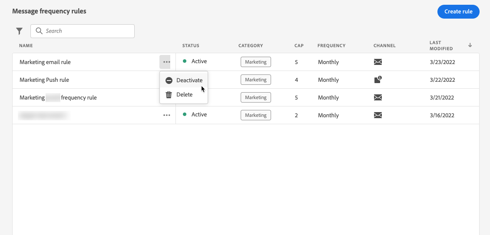
   
The rule's status will change to **[!UICONTROL Inactive]** and the rule will not apply to future message executions. Any messages currently in execution will not be affected.

>[!NOTE]
>
>Deactivating a rule does not affect or reset any counts on individual profiles.

## Apply a frequency rule to a message {#apply-frequency-rule}
 
To apply a frequency rule to a message, follow the steps below.

1. When creating a [journey](../building-journeys/journey-gs.md), add a message by selecting one of the channels you defined for your rule.

1. Select the category you defined for the [rule you created](#create-new-rule).

   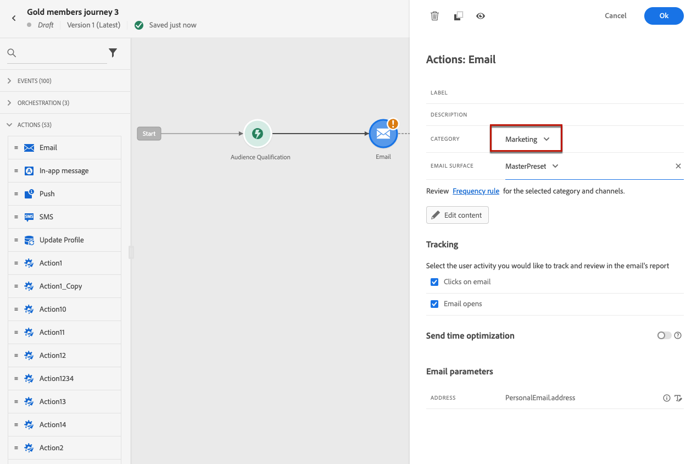

   >[!NOTE]
   >
   >Currently only the **[!UICONTROL Marketing]** category is available for message frequency rules.

1. You can click the **[!UICONTROL Frequency rule]** link to view the frequency rules screen in a new tab. [Learn more](#access-rules)

   All the frequency rules matching the selected category and channel(s) will be automatically applied to this message.

   >[!NOTE]
   >
   >Messages where the category selected is **[!UICONTROL Transactional]** will not be evaluated against frequency rules.

1. You can view the number of profiles excluded from delivery in the [Global report](../reports/global-report.md), and in the [Live report](../reports/live-report.md), where frequency rules will be listed as a possible reason for users excluded from delivery.

>[!NOTE]
>
>Several rules can apply to the same channel, but once the lower cap is reached, the profile will be excluded from the next deliveries.

## Example: combine several rules {#frequency-rule-example}

You can combine several message frequency rules, such as described in the example below.

1. [Create a rule](#create-new-rule) called *Overall Marketing Capping*:

   * Select Email and Push channels.
   * Set capping to 12 monthly.

   

1. To further restrict the number of marketing-based push notifications that a user is sent, create a second rule called *Push Marketing Cap*:

   * Select Push channel.
   * Set capping to 4 monthly.

   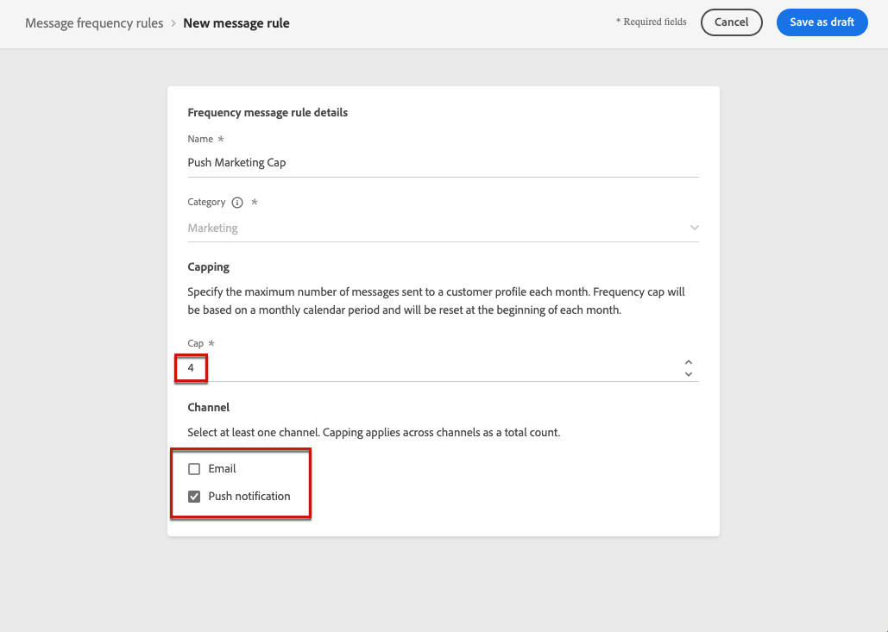

1. Save and [activate](#activate-rule) the rule.

1. Create an email and select the **[!UICONTROL Marketing]** category for that message. [Learn more](../email/create-email.md)

1. Create a push notification and select the **[!UICONTROL Marketing]** category for that message. [Learn more](../push/create-push.md)

In this scenario, an individual profile:
* can receive up to 12 marketing messages per month;
* but will be excluded from marketing push notifications after they have received 4 push notifications.

>[!NOTE]
>
>When testing frequency rules, it is recommended to use a newly created [test profile](../audience/creating-test-profiles.md), because once a profile's frequency cap is reached, there is no way to reset the counter until the next month. Deactivating a rule will allow capped profiles to receive messages, but it will not remove or delete any counter increments.

## How-to video {#video}

Learn how to create, activate, test, and report on frequency rules.

>[!VIDEO](https://video.tv.adobe.com/v/344451?quality=12)
