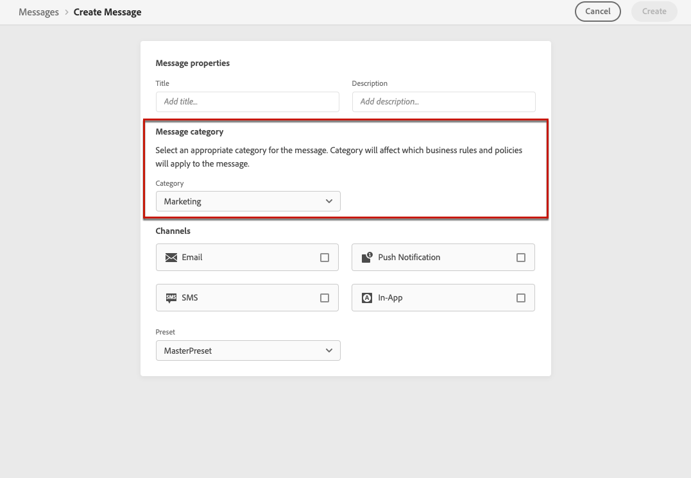

# Message frequency rules {#frequency-rules}

[!DNL Journey Optimizer] allows you to control how often users will receive a message or enter into a journey by setting cross-channel rules that will automatically exclude over-solicited profiles from messages and actions.

For example, you don't want your brand to send more than 3 marketing messages per month to their customers.
 
To do this, you can use a frequency rule which will cap the number of messages sent based on one or more channels during a monthly calendar period.

>[!NOTE]
>
>Message frequency rules are different from opt-out management, which allows users to unsubscribe from receiving communications from a brand. [Learn more](../messages/consent.md#opt-out-management)

## Access rules {#access-rules}

Rules are available from the **[!UICONTROL Administration]** > **[!UICONTROL Rules]** menu. All rules are listed, sorted by modification date.

<!--To access, create, edit or delete message frequency rules, you must have the message configuration permission. [Learn more](../administration/high-low-permissions.md#administration-permissions)-->

Use the filter icon to filter on the category, status, and/or channel. You can also search on the message label.

## Create a rule {#create-new-rule}

To create a new rule, follow the steps below.

1. Access the **[!UICONTROL Message frequency rules]** list, then click **[!UICONTROL Create rule]**.

    

1. Define the rule name.

    

1. Select the message rule category.

   >[!NOTE]
   >
   >Currently only the **[!UICONTROL Marketing]** category is availble.

1. Set the capping for your rule, meaning the maximum number of messages that can be sent to an individual user profile each month.

   

   >[!NOTE]
   >
   >Frequency cap is based on a monthly calendar period. It is reset at the beginning of each month.

1. Select the channel you want to use for this rule: **[!UICONTROL Email]** or **[!UICONTROL Push notification]**.

   

   >[!NOTE]
   >
   >You must select at least one channel to be able to create the rule.

1. Select several channels if you want to apply capping across all selected channels as a total count.

   For example, set capping to 15 and select both the email and push channels. If a profile has already received 10 marketing emails and 5 marketing push notifications, this profile will be excluded from the very next delivery of any marketing email or push notification.

1. Click **[!UICONTROL Save as draft]** to confirm the rule creation. Your message is added in the rule list, with the **[!UICONTROL Draft]** status.

   

## Activate a rule {#activate-rule}

To activate a message frequency rule, click the ellipsis next to the rule and select **[!UICONTROL Activate]**.

   

Activating a rule will impact any messages it applies to on their next execution. Learn how to [apply a frequency rule to a message](#apply-frequency-rule).

>[!NOTE]
>
>You do not need to modify or republish messages or journeys for a rule to take effect.

To deactivate a message frequency rule, click the ellipsis next to the rule and select **[!UICONTROL Deactivate]**.

   
The rule's status will change to **[!UICONTROL Inactive]** and the rule will not apply to future message executions. Any messages currently in execution will not be affected.

>[!NOTE]
>
>Deactivating a rule does not affect or reset any counts on individual profiles.

## Apply a frequency rule to a message {#apply-frequency-rule}
 
To apply a frequency rule to a message, you simply need to select the category you defined for this rule when [creating the message](../messages/create-message.md#create-new-message).

By selecting the **[!UICONTROL Marketing]** category, all the matching message frequency rules will be automatically applied to this message.

<!--Clicking the link out button next to the category selector will jump you over to the rules inventory screen to see which rules will be applied to the message.-->

You can view the number of profiles excluded from delivery in the [Live and Global views](../messages/message-monitoring.md), and in the [email Live report](../reports/email-live-report.md), where frequency rules will be listed as a possible reason for users excluded from delivery.

## Example

You can combine several message frequency rules, such as described in the example below.

1. Create a rule called *Overall Marketing Capping*:

   * Select all channels (Email, Push).
   * Set capping to 12.

1. To further restrict the number of marketing-based push notifications that a user is sent, create a second rule called *Limit marketing push*:

   * Select Push channel.
   * Set capping to 4.

In this scenario, an individual profile can receive up to 12 marketing messages per month, but will be exclude from marketing push notifications after they have received 4 push notifications.
