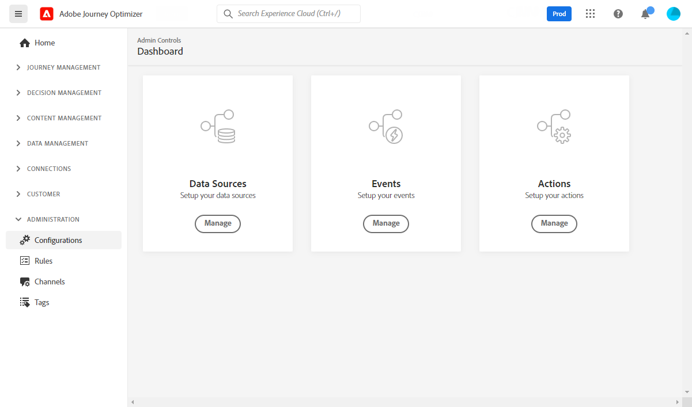

# Get started with [!DNL Journey Optimizer] configuration {#start-optimizer-configuration}

When accessing [!DNL Journey Optimizer] for the first time, you are provisioned a production sandbox and allocated a certain number of IPs depending on your contract.

To be able to create your journeys and send messages, you need to go through the configuration steps below.

## Configure messages and channels

1. To be able to create and send messages, you need to perform specific configurations depending on the channel.

    * For the **Email** channel, you need to delegate subdomains to Adobe and create IP pools to group together IP addresses. [Learn more](../email/get-started-email-config.md)

    * For the **Push** channel, you need to define push notifications settings in both [!DNL Adobe Experience Platform] and [!DNL Adobe Experience Platform Launch]. [Learn more](../push/push-configuration.md)

    * For the **SMS** channel, you need to configure your instance to send SMS, including integrating the provider settings with [!DNL Journey Optimizer]. [Learn more](../sms/sms-configuration.md)

1. Once done, you must create **channel surfaces** to configure all the technical parameters required to deliver messages. [Learn more](channel-surfaces.md)

1. You can also:

    * Manage the number of days during which retries are performed before sending email addresses to the suppression list. [Learn more](manage-suppression-list.md)

    * Enable the **BBC email option** to keep a copy of messages sent to individuals. [Learn more](archiving-support.md#enable-bcc)

    * Configure **frequency rules** to avoid over-solicitating your recipients. [Learn more](frequency-rules.md)

    * Determine which email address and/or phone number to use in priority for your recipients when several addresses/numbers are available in Adobe Experience Platform. [Learn more](primary-email-addresses.md)

<!--* Understand the push notification flow. [Learn more](../push/push-gs.md)-->

>[!NOTE]
>
>These steps must be performed by an [Adobe Journey Optimizer system administrator](../start/path/administrator.md).

## Configure journeys

In order to build journeys, you need to configure **[!UICONTROL Data Sources]**, **[!UICONTROL Events]** and **[!UICONTROL Actions]**. [Learn more](about-data-sources-events-actions.md)

* The **data source** configuration allows you to define a connection to a system to retrieve additional information that will be used in your journeys. [Learn more](../datasource/about-data-sources.md)

* **Events** allow you to trigger your journeys unitarily to send messages, in real-time, to the individual flowing into the journey. In the event configuration, you configure the events expected in the journeys. The incoming events' data is normalized following the Adobe Experience Data Model (XDM). Events come from Streaming Ingestion APIs for authenticated and unauthenticated events (such as Adobe Mobile SDK events). [Learn more](../event/about-events.md)
    
* [!DNL Journey Optimizer] comes with built-in message capabilities that allow you to design and send your content. If you are using a third-party system to send your messages, create a **custom action**. [Learn more](../action/action.md)