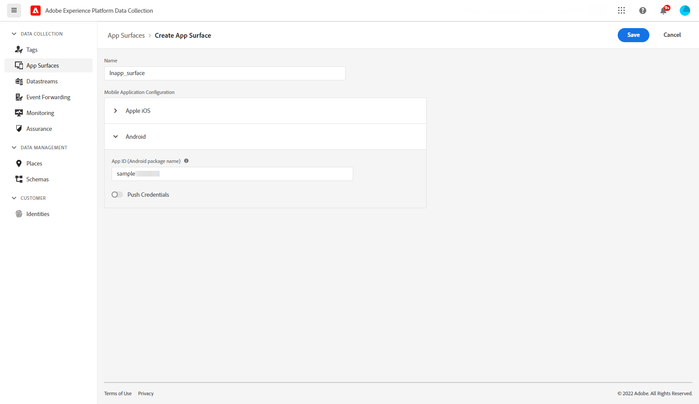

# Configure In-app channel {#inapp-configuration}

Before sending In-app messages, you need to configure your **[!UICONTROL App surfaces]** in [!DNL Adobe Experience Platform Data Collection].

1. From your [!DNL Adobe Experience Platform Data Collection] account, access the **[!UICONTROL App surfaces]** menu, then click **[!UICONTROL Create App surface]**.

    

1. Add a name to your **[!UICONTROL App surface]**.

1. From the Apple iOS drop-down, type-in your **iOS Bundle ID**. Refer to [Apple documentation](https://developer.apple.com/documentation/appstoreconnectapi/bundle_ids) for more information on **Bundle ID**.

    

1. From the Android drop-down, type-in your **Android package name**. Refer to [Android documentation](https://support.google.com/admob/answer/9972781?hl=en#:~:text=The%20package%20name%20of%20an,supported%20third%2Dparty%20Android%20stores) for more information on **Package name**.

1. Click **[!UICONTROL Save]** when you finished the configuration of your **[!UICONTROL App surface]**.

    

Your **[!UICONTROL App surface]** will now be available when creating a new campaign with an In-app message. [Learn more](../messages/create-in-app.md)
