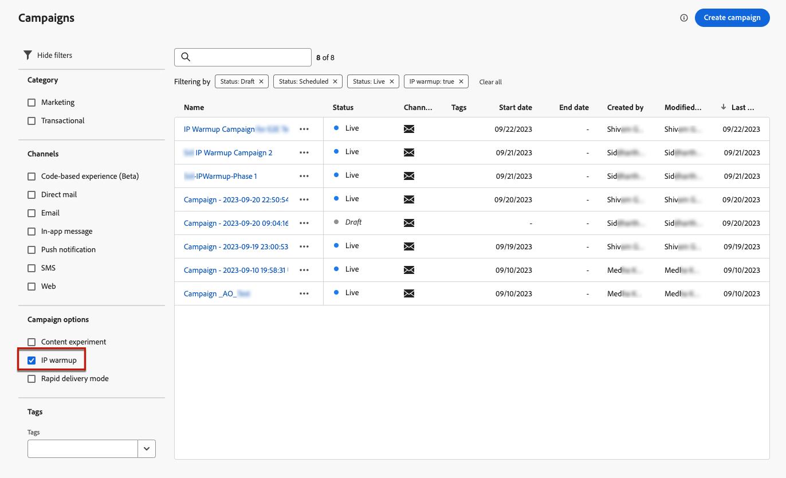

# Create IP warmup campaigns {#create-ip-warmup-campaign}

>[!CONTEXTUALHELP]
>id="ajo_campaign_ip_warmup"
>title="Activate the IP warmup plan option"
>abstract="When you select this option, the campaign can be used in an IP warmup plan. The campaign schedule will then be driven by the IP warmup plan it is associated with."

>[!BEGINSHADEBOX]

What you'll find in this documentation guide:

* [Get started with IP warmup](ip-warmup-gs.md)
* **[Create IP warmup campaigns](ip-warmup-campaign.md)**
* [Create an IP warmup plan](ip-warmup-plan.md)
* [Execute the IP warmup plan](ip-warmup-execution.md)

>[!ENDSHADEBOX]

Before creating the IP warmup plan itself in [!DNL Journey Optimizer], you first need to create one or more campaigns with the dedicated option enabled so that they can be used in an IP warmup plan.

To create an IP warmup campaign, follow the steps below.

1. Create an [email](../email/email-settings.md) channel [surface](channel-surfaces.md) for the domain and the IPs that you have identified for your warmup plan.

    >[!NOTE]
    >
    >Learn how to select the domain and IPs to use in an email surface in [this section](../email/email-settings.md#subdomains-and-ip-pools).
    >
    >Work with your deliverability consultant to identify the domain and IPs to be used for your IP warmup plan.<!--TBC-->

1. Create a [campaign](../campaigns/create-campaign.md) and select the [Email](../email/create-email.md#create-email-journey-campaign) action.

1. Select the surface that you created for IP warmup.

    

    <!--You must use the same surface as the one that will be used for the asociated IP warmup plan. [Learn how to create an IP warmup plan](#create-ip-warmup-plan)-->

1. Click **[!UICONTROL Create]**.

1. From the **[!UICONTROL Schedule]** section, select **[!UICONTROL IP warmup plan activation]**.

    

    The campaign [schedule](../campaigns/create-campaign.md#schedule) will be driven by the IP warmup plan it will be associated with, meaning that the schedule is not defined anymore in the campaign itself.

1. Complete the steps to create an email campaign, such as defining the campaign properties, [audience](../audience/about-audiences.md)<!--best practices for IP warmup in terms of audience?-->, and [content](../email/get-started-email-design.md#key-steps).

    >[!NOTE]
    >
    >For more information on how to configure a campaign, refer to [this page](../campaigns/get-started-with-campaigns.md).

1. [Activate](../campaigns/review-activate-campaign.md) the campaign.

    >[!NOTE]
    >
    >For a live campaign with IP warmup plan activated, the **[!UICONTROL Delete]** button is available until it is associated with an IP warmup plan. Once used in a plan, the campaign cannot be deleted anymore.

1. The campaign is displayed in the **[!UICONTROL Campaigns]** list. To easily retrieve all the IP warmup campaigns created on the current sandbox, you can filter on the **[!UICONTROL IP warmup]** campaign option.

    

Once live, the campaign is ready for use in an IP warmup plan. [Learn more](ip-warmup-plan.md)

<!--Any recommendations when defining an audience? i.e do you have to include all your database or a limited number or according to your Excel file?-->
