# Execute the IP warmup plan {#ip-warmup-running}

>[!BEGINSHADEBOX]

What you'll find in this documentation guide:

* [Get started with IP warmup](ip-warmup-gs.md)
* [Create IP warmup campaigns](ip-warmup-campaign.md)
* [Create an IP warmup plan](ip-warmup-plan.md)
* **[Execute the IP warmup plan](ip-warmup-execution.md)**

>[!ENDSHADEBOX]

Once you have [created an IP warmup plan](ip-warmup-plan.md) and uploaded the file prepared with your deliverability consultant, you can define the phases and runs in your plan.

Each phase is composed of several runs, to which you assign a single campaign.

## Define the phases {#define-phases}

>[!CONTEXTUALHELP]
>id="ajo_admin_ip_warmup_campaigns_excluded"
>title="Exclude campaign audiences"
>abstract="Select campaigns to exclude their audiences from the current phase. This is to prevent previously contacted profiles from other phases or other IP warmup plans from being targeted again."

>[!CONTEXTUALHELP]
>id="ajo_admin_ip_warmup_domains_excluded"
>title="Exclude domain groups"
>abstract="Select the domains that you want to exclude from the current phase. Domain exclusion requires a non-executed phase, so you may have to split a running phase to add exclusions."
>additional-url="https://experienceleague.adobe.com/docs/journey-optimizer/using/configuration/implement-ip-warmup-plan/ip-warmup-execution.html#split-phase" text="Split a phase"

>[!CONTEXTUALHELP]
>id="ajo_admin_ip_warmup_phases"
>title="Define the phases of your plan"
>abstract="Each phase is composed of several runs, to which you assign a single campaign."

<!--You need to associate the campaign and audience at phase level and turns on some settings as needed for all runs associated with a single creative/campaign

At phase level, system ensures that previously targeted + new profiles are picked up AND at iteration level, system ensures that each run is having unique profiles and the count matches what is stated in plan-->

<!---->

1. For each phase, select the campaign you want to associate with this phase of the IP warmup plan.

    >[!NOTE]
    >
    >You cannot select a campaign that is already in use in another IP warmup plan. However, the same campaign can be used in one or more phases of the same IP warmup plan.

    

    >[!IMPORTANT]
    >
    >* Only the campaigns with the **[!UICONTROL IP warmup plan activation]** option enabled are available for selection. [Learn more](#create-ip-warmup-campaign)
    >
    >* You must select a campaign that uses the same surface as the one selected for the current IP warmup plan.

1. Once a campaign is selected for the current phase, the sections to exclude profiles, campaign audiences and domain groups are displayed.

    >[!NOTE]
    >
    >Once a run is activated, exclusions cannot be modified anymore unless you [split the run](#split-phase) to a new phase.

    1. In the **[!UICONTROL Profile exclusion]** section, you can see that the profiles from the previous runs of that phase are always excluded. For example, if in Run #1 a profile got covered in the first 4800 people being targeted, the system will automatically ensure that the same profile doesn't receive the email in Run #2.

        >[!NOTE]
        >
        >This section is not editable.

    1. From the **[!UICONTROL Campaign audiences excluded]** section, select the campaigns which audiences you want to exclude from the current phase.

        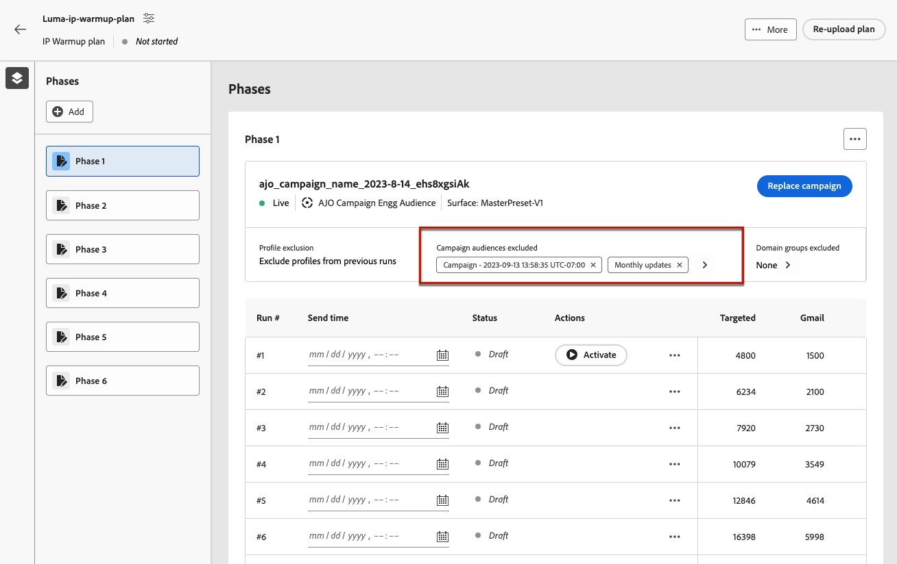

        For example, while executing Phase 1, you had to [split it](#split-phase) for any reason. Therefore, you can exclude the campaign used in Phase 1 so that the previously contacted profiles from Phase 1 are not included in Phase 2. You can also exclude campaigns from other IP warmup plans.

    1. From the **[!UICONTROL Domain groups excluded]** section, select the domains you want to exclude from that phase.

        >[!NOTE]
        >
        >Domain exclusion requires a non-executed phase, so you may have to [split a running phase](#split-phase) to add exclusions.

        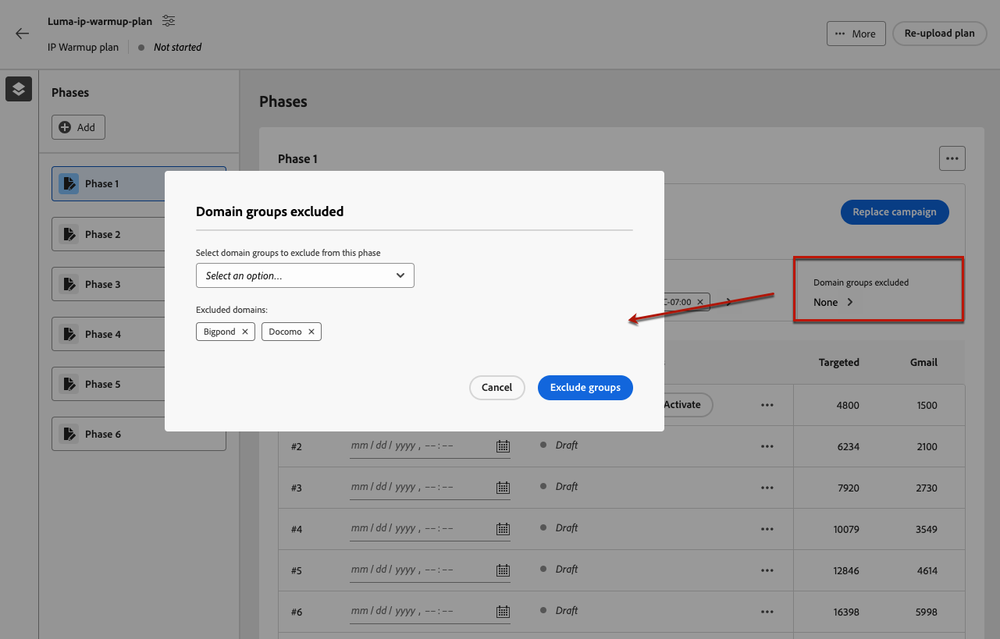

        For example, after running IP warmup for some days, you realize that your ISP reputation with a domain (for example, Adobe) is not good and you wish to resolve it without stopping your IP warmup plan. In such a case, you can exclude the Adobe domain group.

        >[!NOTE]
        >
        >You can only exclude a domain group (whether default or custom) that was added to the [IP warmup plan template](ip-warmup-plan.md#prepare-file). If this is not the case, update the template with the domain group you want to exclude and [re-upload the plan](#re-upload-plan).

1. If needed, you can replace the campaign using the **[!UICONTROL Replace campaign]** button.

    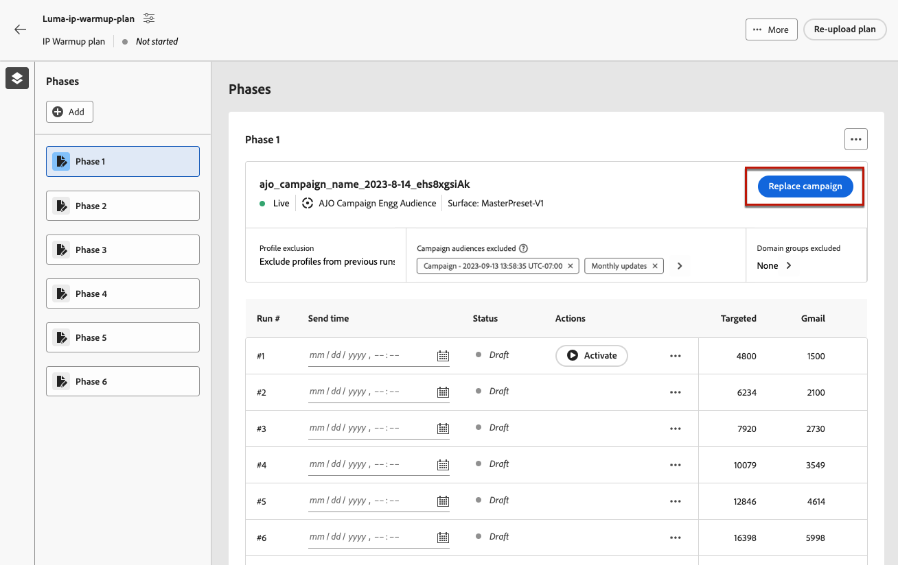

    >[!NOTE]
    >
    >This action is possible only prior to activating the first run of the phase. Once a run is activated, the campaign cannot be replaced, unless you [split the run](#split-phase) to a new phase.

1. You can add a phase if needed. It will be added after the last current phase.

    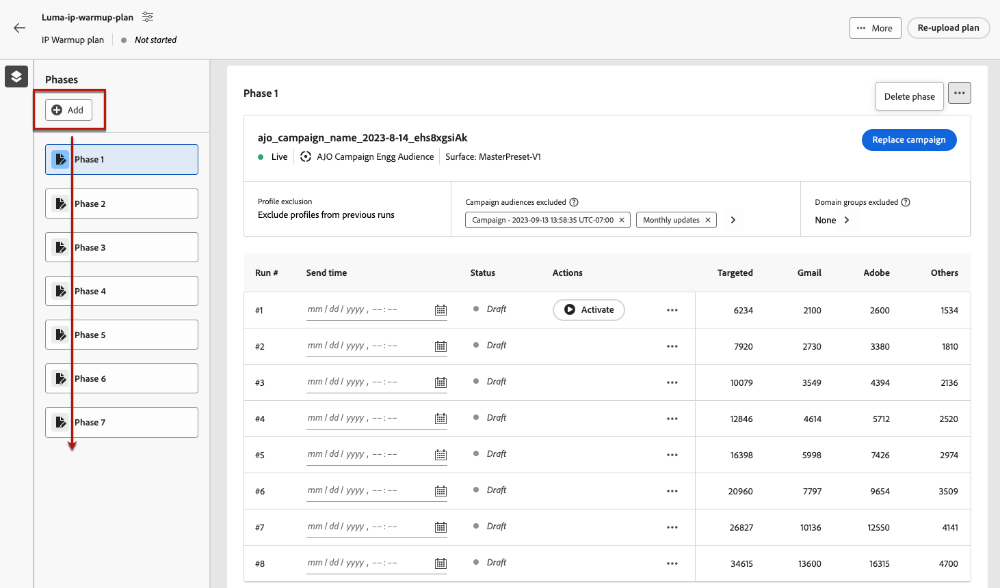

1. Use the **[!UICONTROL Delete phase]** button to remove any unwanted phase. This action is only available if no run is executed in a phase. <!--Once a run is executed, deletion is not allowed.-->

    >[!CAUTION]
    >
    >You cannot undo the **[!UICONTROL Delete]** action.

    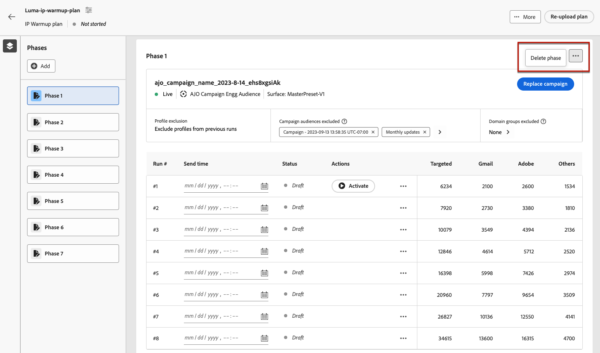

    >[!NOTE]
    >
    >If you delete all the phases from the IP warmup plan, it is recommended to re-upload a plan. [Learn more](#re-upload-plan)

## Define the runs {#define-runs}

>[!CONTEXTUALHELP]
>id="ajo_admin_ip_warmup_run"
>title="Define each run"
>abstract="Define and activate each run for all the phases."

>[!CONTEXTUALHELP]
>id="ajo_admin_ip_warmup_last_engagement"
>title="Filter on engagement"
>abstract="This column is a filter that targets only the users engaged with your brand over the last 20 days for example. You can also change this setting through the **Edit run** option."

>[!CONTEXTUALHELP]
>id="ajo_admin_ip_warmup_retry"
>title="Set a time window"
>abstract="You can define a time window during which the IP warmup campaign can be executed in case there is any delays in the segmentation job."

>[!CONTEXTUALHELP]
>id="ajo_admin_ip_warmup_pause"
>title="Cancel runs with audience errors"
>abstract="Select this option to cancel a run if the qualified profiles are less than the targeted profiles once the audience has been evaluated for that run."

>[!CONTEXTUALHELP]
>id="ajo_admin_ip_warmup_qualified"
>title="View the qualified profiles"
>abstract="This column displays the number of qualified profiles. Once the audience has been evaluated for a run, if there are more targeted profiles than qualified profiles, the run is still executed, unless the **Pause for errors** option is enabled. In this case, the run is cancelled."

1. Select a schedule for each run to make sure it is executed at the specified time.

    

1. Optionally, you can define a time window during which the IP warmup campaign can be executed in case there is any delays in the [audience evaluation](https://experienceleague.adobe.com/docs/experience-platform/segmentation/home.html#how-segmentation-works){target="_blank"}. To do so, click the Properties icon on top left, next to the name of the plan, and use the **[!UICONTROL Retry run time]** drop-down list to select a duration - up to 240 minutes (4 hours).

    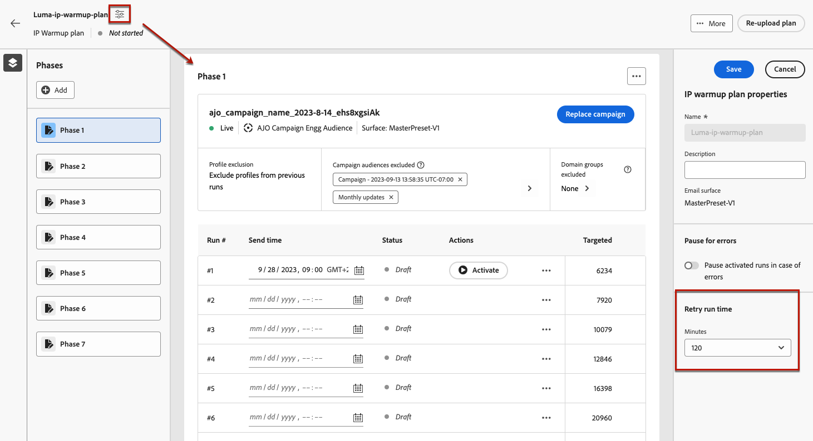

    For example, if you set a send time on a given day at 9am, and select 120 minutes as the retry run time, this allows a window of opportunity of 2 hours (9am - 11am) for the run to be performed for any unexpected delays in the audience evaluation.

    >[!NOTE]
    >
    >If no time window is specified, the run is attempted at the send time and will fail if the audience evaluation is not completed.

1. If needed, select **[!UICONTROL Edit run]** from the More actions icon. There you can update the numbers of addresses in each column. You can also update the **[!UICONTROL Last engagement]** field to target only the users engaged with your brand over the last 20 days for example.

    >[!NOTE]
    >
    >It is recommended to modify these numbers in consultation with your deliverability expert.

    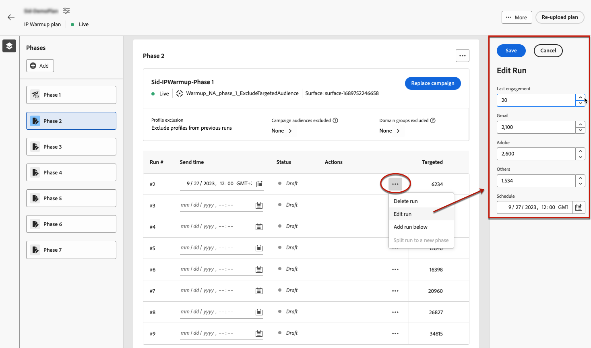

    >[!NOTE]
    >
    >If you don't want to apply any engagement period to a run, enter 0 in the **[!UICONTROL Last engagement]** field.

1. Select the **[!UICONTROL Pause for errors]** option to cancel a run if the qualified profiles are less than the targeted profiles once the audience has been evaluated for that run. In that case, the run takes the **[!UICONTROL Failed]** status.

    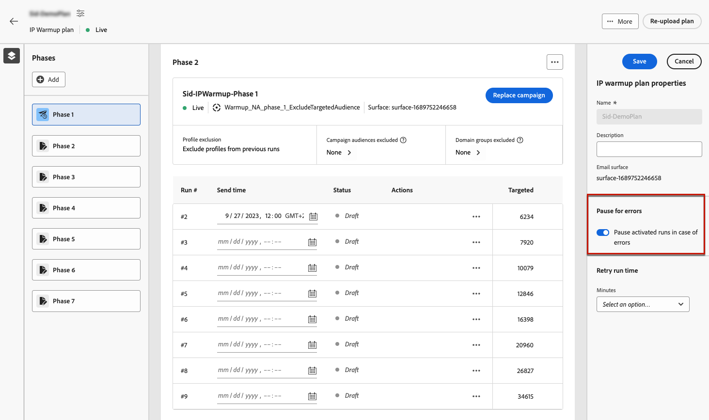

1. **[!UICONTROL Activate]** the run. [Learn more](#activate-run)

1. The status ot this run changes to **[!UICONTROL Live]**, meaning that the system has accepted the request to schedule the run.

    >[!NOTE]
    >
    >The different run statuses are listed in [this section](#monitor-plan).

1. If the campaign execution has not started, you can stop a live run. This action actullay cancels the run schedule - it does not stop the sending.

    

    >[!NOTE]
    >
    >Once the campaign execution has started, the **[!UICONTROL Stop]** button becomes unavailable.

1. To add a run, select **[!UICONTROL Add a run below]** from the More actions icon.

    

## Activate runs {#activate-run}

To activate a run, select the **[!UICONTROL Activate]** button. Then you can activate the next runs on a daily basis.

Make sure you have scheduled enough time to allow for the [audience evaluation](https://experienceleague.adobe.com/docs/experience-platform/segmentation/home.html#how-segmentation-works){target="_blank"} to be executed.

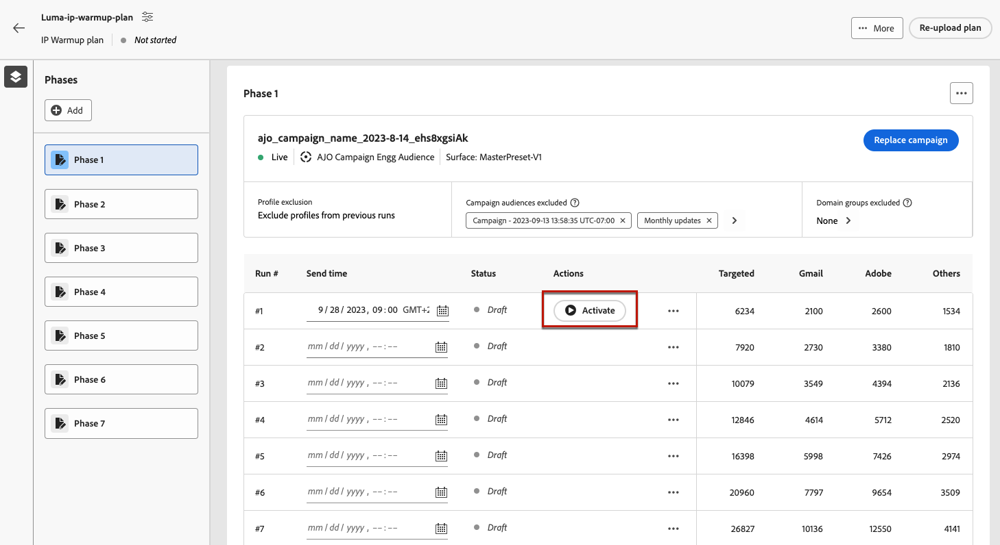

>[!CAUTION]
>
>Each run must be activated at least 12 hours before the actual send time. Otherwise, audience evaluation may not be completed.

When you activate a run, several audiences are automatically created.

* If activating the first run of a phase:

    * An [audience](https://experienceleague.adobe.com/docs/experience-platform/segmentation/ui/segment-builder.html){target="_blank"} is created for the campaign audiences excluded (if any), with the following naming convention: `<warmupName>_Phase<phaseNo>-Audience Exclusion`.

    * Another audience is created for the domain groups excluded (if any), with the following naming convention: `<warmupName>_Phase<phaseNo>-Domain Exclusion`.

    >[!NOTE]
    >
    >The audiences are cleaned up after the warmup plan is marked as completed.
    >
    >The system does not create a new audience in case there is no change in the excluded campaign audiences or domain groups for subsequent phases.

* When activating any run:

    * Another audience is created for the last engagement filter, with the following naming convention: `<warmupName>_Phase<phaseNo>_Run<runNo>-Engagement Filter`.

        >[!NOTE]
        >
        >The audience is cleaned up after the warmup plan is marked as completed.
        >
        >The system does not create a new audience in case there is no change in the last engagement filter for subsequent phases.

    * An [audience composition](https://experienceleague.adobe.com/docs/experience-platform/segmentation/ui/audience-composition.html){target="_blank"} is created corresponding to the audience the campaign will be sent to, with the following naming convention: `<warmupName>-Phase<phaseNo>-Run<runNo>`.

        >[!NOTE]
        >
        >A new audience composition is created for every run.
        >
        >The audience composition (and hence the output audience) is cleaned up when the next iteration is activated.

<!--How do you know when segmentation is complete? Is there a way to prevent user from scheduling less than 12 hours before the segmentation job?-->

<!--Sart to execute on every day basis by simply clicking the play button > for each run? do you have to come back every day to activate each run? or can you schedule them one after the other?)-->

<!--Upon activation, when the segment evaluation happens, more segments will be created by the IP warmup service and will be leveraged in an audience composition and a new audience will be created for each run splitted into the different selected domains.-->

## Monitor the plan {#monitor-plan}

To successfully execute your IP warmup plan, you need to monitor the reports, activate runs and check their status on a daily basis.

### Use the Highlights section {#highlights}

Once the first run is activated for a phase, the **[!UICONTROL Highlights]** section is displayed.

It provides a quick overview of the current run and of the upcoming run. From this section you can also edit and activate the next run.

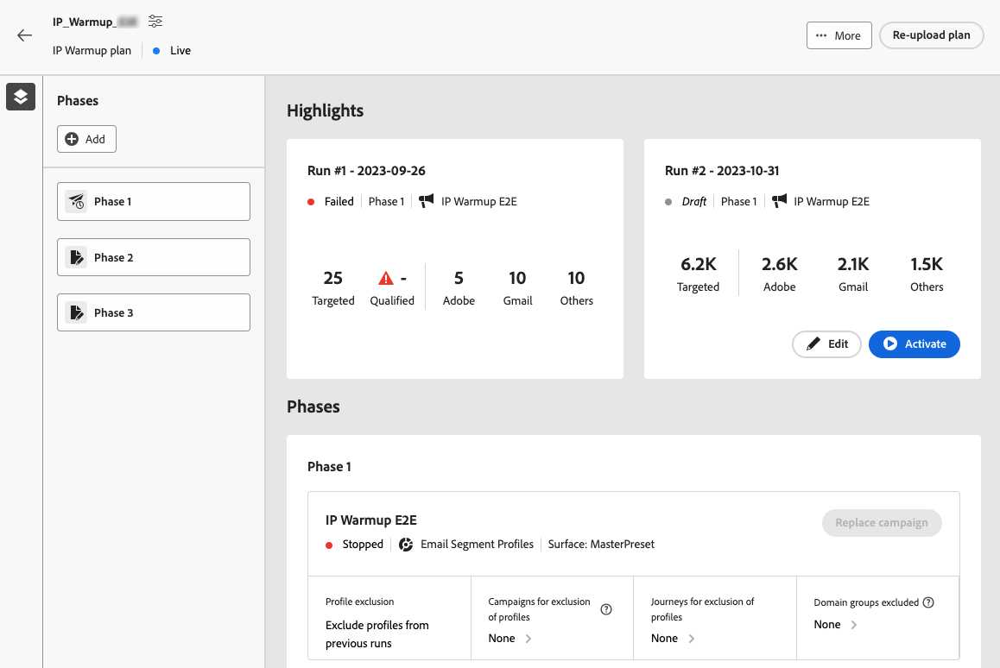

### Check the run statuses {#run-statuses}

The IP warmup plan itself serves as a consolidated report at one single place. You can check elements such as the number of **[!UICONTROL Live]** or **[!UICONTROL Completed]** runs for each phase, and view how your IP warmup plan is progressing.

>[!NOTE]
>
>As a best practice, it is recommended to monitor your IP warmup plan on a daily basis.

A run can have the following statuses:

* **[!UICONTROL Draft]** : whenever a run is created, either when [creating a new plan](ip-warmup-plan.md) or [adding a run](#define-runs) from the user interface, it takes the **[!UICONTROL Draft]** status.
* **[!UICONTROL Live]**: whenever you activate a run, it takes the **[!UICONTROL Live]** status. It means that the system has accepted the request to schedule the run - not that the sending has started.
* **[!UICONTROL Completed]**: the campaign execution for this run is completed. <!--i.e. campaign execution has started, no error happened and emails have reached users? to check with Sid-->
* **[!UICONTROL Cancelled]**: a **[!UICONTROL Live]** run was cancelled using the **[!UICONTROL Stop]** button, or you enabled the **[!UICONTROL Pause for errors]** option and an error happened. [Learn more](#define-runs)
* **[!UICONTROL Failed]**: an error was encountered by the system or the campaign used for the current phase was stopped. If a run fails, you can schedule another run for the next day.

### Use reports {#reports}

More generally, to measure the impact of your plan, you can check the performance of your IP warmup campaigns using the [!DNL Journey Optimizer] campaign reports. To do so, for each completed run, you can click the **[!UICONTROL View reports]** button. Learn more on the campaign email [live report](../reports/campaign-live-report.md#email-live) and [global report](../reports/campaign-global-report.md#email-global).

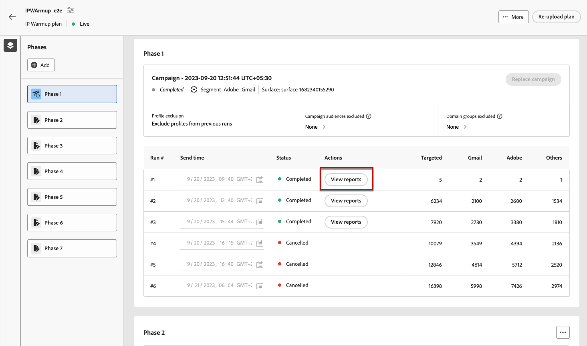

You can also access the reports from the [Campaigns menu](../campaigns/modify-stop-campaign.md#access) as your plan might use different campaigns.

## Manage your plan {#manage-plan}

At any point, if your IP warmup plan is not performing as expected, you can take the actions below.

### Split a phase {#split-phase}

If you want to add a new phase starting from a specific run, select the **[!UICONTROL Split to a new phase option]** from the More actions icon.

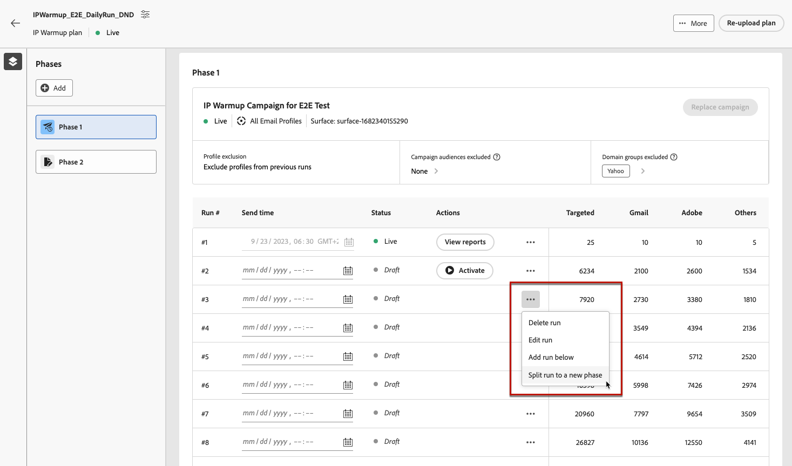

A new phase is created for the remaining runs of the current phase.

For example, if you select this option for Run #4, Runs #4 to #8 will be moved to a new phase just after the current phase.

Follow the steps [above](#define-phases) to define the new phase.

* You can use the **[!UICONTROL Replace campaign]** option for that new phase.

* You can also exclude the previous campaign, or a domain that is not performing well. Learn how in [this section](#define-phases).

<!--
You don't have to decide the campaign upfront. You can do a split later. It's a work in progress plan: you activate one run at a time with a campaign and you always have the flexibility to modify it while working on it.

But need to explain in which case you want to modify campaigns, provide examples
-->

### Re-upload an IP warmup plan {#re-upload-plan}

If your IP warmup plan is not performing as expected (for example, if you observe that some ISPs are marking your messages as spam), you can ask your deliverability expert to set up another IP warmup plan file and re-upload it using the corresponding button.

All the previously executed runs will be read-only. The new plan is displayed under the first plan.

Follow the steps [above](#define-phases) to define the phases from the new plan.

>[!NOTE]
>
>The IP warmup plan details will change as per the newly uploaded file. The previously executed runs (no matter their [status](#monitor-plan)) are not affected.

Let's take an example:

* With the initial IP warmup plan, Phase 2 had 9 runs.

* 4 runs were executed (not matter if failed, completed or cancelled<!--as long as a run has been attempted, it is an executed run-->).

* If you re-upload a new plan, Phase 2 with the first 4 executed runs will go into read-only mode.

* The remaining 5 runs (which are in draft state) are moved to a new phase (Phase 3) which shows up as per the newly uploaded plan.

### Mark a plan as completed {#mark-as-completed}

If your plan is not performing well enough or if you want to drop it to create another one, you can mark it as completed.

To do so, click the **[!UICONTROL More]** button on top right of the IP warmup plan and select **[!UICONTROL Mark as completed]**.

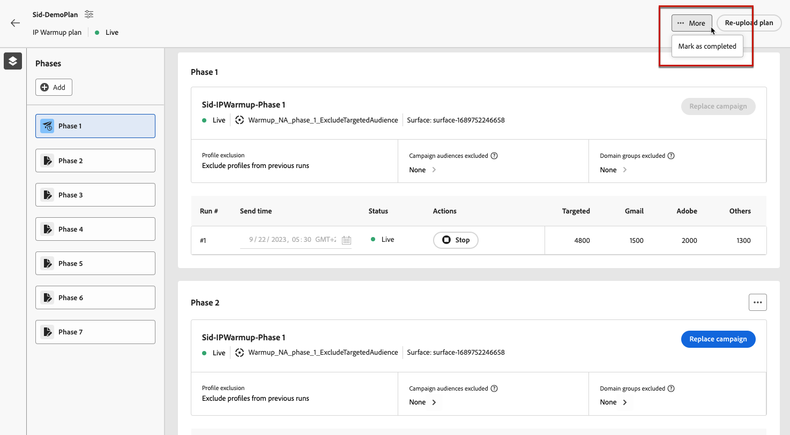

This option is only available if all the runs in the plan are in **[!UICONTROL Completed]** or **[!UICONTROL Draft]** status. If a run is **[!UICONTROL Live]**, the option is greyed out.

The different run statuses are listed in [this section](#monitor-plan).

