# Create an IP warmup plan {#ip-warmup}

>[!BEGINSHADEBOX]

What you'll find in this documentation guide:

* [Get started with IP warmup](ip-warmup-gs.md)
* [Create IP warmup campaigns](ip-warmup-campaign.md)
* **[Create an IP warmup plan](ip-warmup-plan.md)**
* [Execute the IP warmup plan](ip-warmup-execution.md)

>[!ENDSHADEBOX]

Once you created one or more [IP warmup campaigns](ip-warmup-campaign.md) with a dedicated surface and the corresponding option enabled, you can start creating your IP warmup plan.

To access, create, edit and delete the IP warmup plans, you must have the **[!UICONTROL Deliverability Consultant]** role or IP warmup plans related permissions. 

+++Learn how to assign the Deliverability Consultant role or IP warmup plans related permissions

To assign the corresponding permission to a specific **[!UICONTROL Role]**:

1. From the [!DNL Permissions] product, navigate to the **[!UICONTROL Roles]** menu and select the role that you want to update with the new **[!UICONTROL IP Warmup Configurations]** permissions.

1. From your **[!UICONTROL Role]** dashboard, click **[!UICONTROL Edit]**.

    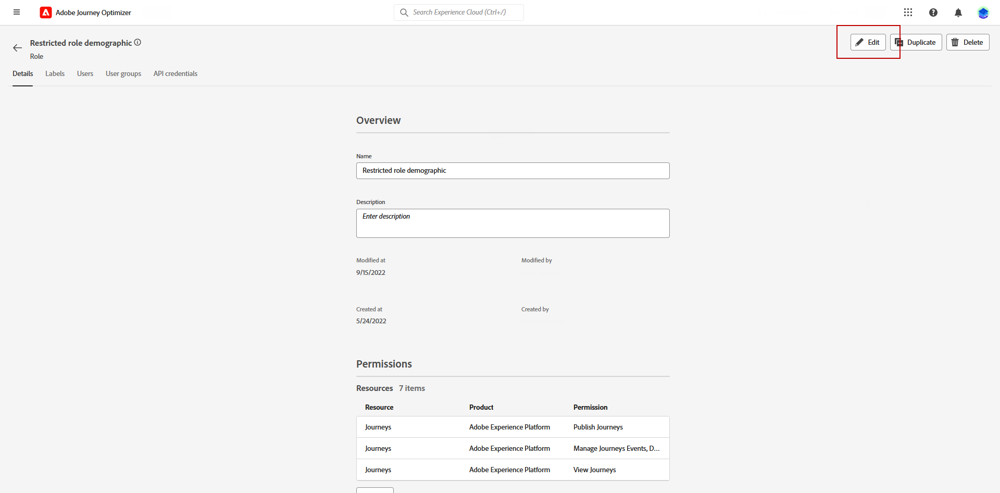

1. Drag and drop the **[!UICONTROL IP Warmup Configurations]** resource to assign permission.

1. From the **[!UICONTROL IP Warmup Configurations]** resource drop-down, select which permission(s) your user needs.

    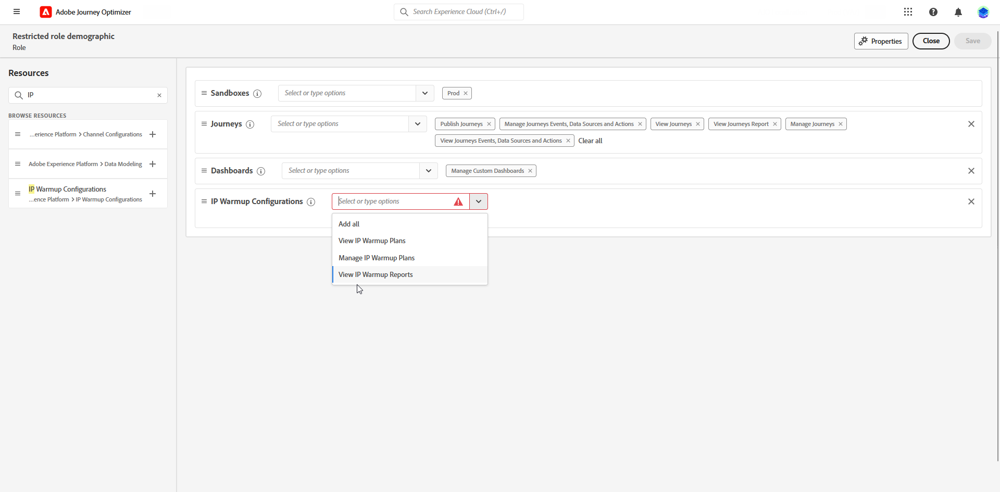

1. Click **[!UICONTROL Save]**.

To assign the corresponding role to a **[!UICONTROL User]**:

1. From the [!DNL Permissions] product, navigate to the **[!UICONTROL Roles]** menu and select the **[!UICONTROL Deliverability Consultant]** built-in role.

1. From your **[!UICONTROL Role]** dashboard, access the **[!UICONTROL Users]** tab.

    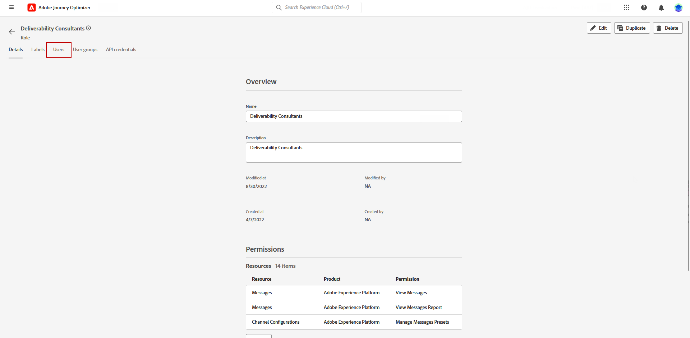
       
1. Click **[!UICONTROL Add user]** to assign the **[!UICONTROL Deliverability Consultant]** built-in role.

    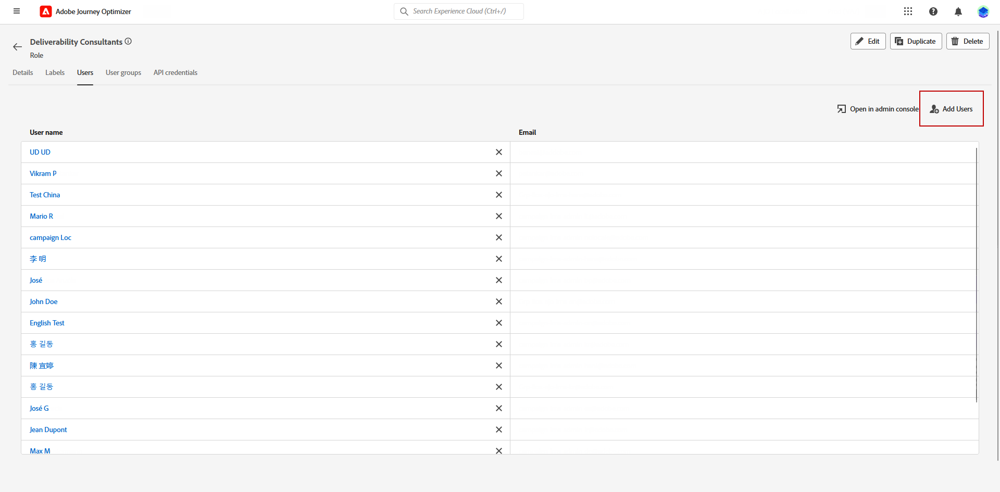

1. Select your **[!UICONTROL User]** and click **[!UICONTROL Save]**.

    

+++

## Prepare the IP warmup plan file {#prepare-file}

IP warmup is an activity which consists in gradually increasing the volume of emails going out from your IPs and domain to the main Internet service providers (ISPs) - in order to establish your reputation as a legitimate sender.

This activity is tipically performed with the help of a deliverability expert who helps to prepare a well thought-out plan based on the industry domains, use cases, regions, ISPs and various other factors.

<!--When working with the [!DNL Journey Optimizer] IP warmup feature, this plan takes the form of an Excel file that must contain a number of predefined columns.-->

Before being able to create an IP warmup plan in the [!DNL Journey Optimizer] interface, you need to fill in an Excel template with all the data that will feed your plan.

* Here you can download the blank [Excel IP warmup plan template](assets/ip-warmup-csv.zip) to fill in.

* You can also download a [sample IP warmup plan template](assets/sample-ip-warmup-plan.zip) already filled in with some data you can use as an example.

>[!CAUTION]
>
>Work with your deliverability consultant to make sure your IP warmup plan file is correctly set up.
>
>Make sure to use the format provided in the template.

Below is an example of a file containing an IP warmup plan.

>[!NOTE]
>
>For now you should leave the **Properties** and **Value** cells untouched.

### IP Warmup Plan tab {#ip-warmup-plan-tab}

* In this example, a plan has been prepared spanning over 17 days (called '**runs**') to reach a target volume of over one million profiles.

* This planned is executed through six **phases**, each of them containing at least one run.

* You can have as many columns as you want for the domains you want to deliver to. In this example, the plan is divided into six columns:

    * Four of which correspond to **out-of-the-box domain groups** to use in your plan (Gmail, Microsoft, Yahoo, and Orange).
    * One corresponds to a custom domain group (that you need to add using the [Custom Domain Group](#custom-domain-group-tab) tab).
    * The sixth column, **Others**, contains all the remaining addresses from other domains which are not covered explicitly in the plan. This column is optional: if omitted, emails will go to the specified domains only.
* The **Engagement Days** column shows that only the profiles engaged with your brand over the last period entered are targeted.

The idea is to progressively increase the number of targeted addresses in each run, while reducing the number of runs for each phase.

The out-of-the-box main domain groups you can add to your plan are listed below:

<!--
* Gmail
* Adobe
* WP
* Comcast
* Yahoo
* Bigpond
* Orange
* Softbank
* Docomo
* United Internet
* Microsoft
* KDDI
* Italia Online
* La Poste
* Apple
-->

+++ Gmail
gmail.com;google.com;googlemail.com;googlemail.co.uk
+++

+++ Adobe
adobe.com
+++

+++WP
wp.pl;o2.pl
+++

+++Comcast
comcast.net
+++

+++Yahoo
aol.fi;games.com;cs.com;yahoo.com.in;y7mail.com;yahoo.co.uk;yahoo.hu;yahoo.co.hu;yahoo.cn;yahoogroups.com.sg;yahoogroups.com.au;aol.es;yahoo.com.au;yahoo.com.vn;yahoo.ca;aol.hk;aol.co.nz;yahoo.com.br;aolpoland.pl;aolnorge.no;yahoo.ne.jp;yahoo.fi;ymail.com;netscape.com;yahoo.com.pe;yahoo.hr;aol.cz;yahoo.ee;aol.be;aolcom.tr;yahoo.si;yahoo.co.id;aol.it;citlink.net;wmconnect.com;yahoo.es;yahoo.dk;yahoogroups.ca;yahoo.com.jp;yahoo.com.hk;aol.kr;yahoo.ie;aol.jp;aol.com.br;yahoo.lt;yahoo.co.kr;aol.nl;yahoo.com.ar;yahoo.bg;ygm.com;yahoo.co.nz;aol.se;aol.com;yahoo.de;goowy.com;rocketmail.com;frontiernet.net;aim.com;yahoo.nl;yahoogroups.co.in;aol.dk;netscape.net;aol.cl;luckymail.com;yahoo.no;yahoo.co.jp;yahoo.com.kr;yahoo.cz;yahoo.co.za;yahoo.sk;verizon.net;yahoogroups.de;yahoo.gr;aol.com.ve;aol.com.ar;yahoo.ro;aol.com.co;wild4music.com;yahoo.at;yahoogroups.com.cn;yahoo.com.co;wow.com;aol.fr;yahoo.in;aol.in;yahoo.com;yahoo.rs;aol.de;yahooxtra.co.nz;yahoo.com.mx;yahoo.com.ph;sky.com;aol.com.mx;aol.com.au;yahoo.se;myaol.jp;aolchina.com;yahoo.pt;yahoo.com.net;yahoo.com.tw;yahoogrupper.dk;yahoo.fr;talk21.com;compuserve.com;aol.pl;yahoo.com.sg;yahoogroups.com.tw;aol.ch;yahoo.it;frontier.com;yahoo.co.in;aolpolcka.pl;yahoo.co.il;verizon.net.in;yahoogruppi.it;yahoo.com.tr;yahoo.cl;yahoogroups.com.hk;yahoogroups.co.uk;yahoo.com.biz;yahoo.com.hr;yahoo.be;aol.co.uk;ybb.ne.jp;aol.tw;yahoogroups.co.kr;yahoo.com.my;rogers.com;gte.net;yahoogroups.com;yahoo.co.th;yahoo.com.cn;love.com;bellatlantic.net;aol.ru;yahoo.com.ve;yahoo.com.ua;yahoo.lv;aolpolska.pl;aol.at;yahoo.pl
+++

+++Bigpond
bigpond.com;bigpond.com.au;bigpond.net;telstra.com;bigpond.net.au
+++

+++Orange
voila.com;francetelecom.com;orange.com;orange.fr;wanadoo.fr;voila.fr
+++

+++Softbank
c.vodafone.ne.jp;jp-h.ne.jp;k.vodafone.ne.jp;jp-d.ne.jp;jp-c.ne.jp;t.vodafone.ne.jp;h.vodafone.ne.jp;r.vodafone.ne.jp;q.vodafone.ne.jp;jp-t.ne.jp;jp-q.ne.jp;s.vodafone.ne.jp;jp-s.ne.jp;jp-r.ne.jp;jp-k.ne.jp;n.vodafone.ne.jp;d.vodafone.ne.jp;softbank.ne.jp;jp-n.ne.jp
+++

+++Docomo
docomo.ne.jp
+++

+++United Internet
gmx.de;1and1.com;gmx.fr;mail.com;1und1.de;gmx.com;gmx.net;gmx.at;web.de;gmx.ch
+++

+++Microsoft
hotmail.com.tr;live.de;live.ru;live.nl;windowslive.com;live.jp;mts.net;xbox.com;hotmail.fr;hotmail.cl;hotmail.jp;live.cl;live.at;live.com.au;hotmail.co.th;live.hk;hotmail.com.au;hotmail.com;live.com.my;hotmail.co.kr;live.ie;outlook.com.br;hotmail.co.il;hotmail.dk;live.co.kr;live.co.uk;live.com.mx;outlook.ie;live.cn;hotmail.co.uk;live.com.sg;hotmail.es;live.fr;live.no;live.dk;hotmail.it;msn.com;live.se;hotmail.co.jp;live.be;live.co.za;live.in;hotmail.se;live.com.pt;hotmail.ch;outlook.com;live.com;hotmail.gr;live.it;live.com.ar;hotmail.ca;hotmail.com.br;hotmail.com.ar;live.ca;hotmail.de
+++

+++KDDI
au.com;ezweb.ne.jp;uqmobile.jp
+++

+++Italia Online
inwind.it;blu.it;virgilio.it;giallo.it;iol.it;libero.it
+++

+++La Poste
laposte.net
+++

+++Apple
mac.com;icloud.com;apple.com;me.com
+++

### Custom Domain Group tab {#custom-domain-group-tab}

You can also add more columns to your plan by including custom domain groups. 

Use the **[!UICONTROL Custom Domain Group]** tab to define a new domain group. For each domain, you can add all the subdomains it covers.<!--TBC-->

For example, if you add the custom domain Luma, you want the following subdomains to be included: luma.com, luma.co.uk, luma.it, luma.fr, luma.de, etc.

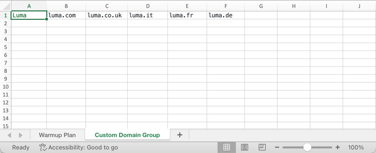

### Example {#example}

Let's say you want to have two custom domain groups:

* One for Hotmail domains only.
* One for all other domains from the domain group Microsoft (thus excluding all Hotmail domains).

Note that all other domains will be gathered into the **[!UICONTROL Others]** column.

1. In the **[!UICONTROL Custom Domain Group]** tab, create the **Hotmail** domain group.

1. Add all the the Hotmail domains on the same row.

    You can [copy and paste](#copy-paste) all the Hotmail domains listed in the [IP Warmup Plan tab](#ip-warmup-plan-tab) section.

1. Add another row.

1. Create the **Microsoft_X** domain group.

1. Add all the the Microsoft domains that are not Hotmail on the same row. Similarly, you can copy and paste them from the list above. [Learn more](#copy-paste)

1. Go back to the **[!UICONTROL IP Warmup Plan]** tab.

1. Create three columns: one for **Hotmail**, one for **Microsoft_X** and one for **Others**.

1. Fill in the columns according to your needs.

>[!NOTE]
>
>Once the IP warmup plan is uploaded into [!DNL Journey Optimizer], you will not need to exclude the Microsoft domain groups.

<!--Only the domain groups listed in the **[!UICONTROL IP Warmup Plan]** tab will be taken into account.-->

### Copy-paste default domains {#copy-paste}

If you want to create a custom domain group containing all the Hotmail domains for example, you can copy and paste the domains from the default list provided [above](#ip-warmup-plan-tab).

Then use the Excel conversion tool to convert text to columns:

1. Select **[!UICONTROL Data]** > **[!UICONTROL Text to columns...]**, choose **[!UICONTROL Delimited]** and select **[!UICONTROL Next]**.

1. Select **[!UICONTROL Semicolon]**, click **[!UICONTROL Next]** and **[!UICONTROL Finish]**.

Each domain now displays in a different column on the same row.

## Access and manage IP warmup plans {#manage-ip-warmup-plans}

1. Access the **[!UICONTROL Administration]** > **[!UICONTROL Channels]** > **[!UICONTROL IP warmup plans]** menu. All the IP warmup plans created so far are displayed.

    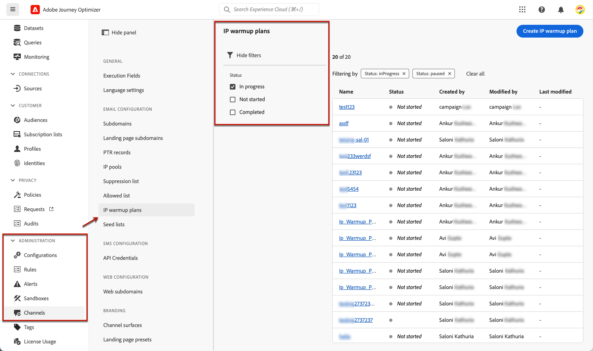

1. You can filter on the status. The different statuses are:

    * **Not started**: no run has been activated yet. [Learn more](ip-warmup-execution.md#define-runs)
    * **Live**: the plan changes to this status as soon as the first run in the first phase has been successfully activated. [Learn more](ip-warmup-execution.md#define-runs)
    * **Completed**: the plan has been marked as completed. <!--This option is only available if all the runs in the plan are in **[!UICONTROL Completed]** or **[!UICONTROL Draft]** status (no run can be **[!UICONTROL Live]**).--> [Learn more](ip-warmup-execution.md#mark-as-completed)
    <!--* **Paused**: to check (user action)-->

1. To delete an IP warmup plan, select the **[!UICONTROL Delete]** icon next to the name of a plan and confirm deletion.

    >[!NOTE]
    >
    >Only plans with the **Not started** status can be deleted.

    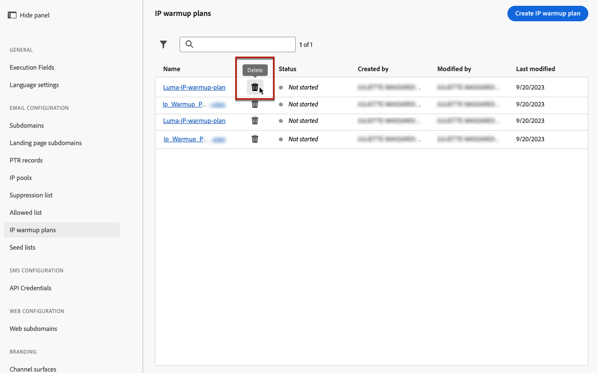

    >[!CAUTION]
    >
    >The selected IP warmup plan will be permanently deleted.

## Create an IP warmup plan {#create-ip-warmup-plan}

>[!CONTEXTUALHELP]
>id="ajo_admin_ip_warmup_upload"
>title="Specify your IP warmup plan"
>abstract="Download the CSV template and fill it with data for IP warmup phases and target number of profiles."

>[!CONTEXTUALHELP]
>id="ajo_admin_ip_warmup_surface"
>title="Select a marketing surface"
>abstract="You must select the same surface as the one selected in the campaign you want to associate with your IP warmup plan."
>additional-url="https://experienceleague.adobe.com/docs/journey-optimizer/using/configuration/channel-surfaces.html" text="Set up channel surfaces"
>additional-url="https://experienceleague.adobe.com/docs/journey-optimizer/using/configuration/channel-surfaces.html" text="Create IP warmup campaigns"

To create an IP warmup plan, follow the steps below.

1. Access the **[!UICONTROL Administration]** > **[!UICONTROL Channels]** > **[!UICONTROL IP warmup plans]** menu, then click **[!UICONTROL Create IP warmup plan]**.

    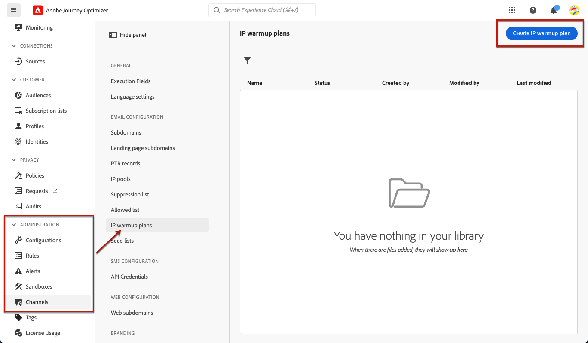

1. Fill in the IP warmup plan details: give it a name and a description.

    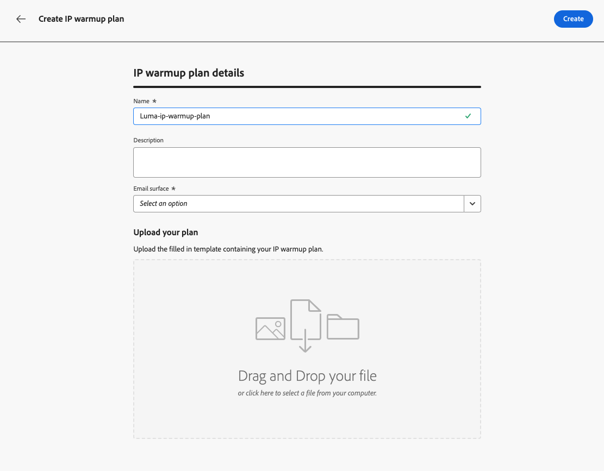

1. Select the [surface](channel-surfaces.md) that you want to warm up. Only marketing surfaces are available for selection. [Learn more on email type](../email/email-settings.md#email-type)

    >[!NOTE]
    >
    >The campaigns you want to associate with your IP warmup plan must use the same surface. [Learn how to create an IP warmup campaign](ip-warmup-campaign.md)

1. Upload the Excel file containing your IP warmup plan. [Learn more](#prepare-file)
    
    <!--
    You can also download the Excel template from the [!DNL Journey Optimizer] user interface and upload it after filling it with the IP warmup details.-->

    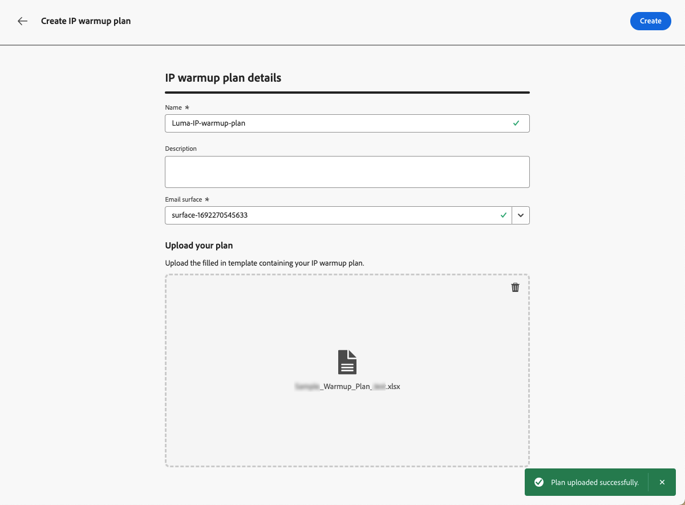

    >[!NOTE]
    >
    >In case the upload fails, make sure you are using the correct formatting and file format (.xls or .xlsx). Use the [sample](assets/ip-warmup-csv.zip) provided to you by Adobe.

1. Click **[!UICONTROL Create]**. All the phases, runs, columns and their content defined in the file you uploaded are automatically displayed in the [!DNL Journey Optimizer] interface.

    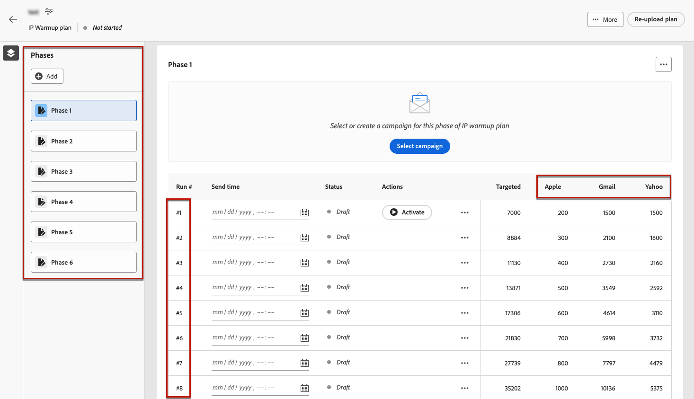

    >[!NOTE]
    >
    >The **[!UICONTROL Targeted]** column shows the sum of all the profiles targeted for each run, meaning all the profiles from each domain groups that you defined, including the **Others** column if any. 

You are now ready to execute your IP warmup plan. [Learn more](ip-warmup-execution.md)
