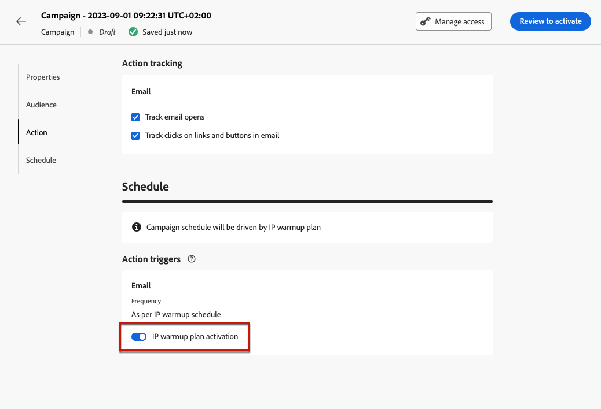
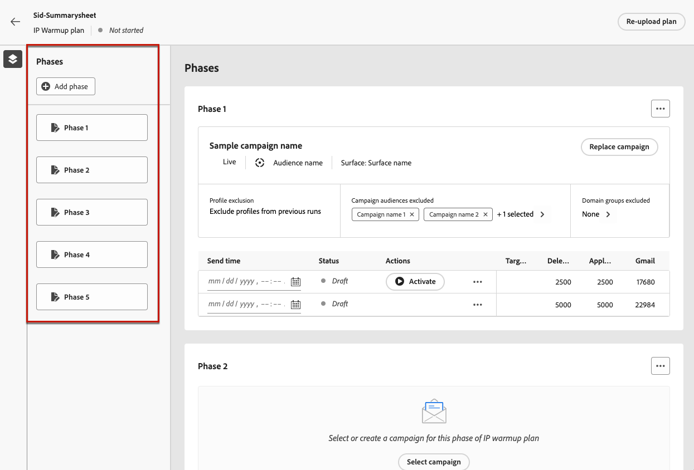
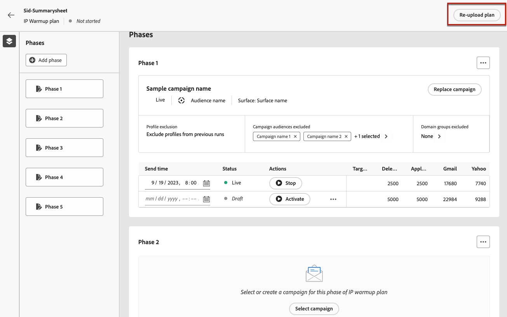
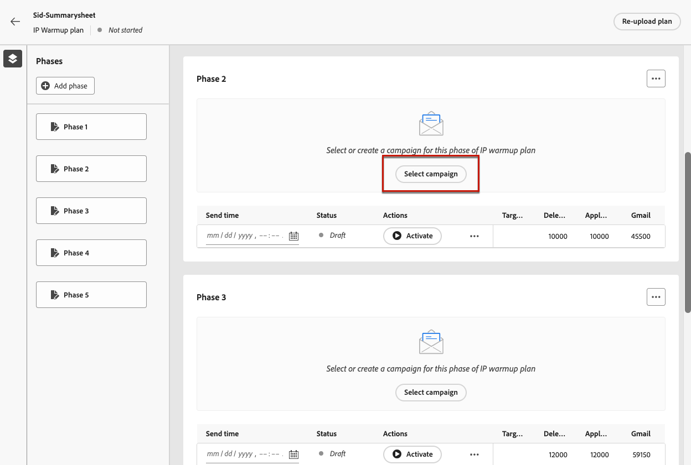
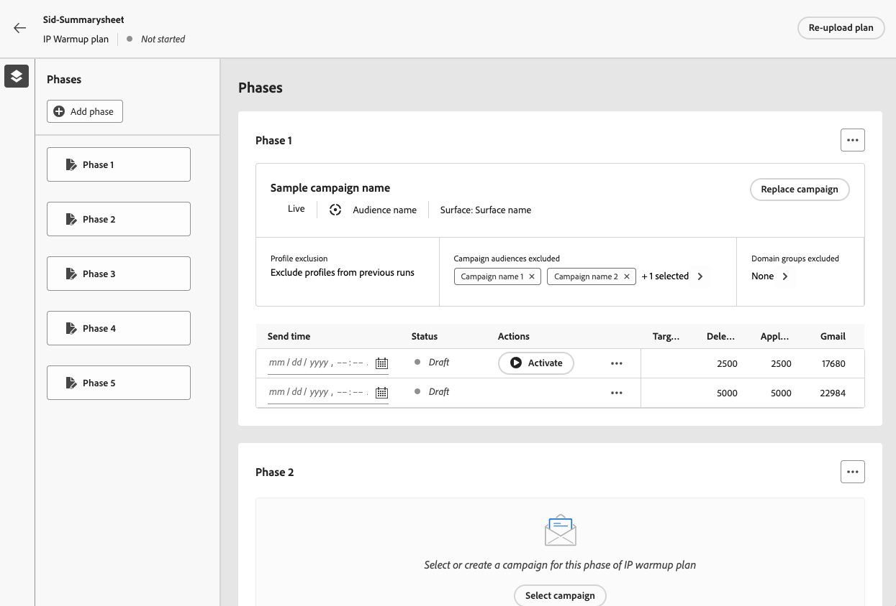
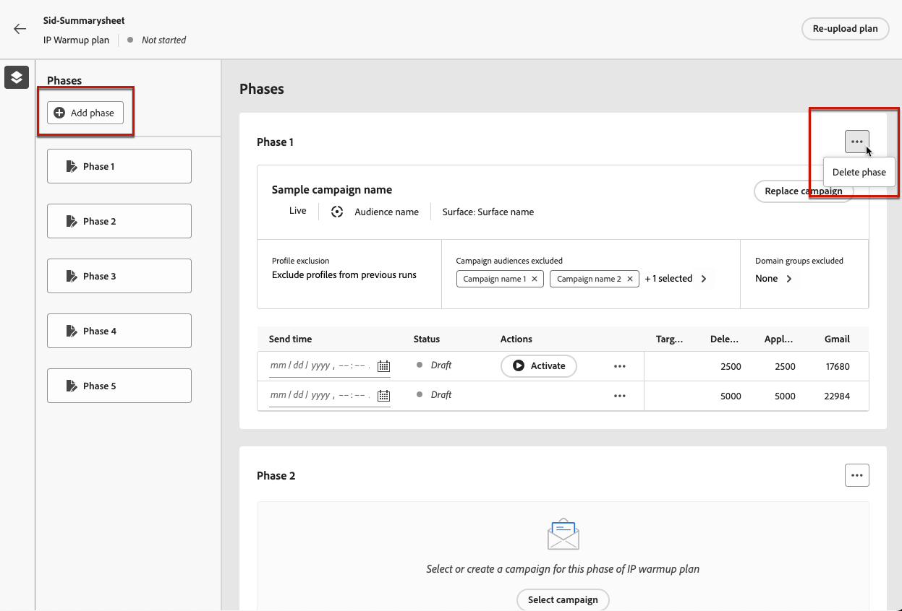
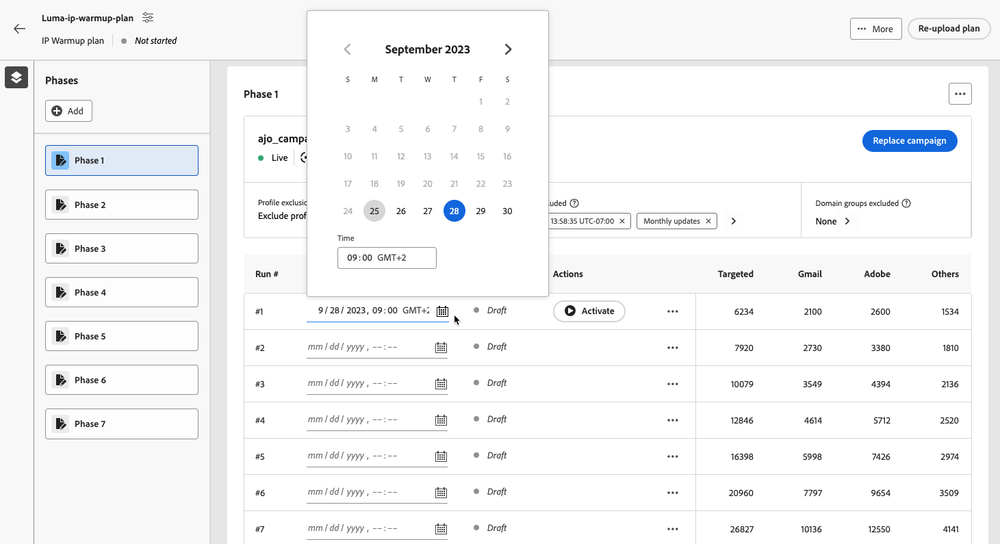
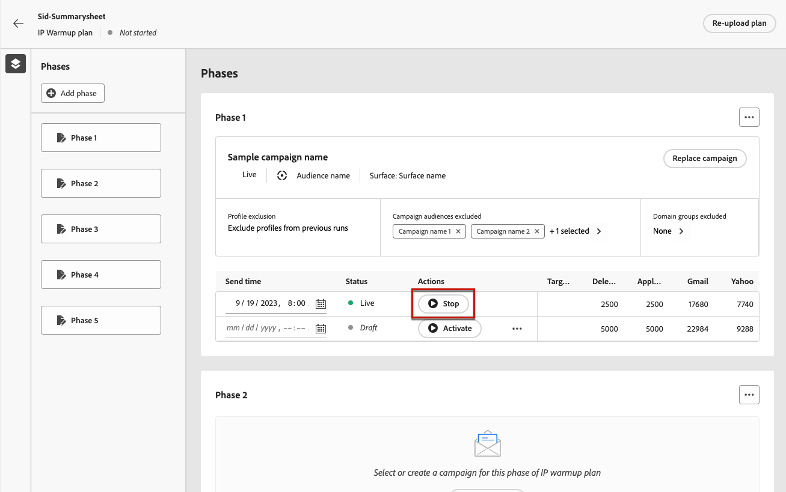
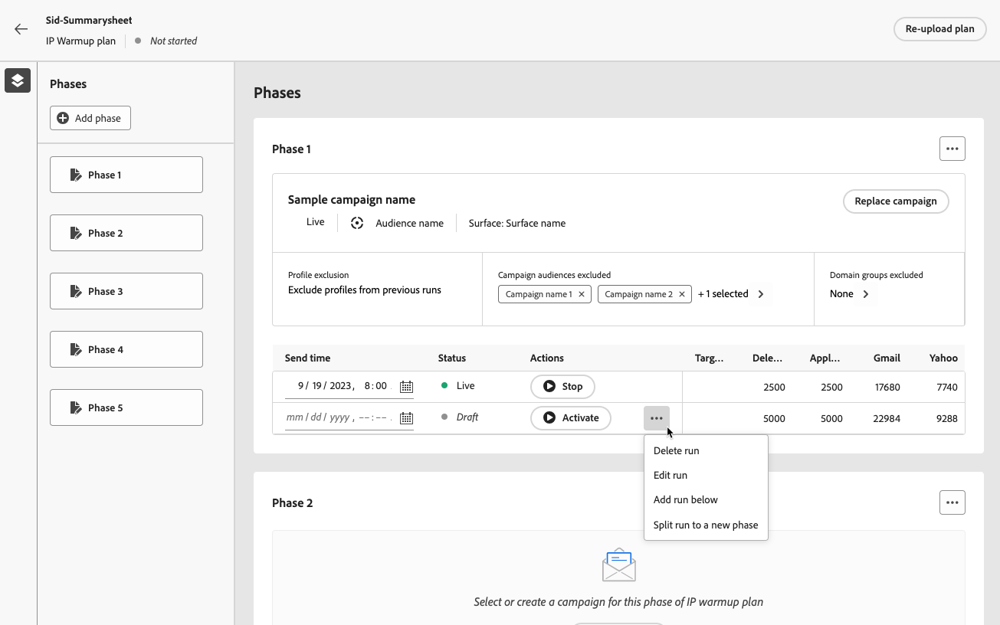

# Implement an IP warmup plan {#ip-warmup}

<!--
>[!CONTEXTUALHELP]
>id="ajo_admin_ip_warmup_plan"
>title="Define your IP warmup plan"
>abstract="You can perform IP warmup workflows directly from the Journey Optimizer interface in a standardized and efficient way that follows the best practices for optimal deliverability."
-->

>[!AVAILABILITY]
>
>The IP warmup feature is currently available as a beta to select users only. To join the beta program, contact Adobe Customer Care.

With [!DNL Journey Optimizer], you can easily perform IP warmup workflows directly from the user interface in a standardized and efficient way that follows the best practices for optimal deliverability.

>[!CAUTION]
>
>This feature only applies to the email channel.

When emails are sent using a new platform, Internet service providers (ISPs) are suspicious of IP addresses that are not recognized. If large volumes of emails are suddenly sent, the ISPs often mark them as spam.

To avoid being marked as spam, you can progressively increase the volume sent using IP warmup plan feature. A new option in the Administration menu allows you to do it more smoothly instead of creating complex journeys. This should ensure smooth development of the start-up phase and enable you to reduce the overall rate of invalid addresses.

>[!NOTE]
>
>Learn more on increasing your email reputation with IP warming in the [Deliverability Best Practice Guide](https://experienceleague.adobe.com/docs/deliverability-learn/deliverability-best-practice-guide/additional-resources/generic-resources/increase-reputation-with-ip-warming.html).

<!--
Here are the main steps:

1. You get a deliverability plan from the deliverability consulting team.

1. Create a campaign - marketer [Learn more](#create-ip-warmup-campaign)

1. Your associated practitioner (customer's practitioner/ACS consultant/partner consultant) creates a IP warmup object in project and uploads a plan.

    The CSV manifests itself like below with numbers showing up with/without domain bifurcation. Below screen shows one phase (creative) with associated runs (The plan obviously has more such phases)

1. Practitioner associates the campaign and audience at phase level and turns on some settings as needed for all runs associated with a single creative/campaign

1. Then start to execute on every day basis by simply clicking the play button

1. Reports will continue to show up at campaign level with similar capabilities as today. NO enhancements in BETA. But the IP warmup plan also serves as a consolidated report at one single place of how many executions were done and so on

Benefits are as follows:

* No more creation of daily journeys and associated testing

* Standardization on Campaign which will be easy for practitioners too

* No more pain of creating queries, audiences and testing those as system will create the audiences. At phase level, system ensures that previously targeted + new profiles are picked up AND at iteration level, system ensures that each run is having unique profiles and the count matches what is stated in plan

* Ease of excluding domains and changing the plan with help of simple toggles to exclude OR by editing numbers inline or create new phases or reupload plan if drastic change. No more pain of editing audience definitions, journey conditions

* Single place to manage and view how IP warm is progressing.

* Consolidated report at creative/campaign level as all runs for a phase 

* There is an expectation that with this, it will ease around 30% of effort and will be much better experience for consultant/partner/practitioner - right from planning to execution to reporting
-->

The key steps to implement an IP warmup plan are as follows:

* [Create IP warmup campaigns](#create-ip-warmup-campaign)
* [Define an IP warmup plan](#define-ip-warmup-plan)

## Create IP warmup campaigns {#create-ip-warmup-campaign}

>[!CONTEXTUALHELP]
>id="ajo_campaign_ip_warmup"
>title="Activate the IP warmup plan option"
>abstract="Select the IP warmup plan activation option. Once the campaign is live, it can be associated with an IP warmup plan."

You need to create one or more campaigns with a specific option enabled so that they can be used in an IP warmup plan. Follow the steps below.

1. Create a [surface](channel-surfaces.md) for the domain and the IPs that you have identified for your warmup plan.

1. Create a [campaign](../campaigns/create-campaign.md) and select the [Email](../email/create-email.md#create-email-journey-campaign) action.

1. Select the surface that you created for IP warmup.

    <!--You must use the same surface as the one that will be used for the asociated IP warmup plan. [Learn how to create an IP warmup plan](#create-ip-warmup-plan)-->

1. Click **[!UICONTROL Create]**.

1. From the **[!UICONTROL Schedule]** section, select **[!UICONTROL IP warmup plan activation]**.

    

    The campaign [schedule](../campaigns/create-campaign.md#schedule) will be driven by the IP warmup plan it will be associated with, meaning that the schedule is not defined any more in the campaign itself.

1. [Activate](../campaigns/review-activate-campaign.md) the campaign. Once live, it is ready for use in an IP warmup plan.

>[!NOTE]
>
>For a live campaign with IP warmup plan activated, the **[!UICONTROL Delete]** button is available until it is associated with an IP warmup plan.

For more information on how to configure a campaign, refer to [this page](../campaigns/get-started-with-campaigns.md).

## Define an IP warmup plan {#define-ip-warmup-plan}

### Manage IP warmup plans {#manage-ip-warmup-plans}

1. Access the **[!UICONTROL Administration]** > **[!UICONTROL Channels]** > **[!UICONTROL IP warmup plans]** menu. All the IP warmup plans created so far are displayed.

    

1. You can filter on the status. The different statuses are:

    * **Not started**: no run has happened
    * **In progress**: as soon as one run has started <!--or is done?-->
    * **Paused**
    * **Completed**: all the runs in the plan are done

1. To delete an IP warmup plan, select the **[!UICONTROL Delete]** icon next to a list item and confirm deletion.

    

    >[!CAUTION]
    >
    >The selected IP warmup plan will be permanently deleted.

### Create an IP warmup plan {#create-ip-warmup-plan}

>[!CONTEXTUALHELP]
>id="ajo_admin_ip_warmup_upload"
>title="Specify your IP warmup plan"
>abstract="Download the CSV template and fill it with data for IP warmup phases and target number of profiles."

>[!CONTEXTUALHELP]
>id="ajo_admin_ip_warmup_surface"
>title="Select a marketing surface"
>abstract="You must select the same surface as the one selected in the campaign you want to associate with your IP warmup plan."
>additional-url="https://experienceleague.adobe.com/docs/journey-optimizer/using/configuration/channel-surfaces.html" text="Set up channel surfaces"
>additional-url="https://experienceleague.adobe.com/docs/journey-optimizer/using/configuration/channel-surfaces.html" text="Create IP warmup campaigns"

>[!CAUTION]
>
>To create, edit and delete the IP warmup plans, you must have the **[!UICONTROL Deliverability Consultant]** permission.
<!--Learn more on managing [!DNL Journey Optimizer] users' access rights in [this section](../administration/permissions-overview.md).-->

When one or more live campaigns with the **[!UICONTROL IP warmup plan activation]** option enabled are activated, you can associate them with an IP warmup plan.

>[!CAUTION]
>
>Work with your deliverability consultant to make sure your IP warmup plan template is correctly set up. <!--TBC-->

1. Access the **[!UICONTROL Administration]** > **[!UICONTROL Channels]** > **[!UICONTROL IP warmup plans]** menu, then click **[!UICONTROL Create IP warmup plan]**.

    

1. Fill in the IP warmup plan details: give it a name and a description.

    

1. Select a [surface](channel-surfaces.md). Only marketing surfaces are available for selection. [Learn more on email type](../email/email-settings.md#email-type)

    >[!CAUTION]
    >
    >You must select the same surface as the one selected in the campaign you want to associate with your IP warmup plan. [Learn how to create an IP warmup campaign](#create-ip-warmup-campaign)

1. Upload the Excel file containing your IP warmup plan<!--which formats are allowed?-->. You can use the template provided by the deliverability team.<!--TBC?--> [Learn more](#upload-plan)
    <!--
    You can also download the Excel template from the [!DNL Journey Optimizer] user interface and upload it after filling it with the IP warmup details.-->

    

1. Click **[!UICONTROL Create]**. The number of phases defined in the file you uploaded are automatically displayed will all the runs for each phase. [Learn more](#upload-plan)

    

### Re-upload an IP warmup plan {#re-upload-plan}

You can re-upload another IP warmup plan using the corresponding button.

>[!NOTE]
>
>The IP warmup plan details will change as per the newly uploaded file. The complete runs and the activated runs are not be affected.

### Upload the file containing the plan {#upload-plan}

Below is an example of a file containing an IP warmup plan.

Each phase correspond to a period composed of several runs, to which you will assign a single campaign.

For each run, you have a certain number of recipients and you will define a date when this run will be executed.

You can have as many columns as you want for the domains you want to deliver to. In this example, you have three columns: Gmail, Adobe and Others, meaning that

The idea is to have more runs in the first phases and to progressively increase the number of targeted addresses while reducing the number of runs.

### Define the phases {#define-phases}

>[!CONTEXTUALHELP]
>id="ajo_admin_ip_warmup_campaigns_excluded"
>title="Select campaigns audiences to exclude"
>abstract="Select the audiences from other campaigns that you want to exclude from the current phase."

>[!CONTEXTUALHELP]
>id="ajo_admin_ip_warmup_domains_excluded"
>title="Select domain groups to exclude"
>abstract="Select the domains that you want to exclude from the current phase."

1. For each phase, select the campaign you want to associate with this phase of the IP warmup plan.

    

    Note the following:

    * Only the campaigns with the **[!UICONTROL IP warmup plan activation]** option enabled <!--and live?--> are available for selection. [Learn more](#create-ip-warmup-campaign)
    
    * You must select a campaign that uses the same surface as the one selected for the current IP warmup plan.

    * You cannot select a campaign that is already in use in another IP warmup campaign.

1. For each phase, the following applies:

    * **[!UICONTROL Profile exclusion]** - The profiles from the previous runs of that phase are always excluded. For example, if on run #1 Leo got covered in the first 6300 people being targeted, the system will automatically ensure that Leo doesn't get the mail in run #2.

    * **[!UICONTROL Campaign audiences excluded]** - Select the audiences from other <!--executed/live?-->campaigns that you want to exclude from the current phase.

        For example, you may be executing a phase and had to split it for any reason. In such a case, in phase 2, you would like to include the campaign used in phase 1 in this section so that in phase 2, previously contacted people from phase 1 are not included. This can be done not just with campaigns used in same IP warmup plan but also from another IP warmup plan too.

    * **[!UICONTROL Domains groups excluded]** - Select the domains you want to exclude from that phase, for example Gmail. <!--??-->

        After running IP warmup for some days, you realize that ISP reputation with a domain say hotmail is not good and you wish to resolve it with ISP but do not wish to stop IP warmup plan. In such a case, you may put the domain group hotmail in excluded category.

        >[!NOTE]
        >
        >Domain exclusion requires a non-executed phase so you may have to split a running phase to add excclusions. Similarly, if domain group is not an OOTB domain group, then you may have to create domain group in Excel and upload and then exclude the same.

    

1. You can add a phase if needed - it will be added after the last current phase. Use the **[!UICONTROL Delete phase]** button to remove any unwanted phase.

    

    >[!CAUTION]
    >
    >You cannot undo the **[!UICONTROL Delete]** action.
    >
    >If you delete all the phases from the IP warmup plan, we recommend to re-upload a plan.

### Define the runs {#define-runs}

1. Select a schedule for each run. <!--which is actually a window of opportunity. meaning? how many hours? shall we specify that to clarify?-->

    

1. Select an end time, which basically means the window within which we can execute warmup campaign in case there is any delays in audience job. If not specified, we will attempt at start time and fail. If end time is provided, we will execute the run between that window.

1. Activate each run. Make sure you schedule a time early enough to allow for the segmentation job to be run. <!--explain how you can evaluate a proper time-->

    >[!CAUTION]
    >
    >Each run must be activated at least 12 hours before the actual send time. Otherwise, segmentation may not be completed. <!--How do you know when segmentation is complete? Is there a way to prevent user from scheduling less than 12 hours before the segmentation job?-->

1. If the campaign execution has not started, you can stop a run.

    Once the campaign execution has started, the **[!UICONTROL Stop]** button becomes unavailable. <!--TBC in UI-->

    

1. To add a run, select **[!UICONTROL Add a run below]** from the three dots icon.

    

1. At any point, if you want to use a different campaign starting from a specific run, select the **[!UICONTROL Split to a new phase option]** from the three dots icon. A new phase is created for the remaining runs of the current phase. Follow the steps [above](#define-phases) to define the new phase.

    For example, if you select this option for run #4, runs #4 to #8 will be moved to a new phase.

<!--
You don't have to decide the campaign upfront. You can do a split later. It's a work in progress plan: you activate one run at a time with a campaign and you always have the flexibility to modify it while working on it.

But need to explain in which case you want to modify campaigns, provide examples
-->

A run can have the following statuses<!--TBC with Medha-->:

* **[!UICONTROL Completed]**: 
* **[!UICONTROL Failed]**:
* **[!UICONTROL Cancelled]**: you stopped the run before the campaign execution has started.
    