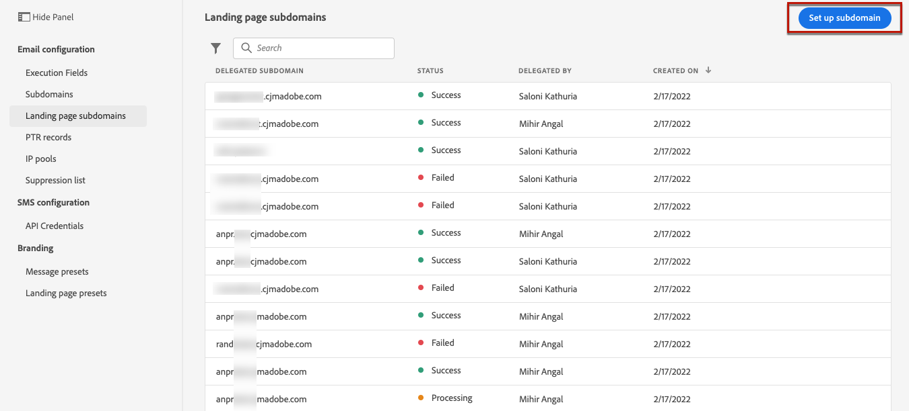
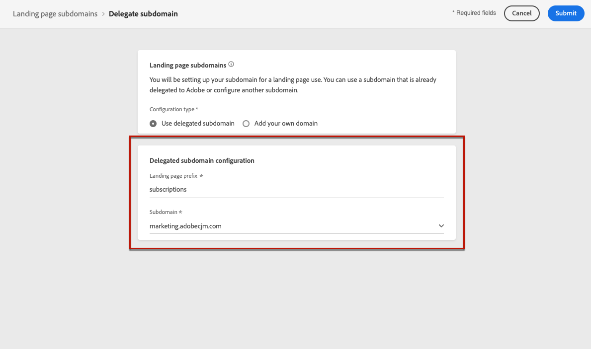
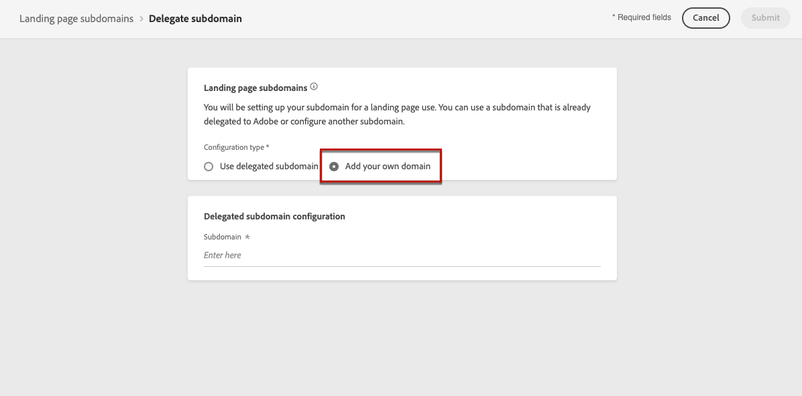
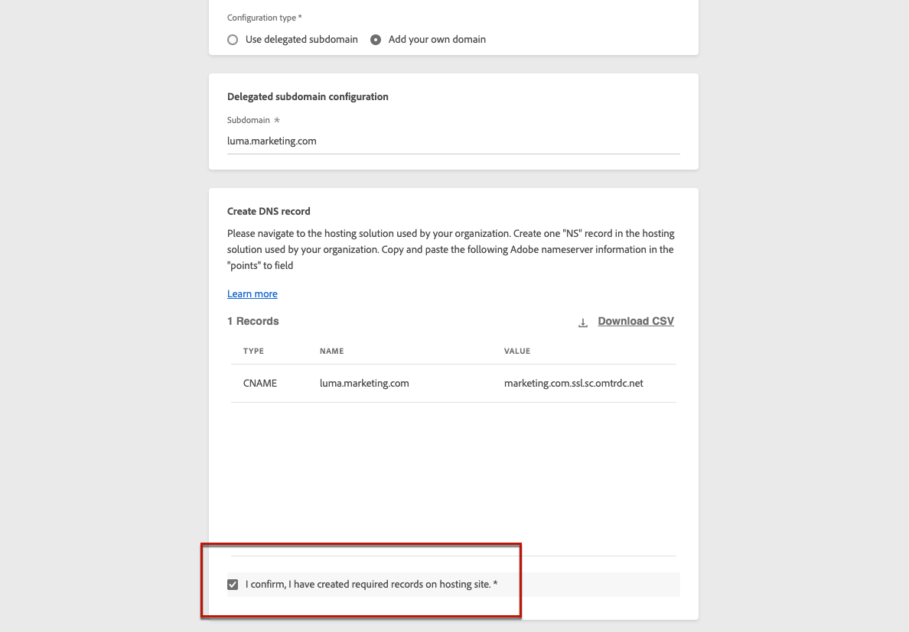
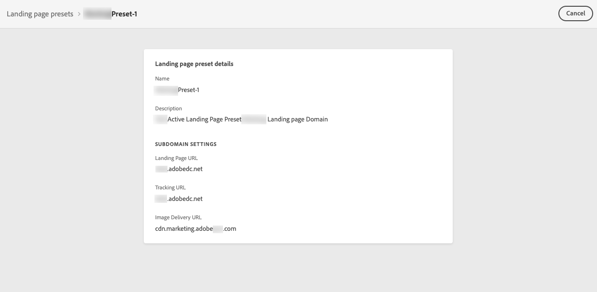
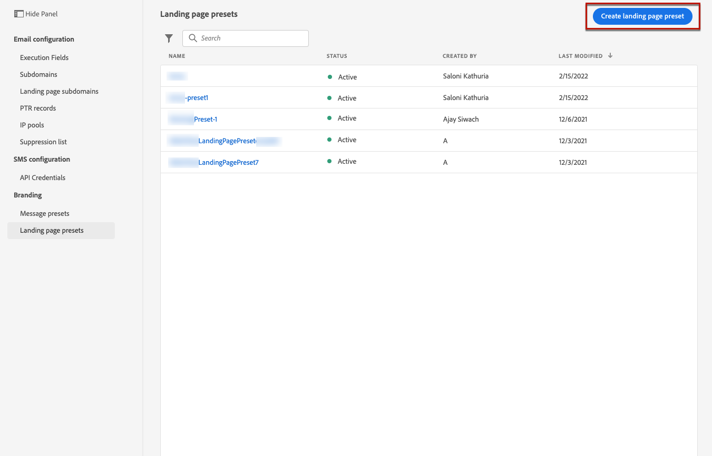
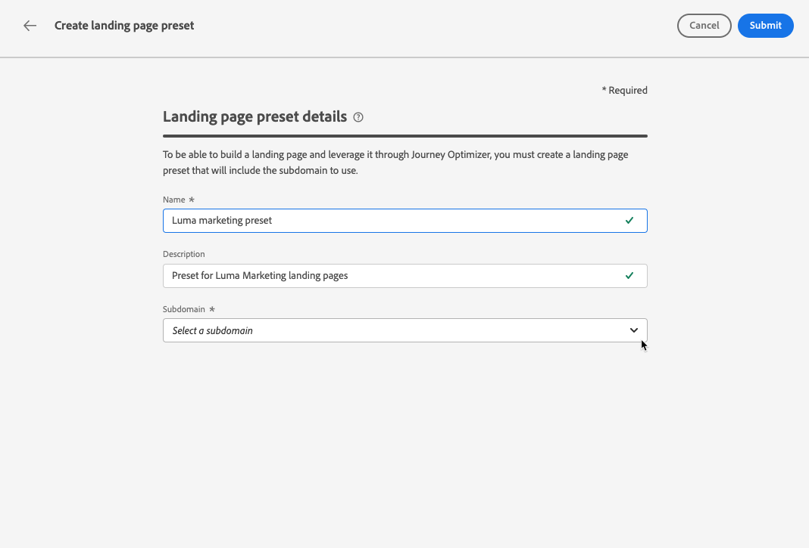

# Configure landing pages {#lp-configuration}

## Configure landing page subdomains {#lp-subdomains}

>[!CONTEXTUALHELP]
>id="ajo_admin_configure_subdomain"
>title="Set up landing page subdomains"
>abstract="To be able to select a subdomain, make sure you have previously configured at least one landing page subdomain."

To be able to [create landing page presets](#lp-create-preset), you  must set up the subdomains you will use for your landing pages.

You can use a subdomain that is already delegated to Adobe, or you can configure another subdomain. Learn more on delegating subdomains to Adobe in [this section](delegate-subdomain.md).

### Use an existing subdomain {#lp-use-existing-subdomain}

To use a subdomain that is already delegated to Adobe, follow the steps below.

1. Access the **[!UICONTROL Administration]** > **[!UICONTROL Channels]** menu, then select **[!UICONTROL Email configuration]** > **[!UICONTROL Landing page subdomains]**.

    

1. Click **[!UICONTROL Set up subdomain]**.

    

1. Select **[!UICONTROL Use delegated domain]** from the **[!UICONTROL Configuration type]** section.

    

1. Enter the prefix that will display in your landing page URL.

    >[!NOTE]
    >
    >Only alpha-numeric characters and hyphens are allowed.

1. Select a delegated subdomain from the list.

    >[!NOTE]
    >
    >You cannot select a subdomain that is already used as landing page subdomain.

    

    >[!CAUTION]
    >
    >If you select a domain that was delegated to Adobe using the [CNAME method](delegate-subdomain.md#cname-subdomain-delegation), you must create the DNS record on your hosting platform. To generate the DNS record, the process is the same as when you configure a new landing page subdomain. Learn how in [this section](#lp-configure-new-subdomain).

1. Click **[!UICONTROL Submit]**.

1. Once submitted, the subdomain displays in the list with the **[!UICONTROL Processing]** status. For more on subdomains' statuses, refer to [this section](access-subdomains.md).<!--Same statuses?-->

    

    >[!NOTE]
    >
    >Before being able to use that subdomain to send messages, you must wait until Adobe performs the required checks, which can take up to 4 hours.<!--Learn more in [this section](delegate-subdomain.md#subdomain-validation).-->

1. Once the checks are successful, the subdomain gets the **[!UICONTROL Success]** status. It is ready to be used to create landing page presets.

### Configure a new subdomain {#lp-configure-new-subdomain}

To configure a new subdomain, follow the steps below.

1. Access the **[!UICONTROL Administration]** > **[!UICONTROL Channels]** menu, then select **[!UICONTROL Email configuration]** > **[!UICONTROL Landing page subdomains]**.

1. Click **[!UICONTROL Set up subdomain]**.

1. Select **[!UICONTROL Add your own domain]** from the **[!UICONTROL Configuration type]** section.

    

1. Specify the subdomain to delegate.

    >[!CAUTION]
    >
    >You cannot use an existing landing page subdomain.
    
    Delegating an invalid subdomain to Adobe is not allowed. Make sure you enter a valid subdomain which is owned by your organization, such as marketing.yourcompany.com.
    
    Multi-level subdomains such as 'email.marketing.yourcompany.com' are currently not supported.

1. The record to be placed in your DNS servers displays. Copy this record, or download a CSV file, then navigate to your domain-hosting solution to generate the matching DNS record.

1. Make sure that DNS record has been generated into your domain-hosting solution. If everything is configured properly, check the box "I confirm...", then click **[!UICONTROL Submit]**.

    

    >[!NOTE]
    >
    >When you configure a new landing page subdomain, it will always point to a CNAME record.

1. Once the subdomain delegation has been submitted, the subdomain displays in the list with the **[!UICONTROL Processing]** status. For more on subdomains' statuses, refer to [this section](access-subdomains.md).<!--Same statuses?-->

    >[!NOTE]
    >
    >Before being able to use that subdomain to send messages, you must wait until Adobe performs the required checks, which can take up to 4 hours.<!--Learn more in [this section](#subdomain-validation).-->

1. Once the checks are successful, the subdomain gets the **[!UICONTROL Success]** status. It is ready to be used to create landing page presets.

    Note that the subdomain will be marked as **[!UICONTROL Failed]** if you fail to create the validation record on your hosting solution.

## Define landing page presets {#lp-define-preset}

When [creating a landing page](../landing-pages/create-lp.md#create-a-lp), you must select a landing page preset to be able to build the landing page and leverage it through **[!DNL Journey Optimizer]**.

### Access landing page presets {#lp-presets}

To access landing page presets, follow the steps below.

1. Access the **[!UICONTROL Administration]** > **[!UICONTROL Channels]** menu.

1. Select **[!UICONTROL Branding]** > **[!UICONTROL Landing page presets]**.

    

1. Click any preset label to access the landing page preset details.

    

### Create a landing page preset {#lp-create-preset}

To create a landing page preset, follow the steps below.

>[!NOTE]
>
>To be able to create a preset, make sure you have previously configured at least one landing page subdomain. [Learn how](#lp-subdomains)

1. Access the **[!UICONTROL Administration]** > **[!UICONTROL Channels]** menu, then select **[!UICONTROL Branding]** > **[!UICONTROL Landing page presets]**.

1. Select **[!UICONTROL Create landing page preset]**.

    

1. Enter a name and a description for the preset.

    >[!NOTE]
    >
    > Names must begin with a letter (A-Z). It can only contain alpha-numeric characters. You can also use underscore `_`, dot`.` and hyphen `-` characters.

1. Select a landing page subdomain from the drop-down list.

    

    >[!NOTE]
    >
    >To be able to select a subdomain, make sure you have previously configured at least one landing page subdomain. [Learn how](#lp-subdomains)

    The settings corresponding to the selected subdomain display.

1. If you want to select the landing page subdomain as the tracking URL, check the **[!UICONTROL Same as landing page subdomain]** option. [Learn more on tracking](../design/message-tracking.md)

    

    For example, if the landing page URL is 'pages.mail.luma.com', and the tracking URL is 'data.mail.luma.com', you can choose 'pages.mail.luma.com' to be used as the tracking subdomain.

1. Click **[!UICONTROL Submit]** to confirm the landing page preset creation. You can also save the preset as draft and resume its configuration later on.

   

1. Once the landing page preset has been created, it displays in the list with the **[!UICONTROL Active]** status. It is ready to be used for your landing pages.

    

You are now ready to [create landing pages](../landing-pages/create-lp.md) in [!DNL Journey Optimizer].

>[!NOTE]
>
>Learn how to create message presets for push notifications and emails in [this section](message-presets.md).

**Related topics**:

* [Get started with landing pages](../landing-pages/get-started-lp.md)
* [Create a landing page](../landing-pages/create-lp.md#create-a-lp)
