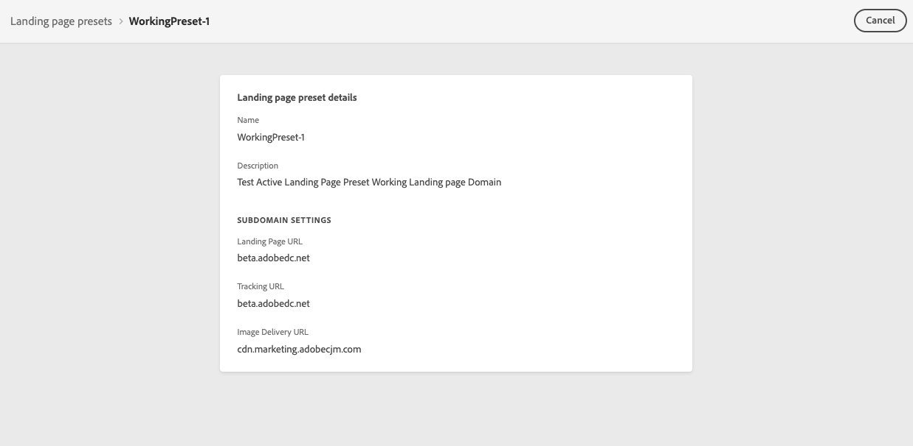

# Configure landing page channel {#lp-configuration}

>[!CAUTION]
>
>The use of landing pages is currently available in early access to select users only. If you want to leverage this feature, contact your Adobe account executive.

## Access landing page presets {#lp-presets}

When [creating a landing page](../landing-pages/create-lp.md#create-a-lp), you need to select a landing page preset to be able to build the landing page and leverage it through **[!DNL Journey Optimizer]**.

>[!NOTE]
>
>To define landing page presets, contact your Adobe account representative or the [Adobe Customer Care Support Team](https://helpx.adobe.com/enterprise/admin-guide.html/enterprise/using/support-for-experience-cloud.ug.html){target="_blank"}.

To access landing page presets, follow the steps below.

1. Access the **[!UICONTROL Administration]** > **[!UICONTROL Channels]** menu, then select **[!UICONTROL Branding]** > **[!UICONTROL Landing page presets]**.

    

1. Click any preset label to access the landing page preset details.

    

<!--
1. Access the **[!UICONTROL Administration]** > **[!UICONTROL Channels]** menu, then select **[!UICONTROL Branding]** > **[!UICONTROL Landing page presets]**.

1. Select **[!UICONTROL Create landing page preset]**.

    

1. Enter a name and a description (optional) for the preset, then select the landing page channel.

    

    >[!NOTE]
    >
    > Names must begin with a letter (A-Z). It can only contain alpha-numeric characters. You can also use underscore `_`, dot`.` and hyphen `-` characters.

1. Configure the **landing page** settings.

     

1. Once all the parameters have been configured, click **[!UICONTROL Submit]** to confirm. You can also save the message preset as draft and resume its configuration later on.

    

1. Once the landing page preset has been created, it displays in the list with the **[!UICONTROL Processing]** status.

    >[!NOTE]
    >
    >If the checks are not successful, learn more on the possible failure reasons in [this section](#monitor-message-presets).  

1. Once the checks are successful, the message preset gets the **[!UICONTROL Active]** status. It is ready to be used to deliver messages.

    

To learn how to configure a message preset for push notifications and emails, refer to [this section](message-presets.md).

You are now ready to use create landing pages in Journey Optimizer.

-->

## Landing page subdomains

You need to set up the subdomains you will use for your landing pages.

You can use a subdomain that is already delegated to Adobe, or you can configure another subdomain. [Learn more on delegating subdomains](delegate-subdomain.md)

<!--
>[!NOTE]
>
>To define landing page subdomains, contact your Adobe account representative or the [Adobe Customer Care Support Team](https://helpx.adobe.com/enterprise/admin-guide.html/enterprise/using/support-for-experience-cloud.ug.html){target="_blank"}.
-->
### Use an existing subdomain

To use subdomain that is already delegated to Adobe, follow the steps below.

1. Access the **[!UICONTROL Administration]** > **[!UICONTROL Channels]** menu, then select **[!UICONTROL Email configuration]** > **[!UICONTROL Landing page subdomains]**.

1. Click **[!UICONTROL Set up subdomain]**.

1. Select **[!UICONTROL Use delegated domain** from the **[!UICONTROL Configuration type]** section.

### Configure a new subdomain

To configure a new subdomain, follow the steps below.

1. Access the **[!UICONTROL Administration]** > **[!UICONTROL Channels]** menu, then select **[!UICONTROL Email configuration]** > **[!UICONTROL Landing page subdomains]**.

1. Click **[!UICONTROL Set up subdomain]**.

1. Select **[!UICONTROL Add your own domain** from the **[!UICONTROL Configuration type]** section.

**Related topics**

* [Get started with landing pages](../landing-pages/get-started-lp.md)
* [Create a landing page](../landing-pages/create-lp.md#create-a-lp)
