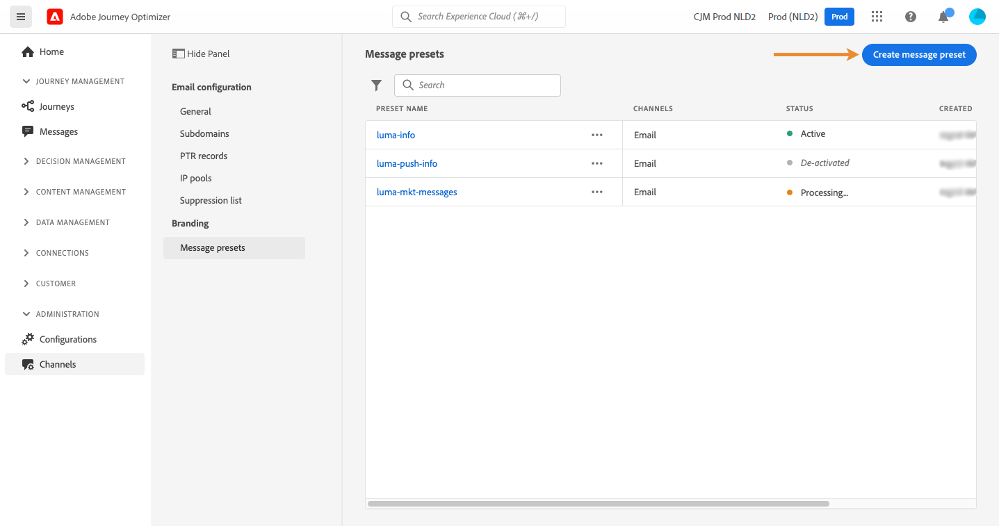

# Configure landing page channel {#lp-configuration}

>[!CAUTION]
>
>The use of landing pages is currently available in early access to select users only. If you want to leverage this feature, contact your Adobe account executive.

## Create a message preset for landing pages {#lp-preset}

You need to create a landing page preset to be able to create a landing page and leverage it through **[!DNL Journey Optimizer]**.

To create a landing page preset, follow these steps:

1. Access the **[!UICONTROL Channels]** > **[!UICONTROL Branding]** > **[!UICONTROL Message presets]** menu, then click **[!UICONTROL Create Message preset]**.

    

1. Enter a name and a description (optional) for the preset, then select the SMS channel.

    

    >[!NOTE]
    >
    > Names must begin with a letter (A-Z). It can only contain alpha-numeric characters. You can also use underscore `_`, dot`.` and hyphen `-` characters.

1. Configure the **SMS** settings.

     

    * Select the **[!UICONTROL SMS Type]** that will be sent with the preset: **[!UICONTROL Transactional]** or **[!UICONTROL Marketing]**.
    
    * Select the **[!UICONTROL SMS configuration]** to associate with the preset.
        
      For more on how to configure your environment to send SMS messages, refer to [this section](sms-configuration.md).

    * Enter the **[!UICONTROL Sender number]** ​you want to use for your communications.

1. Once all the parameters have been configured, click **[!UICONTROL Submit]** to confirm. You can also save the message preset as draft and resume its configuration later on.

    

1. Once the message preset has been created, it displays in the list with the **[!UICONTROL Processing]** status.

    >[!NOTE]
    >
    >If the checks are not successful, learn more on the possible failure reasons in [this section](#monitor-message-presets).  

1. Once the checks are successful, the message preset gets the **[!UICONTROL Active]** status. It is ready to be used to deliver messages.

    

To learn how to configure a message preset for push notifications and emails, refer to [this section](message-presets.md).

You are now ready to send SMS messages with Journey Optimizer.

**Related topics**

* [Create an SMS message](../create-sms.md)
* [Add a message in a journey](../building-journeys/journeys-message.md)
