# Manage the suppression list {#manage-suppression-list}

With [!DNL Journey Optimizer], you can monitor all the email addresses that are automatically excluded from sending in a journey, such as:

* Addresses that are invalid (hard bounces).
* Addresses that consistently soft-bounce, and could adversely affect your email reputation if you continue to include them in your deliveries.
* Recipients who issue a spam complaint of some kind against one of your email messages.

Such email addresses are automatically collected into the Journey Optimizer **suppression list**. Learn more on the suppression list concept and usage in [this section](../reports/suppression-list.md).

You can also [**manually** add an address or a domain](#add-addresses-and-domains) to the suppression list.

>[!NOTE]
>
>It will take between 0 and 60 minutes for [!DNL Journey Optimizer] to take into account the suppressed addresses in outgoing emails.

## Access the suppression list {#access-suppression-list}

To access the detailed list of excluded email addresses, go to **[!UICONTROL Administration]** > **[!UICONTROL Channels]** > **[!UICONTROL Email configuration]**, and select **[!UICONTROL Suppression list]**.

>[!CAUTION]
>
>Permissions to view, export and manage the suppression list are restricted to [Journey Administrators](../administration/ootb-product-profiles.md#journey-administrator). Learn more on managing [!DNL Journey Optimizer] users' access rights in [this section](../administration/permissions-overview.md).

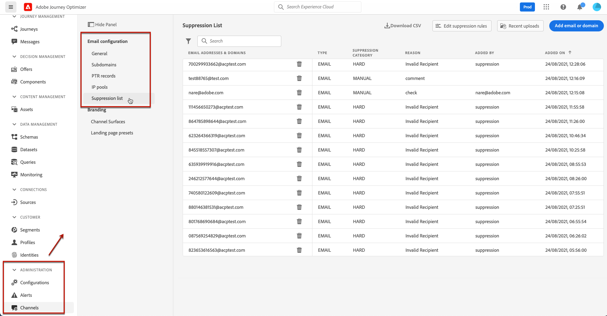

Filters are available to help you browse through the list.

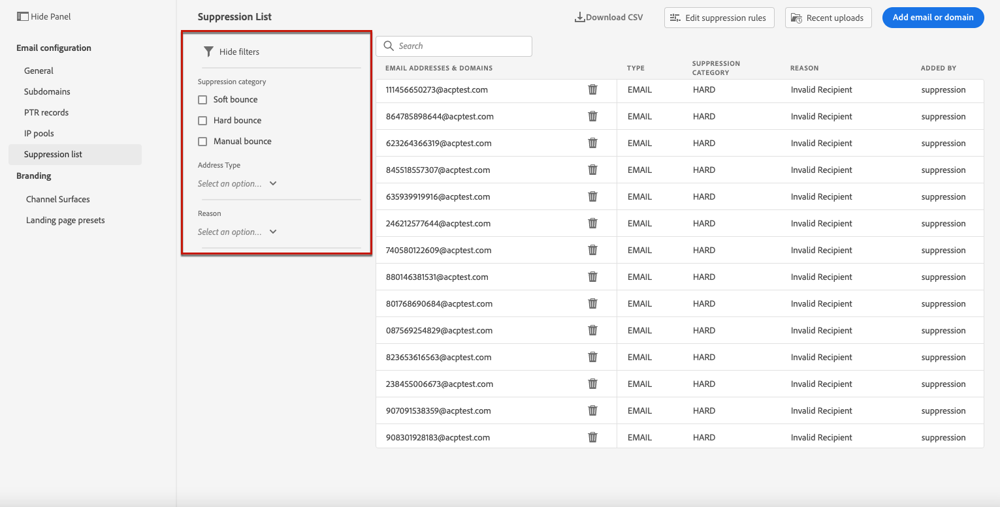

You can filter on the **[!UICONTROL Suppression category]**, **[!UICONTROL Address type]**, or **[!UICONTROL Reason]**. Select the option(s) of your choice for each criterion. Once selected, you can clear each filter or all filters displayed on top of the list.

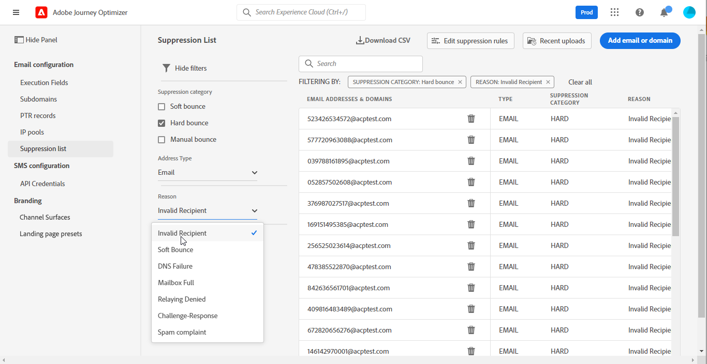

If you manually add an email address or a domain by mistake, the **[!UICONTROL Delete]** button enables you to remove that entry.

>[!CAUTION]
>
>Never use the **[!UICONTROL Delete]** button to remove suppressed email addresses or domains.

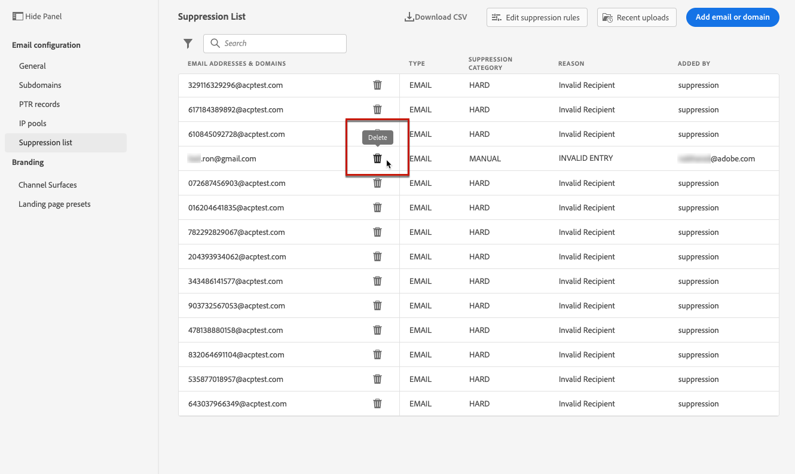

Deleting an email address or a domain from the suppression list means that you will start again delivering to this address or domain. Consequently, this can have severe impacts on your deliverability and IP reputation, which could eventually lead to your IP address or sending domain being blocked. Learn more on the importance of maintaining a suppression list in [this section](../reports/suppression-list.md).

>[!NOTE]
>
>Proceed with extra care when considering deleting any email address or domain. In case of any doubt, contact a deliverability expert.

From the **[!UICONTROL Suppression list]** view, you can also edit suppression rules. [Learn more](retries.md)

To export the suppression list as a CSV file, select the **[!UICONTROL Download CSV]** button.

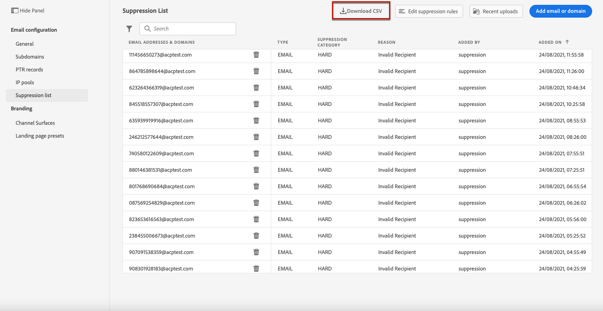

## Suppression categories and reasons {#suppression-categories-and-reasons}

When a message fails to be delivered to an email address, [!DNL Journey Optimizer] determines why the delivery failed and associates it with a **[!UICONTROL Suppression category]**.

The suppression categories are as follows:

* **Hard**: The email address is immediately sent to the suppression list.

    >[!NOTE]
    >
    >When the error is the result of a spam complaint, it also falls into the **Hard** category. The email address of the recipient who issued the complaint is immediately sent to the suppression list.

* **Soft**: Soft errors send an address to the suppression list once the error counter reaches the limit threshold. [Learn more on retries](retries.md)

* **Manual**: You can also manually add an email address or a domain to the suppression list. [Learn more](#add-addresses-and-domains)

>[!NOTE]
>
>Learn more on soft bounces and hard bounces in the [Delivery failure types](../reports/suppression-list.md#delivery-failures) section.

For each email address that is listed, you can also check the **[!UICONTROL Type]** (email or domain), **[!UICONTROL Reason]** for excluding it, who added it, and the date/time it was added to the suppression list.

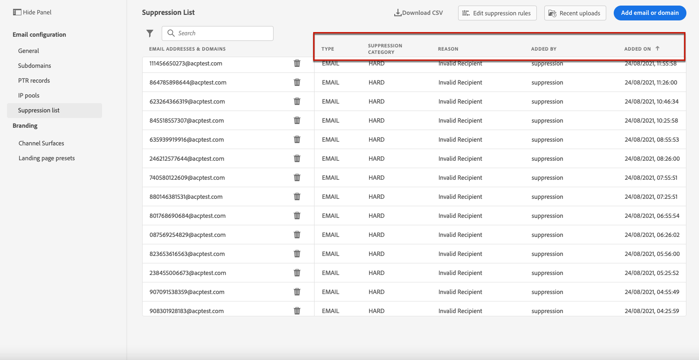

The possible reasons for a delivery failure are:

| Reason | Description | Suppression category |
| --- | --- | --- |
| **[!UICONTROL Invalid Recipient]** | The recipient is invalid or does not exist. | Hard |
| **[!UICONTROL Soft Bounce]** | The message soft bounced for a reason other than the soft errors listed in this table, such as when sending over the allowed rate recommended by an ISP. | Soft |
| **[!UICONTROL DNS Failure]** | The message bounced due to a DNS failure. | Soft |
| **[!UICONTROL Mailbox Full]** | The message bounced due to the mailbox of the recipient being full and unable to accept more messages. | Soft |
| **[!UICONTROL Relaying Denied]** | The message was blocked by the receiver because relaying is not allowed. | Soft |
| **[!UICONTROL Challenge-Response]** | The message is a challenge-response probe. | Soft |
| **[!UICONTROL Spam Complaint]** | The message was blocked because marked as a spam by the recipient. | Hard |

>[!NOTE]
>
>Unsubscribed users are not receiving emails from [!DNL Journey Optimizer], therefore their email addresses cannot be sent to the suppression list. Their choice is handled at the Experience Platform level. [Learn more on opting-out](../messages/consent.md)

## Manually add addresses and domains {#add-addresses-and-domains}

>[!CONTEXTUALHELP]
>id="ajo_admin_suppression_list_header"
>title="Add emails or domains to the suppression list"
>abstract="You can manually populate the Journey Optimizer suppression list to exclude specific email addresses and/or domains from your sending."

>[!CONTEXTUALHELP]
>id="ajo_admin_suppression_list"
>title="Add emails or domains to the suppression list"
>abstract="To populate the Journey Optimizer suppression list, you can manually add email addresses or domains - one at a time, or in bulk mode through a CSV file upload. These specific email addresses and/or domains will be excluded from your sending."

When a message fails to be delivered to an email address, this address is automatically added to the suppression list based on the defined suppression rule or bounce count.

However, you can also manually populate the [!DNL Journey Optimizer] suppression list to exclude specific email addresses and/or domains from your sending.

You may add email addresses or domains [one at a time](#add-one-address-or-domain), or [in bulk mode](#upload-csv-file) through a CSV file upload.

To do this, select the **[!UICONTROL Add email or domain]** button, then follow one of the methods below.

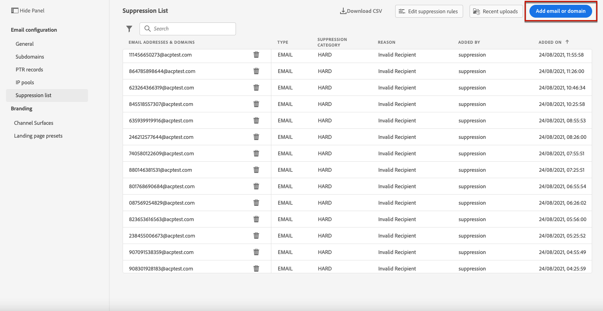

### Add one address or domain {#add-one-address-or-domain}

>[!CONTEXTUALHELP]
>id="ajo_admin_suppression_list_address"
>title="Add one item to the suppression list"
>abstract="You can populate the suppression list by adding email addresses and/or domains one by one."

1. Select the **[!UICONTROL One by one]** option.

    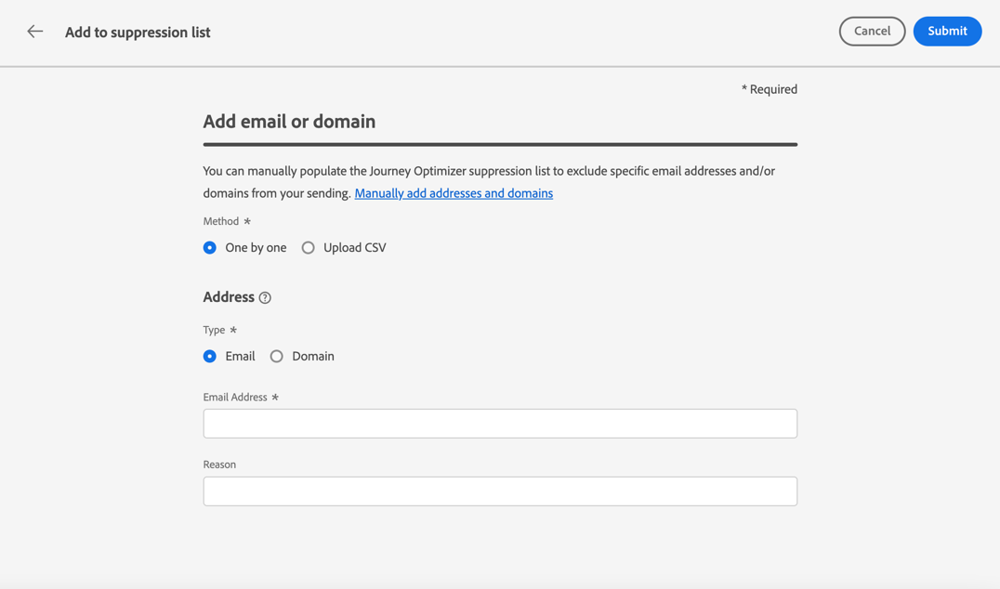

1. Choose the address type: **[!UICONTROL Email address]** or **[!UICONTROL Domain address]**.

1. Enter the email address or domain you want to exclude from your sending.

    >[!NOTE]
    >
    >Make sure you enter a valid email address (such as abc@company.com) or domain (such as abc.company.com).

1. Specify a reason if needed.

    >[!NOTE]
    >
    >All ASCII characters comprised between 32 and 126 are allowed in the **[!UICONTROL Reason]** field. The full list can be found on [this page](https://en.wikipedia.org/wiki/Wikipedia:ASCII#ASCII_printable_characters){target="_blank"} for example.

1. Click **[!UICONTROL Submit]**.

### Upload a CSV file {#upload-csv-file}

>[!CONTEXTUALHELP]
>id="ajo_admin_suppression_list_csv"
>title="Upload CSV to add items to the suppression list"
>abstract="You can populate the suppression list by uploading a CSV file filled in with the email addresses/domains you want to exclude."

1. Select the **[!UICONTROL Upload CSV]** option.

    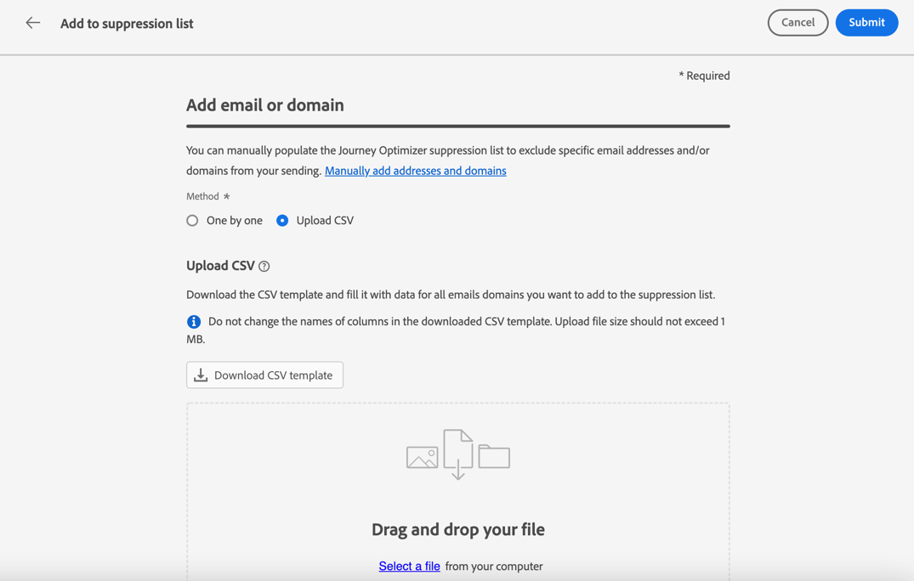

1. Download the CSV template to use, which includes the columns and format below:

    ```
    TYPE,VALUE,COMMENT
    EMAIL,abc@somedomain.com,Comment
    DOMAIN,somedomain.com,Comment
    ```
    >[!NOTE]
    >
    >All ASCII characters comprised between 32 and 126 are allowed in the **Comment** column. The full list can be found on [this page](https://en.wikipedia.org/wiki/Wikipedia:ASCII#ASCII_printable_characters){target="_blank"} for example. 

    You can also download this template from the **[!UICONTROL Suppression list]** main view.

    >[!CAUTION]
    >
    >Do not change the names of the columns in the CSV template.
    >
    >The file size should not exceed 1 MB.

1. Fill in the CSV template with the email addresses and/or domains you want to add to the suppression list.

1. Once completed, drag and drop your CSV file, then click **[!UICONTROL Submit]**.

    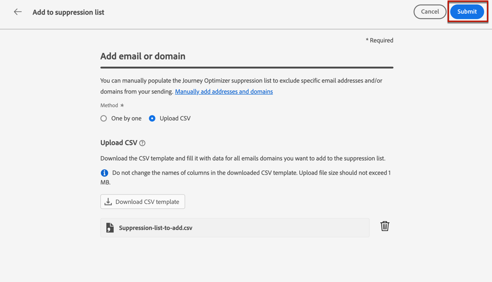

>[!NOTE]
>
>Once the upload is done, make sure it was successful by checking its status from the interface. [Learn how](#recent-uploads)

### Check recent uploads status {#recent-uploads}

You can check the list of the latest CSV files you uploaded.

To do this, from the **[!UICONTROL Suppression list]** view, click the **[!UICONTROL Recent uploads]** button.

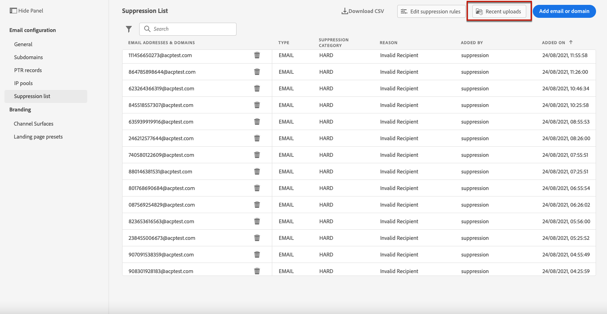

The latest uploads you submitted and their corresponding statuses are displayed.

If an error report is associated with a file, you can download it to check the errors encountered.

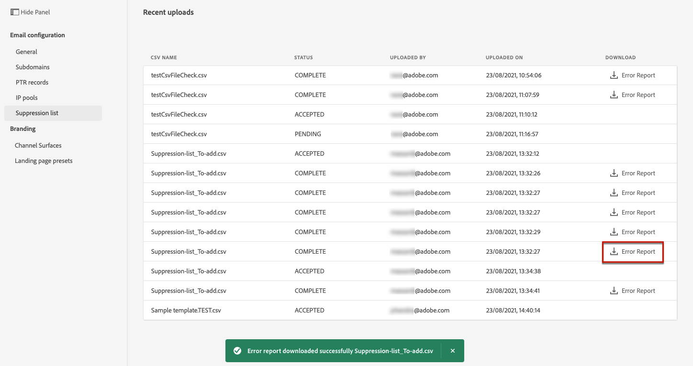

Below is an example of the type of entries you can find in the error report:

```
type,value,comments,failureReason
Email,examplemail.com,MANUAL,Invalid format for value: examplemail.com
Email,examplemail,MANUAL,Invalid format for value: examplemail
Email,example@mail,MANUAL,Invalid format for value: example@mail
Domain,example,MANUAL,Invalid format for value: example
Domain,example.!com,MANUAL,Invalid format for value: example.!com
Domain,!examplecom,MANUAL,Invalid format for value: !examplecom
```
