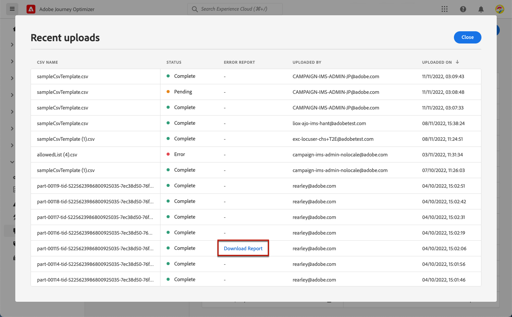
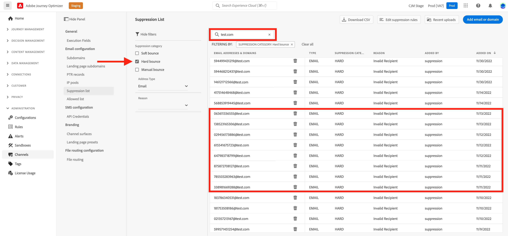
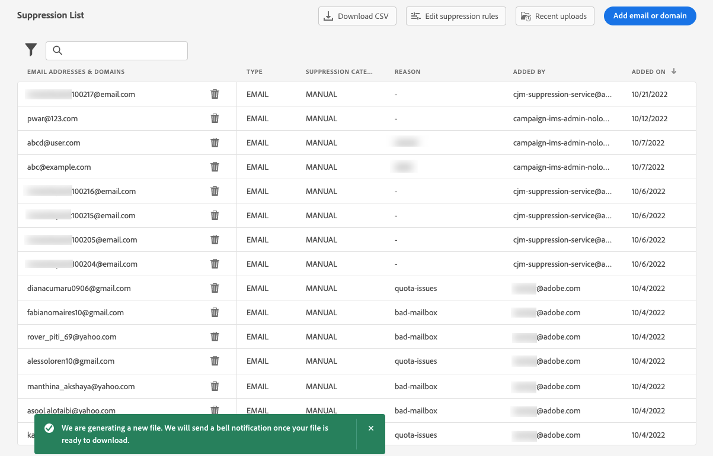
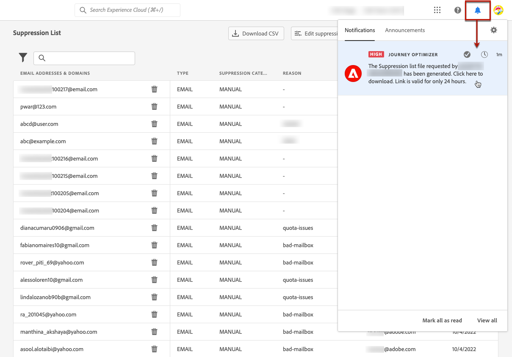

# Manage the suppression list {#manage-suppression-list}

With [!DNL Journey Optimizer], you can monitor all the email addresses that are automatically excluded from sending in a journey or a campaign, such as hard bounces, soft bounces, and spam complaints.

Such email addresses are automatically collected into the Journey Optimizer **suppression list**. A suppression list consists of addresses and domains to exclude from your audiences. It gathers email addresses and domains that are suppressed across all mailings in a single client environment, meaning specific to an organization ID associated with a sandbox ID.

Learn more on the suppression list concept and usage in [this section](../reports/suppression-list.md).


## Access the suppression list {#access-suppression-list}

To access the detailed list of excluded email addresses and domains, browse to **[!UICONTROL Administration]** > **[!UICONTROL Channels]** > **[!UICONTROL Email configuration]**, and select **[!UICONTROL Suppression list]**.

>[!CAUTION]
>
>Permissions to view, export and manage the suppression list are restricted to [Journey Administrators](../administration/ootb-product-profiles.md#journey-administrator). Learn more on managing [!DNL Journey Optimizer] users' access rights in [this section](../administration/permissions-overview.md).


Filters are available to help you browse through the list.


You can filter on the **[!UICONTROL Suppression category]**, **[!UICONTROL Address type]**, or **[!UICONTROL Reason]**. Select the option(s) of your choice for each criterion. Once selected, you can clear each filter or all filters displayed on top of the list.


## Understand failure reasons {#suppression-categories-and-reasons}

When a message fails to be delivered to an email address, [!DNL Journey Optimizer] determines why the delivery failed and associates it with a **[!UICONTROL Suppression category]**.

The suppression categories are as follows:

* **Hard**: A hard bounce indicates an invalid email address (i.e. an email address that does not exist). This involves a bounce message from the receiving email server that explicitly states that the address is invalid. The email address is immediately sent to the suppression list.

    When the error is the result of a spam complaint, it also falls into the **Hard** category. The email address of the recipient who issued the complaint is immediately sent to the suppression list.

* **Soft**: A soft bounce is a temporary email bounce that occurred for a valid email address. The email address is added to the suppression list after several retries. Soft errors send an address to the suppression list once the error counter reaches the limit threshold. [Learn more about retries](retries.md)

* **Manual**: Manual errors have been added manually to the suppression list. [Learn more](#add-addresses-and-domains)

For each email address that is listed, you can also check the **[!UICONTROL Type]** (email or domain), **[!UICONTROL Reason]** for excluding it, who added it, and the date/time it was added to the suppression list.


Possible reasons for a delivery failure are:

| Reason | Description | Category |
| --- | --- | --- |
| **[!UICONTROL Invalid Recipient]** | The recipient is invalid or does not exist. | Hard |
| **[!UICONTROL Soft Bounce]** | The message soft bounced for a reason other than the soft errors listed in this table, such as when sending over the allowed rate recommended by an ISP. | Soft |
| **[!UICONTROL DNS Failure]** | The message bounced due to a DNS failure. | Soft |
| **[!UICONTROL Mailbox Full]** | The message bounced due to the mailbox of the recipient being full and unable to accept more messages. | Soft |
| **[!UICONTROL Relaying Denied]** | The message was blocked by the receiver because relaying is not allowed. | Soft |
| **[!UICONTROL Challenge-Response]** | The message is a challenge-response probe. | Soft |
| **[!UICONTROL Spam Complaint]** | The message was blocked because marked as a spam by the recipient. | Hard |

>[!NOTE]
>
>Unsubscribed users are not receiving emails from [!DNL Journey Optimizer], therefore their email addresses cannot be sent to the suppression list. Their choice is handled at the Experience Platform level. [Learn more on opting-out](../privacy/opt-out.md)


### Suppression rules  {#suppression-rules}

From the **[!UICONTROL Suppression list]** view, you can also edit the retry parameter associated to the suppression rules from the **[!UICONTROL Edit suppression rules button]**. Use this option to update the retry threshold for the current sandbox. [Learn more](retries.md)


## Add addresses and domains to the suppression list{#add-addresses-and-domains}

>[!CONTEXTUALHELP]
>id="ajo_admin_suppression_list_header"
>title="Add emails or domains to the suppression list"
>abstract="You can manually populate the Journey Optimizer suppression list in order to exclude specific email addresses and/or domains from your sending."

>[!CONTEXTUALHELP]
>id="ajo_admin_suppression_list"
>title="Add emails or domains to the suppression list"
>abstract="To populate the suppression list, you can manually add email addresses or domains: one at a time, or in bulk mode through a CSV file upload. These specific email addresses and/or domains will be excluded from your sending."

When a message fails to be delivered to an email address, this address is automatically added to the suppression list based on the defined suppression rule or bounce count.

However, you can also manually populate the [!DNL Journey Optimizer] suppression list to exclude specific email addresses and/or domains from your sending.

>[!NOTE]
>
>It can take up to 60 minutes for [!DNL Journey Optimizer] to take into account the suppressed addresses in outgoing emails.

You may add email addresses or domains [one at a time](#add-one-address-or-domain), or [in bulk mode](#upload-csv-file) through a CSV file upload.

### Add one address or domain {#add-one-address-or-domain}

>[!CONTEXTUALHELP]
>id="ajo_admin_suppression_list_address"
>title="Add one item to the suppression list"
>abstract="You can populate the suppression list by adding email addresses and/or domains one by one."

To add an email address or a domain to the suppression list, follow the steps below:

1. Select the **[!UICONTROL Add email or domain]** button.

    

1. Choose the **[!UICONTROL One by one]** option.

    

1. Select the address type: **[!UICONTROL Email address]** or **[!UICONTROL Domain address]**.

1. Enter the email address or domain you want to exclude from your sending.

    >[!NOTE]
    >
    >Make sure you enter a valid email address (such as abc@company.com) or domain (such as abc.company.com).

1. (optional) Enter a reason. All ASCII printable characters comprised between 32 and 126 are allowed in this field.

1. Use the **[!UICONTROL Submit]** button to confirm.

### Upload a CSV file {#upload-csv-file}

>[!CONTEXTUALHELP]
>id="ajo_admin_suppression_list_csv"
>title="Upload CSV to add items to the suppression list"
>abstract="You can populate the suppression list by uploading a CSV file filled in with the email addresses/domains you want to exclude."

To add an group of email addresses or a domains to the suppression list, follow the steps below:

1. Select the **[!UICONTROL Add email or domain]** button.
1. Choose the **[!UICONTROL Upload CSV]** option.

    

1. Download the CSV template to use, which includes the columns and format below:

    ```
    TYPE,VALUE,COMMENT
    EMAIL,abc@somedomain.com,Comment
    DOMAIN,somedomain.com,Comment
    ```

1. Fill in the CSV template with the email addresses and/or domains to add to the suppression list. All ASCII printable characters comprised between 32 and 126 are allowed in the **COMMENT** column. 

    >[!CAUTION]
    >
    >Do not change the name of the columns in the CSV template.
    >
    >The file size should not exceed 1 MB.
    >

1. Once completed, drag and drop your CSV file, and use the **[!UICONTROL Submit]** button to confirm.

    

Once the upload is done, you can check its status from the [Recent uploads](#recent-uploads) button, as detailed below.

### Check uploads status {#recent-uploads}

Use the **[!UICONTROL Recent uploads]** button to check the status of the latest uploaded CSV files.


Possible statuses are:

* **[!UICONTROL Pending]**: The file upload is processing.
* **[!UICONTROL Error]**: The file upload process failed due to a technical issue or to a file format error.
* **[!UICONTROL Complete]**: The file upload process was successfully completed.

During the upload, if some addresses are not in the correct format, they are not added to the [!DNL Journey Optimizer] suppression list.

In that case, when the upload is complete, it is associated with a report. You can download it to check the errors encountered<!-- and understand why they were not added to the suppression list-->.



Below is an example of the type of entries you can find in the error report:

```
type,value,comments,failureReason
Email,examplemail.com,MANUAL,Invalid format for value: examplemail.com
Email,examplemail,MANUAL,Invalid format for value: examplemail
Email,example@mail,MANUAL,Invalid format for value: example@mail
Domain,example,MANUAL,Invalid format for value: example
Domain,example.!com,MANUAL,Invalid format for value: example.!com
Domain,!examplecom,MANUAL,Invalid format for value: !examplecom
```

## Remove an address from the suppression list{#remove-from-suppression-list}

You can update manually the suppression list. Removing an email address from quarantine is a sensitive operation and can affect your IP reputation and deliverability rates. Make sure to proceed with caution.

When deleting an email address or a domain from the suppression list, Adobe Journey Optimizer can start again delivering to this address or domain.  Learn more about deliverability in [this section](../reports/deliverability.md).

To remove an address from the suppression list, use the **[!UICONTROL Delete]** button.


>[!NOTE]
>
>Proceed with extra care when considering deleting any email address or domain. In case of any doubt, contact a deliverability expert.


For example in the case of an Internet Service Provider (ISP) outage, emails are wrongly marked as hard bounces because they cannot be successfully delivered to their recipient. These email addresses must be removed from the suppression list.

To perform this, filter the suppression list to display affected email addresses or domains. For example if an ISP outage happened from Nov 11, 2022 to Nov 13, 2022 on the **test.com** domain, filter the addresses added to the suppression list in that timeframe, as below:



You also need to add a filter on the type of hard bounce, depending on the details of the outage. These details are provided by the ISP, such as the exact error code returned to the sender. For example: `550 <email address> recipient rejected` or `550 5.1.1 ‘email address’: user lookup success but no user record found`.

Once identified, these addresses can be manually removed from the suppression list using the **[!UICONTROL Delete]** button. These addresses can then be included in future email campaigns. 

## Download the suppression list {#download-suppression-list}

<!--
>[!CONTEXTUALHELP]
>id="ajo_admin_suppression_list_download"
>title="Export the list as a CSV file"
>abstract="To download the suppression list, you can either export the current list by generating a new file, or download the file that was previously generated."
-->

To export the suppression list as a CSV file, follow the steps below:

1. Select the **[!UICONTROL Download CSV]** button.

    

1. Wait until the file is generated.

    

    >[!NOTE]
    >
    >Download time depends on the file size, meaning the number of addresses that are on the suppression list.
    >
    >One download request can be processed at a time for a given sandbox.

1. Once the file is generated, you receive a notification. Click the bell icon on top right of the screen to display it.

1. Click the notification itself to download the file.

    

    >[!NOTE]
    >
    >The link is valid for 24 hours.

<!--When downloading the CSV file, you can choose to either:

* Download the file that was previously generated by another user or yourself.

* Generate a new file in order to export the current suppression list.-->