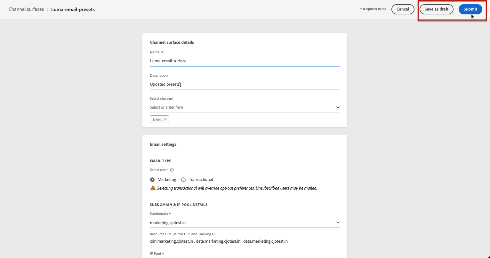

# Create message presets {#message-presets-creation}

With [!DNL Journey Optimizer], you can set up message presets that define all the technical parameters required for email and push notification message: email type, sender email and name, mobile apps, and more. 

>[!CAUTION]
>
> * Message presets configuration is restricted to Journey Administrators. [Learn more](../administration/ootb-product-profiles.md#journey-administrator)
>
> * You must perform Email configuration and [Push configuration](../messages/push-configuration.md) steps before creating message presets.

Once message presets have been configured, you be able to select them when creating messages from the **[!UICONTROL Presets]** list.

➡️ [Learn how to create and use email presets in this video](#video-presets)

## Create a message preset {#create-message-preset}

To create a message preset, follow these steps:

1. Access the **[!UICONTROL Channels]** > **[!UICONTROL Branding]** > **[!UICONTROL Message presets]** menu, then click **[!UICONTROL Create Message preset]**.

    

1. Enter a name and a description (optional) for the preset, then select the channel(s) to configure.

    

    >[!NOTE]
    >
    > Names must begin with a letter (A-Z). It can only contain alpha-numeric characters. You can also use underscore `_`, dot`.` and hyphen `-` characters. 

1. Configure the **email** settings. [Learn more](#configure-email-settings)

1. Configure the **push notification** settings. [Learn more](#configure-push-settings)

    <!--Configure SMS settings. [Learn more](#configure-sms-settings) -->

1. Once all the parameters have been configured, click **[!UICONTROL Submit]** to confirm. You can also save the message preset as draft and resume its configuration later on.

    
    
1. Once the message preset has been created, it displays in the list with the **[!UICONTROL Processing]** status.

    During this step, several checks will be performed to verify that it has been configured properly. The processing time is around **48h-72h**, and can take up to **7-10 business days**.

    These checks include configuration and technical tests that are performed by the Adobe team:

    * SPF validation
    * DKIM validation
    * MX record validation
    * Check IPs denylisting
    * Helo host check
    * IP pool verification
    * A/PTR record, t/m/res subdomain verification

    >[!NOTE]
    >
    >If the checks are not successful, learn more on the possible failure reasons in [this section](#monitor-message-presets).  

1. Once the checks are successful, the message preset gets the **[!UICONTROL Active]** status. It is ready to be used to deliver messages.

    

## Configure email settings {#configure-email-settings}

Email settings are defined in a dedicated section of the message preset configuration.

Configure your settings as described below.

### Type of email{#email-type}

In the **EMAIL TYPE** section, select the type of message that will be sent with the preset: **Marketing** or **Transactional**.

Choose **Marketing** for promotional messages: these messages require user consent.

Choose **Transactional** for non-commercial messages such as order confirmation, password reset notifications, or delivery information for example.

>[!CAUTION]
>
>**Transactional** messages can be sent to profiles who unsubscribed from marketing communications. These messages can only be sent in specific contexts.

### Subdomain & IP pool {#subdomains-and-ip-pools}

In the **SUBDOMAIN & IP POOL DETAILS** section, you must:

1. Select the subdomain to use to send the emails. [Learn more](about-subdomain-delegation.md)

1. Select the IP pool to associate with the preset. [Learn more](ip-pools.md)

### List-Unsubscribe {#list-unsubscribe}

Upon [selecting a subdomain](#subdomains-and-ip-pools) from the list, the **[!UICONTROL Custom List-Unsubscribe]** option displays.

This option is enabled by default.

If you leave it enabled, all emails sent with [!DNL Journey Optimizer] and using this preset will automatically include the unsubscribe link in the email header, with the default address displayed (based on the [selected subdomain](#subdomains-and-ip-pools)).

If you disable this option, the default unsubscribe link provided by [!DNL Journey Optimizer] will not be included into the email header.

Learn more on using unsubscribe links in email header in [this section](../messages/consent.md).

<!--Select the **[!UICONTROL Custom List-Unsubscribe]** option to enter your own Unsubscribe URL and/or your own Unsubscribe email address.-->

### URL tracking{#url-tracking}

To identify where and why a person clicked on your link, you can add UTM parameters for URL tracking in the  **[!UICONTROL URL TRACKING CONFIGURATION (web analytics)]** section.

Based on the parameters you define, a UTM code will be applied to the end of the URL included in your message content. You will then be able to compare results in a web analytics tool, such as Google Analytics.

Three UTM parameters are available by default. You can add up to 10 tracking parameters. To add a UTM parameter, select the **[!UICONTROL Add new UTM param]** button.

To configure a UTM parameter, you can directly enter the desired values in the **[!UICONTROL Name]** and **[!UICONTROL Value]** fields, or choose from a list of predefined values by navigating to the following objects:

* Journey attributes: Source id, Source name, Source version id
* Message attributes: Action id, Action name
* Offer decisioning attributes: Offer id, Offer name

>[!CAUTION]
>
>Do not select a folder: make sure to browse to the necessary folder and select a profile attribute to use as a UTM value. 

### Header parameters{#email-header}

In the **[!UICONTROL HEADER PARAMETERS]** section, enter the sender names and email addresses associated to the type of messages sent using that preset.

>[!CAUTION]
>
>The email addresses must use the current selected [delegated subdomain](about-subdomain-delegation.md).

* **[!UICONTROL Sender name]**: The name of the sender, such as your brand's name.

* **[!UICONTROL Sender email]**: The email address you want to use for your communications. For example, if the delegated subdomain is *marketing.luma.com*, you can use *contact@marketing.luma.com*.

* **[!UICONTROL Reply to (name)]**: The name that will be used when the recipient clicks the **Reply** button in their email client software.

* **[!UICONTROL Reply to (email)]**: The email address that will be used when the recipient clicks the **Reply** button in their email client software. You must use an address defined on the delegated subdomain (for example, *reply@marketing.luma.com*), otherwise the emails will be dropped.

* **[!UICONTROL Error email]**: All errors generated by ISPs after a few days of mail being delivered (asynchronous bounces) are received on this address.

>[!NOTE]
>
>Addresses must begin with a letter (A-Z) and can only contain alpha-numeric characters. You can also use underscore `_`, dot`.` and hyphen `-` characters.

### Email retry parameters{#email-retry}

You can configure the **Email retry parameters**.

By default, the [retry time period](retries.md#retry-duration) is set to 84 hours, but you can adjust this setting to better suit your needs.

You must enter an integer value (in hours or minutes) within the following range:

* For marketing emails, the minimum retry period is 6 hours.
* For transactional emails, the minimum retry period is 10 minutes.
* For both email types, the maximum retry period is 84 hours (or 5040 minutes).

## Configure push settings {#configure-push-settings}

Push settings are defined in a dedicated section of the message preset configuration.

To define the push settings associated to the message preset, follow the steps below:

1. Select at least one platform: **iOS** and/or **Android**.
    
1. Select the mobile applications to use for each platform.

        
For more on how to configure your environment to send push notifications, refer to [this section](../messages/push-gs.md).

<!--
## Configure SMS settings {#configure-sms-settings}

1. Select the **[!UICONTROL SMS Type]** that will be sent with the preset: **[!UICONTROL Transactional]** or **[!UICONTROL Marketing]**.

    
    
1. Select the **[!UICONTROL SMS configuration]** to associate with the preset.
        
    For more on how to configure your environment to send SMS messages, refer to [this section](sms-configuration.md).

1. Enter the **[!UICONTROL Sender number]** ​you want to use for your communications.
-->

## Monitor message presets {#monitor-message-presets}

All your message presets display in the **[!UICONTROL Channels]** > **[!UICONTROL Message presets]** menu. Filters are available to help you browse through the list (channel type, user, status).

Once created, message presets can have the following statuses:

* **[!UICONTROL Draft]**: The message preset has been saved as a draft and has not been submitted yet. Open it to resume the configuration.
* **[!UICONTROL Processing]**: The message preset has been submitted and is going through several verifications steps.
* **[!UICONTROL Active]**: The message preset has been verified and can be selected to create messages.
* **[!UICONTROL Failed]**: One or several checks have failed during the message preset verification.
* **[!UICONTROL Deactivated]**: The message preset is deactivated. It cannot be used to create new messages.

In case a message preset creation fails, the details on each possible failure reason are described below.

If one of these errors occurs, contact [Adobe Customer Care](https://helpx.adobe.com/enterprise/admin-guide.html/enterprise/using/support-for-experience-cloud.ug.html){target="_blank"} to get assistance.

* **SPF validation failed**: SPF (Sender Policy Framework) is an email authentication protocol that allows to specify authorized IPs that can send emails from a given subdomain. SPF validation failure means that the IP addresses in the SPF record do not match the IP addresses used for sending emails to the mailbox providers. 

* **DKIM validation failed**: DKIM (DomainKeys Identified Mail) allows the recipient server to verify that the received message was sent by the genuine sender of the associated domain and that the content of the original message was not altered on its way. DKIM validation failure means that the receiving mail servers are unable to verify the authenticity of the message content and its association with the sending domain.:

* **MX record validation failed**: MX (Mail eXchange) record validation failure means that the mail servers responsible for accepting inbound emails on behalf of a given subdomain are not correctly configured.

* **Deliverability configurations failed**: Deliverability configurations failure can happen due to any of the following reasons:
    * Blocklisting of the allocated IPs
    * Invalid `helo` name
    * Emails being sent from IPs other than the ones specified in the IP pool of the corresponding preset
    * Unable to deliver emails to inboxes of major ISPs like Gmail and Yahoo

## Edit a message preset {#edit-message-preset}

To edit a message preset, follow the steps below.

>[!NOTE]
>
>You cannot edit the **[!UICONTROL Push notification settings]**. If a message preset is only configured for the Push notification channel, it is not editable.

1. From the list, click a message preset name to open it.

    

1. Edit its properties as desired.

    >[!NOTE]
    >
    >If a message preset has the **[!UICONTROL Active]** status, the **[!UICONTROL Name]**, **[!UICONTROL Select channel]** and **[!UICONTROL Subdomain]** fields are greyed out and cannot be edited.

1. Click **[!UICONTROL Submit]** to confirm your changes.

    

    >[!NOTE]
    >
    >You can also save the message preset as draft and resume update later on.

Once the changes are submitted, the message preset will go through a validation cycle similar to the one in place when [creating a preset](#create-message-preset).

>[!NOTE]
>
>If you only edit the **[!UICONTROL Description]**, **[!UICONTROL Email type]** and/or **[!UICONTROL Email retry parameters]** fields, the update is instantaneous.

For message presets that have the **[!UICONTROL Active]** status, you can check the details of the update. To do so:

* Click the **[!UICONTROL Recent update]** icon that is displayed next to the active preset name.

    

* You can also access the update details from an active message preset while update is in progress.
    
    

On the **[!UICONTROL Recent update]** screen, you can see information such as the update status, and the list of requested changes.

### Update statuses {#update-statuses}

A message preset update can have the following statuses:

* **[!UICONTROL Processing]**: The message preset update has been submitted and is going through several verifications steps.
* **[!UICONTROL Success]**: The updated message preset has been verified and can be selected to create messages.
* **[!UICONTROL Failed]**: One or several checks have failed during the message preset update verification.

Each status is detailed below.

### Processing

Several deliverability checks will be performed to verify that the preset has been updated properly.

>[!NOTE]
>
>If you only edit the **[!UICONTROL Description]**, **[!UICONTROL Email type]** and/or **[!UICONTROL Email retry parameters]** fields, the update is instantaneous.

The processing time is around **48h-72h**, and can take up to **7-10 business days**. Learn more on the checks performed during the validation cycle in [this section](#create-message-preset).

If you edit a preset that was already active:

* Its status remains **[!UICONTROL Active]** while the validation process is in progress.

* The **[!UICONTROL Recent update]** icon displays next to the name of the preset in the message presets list.

* During the validation process, the messages configured using this preset are still using the older version of the preset.

>[!NOTE]
>
>You cannot modify a message preset while update is in progress. You can still click its name, but all the fields are greyed out. The changes will not be reflected until the update is successful.

### Success {#success}

Once the validation process is successful, the new version of the preset is automatically used in all messages using this preset. However, you may have to wait:
* a few minutes before it is consumed by the unitary messages,
* until the next batch for the preset to be effective in batch messages.

### Failed {#failed}

If the validation process fails, the older version of the preset will still be used.

Learn more on the possible failure reasons in [this section](#monitor-message-presets).

Upon update failing, the preset becomes editable again. You can click its name and update the settings that need to be fixed.

## Deactivate a message preset {#deactivate-preset}

To make an **[!UICONTROL Active]** message preset unavailable to create new messages, you can deactivate it. However, the published messages using this preset will not be affected and will continue working.

>[!NOTE]
>
>You cannot deactivate a message preset while an update is processing. You must wait until the update is successful or has failed. Learn more on [editing message presets](#edit-message-preset) and on the [update statuses](#update-statuses).

1. Access the message presets list.

1. For the active preset of your choice, click the **[!UICONTROL More actions]** button.

1. Select **[!UICONTROL Deactivate]**.

    

>[!NOTE]
>
>Deactivated message presets cannot be deleted to avoid any issue in journeys using these presets to send messages.

You cannot directly edit a deactivated message preset. However, you can duplicate it and edit the copy to create a new version that you will use to create new messages. You can also activate it again, and wait until the update is successful to edit it.

## How-to video{#video-presets}

Learn how to create message presets, how to use them and how to delegate a subdomain and create an IP pool.

>[!VIDEO](https://video.tv.adobe.com/v/334343?quality=12)
