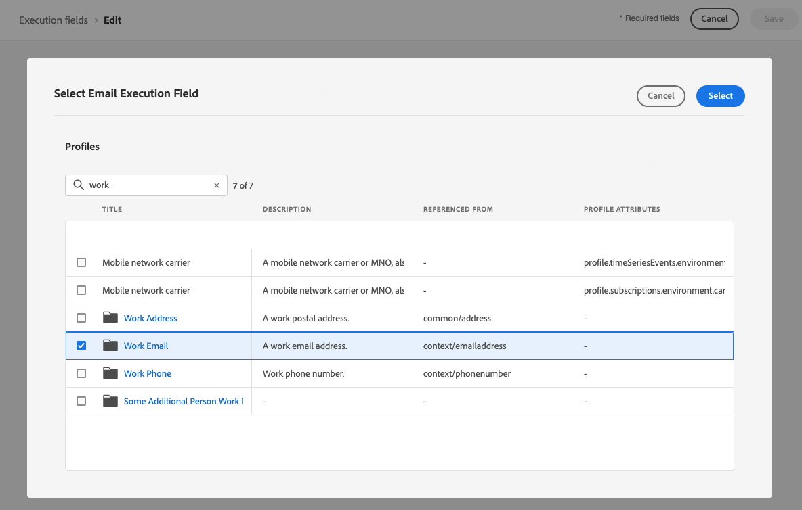
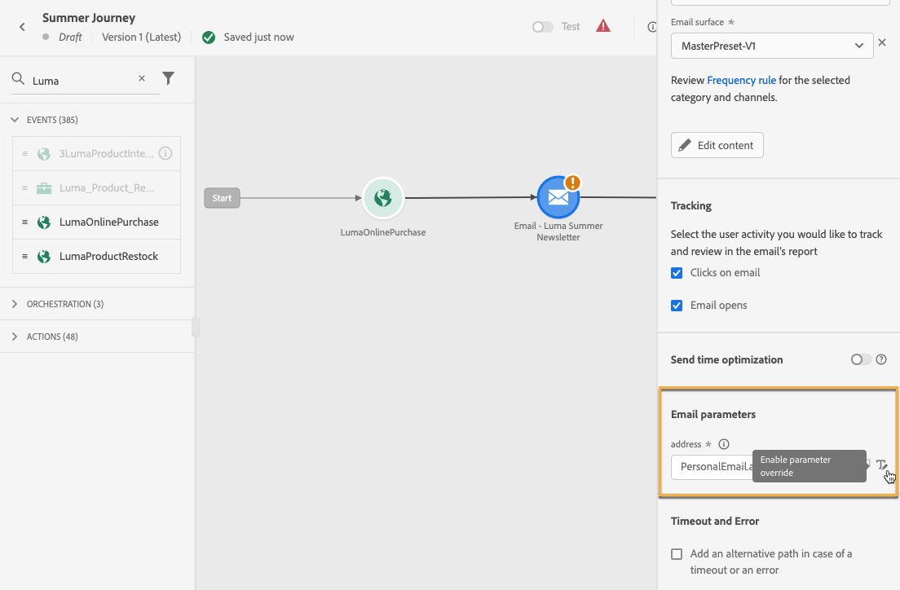

# Change the execution addresses {#change-primary-email}

>[!CONTEXTUALHELP]
>id="ajo_admin_execution_address"
>title="Define which address to use"
>abstract="When several email addresses or phone numbers are available in the database (personal, professional, etc.), you can choose which one to prioritize for sending."

>[!CONTEXTUALHELP]
>id="ajo_admin_execution_address_header"
>title="Define which address to use"
>abstract="Edit the fields used to determine the profiles' email address or phone number to prioritize for sending."

When you target a profile, several email addresses or phone numbers may be available in the database (professional email address, personal phone number, etc.).

In that case, [!DNL Journey Optimizer] uses **[!UICONTROL Execution fields]** to determine which email address or phone number to use from the profile service in priority.

To check the fields that are currently used by default, access the **[!UICONTROL Administration]** > **[!UICONTROL Channels]** > **[!UICONTROL General]** > **[!UICONTROL Executions fields]** menu.

The current values are used for all deliveries at the sandbox level. You can update these fields if needed.

In most cases, you will change an execution field globally and define a value that should be used for all email or SMS messages. <!--[Learn how](#admin-settings)-->

<!--In some specific use cases only, you can override the value set globally and define a different value at the journey level. [Learn more](#journey-parameters)-->

## Update the Administration settings {#admin-settings}

To change the execution fields globally at the sandbox level, follow the steps below.

1. Access the  **[!UICONTROL Channels]** > **[!UICONTROL General]** > **[!UICONTROL Executions fields]** menu.

1. Click **[!UICONTROL Edit]** to change the default values.

    

1. Click the current field of your choice or the edit icon to select a new field.

    

1. The list of available email-type XDM fields displays. Select the field to use.

    

1. Click **[!UICONTROL Save]** to confirm your choice.

The execution field is updated and will now be used as the primary address.
    
<!--1. You can also select an additional field to use as secondary email address. This allows you to determine which field to use if the primary field is empty for a profile. -->

## Override a value in the journey parameters {#journey-parameters}

For specific use cases only, you can override the execution field set globally and define a different value at the journey level, in particular for the email channel.

When adding an **[!UICONTROL Email]** action to a [journey](../email/create-email.md#create-email-journey-campaign), the primary email address is displayed under the journey advanced parameters.

In some specific contexts, you can override this value using the **[!UICONTROL Enable parameter override]** icon to the right of the **[!UICONTROL address]** field.

>[!CAUTION]
>
>Email address override should only be used for specific use cases. Most of the time, you do not need to change the email address because the value defined as the primary address in the **[!UICONTROL Execution fields]** is the one that should be used.

Overriding this value may be useful for example to:

* Test an email. You can add your own email address: after you have published the journey, the email is sent to you.
* Send an email to the subscribers of a list. Learn more in [this use case](../building-journeys/message-to-subscribers-uc.md).
