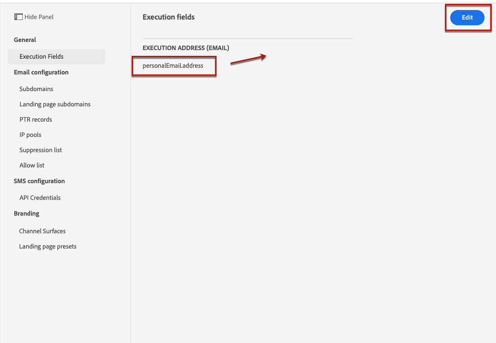
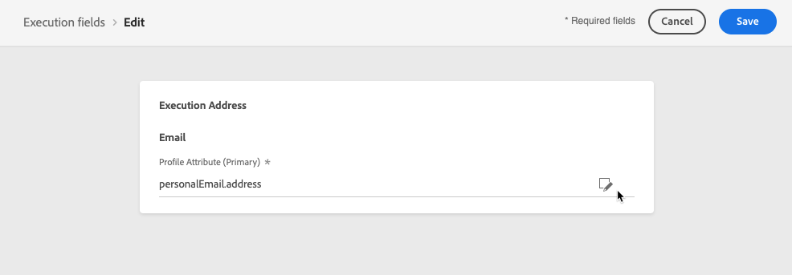
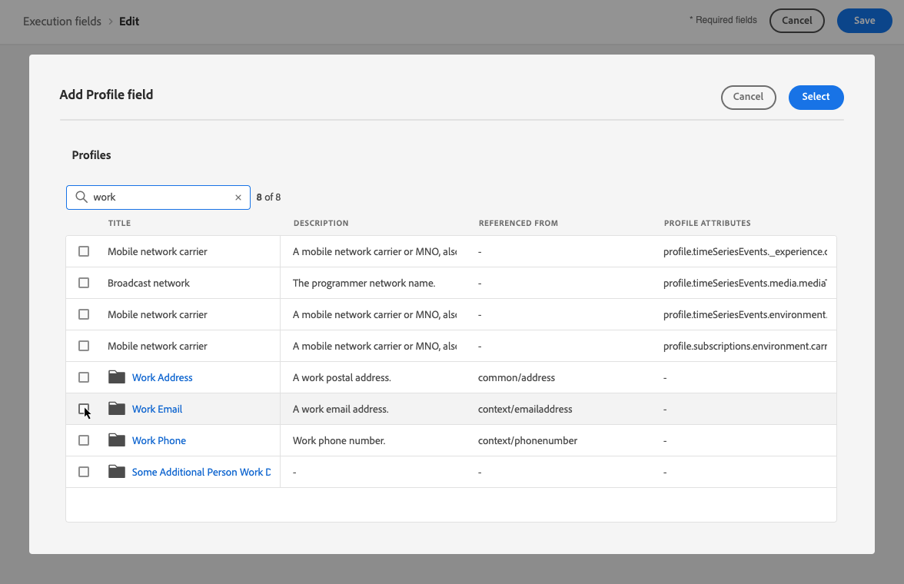
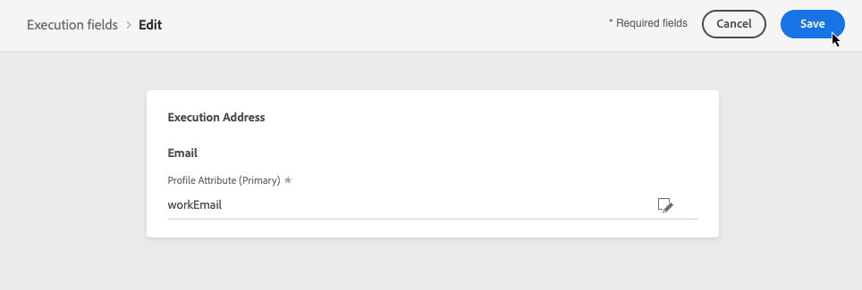

# Change the primary addresses {#change-primary-email}

>[!CONTEXTUALHELP]
>id="ajo_admin_execution_address"
>title="Define which address to use"
>abstract="When several addresses are available in the database (personal, professional, etc.), you can choose which address to prioritize for sending."

When you target a profile, several email addresses may be available in the database (personal, professional email address, etc.).

With [!DNL Journey Optimizer], you can determine which email address to use from the profile service and to prioritize when several addresses are available. To do this, follow the steps below.

1. Access the  **[!UICONTROL Channels]** > **[!UICONTROL General]** > **[!UICONTROL Executions fields]** menu.

    

1. The field that is currently used by default to determine the profiles' email addresses displays on this screen. Click **[!UICONTROL Edit]** to change it.

    

1. Click the current field or the edit icon to select a new field.

    

1. The list of available email-type XDM fields displays. Select the field to use.

    

1. Click **[!UICONTROL Save]** to confirm your choice.

    

    The execution field is updated and will now be used as the primary address.
    
<!--1. You can also select an additional field to use as secondary email address. This allows you to determine which field to use if the primary field is empty for a profile. -->
