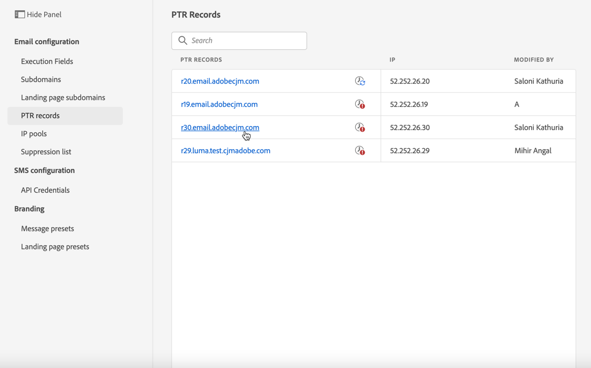
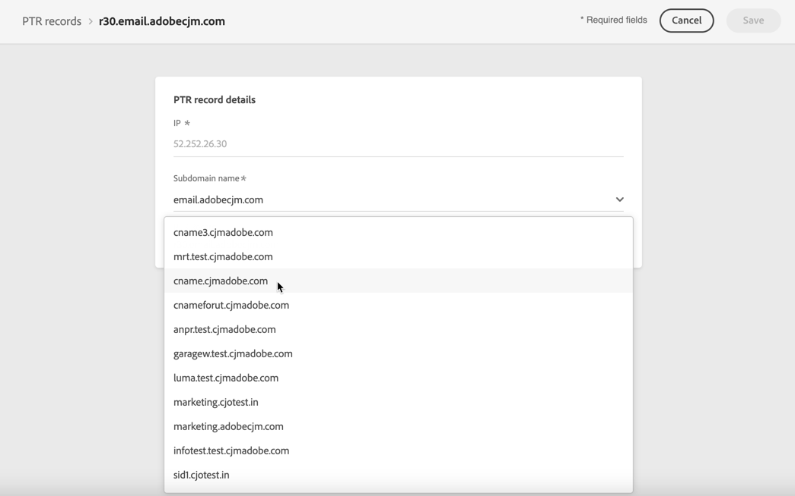
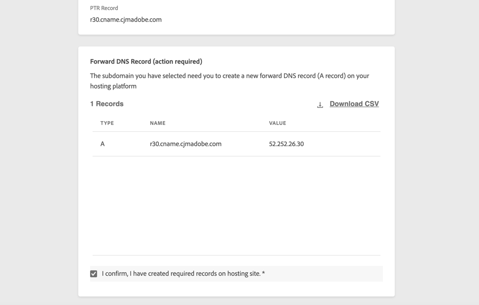
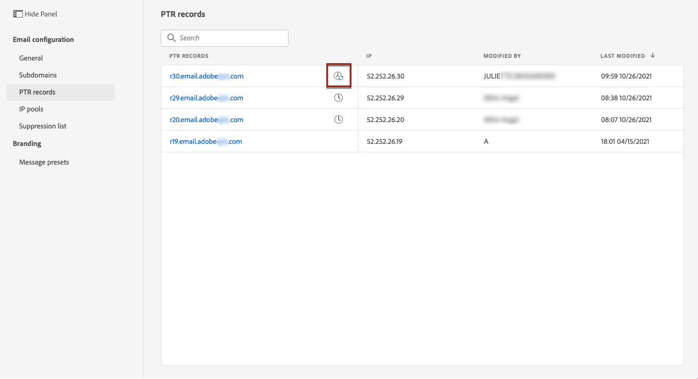

# PTR records

## About PTR records

A pointer record (PTR) is a type of Domain Name System (DNS) record that provides the domain name linked to an IP address.

With PTR records, receiving mail servers can check the authenticity of sending mail servers by identifying whether their IP addresses correspond to the names with which the servers connect.

## Access your subdomains' PTR records

Once [a subdomain is delegated](delegate-subdomain.md) in Adobe Journey Optimizer, a PTR record is automatically created and associated with this subdomain. You can access it from the **[!UICONTROL Channels]** > **[!UICONTROL Email configuration]** > **[!UICONTROL PTR records]** menu.

The list shows the PTR records generated for each delegated subdomain, using the syntax below:

* "r" for record,
* "xx" for the two last figures of the IP address,
* subdomain name.

You can open a PTR record from the list to display the associated subdomain name and IP address.

## Edit a PTR record {#edit-ptr-record}

You can modify a PTR record to edit the subdomain associated with an IP address.

>[!NOTE]
>
>You cannot modify the **[!UICONTROL IP]** and **[!UICONTROL PTR record]** fields.

### Fully delegated subdomains

To edit a PTR record with a subdomain that is [fully delegated](delegate-subdomain.md#full-subdomain-delegation) to Adobe, follow the steps below.

1. From the list, click a PTR record name to open it.

    

1. Select a subdomain [fully delegated](delegate-subdomain.md#full-subdomain-delegation) to Adobe from the list.

    

1. Click **[!UICONTROL Save]** to confirm your changes.

<!--### Delegated subdomains using the CNAME method {#edit-ptr-subdomains-cname}

To edit a PTR record with a subdomain that is delegated to Adobe using the [CNAME method](delegate-subdomain.md#cname-subdomain-delegation), follow the steps below.

1. From the list, click a PTR record name to open it.

    

1. Select a subdomain delegated to Adobe using the [CNAME method](delegate-subdomain.md#cname-subdomain-delegation) from the list.

    

1. You need to create a new forward DNS record on your hosting platform. To do this, copy the record generated by Adobe. Once done, check the box "I confirm...".

    

    >[!NOTE]
    >
    >If you get this message: "Please create forward DNS first and then try again", follow the steps below:
    >   * Check on the DNS provider if the forward DNS record was successfully created. 
    >   * Records across the DNS may not synchronize immediately. Wait for a few minutes, and try again.

1. Click **[!UICONTROL Save]** to confirm your changes.-->

## Check PTR record update details

A **[!UICONTROL Processing]** icon displays next to the name of the PTR record in the list.

To check the PTR record update details, click the **[!UICONTROL Updating]** or **[!UICONTROL Recent updates]** icon.

You can see information such as the update status, and the requested changes.

## PTR record update statuses

A PTR record update can have the following statuses:

*  **[!UICONTROL Processing]**: The PTR record update has been submitted and is going through a verification process.
*  **[!UICONTROL Success]**: The updated PTR record has been verified and the new subdomain is now associated with the IP address.
*  **[!UICONTROL Failed]**: One or several checks have failed during the PTR record update verification.

### Processing

Several deliverability checks will be performed to verify that the new subdomain to associate with the IP address is valid. <!--The processing time is around **48h-72h**, and can take up to **7-10 days**. Learn more on the checks performed during the validation cycle in [this section](#create-message-preset).-->

>[!NOTE]
>
>You cannot modify a PTR record while update is in progress. You can still click its name, but the **[!UICONTROL Subdomain]** field is greyed out. The changes will not be reflected until the update is successful.

During the validation process, the old subdomain is still associated with the IP address.

### Success

Once the validation process is successful, the new subdomain is automatically associated with the IP address.

### Failed

If the validation process fails, the older PTR record is displayed. The valid subdomain that was previously associated with the IP address remains unchanged.

The possible update error types are as follows:
* Failure to create a new forward DNS for the PTR record
* Failure to update the record
* Failure to re-onboard the affinities

Upon update failing, the PTR record becomes editable again. You can click its name and update the subdomain again.
