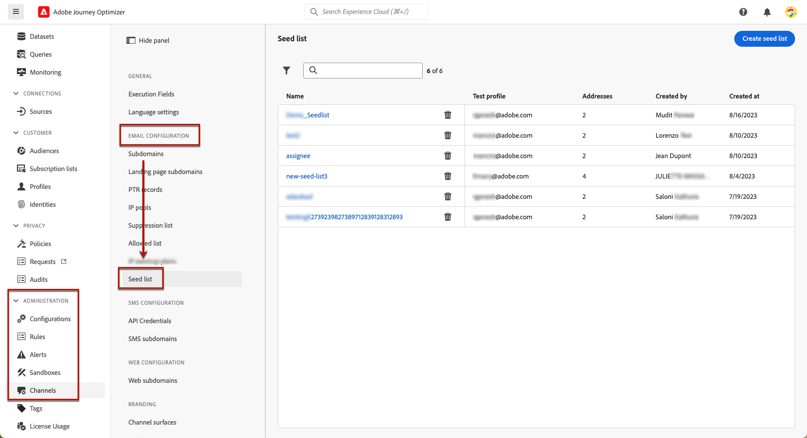
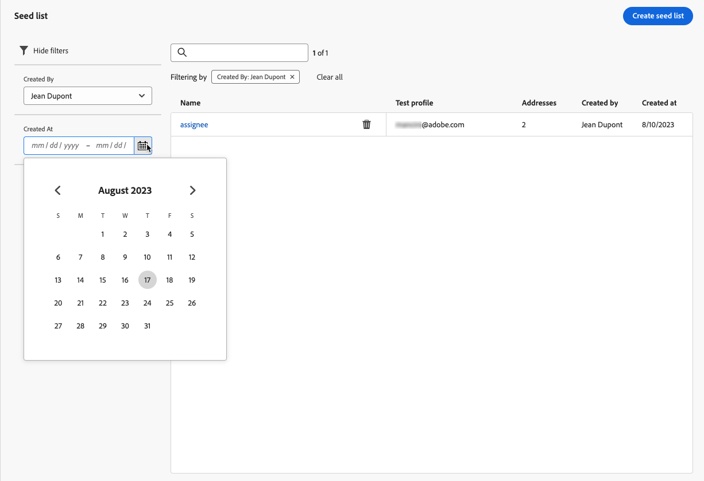
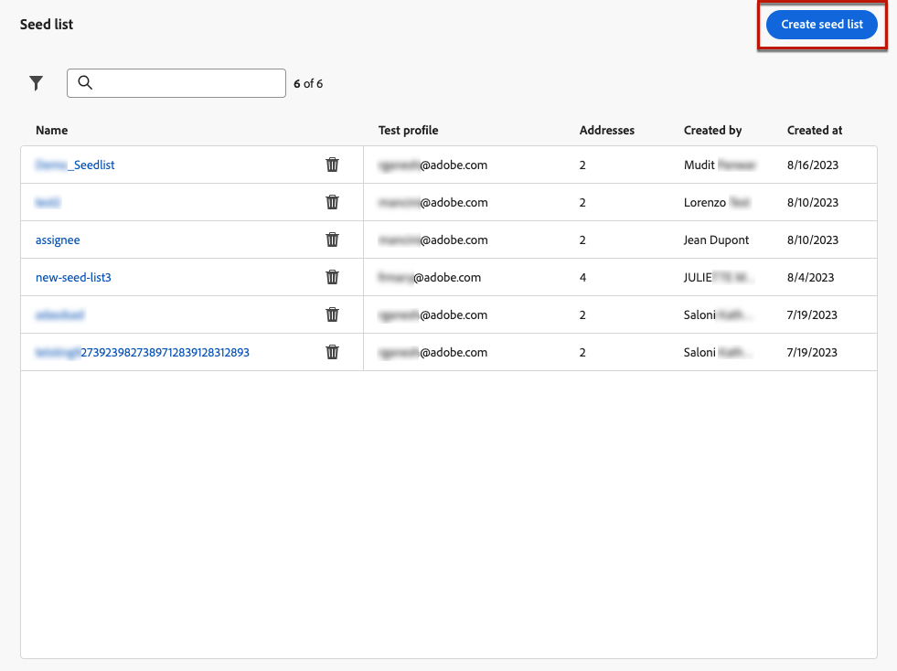
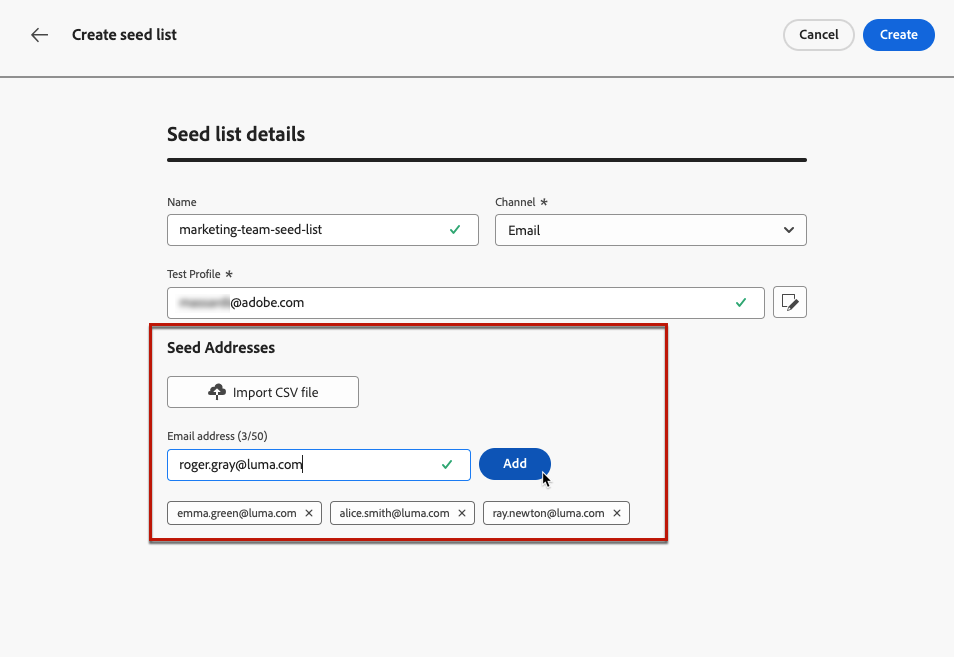
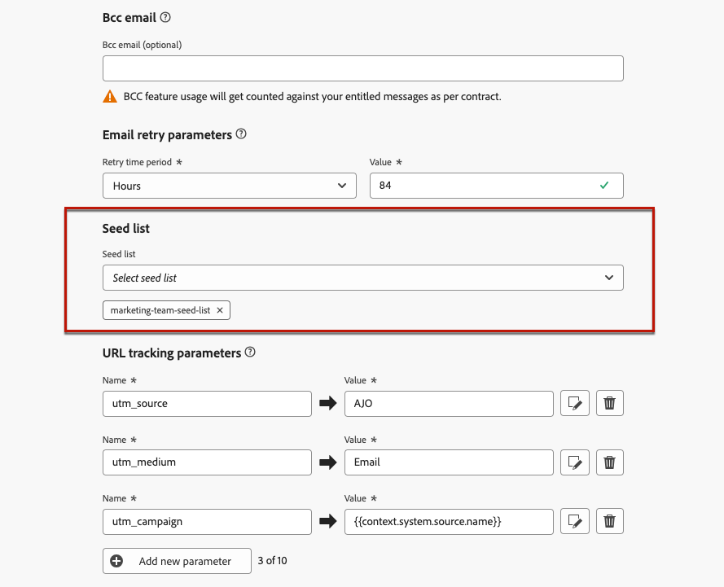
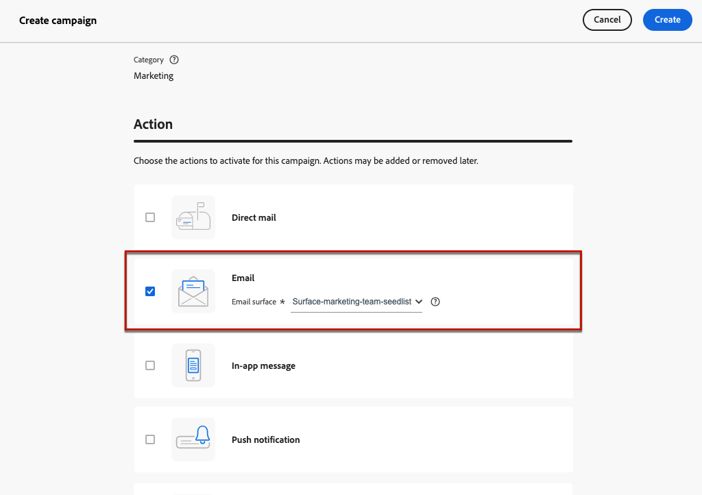

# Use seed lists {#seed-lists}

Seed lists in [!DNL Journey Optimizer] enable you to automatically include specific seed addresses in your deliveries.

>[!CAUTION]
>
>Currently this feature only applies to the email channel.
>
>Variants are currently not supported. Like each profile from the targeted audience, the seed addresses receive a single copy of each message, but not all variants of the same message (such as the different treatments of a [content experiment](../campaigns/get-started-experiment.md)).

Seed addresses are used to target recipients who do not match the defined target criteria. This way, recipients who are out of the delivery scope can receive the delivery, as any other target recipient would.

Seed addresses are not real profiles nor test profiles as they do not include any profile details. They are only recipients belonging to internal stakeholders stored in the system. When selected in a specific campaign or journey, they are included at the delivery execution time, meaning they will receive a copy of the delivery for assurance purposes.

* By receiving deliveries at the same time and in the same conditions as your customers, seed lists allow you to monitor the email copies sent out to ensure that all display formats, images and links are correct, as well as keeping track of the actual messages sent out to your recipients.

    For example:

    +++ If you are a marketing manager:

    You want all your team members to receive copies of sent messages at the same time as your customers. This way your team can ensure that messages are sent out with the expected layout, active URLs, correct text and images - all as planned before execution.

    +++

    +++ If you are a product owner:

    You need to keep track of actual messages sent out to customers. Indeed, your team and leadership may be interested in some campaigns and need to be added on an ad hoc basis for receiving copies of message at the delivery time.

    +++

* Another reason for using seed lists is your mailing list protection. Inserting seed addresses into your mailing list lets you be noticed if it is being used by a third party, as the seed addresses it contains will receive the deliveries sent to your mailing list.

## Access the seed lists {#access-seed-lists}

To access the seed lists already created, go to **[!UICONTROL Administration]** > **[!UICONTROL Channels]** > **[!UICONTROL Email configuration]**, and select **[!UICONTROL Seed list]**.

<!--
>[!CAUTION]
>
>Permissions to view, export and manage the seed lists are restricted to [Journey Administrators](../administration/ootb-product-profiles.md#journey-administrator). Learn more on managing [!DNL Journey Optimizer] users' access rights in [this section](../administration/permissions-overview.md).-->

>[!CAUTION]
>
>To be able to view, edit and manage seed lists, you must have the **[!UICONTROL Manage Seedlist]** permission.

You can search seed lists by name, and/or filter on the user who created the list or on the creation date. Once selected, you can clear the filter displayed on top of the list.

Use the **[!UICONTROL Delete]** button to permanently remove an entry.

>[!CAUTION]
>
>It is not possible to delete a seed list which is used in an active [campaign](../campaigns/review-activate-campaign.md) or [journey](../building-journeys/publishing-the-journey.md). You need to deactivate the campaign/journey, or edit it to use another surface that has not the seed list selected. [Learn more on using a seed list](#use-seed-list)

You can click a seed list name to edit it. <!--Use the **[!UICONTROL Edit]** button to edit a seed list.-->

## Create a seed list {#create-seed-list}

>[!CONTEXTUALHELP]
>id="ajo_seed_list_details"
>title="Define a seed list"
>abstract="Use a seed list to automatically add specific internal addresses to your delivery audience for assurance purposes. Seed lists allow you to monitor the message copies sent out to ensure that all display elements are correct and to protect your mailing list. Currently this feature only applies to the email channel."
>additional-url="https://experienceleague.adobe.com/docs/journey-optimizer/using/configuration/seed-lists.html#use-seed-list" text="What are seed lists?"

>[!CONTEXTUALHELP]
>id="ajo_seed_addresses"
>title="Fill in the seed list"
>abstract="Select the addresses that will be included at the delivery execution time and will receive an exact copy of your message. You can either import a CSV file or manually enter email addresses."

To create a seed list, follow the steps below.

1. Access the **[!UICONTROL Administration]** > **[!UICONTROL Channels]** > **[!UICONTROL Email configuration]** > **[!UICONTROL Seed list]** menu.

1. Select the **[!UICONTROL Create seed list]** button.

    

1. Fill in the details. Start by adding a name.

    

    >[!NOTE]
    >
    >Names must begin with a letter (A-Z) and include only alpha-numeric characters or special characters ( _, ., -).

1. Select the channel. Currently only the email channel is available.

1. Select a test profile. Because seed addresses do not include profile details, this test profile will be only used to display the personalization data in the message sent to the seed addresses.

    >[!NOTE]
    >
    >Only one test profile can be selected at a time.

1. Add the seed addresses you want to send your deliveries to. You can either import a CSV file or manually enter email addresses.

    

    >[!NOTE]
    >
    >You can combine both options, but the total number of addresses in a seed list cannot exceed 50.

1. Click **[!UICONTROL Create]** to confirm. The newly created seed list displays in the [Seed list screen](#access-seed-lists).

## Use a seed list in a campaign or journey {#use-seed-list}

Now that your seed list is created, you can use it in any campaign or journey to include the corresponding seed addresses in your deliveries. To do so, follow the steps below.

>[!CAUTION]
>
>Messages sent to seed addresses are not included in reports.

1. Create a surface and select the **[!UICONTROL Email]** channel. [Learn more](../email/email-settings.md)

1. Select the seed list of your choice in the [corresponding section](../email/email-settings.md#seed-list).

    >[!NOTE]
    >
    >Only one seed list can be selected at a time.

    

1. Submit the surface.

1. Create a [campaign](../campaigns/create-campaign.md) or a [journey](../building-journeys/journey-gs.md).

1. Select the **[!UICONTROL Email]** action and select the [surface](channel-surfaces.md) including the seed list that is relevant to you.

    

1. Activate your [campaign](../campaigns/review-activate-campaign.md) or publish your [journey](../building-journeys/publishing-the-journey.md).

Now each time an email message is sent out to your customers through that campaign or journey, the email addresses on the selected seed list will also receive it in the same conditions, at the same time and with the same content as the targeted recipients.

>[!NOTE]
>
>For journeys the email delivery is sent to the seed addresses only on the journey first execution.
