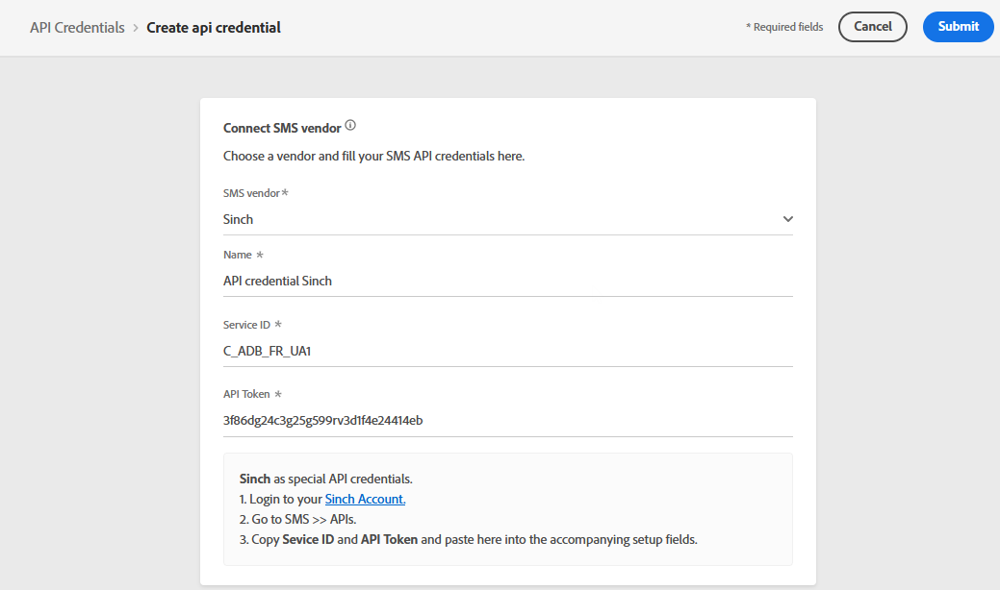

# Configure SMS channel {#sms-configuration}

>[!CAUTION]
>
> The use of the SMS channel is currently available in early access to select users only. If you want to leverage this feature, contact your Adobe account executive.

[!DNL Journey Optimizer] allows you to create your journeys and send messages to targeted audience. 

## Create new API credential {#create-api}

To configure your SMS vendor with Journey Optimizer, follow these steps:

1. Access the **[!UICONTROL Administration]** > **[!UICONTROL Channels]** > **[!UICONTROL API Credentials]** menu, then click **[!UICONTROL Create API credential]**.

    

1. Select your **[!UICONTROL SMS vendor]**.

1. Enter a **[!UICONTROL Name]** for your API Credential.

1. Enter your **[!UICONTROL Service ID]** and **[!UICONTROL API Token]**. 

    >[!NOTE]
    >
    > Sinch requires special API credentials. To find your **[!UICONTROL Service ID]** and **[!UICONTROL API Token]**, access SMS > APIs menu from your Sinch account, 

    

1. Click **[!UICONTROL Submit]** when you finished the configuration of your API credentials.

After creating and configuring your API credential, you now need to create a message preset for SMS messages.

## Create a message preset for SMS messages {#message-preset-sms}

Once your SMS channel has been configured, you need to create a message preset to be able to send SMS messages from **[!DNL Journey Optimizer]**.

Learn how to create and configure a message preset in [this section](message-presets.md).

You are now ready to send SMS messages with Journey Optimizer.

**Related topics**

* [Create an SMS message](../create-sms.md)
* [Add a message in a journey](building-journeys/journeys-message.md)