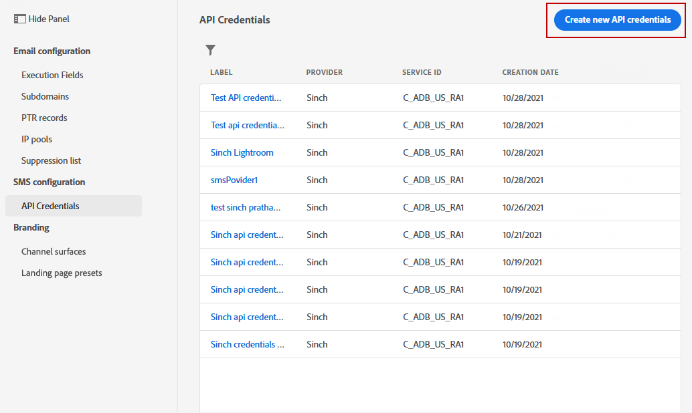
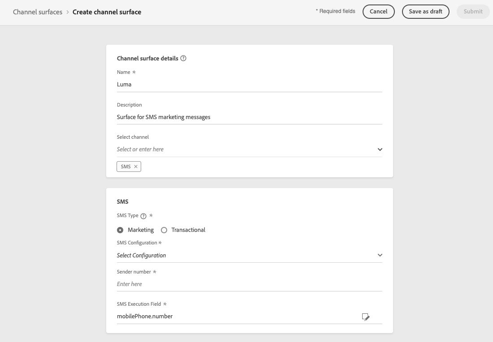
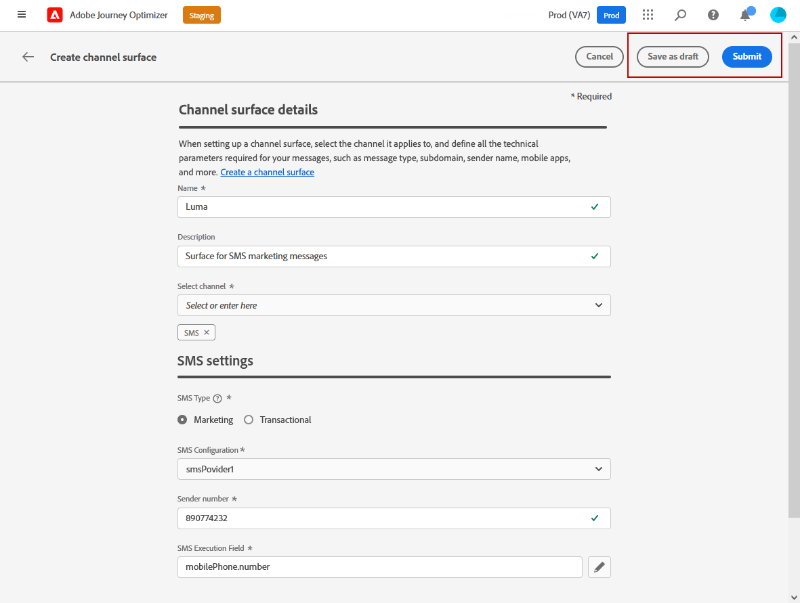

# Configure SMS channel {#sms-configuration}

[!DNL Journey Optimizer] allows you to create your journeys and send messages to targeted audience. 

>[!NOTE]
>
>SMS channel is currently only available for a set of organizations (Limited Availability). For more information, contact your Adobe representative.

## Create new API credential {#create-api}

To configure your SMS vendor with Journey Optimizer, follow these steps:

1. Access the **[!UICONTROL Administration]** > **[!UICONTROL Channels]** > **[!UICONTROL API Credentials]** menu, then click **[!UICONTROL Create API credential]**.

    

1. Select your **[!UICONTROL SMS vendor]**:

    * [!DNL Sinch]. To find your **[!UICONTROL Service ID]** and **[!UICONTROL API Token]**, access SMS > APIs menu from your Sinch account.
    * [!DNL Twilio]. To find your **[!UICONTROL Service ID]** and **[!UICONTROL API Token]**, access the Account Info pane of the Console Dashboard page.

1. Enter a **[!UICONTROL Name]** for your API Credential.

1. Enter your **[!UICONTROL Service ID]** and **[!UICONTROL API Token]**. 

    

1. Click **[!UICONTROL Submit]** when you finished the configuration of your API credentials.

After creating and configuring your API credential, you now need to create a message preset for SMS messages.

## Create a message preset for SMS messages {#message-preset-sms}

Once your SMS channel has been configured, you need to create a message preset to be able to send SMS messages from **[!DNL Journey Optimizer]**.

To create a message preset, follow these steps:

1. Access the **[!UICONTROL Channels]** > **[!UICONTROL Branding]** > **[!UICONTROL Message presets]** menu, then click **[!UICONTROL Create Message preset]**.

    

1. Enter a name and a description (optional) for the preset, then select the SMS channel.

    

    >[!NOTE]
    >
    > Names must begin with a letter (A-Z). It can only contain alpha-numeric characters. You can also use underscore `_`, dot`.` and hyphen `-` characters.

1. Configure the **SMS** settings.

     

    * Select the **[!UICONTROL SMS Type]** that will be sent with the preset: **[!UICONTROL Transactional]** or **[!UICONTROL Marketing]**.
    
    * Select the **[!UICONTROL SMS configuration]** to associate with the preset.
        
      For more on how to configure your environment to send SMS messages, refer to [this section](sms-configuration.md).

    * Enter the **[!UICONTROL Sender number]** ​you want to use for your communications.

    * Select your **[!UICONTROL SMS Execution Field]** to select the **[!UICONTROL Profile attribute]** associated with the profiles' phone numbers.

1. Once all the parameters have been configured, click **[!UICONTROL Submit]** to confirm. You can also save the message preset as draft and resume its configuration later on.

    

1. Once the message preset has been created, it displays in the list with the **[!UICONTROL Processing]** status.

    >[!NOTE]
    >
    >If the checks are not successful, learn more on the possible failure reasons in [this section](#monitor-message-presets).  

1. Once the checks are successful, the message preset gets the **[!UICONTROL Active]** status. It is ready to be used to deliver messages.

    

You are now ready to send SMS messages with Journey Optimizer.

**Related topics**

* [Create an SMS message](../messages/create-sms.md)
* [Add a message in a journey](../building-journeys/journeys-message.md)
