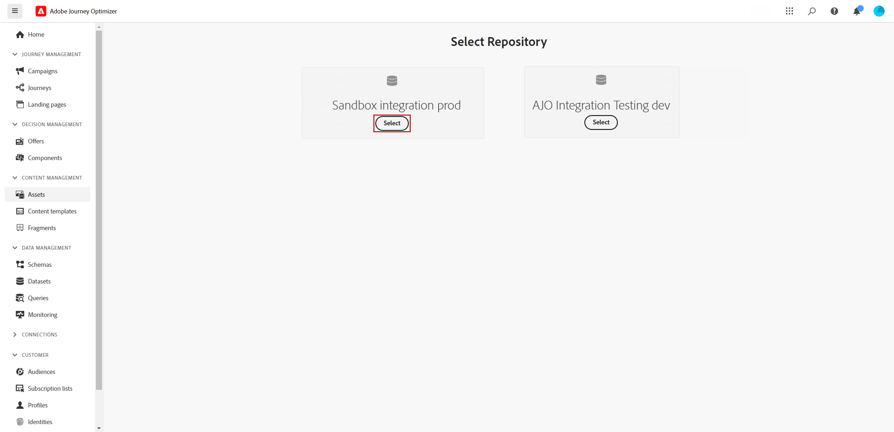
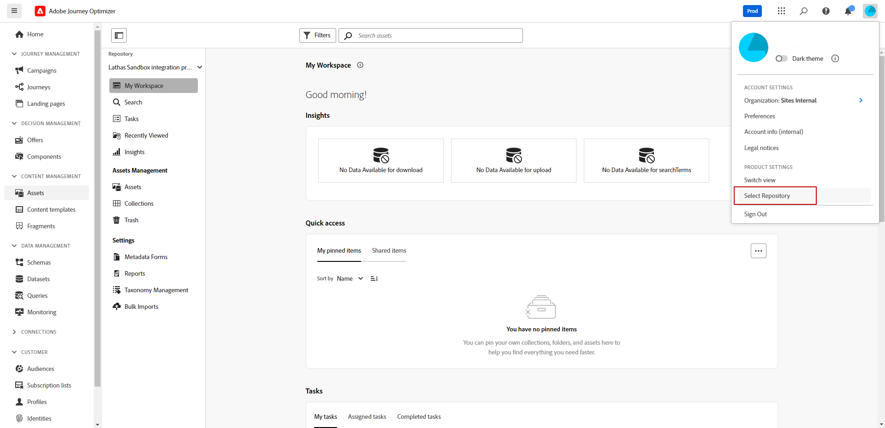
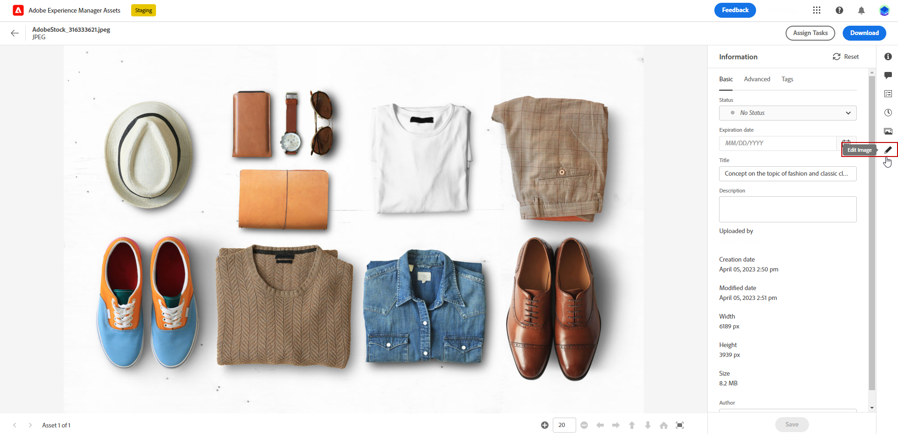
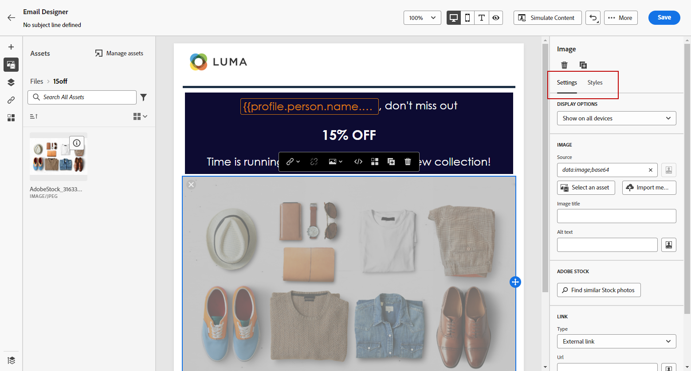

# Create and manage assets with [!DNL Experience Manager Assets]{#experience-manager-assets}

## Get started with [!DNL Experience Manager Assets] {#get-started-assets}

Bring marketing and creative workflows together using **[!DNL Adobe Experience Manager Assets]**. Natively integrated with **[!DNL Adobe Journey Optimizer]**, access **[!DNL Assets Essentials]** or **[!DNL Assets as a Cloud Service]** to store, manage, discover and distribute digital assets. It provides a single, centralized repository of assets that you can use to populate your messages.

**[!DNL Adobe Experience Manager Assets]** offers two collaborative and centralized asset workspaces that extend your creative system and unify digital assets for experience delivery: 

* **[!DNL Assets as a Cloud Service]**: Adobe Experience Manager Assets as a Cloud Service offers an easy-to-use cloud solution for efficient Digital Asset Management and Dynamic Media operations. It seamlessly incorporates advanced features, including Artificial Intelligence and Machine Learning.

    Learn more in [Adobe Experience Manager as a Cloud Service documentation](https://experienceleague.adobe.com/docs/experience-manager-cloud-service/content/assets/overview.html).

* **[!DNL Assets Essentials]**: Experience Manager Assets Essentials is Assets as a Cloud Service lightweight solution for unified asset management and collaboration. With a modern, simplified interface, it empowers creative and marketing teams to effortlessly store, discover, and distribute digital assets.

    Learn more in [Adobe Experience Manager Assets Essentials documentation](https://experienceleague.adobe.com/docs/experience-manager-assets-essentials/help/introduction.html){target="_blank"}.

Depending on your contract, **[!DNL Adobe Experience Manager Assets Essentials]** or **[!DNL Adobe Experience Manager Assets as a Cloud Service]** can be accessed directly from **[!DNL Adobe Journey Optimizer]** through the left menu **[!UICONTROL Assets]** section. You can also access assets and folders when [designing an email content](../email/get-started-email-design.md).

## Prerequisites{#assets-prerequisites}

>[!BEGINTABS]

>[!TAB Adobe Experience Manager Assets Essentials]

Before using [!DNL Adobe Experience Manager Assets Essentials], you must add users to the **Assets Essentials Consumer Users** or/and **Assets Essentials Users** Product profiles. Read more in [Assets Essentials documentation](https://experienceleague.adobe.com/docs/experience-manager-assets-essentials/help/get-started-admins/deploy-administer.html#add-user-groups){target="_blank"}.

>[!NOTE]
>For Journey Optimizer products obtained before January 6, 2022, you must deploy **[!DNL Adobe Experience Manager Assets Essentials]** for your organization. Learn more in the [Deploy Assets Essentials](https://experienceleague.adobe.com/docs/experience-manager-assets-essentials/help/deploy-administer.html){target="_blank"} section.

>[!TAB Adobe Experience Manager Assets as a Cloud Service]

Before using **[!DNL Adobe Experience Manager Assets as a Cloud Service]**, you must add users to Assets Cloud Services. Read more in [Adobe Experience Manager Assets as a Cloud Service](https://experienceleague.adobe.com/docs/experience-manager-cloud-service/content/security/ims-support.html).

>[!ENDTABS]

## Upload and insert assets{#add-asset}

To import files to **[!DNL Assets Essentials]** or **[!DNL Assets as a Cloud Service]**, you first need to browse or create the folder it will be stored into. You will then be able to insert them to your email content.

1. From [!DNL Adobe Journey Optimizer] home page, select the **[!UICONTROL Assets]** tab under the **[!UICONTROL Content management]** menu to access **[!DNL Assets Essentials]** or **[!DNL Assets as a Cloud Service]**.

    

1. Choose the repository for your Assets in Journey Optimizer. You can opt for either an **[!DNL Assets Essentials]** or **[!DNL Assets as a Cloud Service]** repository, provided you own this solution.

    

    +++ Learn how to switch Assets repository.

    To change your Assets repository, select the Account icon in the upper right and click **[!UICONTROL Select Repository]**. 

    

    +++

1. Double-click a folder from the central section or from the tree view to open it.

    You can also click **[!UICONTROL Create folder]** to create a new folder.

    

1. Once in the selected or created folder, click **[!UICONTROL Add Assets]** to upload new asset to your folder.

    

1. From the **[!UICONTROL Upload files]**, click **[!UICONTROL Browse]** and choose if you want to **[!UICONTROL Browse files]** or **[!UICONTROL Browse folders]**.

1. Select the file you want to upload. When done, click **[!UICONTROL Upload]**. To learn more on how to manage your assets, refer to this [page](https://experienceleague.adobe.com/docs/experience-manager-assets-essentials/help/manage-organize.html).

1. To further edit your assets with Adobe Photoshop Express, double-click the assets. Then, from the right-hand menu, select the **[!UICONTROL Edit mode]** icon. [Learn more](https://experienceleague.adobe.com/docs/experience-manager-assets-essentials/help/edit-images.html){target="_blank"}.

    

1. From [!DNL Adobe Journey Optimizer], select the **[!UICONTROL Asset picker]** menu from the left pane of the email designer.

    

1. Select your previously created **[!UICONTROL Assets]** folder. You can also search for your asset or your folder in the search bar.

1. Drag and drop your asset in your email content.

    

1. You can further customize your assets such as adding an external link or a text using the **[!UICONTROL Settings]** and **[!UICONTROL Styles]** tabs. [Learn more about components settings](../email/content-components.md)

    

    <!--
    After adding your asset to your email, use the **[!UICONTROL Find similar Stock photos]** option to locate Stock photos that match the content, color, and composition of your image. [Learn more about Adobe Stock](stock.md).

    Note that this option is available for licensed/unlicensed Stock images and images from your Assets folder. 

    
    -->

## [!DNL Adobe Experience Manager Assets] FAQ {#faq-assets}

+++ Can I continue using the Assets Essentials bundled repository within Journey Optimizer?

If you are provisioned on **[!DNL Adobe Experience Manager Assets as a Cloud Service]**, you have access to both **[!DNL Adobe Experience Manager Assets Essentials]** and **[!DNL Adobe Experience Manager Assets as a Cloud Service]** repositories if user has the right permissions. These repositories are separate and not in sync. A user in Journey Optimizer will be able to see both of those repositories, including other environments that they are entitled to such as Stage, Dev, etc., and should be able to seamlessly switch between them with the repository selector.

+++

+++ How are assets managed? Are changes in Assets as a Cloud Service reflected in Journey Optimizer?

**[!DNL Adobe Experience Manager Assets as a Cloud Service]** integrates with Journey Optimizer similarly to **[!DNL Adobe Experience Manager Assets Essentials]**. When modifications are made to assets, a binary copy is generated. Note that updates in **[!DNL Assets as a Cloud Service]** do not automatically propagate to live email campaigns. Any changes must be manually re-selected in the email designer to ensure synchronization between the assets and the ongoing email campaigns.

+++

+++ Can I use Dynamic Media URLs while authoring emails in Journey Optimizer?

Yes, you can use Dynamic Media URLs within Journey Optimizer email authoring. Simply paste the URLs, instead of selecting from the Asset Selector.

+++

+++ Can Journey Optimizer user make changes to the Adobe Experience Manager Assets as a Cloud Service repository from Journey Optimizer interface?

As long as the Journey Optimizer user is an entitled **[!DNL Adobe Experience Manager Assets as a Cloud Service]** standard user and has the Edit permission on the repository, the user is able to make edits to the **[!DNL Adobe Experience Manager Assets as a Cloud Service]** repository.

+++
