# Work with fragments {#fragments}

A fragment is a reusable component that can be referenced in one or more emails across [!DNL Journey Optimizer] campaigns and journeys.

This functionality allows to prebuild multiple custom content blocks that can be used by marketing users to quickly assemble email contents in an improved design process.

➡️ [Learn how to manage, author and use fragments in these videos](#video-fragments)

>[!CAUTION]
>
>To create, edit and archive fragments, you must have the **[!DNL Manage Library Items]** permission included in the **[!DNL Content Library Manager]** product profile. [Learn more](../administration/ootb-product-profiles.md#content-library-manager)

To make the best use of fragments:

* Create your own fragments. You can create visual fragments or expression fragments. [Learn more](#create-fragments)
* Use them as many times as needed in your content. See [Add visual fragments](../email/use-visual-fragments.md) and [Leverage expression fragments](../personalization/use-expression-fragments.md)

>[!NOTE]
>
>Currently in [!DNL Journey Optimizer]:
>
>* Visual fragments are only available for the Email channel.
>
>* Expression fragments are not available for the Web and In-app channels.

## Access and manage fragments {#access-manage-fragments}

To access the fragment list, select **[!UICONTROL Content Management]** > **[!UICONTROL Fragments]** from the left menu.

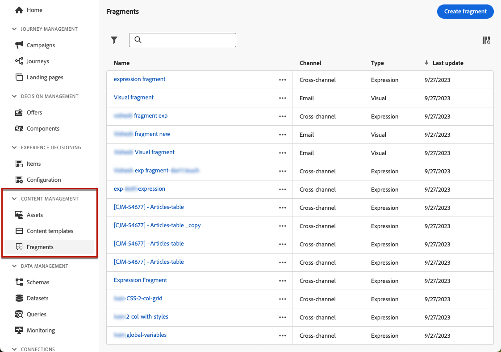

All the fragments that were created on the current sandbox - either [from the **[!UICONTROL Fragments]** menu](#create-fragments), either using the [Save as fragment](#save-as-fragment) option - are displayed.

You can filter fragments on their:

* Type: **[!UICONTROL Visual]** or **[!UICONTROL Expression]**
* Tags
* Creation or modification date

You can choose to show all fragments, or only the items that the current user created or modified.

You can also display the **[!UICONTROL Archived]** fragments. [Learn more](#archive-fragments)

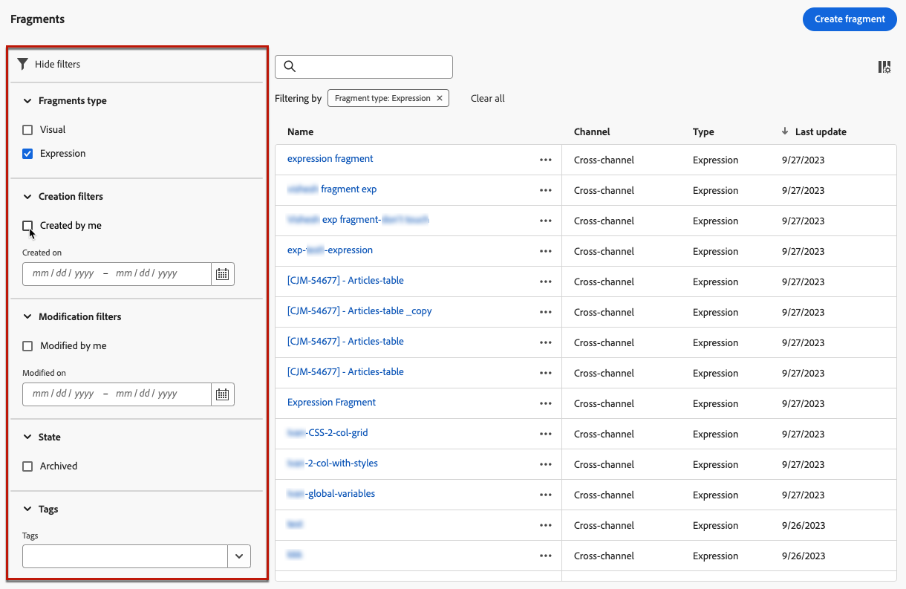

From the **[!UICONTROL More actions]** button next to each fragment, you can:

* Duplicate a fragment.

* Use the **[!UICONTROL Explore references]** option to see the journeys, campaigns or templates where it is used. [Learn more](#explore-references)

* Copy a fragment to another sandbox. <!--Learn more?-->

* Archive a fragment. [Learn more](#archive-fragments)

* Edit a fragment's [tags](../start/search-filter-categorize.md#tags).

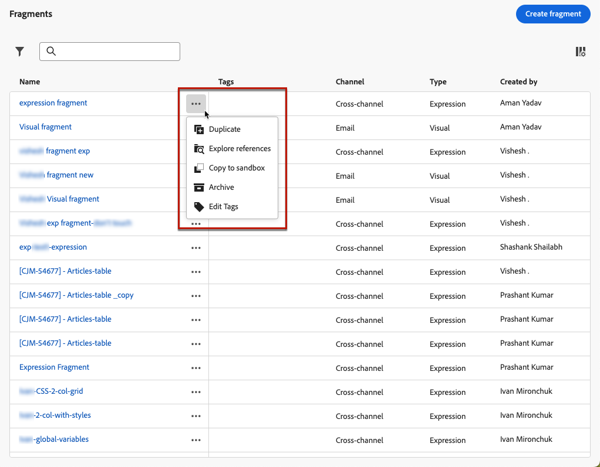

### Edit fragments {#edit-fragments}

To edit a fragment, follow the steps below.

1. Click the desired item from the **[!UICONTROL Fragments]** list.
1. From the fragment properties, you can [explore references](#explore-references), [manage its access](../administration/object-based-access.md), and update the fragment details including [tags](../start/search-filter-categorize.md#tags).

    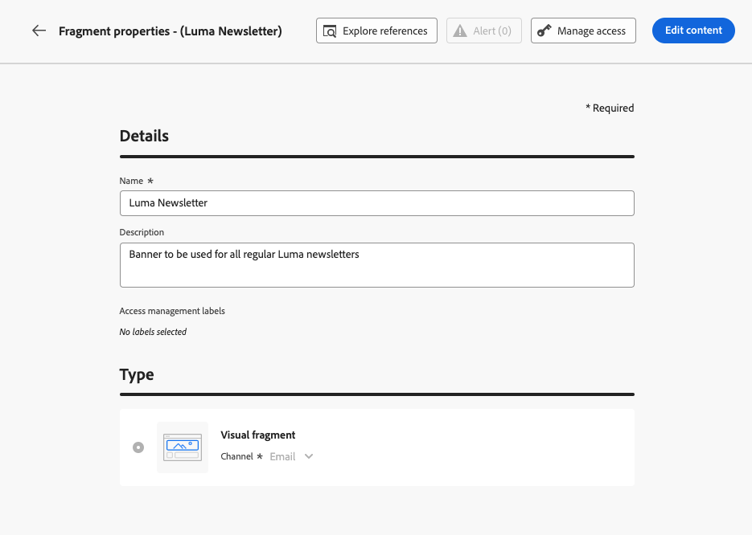

1. Select the corresponding button to edit content as you would do when creating a fragment from scratch. [Learn more](#create-from-scratch)

>[!NOTE]
>
>When you edit a fragment, the changes are automatically propagated to all contents using that fragment, except content used in **[!UICONTROL Live]** journeys or campaigns. You can also break inheritance from the original fragment. Learn more in the [Add visual fragments to your emails](../email/use-visual-fragments.md#break-inheritance) and [Leverage expression fragments](../personalization/use-expression-fragments.md#break-inheritance) sections.

### Explore references {#explore-references}

You can display the list of the journeys, campaigns and content templates that are currently using a fragment. 

To do so, select **[!UICONTROL Explore references]** either from the **[!UICONTROL More actions]** menu in the fragment list or from the fragment properties screen.

Select a tab to toggle between journeys, campaigns, templates and fragments. You can see their status and click a name to be redirected to the corresponding item where the fragment is referenced.

>[!NOTE]
>
>If the fragment is used in a journey, campaign or template that has a label preventing you from accessing it, you will see an alert message on top of the selected tab. [Learn more on Object Level Access Control (OLAC)](../administration/object-based-access.md)

### Archive fragments {#archive-fragments}

You can clean the fragment list from the items that are no longer relevant to your brand.

To do so, click the **[!UICONTROL More actions]** button next to the desired fragment and select **[!UICONTROL Archive]**. It will disappear from the fragment list, which prevents users from using it in future emails or templates.

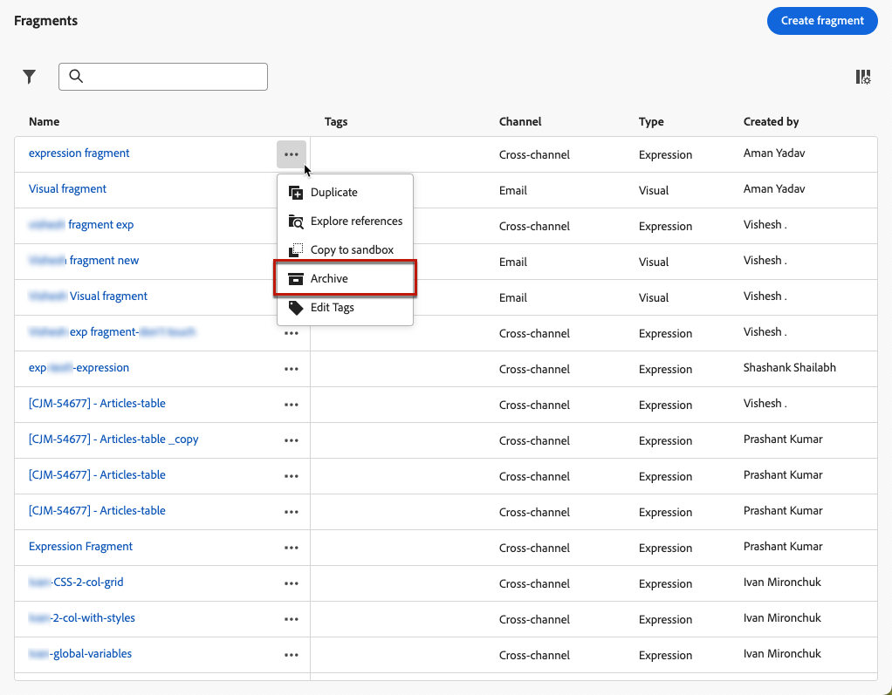

>[!NOTE]
>
>If you archive a fragment that is used in a content, <!--it will remain in the email or template, but you won't be able to select it from the fragment list to edit it-->that content will not be affected.

To unarchive a fragment, filter on the **[!UICONTROL Archived]** items and select **[!UICONTROL Unarchive]** from the **[!UICONTROL More actions]** menu. It is now again accessible from the fragment list, and can be used in any email or template.

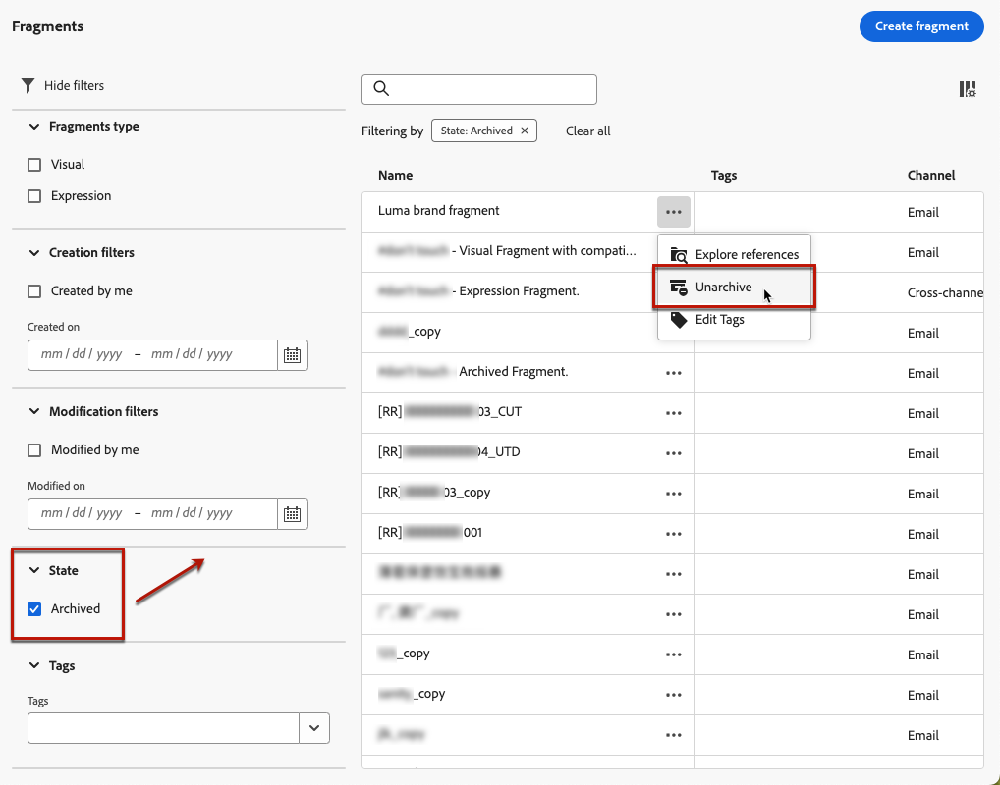

## Create fragments {#create-fragments}

There are two ways you can create fragments:

* Create a fragment from scratch, using the **[!UICONTROL Fragments]** dedicated menu. [Learn how](#create-from-scratch)

* When designing content, save a portion of your content as fragment. [Learn how](#save-as-fragment)

Once saved, your fragment is available for use in a journey, a campaign or a template. Whether created from scratch or from an existing content, you can now use this fragment when building any content within [!DNL Journey Optimizer]. See [Add visual fragments](../email/use-visual-fragments.md) and [Leverage expression fragments](../personalization/use-expression-fragments.md)

### Create from scratch {#create-from-scratch}

>[!CONTEXTUALHELP]
>id="ajo_create_fragment"
>title="Define your own fragment"
>abstract="Create a standalone fragment from scratch to make your content reusable across multiple journeys and campaigns."

To create a fragment from scratch, follow the steps below.

1. Access the fragment list through the **[!UICONTROL Content Management]** > **[!UICONTROL Fragments]** left menu.

1. Select **[!UICONTROL Create fragment]**.

1. Fill in the fragment details, i.e. name and description (if needed).

    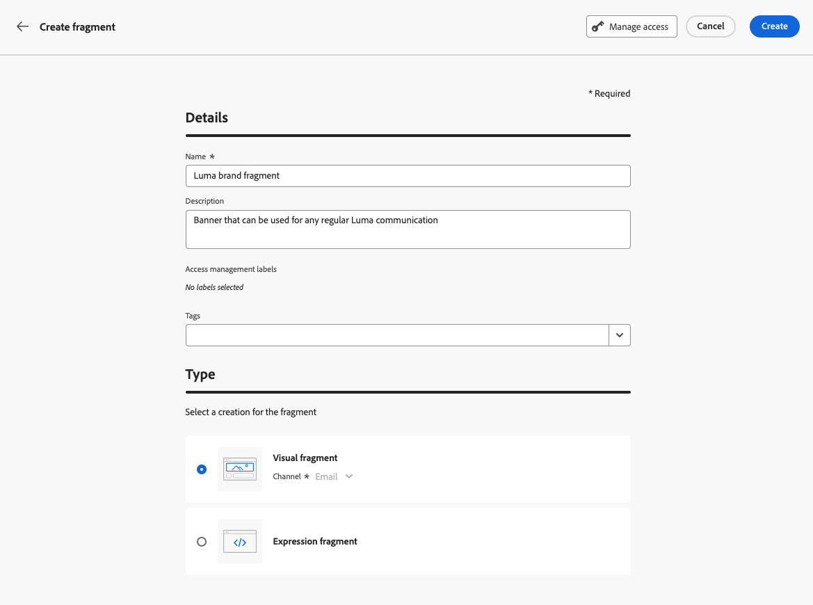

1. Select the fragment type: [!UICONTROL Visual fragment](#create-visual-fragment) or [!UICONTROL Expression fragment](#create-expression-fragment).

1. To assign custom or core data usage labels to the fragment, select **[!UICONTROL Manage access]**. [Learn more on Object Level Access Control (OLAC)](../administration/object-based-access.md).

1. Select or create Adobe Experience Platform tags from the **[!UICONTROL Tags]** field to categorize your fragment for improved search. [Learn more](../start/search-filter-categorize.md#tags)

1. Click **[!UICONTROL Create]**.

### Create a visual fragment {#create-visual-fragment}

1. [Create a fragment](#create-from-scratch) from the **[!UICONTROL Content Management]** > **[!UICONTROL Fragments]** left menu and select the **[!UICONTROL Visual fragment]** type.

    >[!NOTE]
    >
    >Currently for visual fragments only the **Email** channel is supported.

1. The [Email Designer](../email/get-started-email-design.md) displays. Edit your content as needed, the same way you would do for any email inside a journey or a campaign.

    >[!NOTE]
    >
    >You can add personalization fields and dynamic content, but contextual attributes are not supported in fragments.

    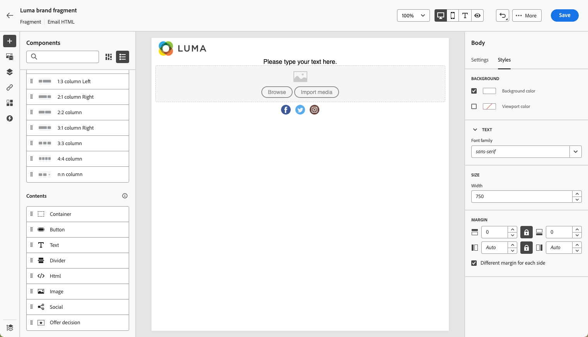

1. Once your fragment is ready, click **[!UICONTROL Save]**. It is added to the [fragment list](#access-manage-fragments).

1. If needed, click the arrow next to the fragment name to go back to the **[!UICONTROL Details]** screen and edit it.

    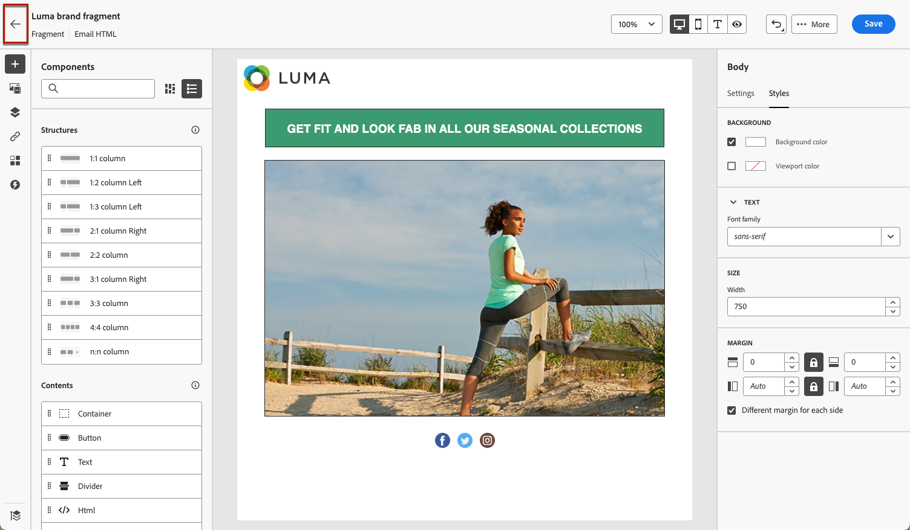

This fragment is now ready to be used when building any [email](../email/get-started-email-design.md) or [content template](content-templates.md) within [!DNL Journey Optimizer]. [Learn how](../email/use-visual-fragments.md)

### Create an expression fragment {#create-expression-fragment}

1. [Create a fragment](#create-from-scratch) from the **[!UICONTROL Content Management]** > **[!UICONTROL Fragments]** left menu and select the **[!UICONTROL Expression fragment]** type.

1. Select the type of code you want to use: **[!UICONTROL HTML]**, **[!UICONTROL JSON]** or **[!UICONTROL Text]**.

    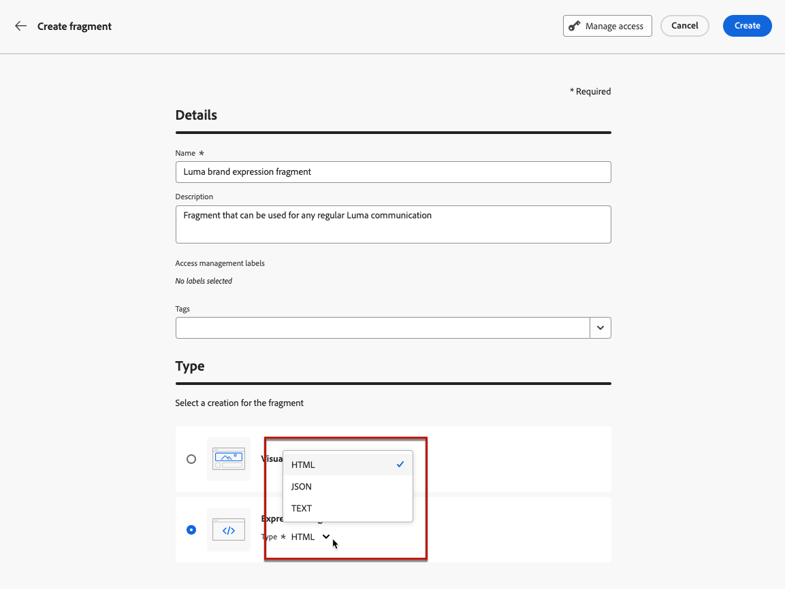

    <!--Expression fragments can be used in any channel.-->

1. Click **[!UICONTROL Create]**. The Expression editor opens.

1. You can leverage the [!DNL Journey Optimizer] Expression editor with all its personalization and authoring capabilities. [Learn more](../personalization/personalization-build-expressions.md)

    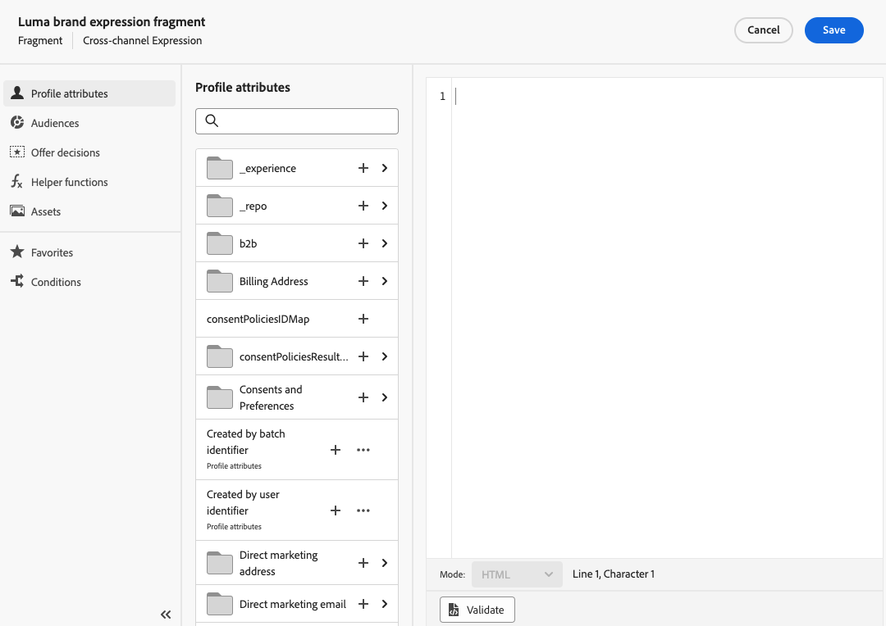

1. Once your fragment is ready, click **[!UICONTROL Save]**. It is added to the [fragment list](#access-manage-fragments).

1. If needed, click the arrow next to the fragment name to go back to the **[!UICONTROL Details]** screen and edit it.

This fragment is now ready to be used when building any content within the [!DNL Journey Optimizer] Expression editor. [Learn how](../personalization/use-expression-fragments.md)

## Save as fragment {#save-as-fragment}

When editing content in [!DNL Journey Optimizer], you can save all or part of your content as fragment for future reuse.

### Save as visual fragment {#save-as-visual-fragment}

When designing a [content template](content-templates.md) or an [email](../email/get-started-email-design.md) in a campaign or a journey, you can save a portion of your content as visual fragment. To do this, follow the steps below.

1. In the [Email Designer](../email/get-started-email-design.md), click the ellipsis on top right of the screen.

1. Select **[!UICONTROL Save as fragment]** from the drop-down menu.

    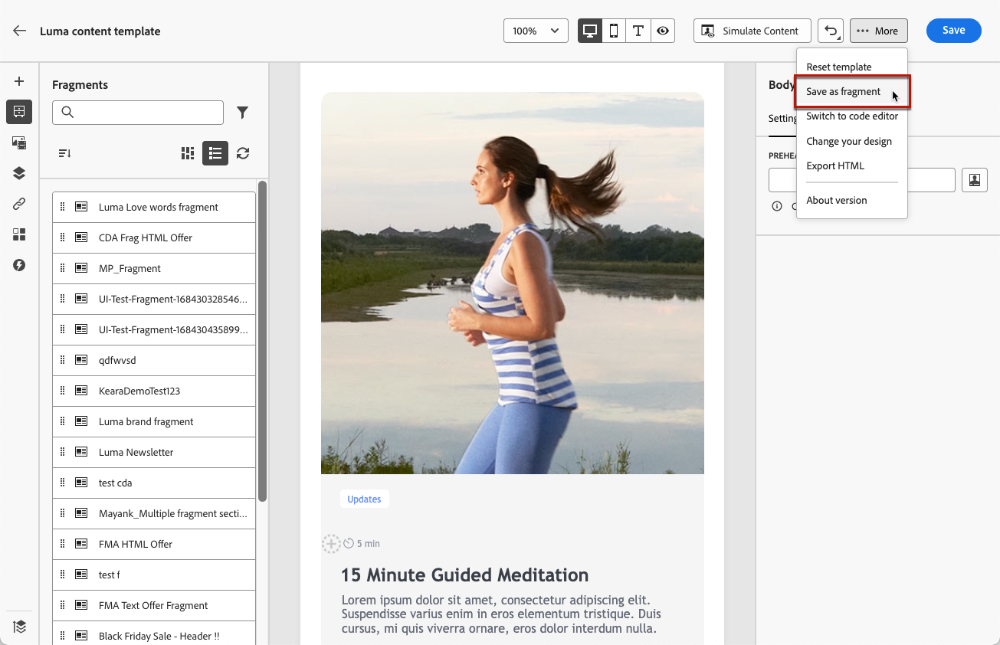

1. The **[!UICONTROL Save as fragment]** screen displays. There select the elements you want to include into your fragment, including personalization fields and dynamic content. Note that contextual attributes are not supported in fragments.

    >[!CAUTION]
    >
    >You can only select sections that are adjacent to each other. You cannot select an empty structure or another fragment.

    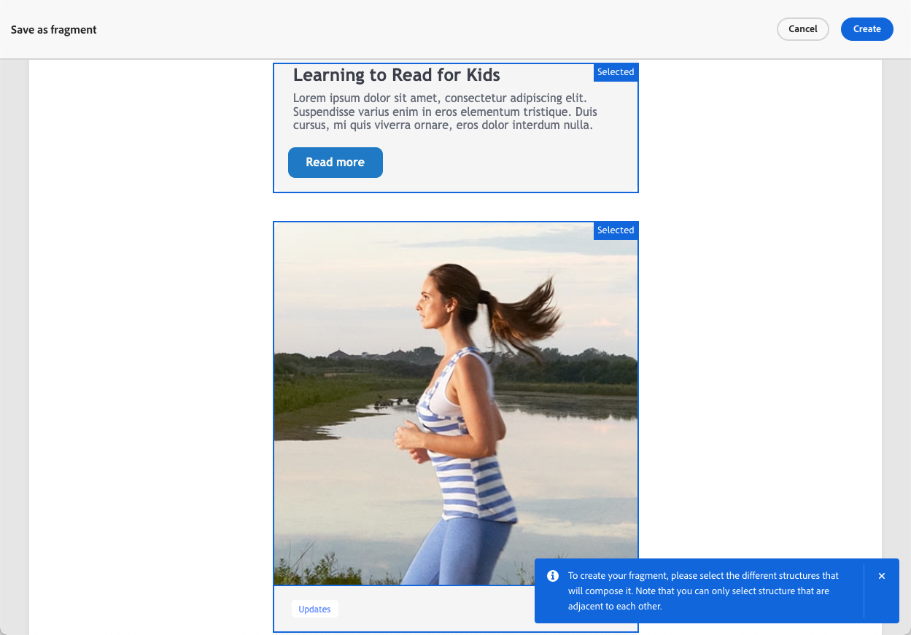

1. Click **[!UICONTROL Create]**. Fill in the fragment details, i.e. name and description (if needed).

1. To assign custom or core data usage labels to the fragment, select **[!UICONTROL Manage access]**. [Learn more on Object Level Access Control (OLAC)](../administration/object-based-access.md).

1. Select or create Adobe Experience Platform tags from the **Tags** field to categorize your template for improved search. [Learn more](../start/search-filter-categorize.md#tags)

1. Click **[!UICONTROL Create]** again. The fragment is saved into added to the [fragment list](#access-manage-fragments), accessible from the [!DNL Journey Optimizer] dedicated menu.

    It becomes a standalone fragment that can be [accessed](#access-manage-fragments), [edited](#edit-fragments) and [archived](#archive-fragments) as any other item on that list.

You can now use this fragment when building any [email](../email/get-started-email-design.md) or [content template](content-templates.md) within [!DNL Journey Optimizer]. [Learn how](../email/use-visual-fragments.md)

>[!NOTE]
>
>Any change to that new fragment is not propagated to the email or template it comes from. Similarly, when the original content is edited within that email or template, the new fragment is not modified.

### Save as expression fragment {#save-as-expression-fragment}

>[!CONTEXTUALHELP]
>id="ajo_perso_library"
>title="Save as expression fragment"
>abstract="The [!DNL Journey Optimizer] Expression editor allows you to save content as expression fragments. These expressions are then available to build personalized content."

The [!DNL Journey Optimizer] Expression editor allows you to save content as expression fragments. These expressions are then available to build personalized content.

To save content as an expression fragment, follow the steps below.

1. In the [Expression editor](../personalization/personalization-build-expressions.md) interface, build an expression, then click **[!UICONTROL Save as fragment]**. 

1. In the right pane, enter a name and a description for the expression to help users find it more easily.

    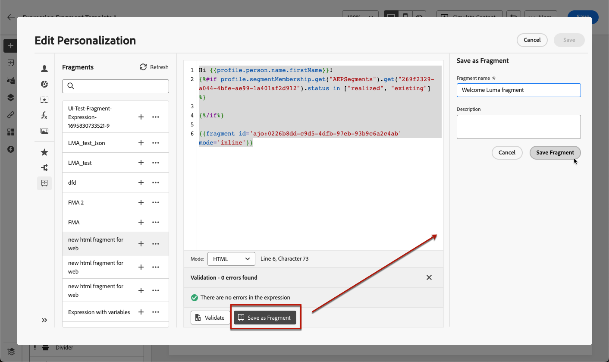

1. Click **[!UICONTROL Save fragment]**.

    <!--An expression fragment cannot be nested inside another fragment.-->

1. The expression fragment is added to the [fragment list](#access-manage-fragments). You can now use it to build personalized content.

>[!NOTE]
>
>Expressions cannot exceed 200KB.

## How-to video {#video-fragments}

Learn how to manage, author, and use visual fragments in [!DNL Journey Optimizer].

>[!VIDEO](https://video.tv.adobe.com/v/3419932/?quality=12)

Learn how to manage, author, and use expression fragments in [!DNL Journey Optimizer].

>[!VIDEO](https://video.tv.adobe.com/v/3424587/?quality=12)
