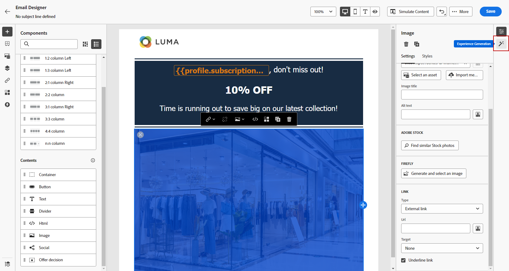

# Image generation with the Content assistant {#image-content-assistant}

Once you have created and personalized your Emails or Web pages, take your content to the next level with the Content assistant. This powerful tool allows you to personalize and enhance your content effortlessly. 

In this example, we will focus on using the Content assistant to update and improve your assets for a better user experience.

1. After creating and configuring your delivery, click **[!UICONTROL Create content]** and personalize your deliveries as needed.

1. Select the asset you want to change with the Content assistant.

1. From the right-hand menu, select **[!UICONTROL Experience generation]**.

    

1. Add a prompt to better fine-tune your results and click **[!UICONTROL Generate]**.

    Enable the **[!UICONTROL Enhance with current content]** option for the Content assistant to personalize new assets based on your delivery, campaign's name, and selected audience.

1. Browse the **[!UICONTROL Variation suggestions]** to find the desired Asset.

1. Once you choose your **[!UICONTROL Variant]**, access the advanced menu of your selected Asset. 

1. You can choose **[!UICONTROL Make similar]** to generate more variant based on the selected variant.

1. Click **[!UICONTROL Edit image]**.

1. Click **[!UICONTROL Insert]** to add the generated asset to your content.

1. After defining your message content, click the **[!UICONTROL Simulate content]** button to control the rendering of your delivery, and check personalization settings with test profiles. [Learn more](../email/preview.md)

1. When your delivery is ready, from your Campaign summary page, you can click **[!UICONTROL Review to activate]** to display a summary of the campaign. Alerts display if any parameter is incorrect or missing.

1. Before launching your campaign, double-check that all configurations are correct, and then click on **[!UICONTROL Activate]**.

After successfully configuring your experimentation and campaign, you can keep track of your delivery's progress using the Campaign report. [Learn more](../reports/campaign-global-report.md#experimentation-report)