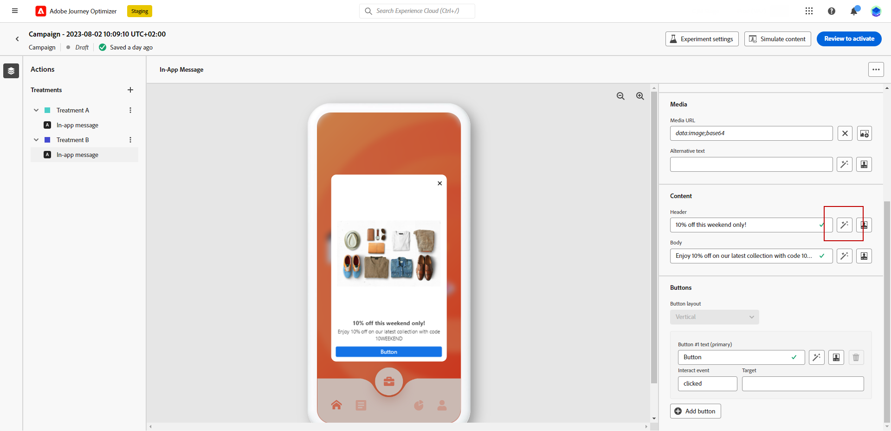
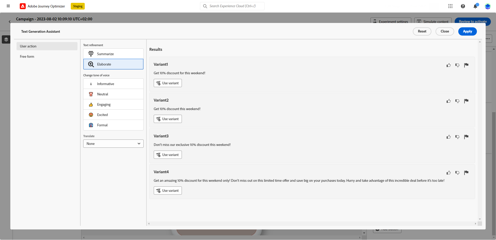
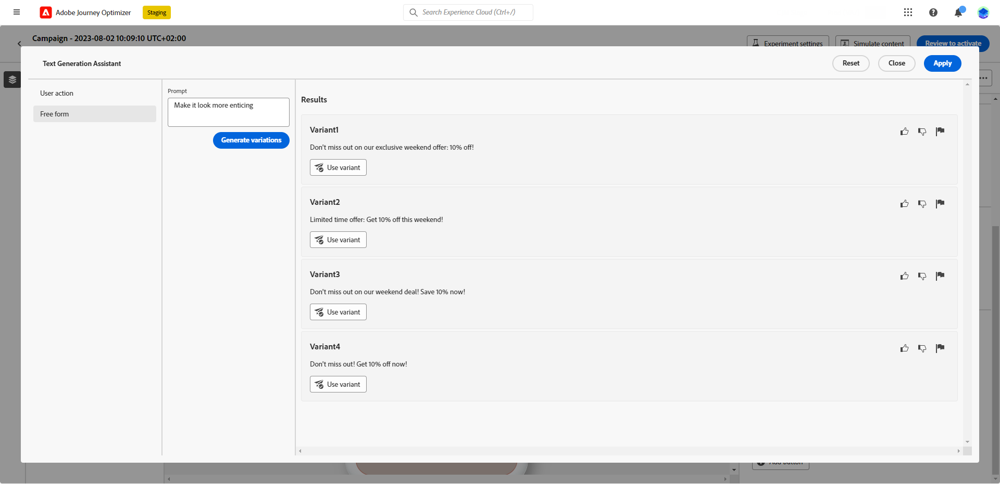
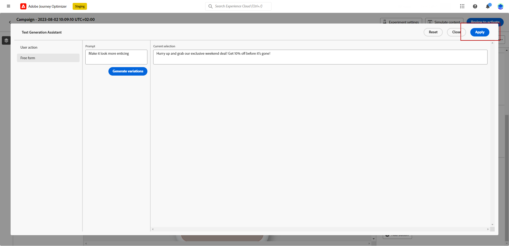

# Title generation with the Content assistant {#title-content-assistant}

>[!BEGINSHADEBOX]

* [Get started with the Content assistant](gs-generative.md)
* **[Generate text with the Content assistant](generative-title.md)**
* [Generate images with the Content assistant](generative-image.md)

>[!ENDSHADEBOX]

Once you have created and personalized your messages, take your content to the next level with the Content assistant. 

By leveraging the Content assistant, you have the opportunity to optimize your message's impact by experimenting with different main titles. Each variant is considered as a unique Treatment, to measure and compare which title effectively generates more clicks.

In this particular example, learn how to send an engaging Push notification using Content Experiment. Follow these steps:

1. Create your message and add Content experimentation. Learn more about Content Experimentation in [this section](../campaigns/content-experiment.md)

1. After configuring your campaign and experiment, click **[!UICONTROL Create content]** and personalize your message content as needed.

1. For your second **[!UICONTROL Treatment]**, use the Generation assistant to change the Title.

    Next to your **[!UICONTROL Header]** field, click **[!UICONTROL Edit with Text generation assistant]**.

    

1. From the **[!UICONTROL User action]** menu, select the **[!UICONTROL Text refinement]**:

    * **[!UICONTROL Summarize]**: Use this option to shorten a text and keep the essential.
    
    * **[!UICONTROL Elaborate]**: Use this option to expand your content with additional creative variants from the Content assistant.

    

1. Choose the tone of your variants with the **[!UICONTROL Change tone of voice]** menu. 

1. From the **[!UICONTROL Free form]** menu, you can also choose to provide a prompt to better fine-tune your results.

    

1. Once you found the appropriate variant, click **[!UICONTROL User variant]** then **[!UICONTROL Apply]**.

    

1. After defining your message content, click the **[!UICONTROL Simulate content]** button to control the rendering, and check personalization settings with test profiles. [Learn more](../email/preview.md)

1. When your content experiment is ready, from your campaign summary page, you can click **[!UICONTROL Review to activate]** to display a summary of the campaign. Alerts display if any parameter is incorrect or missing.

1. Before launching your campaign, double-check that all configurations are correct, and then click on **[!UICONTROL Activate]**.

After successfully configuring your experimentation and campaign, you can track your campaign in the campaign report. [Learn more](../reports/campaign-global-report.md#experimentation-report)
