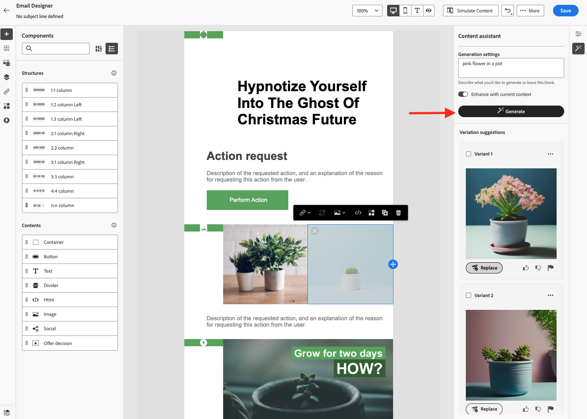

# Get started with the Content assistant {#gs-content-assistant}

>[!BEGINSHADEBOX]

**Table of content**

* **[Get started with the Content assistant](gs-generative.md)**
* [Generate text with the Content assistant](generative-content.md)
* [Generate images with the Content assistant](generative-image.md)

>[!ENDSHADEBOX]

Adobe Journey Optimier Content assistant brings proactive content variation suggestions for text and images. It is available for email, Push, SMS, and Web channels. This new capability provides a prompt based text and image generation. Image generation is managed with Adobe Firefly.

Use the Content assistant to optimize your message's impact by experimenting with different main titles and images. Generate multiple variant and build an experiment to compare them. Leveraging Journey Optimizer Content Experiment, you can define multiple message treatments in order to measure which one performs best for your target audience. You can choose to vary the delivery content, or subject. The message audience is randomly allocated to each treatment to determine which one works best in terms of the specified metric. Learn more about Content Experiment in [this section](../campaigns/content-experiment.md).

>[!AVAILABILITY]
>
>Adobe Journey Optimizer Content assistant is currently available as a beta to select users only. To join the beta program, contact Adobe Customer Care.

