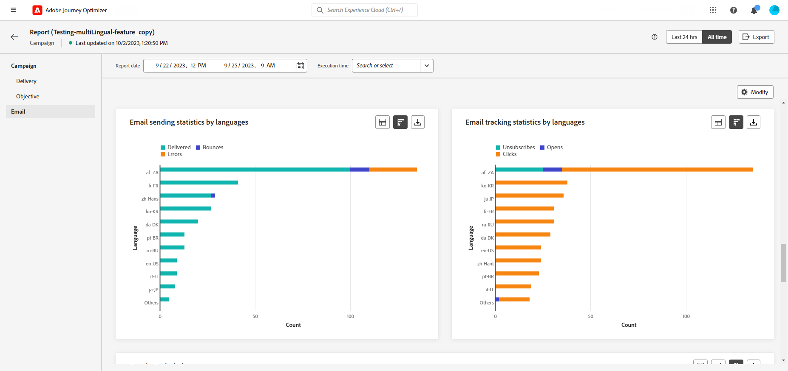

# Create multilingual content {#multilingual-automated}

The multilingual feature enables you to effortlessly create content in multiple languages within a single campaign. With this feature, you can switch between languages when editing your campaign, streamlining the entire editing process and improving your capability to efficiently manage multilingual content.

## Create locale {#create-locale}

When configuring your language settings, as described in the [Create your language settings](#language-settings) section, if a specific locale is not available for your multilingual content, you have the flexibility to create as many new locales as required using the **[!UICONTROL Translation]** menu.

1. From the **[!UICONTROL Administration]** menu, access **[!UICONTROL Channel]**.
    
    The translations menu gives you access to the list of activated locales.

1. From the **[!UICONTROL Locale dictionary]** tab, click **[!UICONTROL Add locale]**.

    

1. Select your Locale code from the **[!UICONTROL Language]** list and the associated **[!UICONTROL Region]**.

1. Click **[!UICONTROL Save]** to create your Locale.

    

## Create translation project {#translation-project}

1. From the **[!UICONTROL Translation projects]** menu under **[!UICONTROL Content management]**, click **[!UICONTROL Create project]**.

1. Type-in a **[!UICONTROL Name]** and **[!UICONTROL Description]**.

1. Select the **[!UICONTROL Source locale]**.

1. Choose if your translations are automatically publish after approval and if you want to enable the review workflow.

1. Click **[!UICONTROL Add locale]** to access the menu and define the languages for your translation project.

    If a **[!UICONTROL Locale]** is missing, you can manually create it beforehand from the **[!UICONTROL Translation]** menu or by API. Refer to [Create a new Locale](#create-locale).

1. Select from the list your **[!UICONTROL Target locale(s)]** and choose which **[!UICONTROL Translation provider]** you want to use for each locale.

1. Click **[!UICONTROL Add a locale]** when you finished linking your Target locale with the correct Translation provider. 

1. Click **[!UICONTROL Save]** when your translation project is configured.

1. From the Advanced menu of your Translation project, you can choose to Edit, deactive or delete it.

## Create language settings {#language-settings}

In this section, you can set your primary language and its associated locales for managing your multilingual content. You can also choose the attribute that you want to use to look up information related to profile language

1. From the **[!UICONTROL Administration]** menu, access **[!UICONTROL Channel]**.

1. In the **[!UICONTROL Language settings]** menu, click **[!UICONTROL Create language settings]**.

1. Type-in the name of your **[!UICONTROL Language settings]**.

1. Choose the **[!UICONTROL Translation project]** option.

1. From the **[!UICONTROL Translation project]** field, click **[!UICONTROL Edit]** and choose your previously created **[!UICONTROL Translation project]**. 

    Your previously configured Locales are automatically imported. If you update your **[!UICONTROL Translation project]**, click **[!UICONTROL Refresh]** to reflect these changes in your **[!UICONTROL Language settings]**.

1. From the **[!UICONTROL Sending preference]** menu, select the attribute that you want to look up to find information on profile languages.

1. Click **[!UICONTROL Edit]** next to your **[!UICONTROL Locale]** to further personalize it and to add **[!UICONTROL Profile preferences]**.

1. Click **[!UICONTROL Submit]** to create your **[!UICONTROL Language settings]**.

<!--
1. Access the **[!UICONTROL Channel surfaces]** menu and create a new channel surface or select an existing one.

1. In the **[!UICONTROL Header parameters]** section, select the **[!UICONTROL Enable multilingual]** option.

1. Select your **[!UICONTROL Locales dictionary]** and add as many as needed.
-->

## Create a multilingual campaign {#create-multilingual-campaign}

1. Begin by creating and configuring your campaign according to your requirements. [Learn more](../campaigns/create-campaign.md)

1. Navigate to the **[!UICONTROL Actions]** menu, and select **[!UICONTROL Edit content]**.

1. Create or import your original content and personalize it as needed.

1. Once your primary content is created, click **[!UICONTROL Save]** and head back to the campaign configuration screen.

1. Click **[!UICONTROL Add languages]** and select your previously created **[!UICONTROL Language settings]**. [Learn more](#create-language-settings)

1. Access the advanced settings of the **[!UICONTROL Locales]** menu and select **[!UICONTROL Copy primary to all locales]**.

1. Now that your primary content is duplicated throughout your selected  **[!UICONTROL Locales]**, access each locale and click **[!UICONTROL Edit email body]** to translate your content.

1. You can choose to disable or enable locales with the **[!UICONTROL More action]** menu of your selected Locale.

1. To deactivate your Multilingual configuration, click **[!UICONTROL Add languages]** and select the language you wish to keep as local language.

1. Click **[!UICONTROL Review to activate]** to display a summary of the campaign.

    The summary allows you to modify your campaign if necessary, and to check if any parameter is incorrect or missing.

1. Browse through your multilingual content to see the rendering in each language.

1. Check that your campaign is correctly configured, then click **[!UICONTROL Activate]**.

Your campaign is now activated. The message configured in the campaign is sent immediately, or on the specified date. Note that as soon as your Campaign is live, it can not be modified. To reuse content, you can duplicate your Campaign.

Once sent, you can measure the impact of your Campaigns within the Campaign reports.

## Multilingual campaign report {#multilingual-campaign-report}

Global reports, accessible from the **All time** tab, display events that occurred at least two hours ago and cover events over a selected time period. Campaign global report can be accessed directly from your Campaign with the **[!UICONTROL View report]** button.

For more information on data available in the Campaign report, refer to [this page](../reports/campaign-global-report.md).

+++Learn more on the different metrics and widgets available for your multilingual content.

The **[!UICONTROL Email sending statistics by languages]** widget details the success of your delivery depending on your **[!UICONTROL Locales]**:

* **[!UICONTROL Delivered]**: Number of messages successfully sent, in relation to the total number of sent messages.

* **[!UICONTROL Bounces]**: Total of errors cumulated during delivery and automatic return processing in relation to the total number of sent messages.

* **[!UICONTROL Errors]**: Total number of errors that occurred during a delivery preventing it from being sent to profiles.

The **[!UICONTROL Email tracking statistics by languages]** widget contains the available data for recipient activity for your delivery depending on your **[!UICONTROL Locales]**:

* **[!UICONTROL Unsubscribes]**: Number of clicks on the unsubscription link.

* **[!UICONTROL Opens]**: Number of times the message was opened.

* **[!UICONTROL Clicks]**: Number of times a content was clicked on.
+++

<!--
# Create a multilingual journey {#create-multilingual-journey}

1. Create your journey with a Delivery and personalize your content as needed.
1. From your delivery action, click Edit content.
1. Click Add languages.

-->
