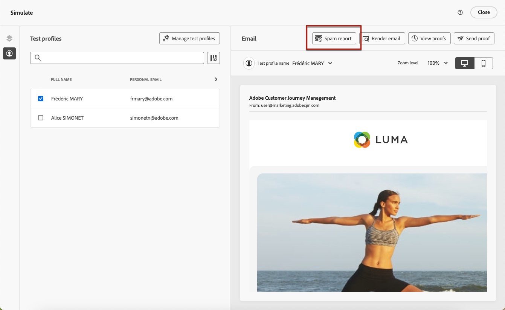
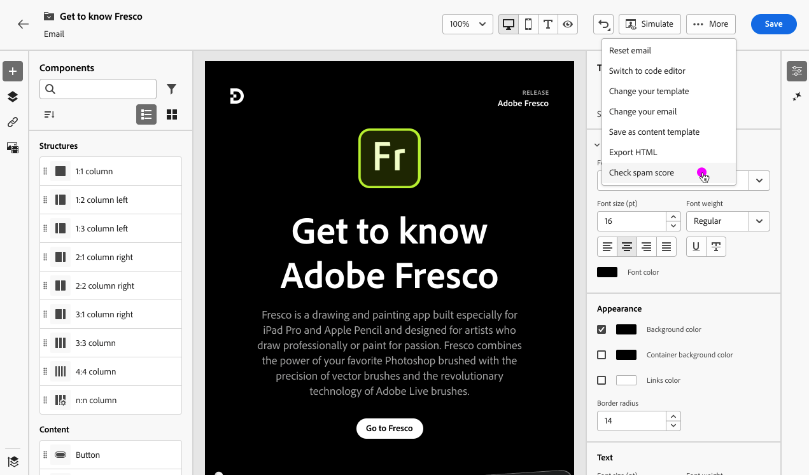
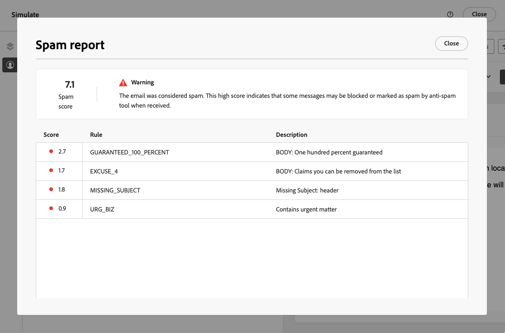
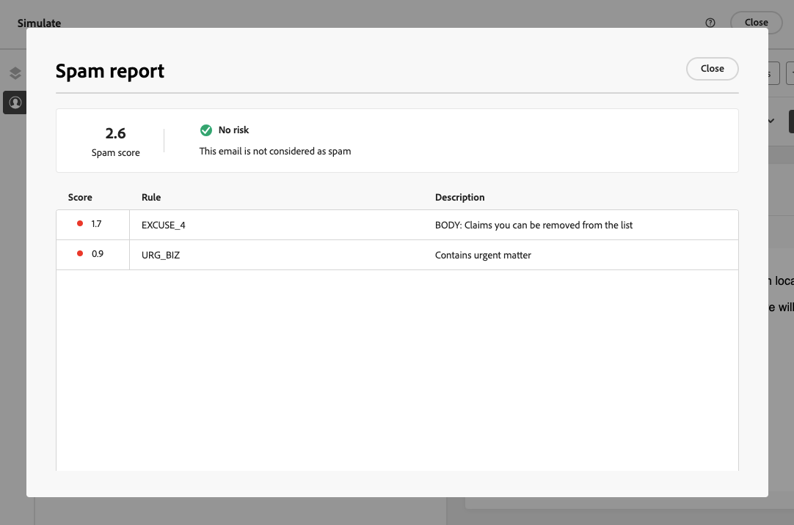
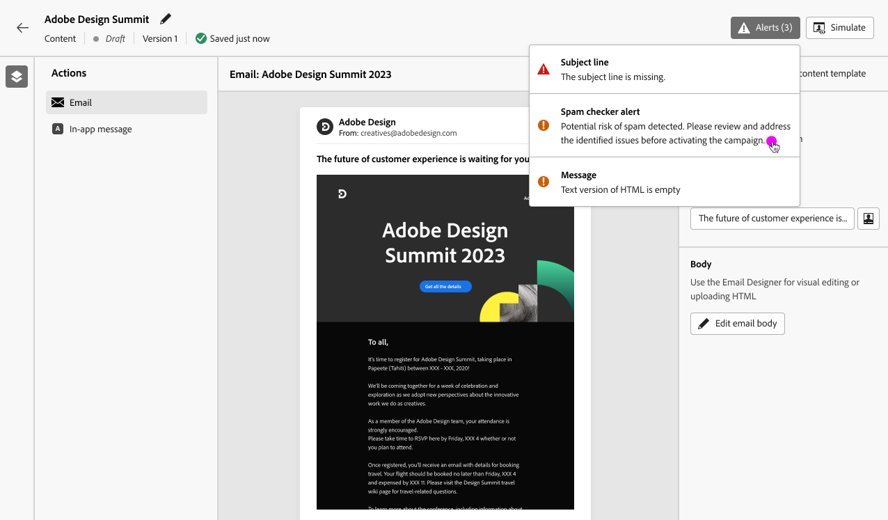

# Use Spam report {#spam-report}

>[!AVAILABILITY]
>
>The Spam report feature is currently available as a beta to select users only. To join the beta program, contact Adobe Customer Care.

[!DNL Journey Optimizer] enables you to check how your content will perform against spam filtering and make sure your messages land in your customers' inboxes - not in spam.

>[!CAUTION]
>
>* This feature is currently only available for the Email channel.
>
>* For now the spam report analysis can only be performed for content in English.

When editing or previewing your content, the **[!UICONTROL Spam report]** option provides a scoring and advice to improve scores for each individual item that is listed.

This allows you to determine whether a message runs the risk of being considered as spam by the anti-spam tools used upon receipt, and to take actions if this is not the case.

>[!CAUTION]
>
>The Spam report only provides indications and warnings. Note that you are not prevented from sending messages if the Spam report indicates that your content is considered as spam. It is your choice to act upon the score and suggested improvements.

To use the **[!UICONTROL Spam report]** feature, follow the steps below.

<!--For example spam scoring tool can tell that there are too many Images compared to the text. Retailers tend to do this even though the spam score gets worse because the content is more engaging.-->

<!--Michael, who is a marketer with NIKE works along with Tara from testing team to ensure that the emails being sent as part of the campaign/journey don't get categorised as SPAM.

They need an integration within AJO's marketing system to show how the curated content is doing against different SPAM compliance pillars like for SPAM trigger words, HTML Body content and layout, subject line etc.

They should be able to get scores for each individual items as shown by market standard SPAM filtering tools like Spam Assassin, Symantec etc.

They should also get suggestions on how to improve the score better to be confident that the messages don't get categorised as spam.-->

1. From the **[!UICONTROL Simulate]** screen, click the **[!UICONTROL Spam report]** button.

    

<!--
    You can also open the [Email Designer](../email/content-from-scratch.md), click the **[!UICONTROL More]** button and select **[!UICONTROL Check spam score]** from the menu.

    
-->

1. An anti-spam checking is automatically performed and the **[!UICONTROL Spam report]** window displays the results. It shows how your content is doing in terms of body layout, structure, image size, spam trigger words if any, etc.

    

1. Check the scores and descriptions for each item.

    If the score is higher than 5, a warning is displayed. It indicates that some messages may be blocked or marked as spam by anti-spam tools when received.

1. Based on that scoring, if you consider that some elements can be improved, go to your content using the [Email Designer](../email/content-from-scratch.md) and make the updates needed.

1. Once your changes are done, go back to the **[!UICONTROL Spam report]** screen to ensure your score has improved.

    

<!--You can also check the message's alerts for warnings on potential risk of spam detection. Follow the steps below.

1. Click the **[!UICONTROL Alerts]** button on top right of the screen. [Learn more on email alerts](../email/create-email.md#check-email-alerts)

1. If **[!UICONTROL Spam checker alert]** is displayed, you should check your content for a potential risk of spam using the **[!UICONTROL Spam report]** feature as detailed above.

    
-->

