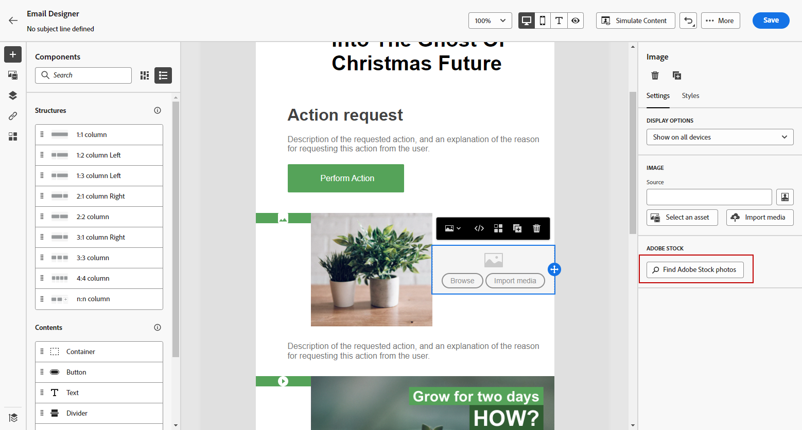
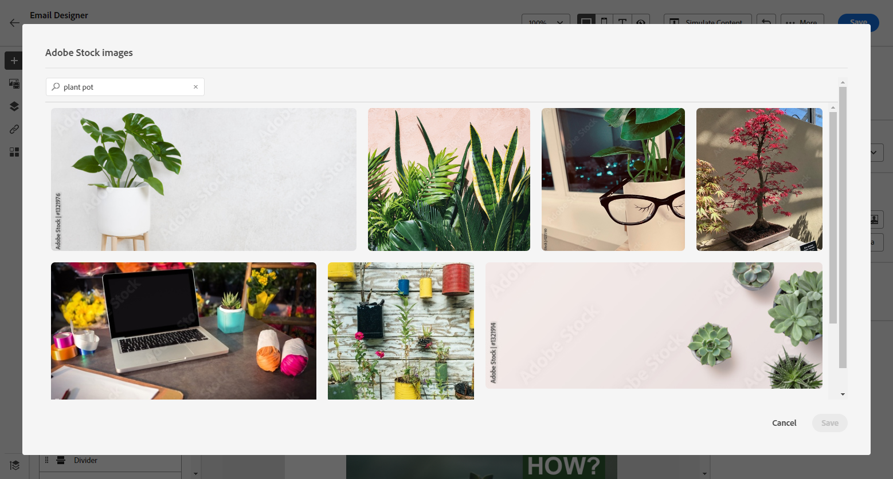
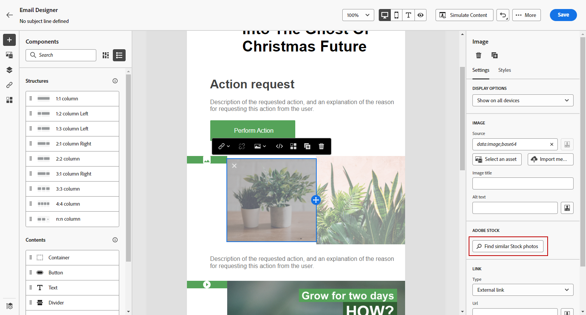
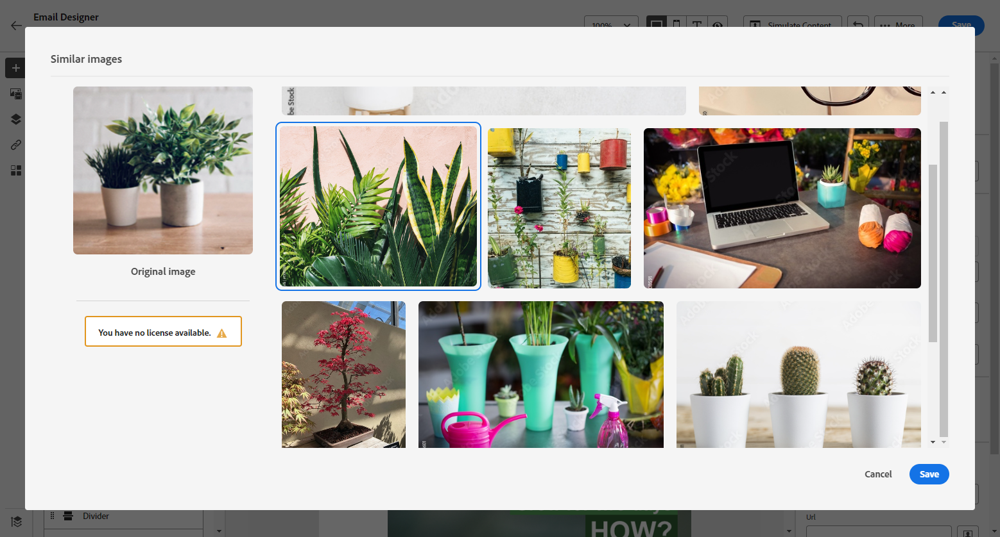
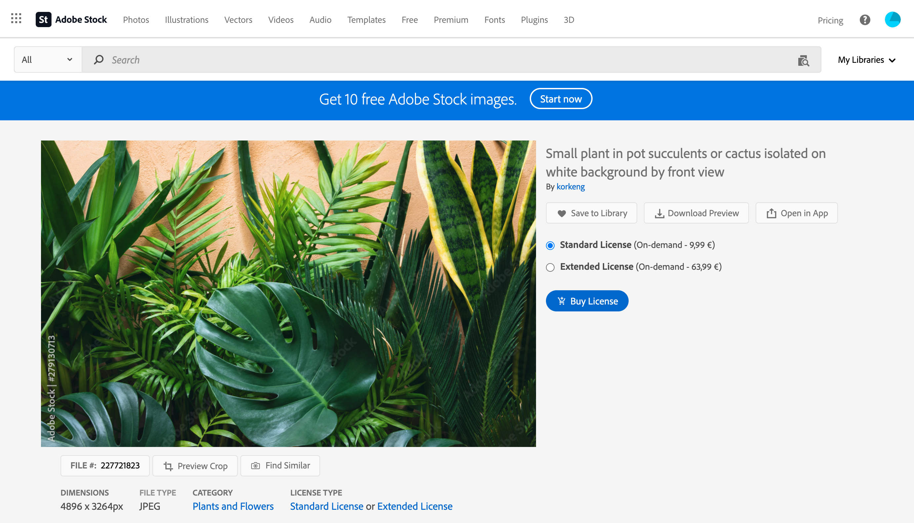
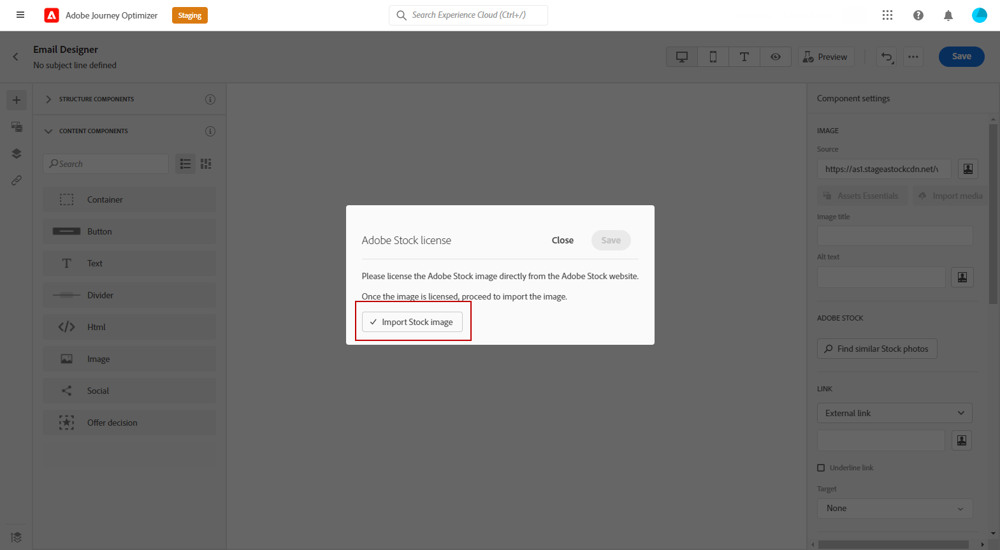

# Work with [!DNL Adobe Stock] images {#stock}

## Get started with [!DNL Adobe Stock] {#get-started-stock}

The [!DNL Adobe Stock] and [!DNL Adobe Journey Optimizer] Email Designer integration plugin provides customers an easy way to navigate, license, and save imagery for use in message authoring.

[Adobe Stock](https://helpx.adobe.com/stock/get-started.html){target="_blank"} provides access to millions of high-quality, curated, royalty-free photos, videos, illustrations, and vector graphics. You can choose to purchase a credit pack to license assets or only buy one Standard or Extended license for the needed asset. Adobe Stock also provides a free collection of assets.

With [!DNL Adobe Journey Optimizer], you can upload images to your emails directly from [!DNL Adobe Stock] and add it to your **[!UICONTROL Assets]** folder using the **[!UICONTROL Find Adobe Stock photos]** option. In addition, the **[!UICONTROL Find Similar Stock photos]** option helps you find images that match the content, color, and composition of the asset used in your delivery.

## Permissions{#stock-permissions}

 The **[!UICONTROL Find Adobe Stock photos]** and **[!UICONTROL Find Similar Image]** options are available to users with access to an AEM Assets Essentials Product Profile. 
 
 For more on this, refer to [Experience Manager Assets documentation](https://experienceleague.adobe.com/docs/experience-manager-assets-essentials/help/get-started-admins/deploy-administer.html#add-users-to-essentials){target="_blank"}.

## Insert an image from [!DNL Adobe Stock] {#add-stock-image}

To add images from [!DNL Adobe Stock] to your content, follow the steps below:

1. From the **[!UICONTROL Content components]** section of the Email Designer, drag and drop an **Image**.

1. Click the **[!UICONTROL Find Adobe Stock photos]** button on the left side of the Email Designer.

    

1. Browse through the library or enter a term in the search field. 

    

1. Select the chosen image and click **[!UICONTROL Save]**.

    If the image you selected is not licensed, you must [get the license](#license-stock-image).

## Find similar photos {#similar-stock-image}

You can replace any existing image in your email content by a photo from [!DNL Adobe Stock]. Note that this option is available for all images: licensed/unlicensed Stock images and images from your Assets folder.

To browse similar photos, follow the steps below:

1. Select the image to replace.
1. Click the **[!UICONTROL Find similar Stock photos]** button to display assets in [!DNL Adobe Stock] which match the content, color, and composition of the image. 

    

1. Select the chosen image and click **[!UICONTROL Save]**. 

    
    
    If the image you selected is not licensed, you must [get the license](#license-stock-image).

1. Customize your image, if needed, with the **[!UICONTROL Settings]** and **[!UICONTROL Styles]** tabs. [Learn more about components settings](../email/content-components.md).

## Get the license from [!DNL Adobe Stock] {#license-stock-image}

If your image is already licensed, it is represented by the  icon. If not, you must license it. 

To license and download your image, follow the steps below:

1. Select it and click the **[!UICONTROL License Adobe Stock image]** icon.

    

    You are then redirected to the [!DNL Adobe Stock] website to buy the license.

    

1. From the [!DNL Adobe Stock] website, you need to purchase your asset to be able to download the image and remove the watermark.

    This purchase depends on your Adobe Stock plan or subscription. Note that if you have multiple Adobe Stock accounts, you will be redirected to the last used Stock ID. In this case, make sure you are signed in to the correct account before licensing your asset.

    For more about Adobe Stock plans and prices in [Adobe Stock documentation](https://stock.adobe.com/plans){target="_blank"}.
        
    >[!WARNING]
    > If an email including an unlicensed image is sent, the image keeps its unlicensed form with the watermark.

1. Once your purchase has been completed, you can now head back to your email in [!DNL Adobe Journey Optimizer] and select **[!UICONTROL Import stock image]** to import your licensed image to your assets. 

    

1. Select in which folder to store your asset. For more information on [!DNL Experience Manager Assets], refer to this [page](assets.md#get-started-assets).

## Related topics{#stock-related-topics}

* [Email design in Journey Optimizer](../email/get-started-email-design.md)
* [Components settings for email design](../email/content-components.md)
* [Adobe Stock Get Started](https://helpx.adobe.com/stock/get-started.html){target="_blank"}.

