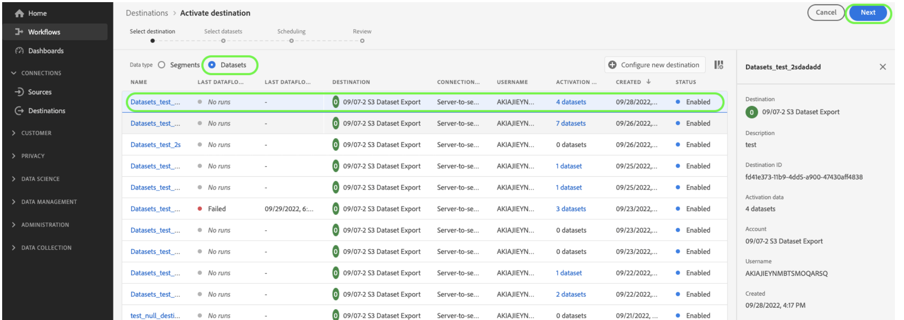
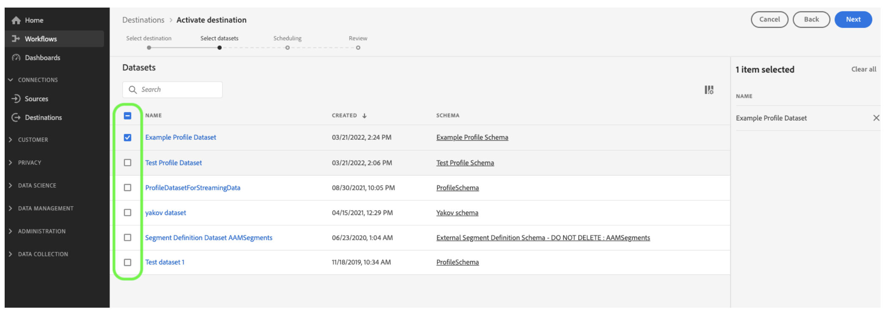
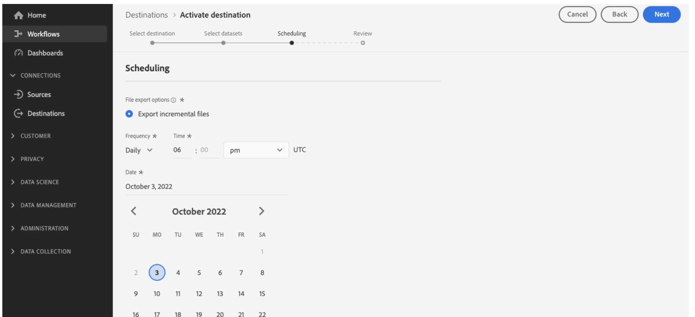
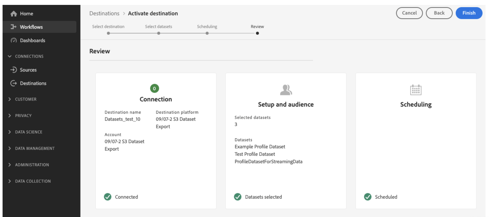

# Export datasets to cloud storage locations {#export-datasets}

>[!AVAILABILITY]
>
>The datasets export feature is currently in beta and available to all Adobe Journey Optimizer users. Please work with your Adobe representative on getting access to Destinations if you do not already have access.

Journey Optimizer allows you to establish a live connection with cloud storage locations in order to export the content of your datasets.

By periodically exporting your data, you can ensure that you have a complete and up-to-date record of your customer interactions, use this information for reporting or analysis purposes, and maintain compliance with legal requirements.

## Available cloud storage destinations {#destinations}

You can export datasets to 6 cloud storage destinations which are accessible from the **[!UICONTROL Destinations]** menu, in the **[!UICONTROL Catalog]** tab.

>[!AVAILABILITY]
>
>These destinations are all available in beta and subject to change.

Detailed information on each destination is available in Adobe Experience Platform documentation:

* [Amazon S3](https://experienceleague.adobe.com/docs/experience-platform/destinations/catalog/cloud-storage/amazon-s3.html)
* [Azure Blob](https://experienceleague.adobe.com/docs/experience-platform/destinations/catalog/cloud-storage/azure-blob.html)
* [Azure Data Lake Gen 2](https://experienceleague.adobe.com/docs/experience-platform/destinations/catalog/cloud-storage/adls-gen2.html)
* [Data Landing Zone](https://experienceleague.adobe.com/docs/experience-platform/destinations/catalog/cloud-storage/data-landing-zone.html)
* [Google Cloud Storage](https://experienceleague.adobe.com/docs/experience-platform/destinations/catalog/cloud-storage/google-cloud-storage.html)
* [SFTP](https://experienceleague.adobe.com/docs/experience-platform/destinations/catalog/cloud-storage/sftp.html)

## Prerequisites {#prerequisites}

Check the following prerequisites before starting exporting your datasets:

* To export datasets, you need the **Manage Destinations**, **View Destinations**, **Activate Destinations**, and **Manage and Activate Dataset Destinations** [access control permissions](https://experienceleague.adobe.com/docs/experience-platform/access-control/home.html#permissions). Read the [access control overview](https://experienceleague.adobe.com/docs/experience-platform/access-control/ui/overview.html) or contact your product administrator to obtain the required permissions.

*  This feature supports the export of First-generation data only, i.e. raw data as defined in the [Real-Time Customer Data Platform product description](https://helpx.adobe.com/legal/product-descriptions/real-time-customer-data-platform-b2c-edition-prime-and-ultimate-packages.html). Make sure that the dataset that you want to export do not contain Second-generation data.

## Main steps to export datasets {#main-steps}

The main steps to export a dataset to a cloud storage location are as follows:

Detailed information on each step is available in Adobe Experience Platform documentation: [Export datasets to cloud storage destinations](https://experienceleague.adobe.com/docs/experience-platform/destinations/ui/activate/export-datasets.html?lang=en).

1. **Setup your cloud storage destination**. If you have not done so already, connect to a cloud storage destination from the destinations catalog. [Learn how to create a new destination connection](https://experienceleague.adobe.com/docs/experience-platform/destinations/ui/connect-destination.html?lang=en#setup)

    <!---->

1. **Select the cloud storage destination** where you want to export your datasets. In the destinations catalog, click the **[!UICONTROL Export datasets]** button on the desired card and select the connection to use.

    <!---->

    >[!NOTE]
    >
    >If you are using Adobe Journey Optimizer along with Real-Time Customer profiles, destination cards will display an "Activate" button, allowing you to both export datasets and activate segments for this destination, depending on the permissions you have enabled.

1. **Select the dataset(s)** that you want to export to the selected destination.

    <!---->

1. **Schedule the export** of your dataset. Specify when the export should start and at which frequency it should occur.

    <!---->

1. **Review and confirm the export** by checking the summary that displays at the end of the configuration.

    <!---->

Once the export is complete, the content of your dataset is deposited on your cloud storage location according to the schedule you have configured. [Learn how to verify successful dataset export](https://experienceleague.adobe.com/docs/experience-platform/destinations/ui/activate/export-datasets.html#verify)

## Use case: export sends, opens and clicks to an SFTP server {#use-case}

