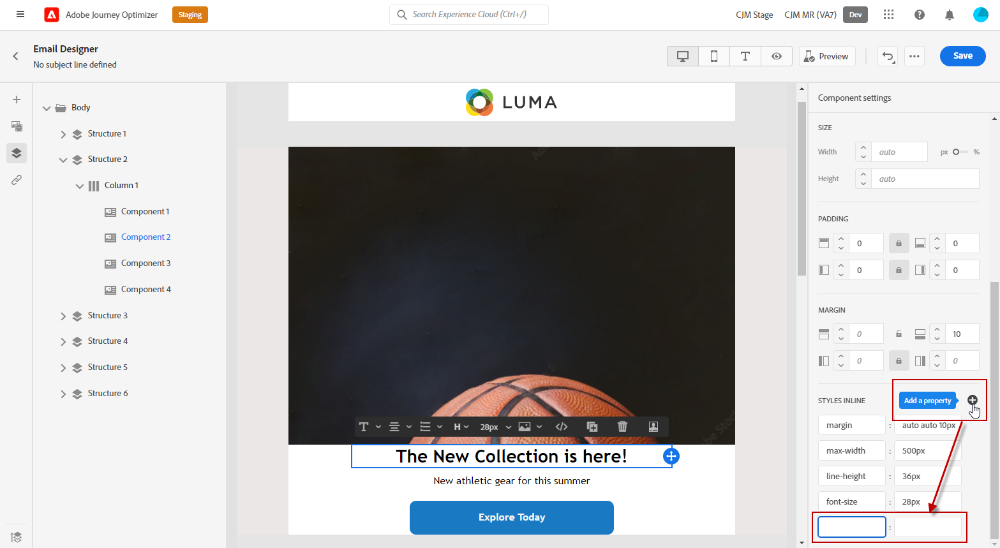

# Add inline styling attributes {#adding-inline-styling-attributes}

In the Email Designer interface, when you select an element and display its settings on the side panel, you can customize the inline attributes and their value for that specific element.

1. Select an element in your content.
1. On the side panel, look for the **[!UICONTROL Styles Inline]** settings.

   

1. Modify the values of the existing attributes, or add new ones using the **+** button. You can add any attribute and value that is CSS-compliant.

   

The styling is then applied to the selected element. If the child elements do not have specific styling attributes defined, the styling of the parent element is inherited.
