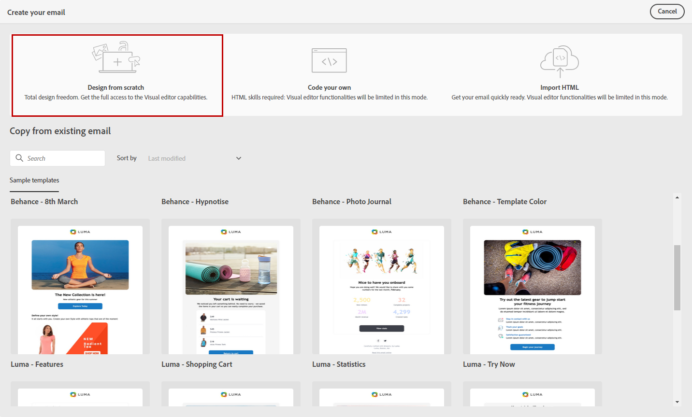

# Start from scratch {#create-email-content}

>[!CONTEXTUALHELP]
>id="ac_structure_components_email"
>title="About Structure components"
>abstract="Structure components define the layout of the email."

>[!CONTEXTUALHELP]
>id="ac_structure_components_landing_page"
>title="About Structure components"
>abstract="Structure components define the layout of the landing page."

>[!CONTEXTUALHELP]
>id="ac_structure_components_fragment"
>title="About Structure components"
>abstract="Structure components define the layout of the fragment."

>[!CONTEXTUALHELP]
>id="ac_structure_components_template"
>title="About Structure components"
>abstract="Structure components define the layout of the template."

>[!CONTEXTUALHELP]
>id="ac_edition_columns_email"
>title="Defining email columns"
>abstract="The Email Designer allows you to easily define the layout of your email by defining column structure."

>[!CONTEXTUALHELP]
>id="ac_edition_columns_landing_page"
>title="Defining landing page columns"
>abstract="The Email Designer allows you to easily define the layout of your landing page by defining column structure."

>[!CONTEXTUALHELP]
>id="ac_edition_columns_fragment"
>title="Defining fragment columns"
>abstract="The Email Designer allows you to easily define the layout of your fragment by defining column structure."

>[!CONTEXTUALHELP]
>id="ac_edition_columns_template"
>title="Defining template columns"
>abstract="The Email Designer allows you to easily define the layout of your template by defining column structure."

The Email Designer allows you to easily define the structure of your email. By adding and moving structural elements with simple drag-and-drop actions, you can design the shape of your email within seconds.

To start building your email content with the email designer, follow the steps below:

1. From the Email Designer home page, select the **[!UICONTROL Design from scratch]** option.

    

1. Start designing your email content by drag and dropping **[!UICONTROL Structure components]** to define the layout of your email.

   >[!NOTE]
   >
   >Note that stack of columns are not compatible with all email programs. When not supported, columns will not be stacked.
   >
   >Once placed in the email, you cannot move nor remove your components unless there is already a content component or a fragment placed inside.

    

1. Add as many **[!UICONTROL Structure components]** as needed.

   Select the **[!UICONTROL n:n column]** component to define the number of columns of your choice (between 3 and 10). You can also define the width of each column by moving the arrows at the bottom of each column.

   >[!NOTE]
   >
   >Each column size cannot be under 10% of the total width of the structure component. You cannot remove a column that is not empty.

1. From the **[!UICONTROL Content components]** drop-down, you can add as many **[!UICONTROL Content components]** as you need in your structure component. [Learn more about Content components](content-components.md).

    

1. Each component can be further customized with the **[!UICONTROL Component settings]** section. For example, you can change your text style, the padding or margin of your component. [Learn more about alignment and padding](adjusting-vertical-alignment-and-padding.md).

    

1. From the **[!UICONTROL Assets picker]**, you can directly add assets stored in the **[!UICONTROL Assets library]** to your email. [Learn more about asset management](assets-essentials.md).

    Double-click the folder which contained your assets and drag and drop the asset you want to add to your email.

    

1. Add personalization fields to customize the content from your profiles data. [Learn more about content personalization](../personalization/personalize.md).

    

1. In the **[!UICONTROL Links]** tab in the left pane, check the list of all the URLs of your content that will be tracked. You can modify their **[!UICONTROL Tracking Type]**, **[!UICONTROL Label]** and **[!UICONTROL Tags]** if needed.

    

    >[!NOTE]
    >
    >Learn more about links and message tracking in [this page](message-tracking.md).

1. If needed, you can switch to code editor to further personalize your email by clicking **[!UICONTROL Switch to code editor]** from the advanced menu. For more information on the code editor, refer to [this page](code-content.md#).

    >[!NOTE]
    >
    >You will not be able to use the visual designer for this email after switching to the code editor.

    

1. Click **[!UICONTROL Show preview]** to check your email rendering. You can choose the desktop or mobile view.

    For more information on how preview your email, refer to [this page](preview.md).

    

1. When your email is ready, click **[!UICONTROL Save & Close]**.

