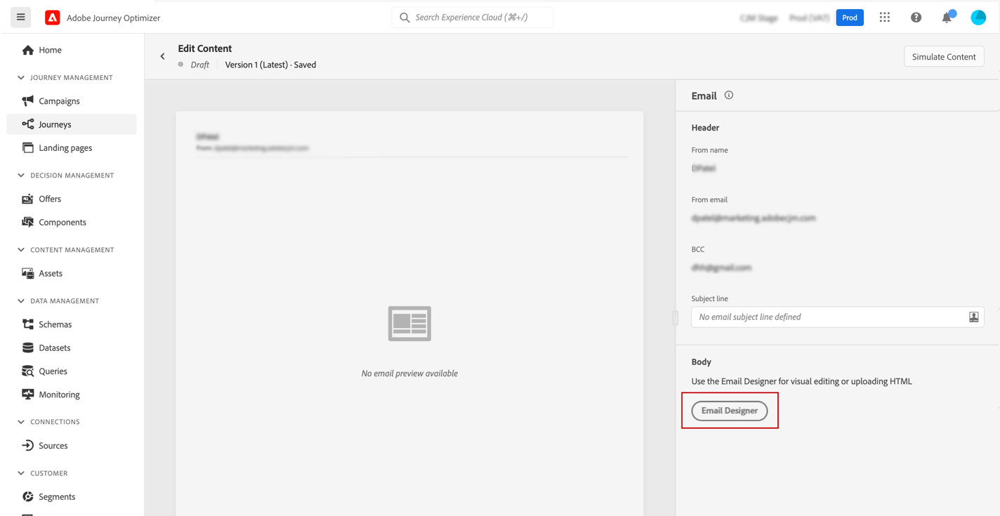
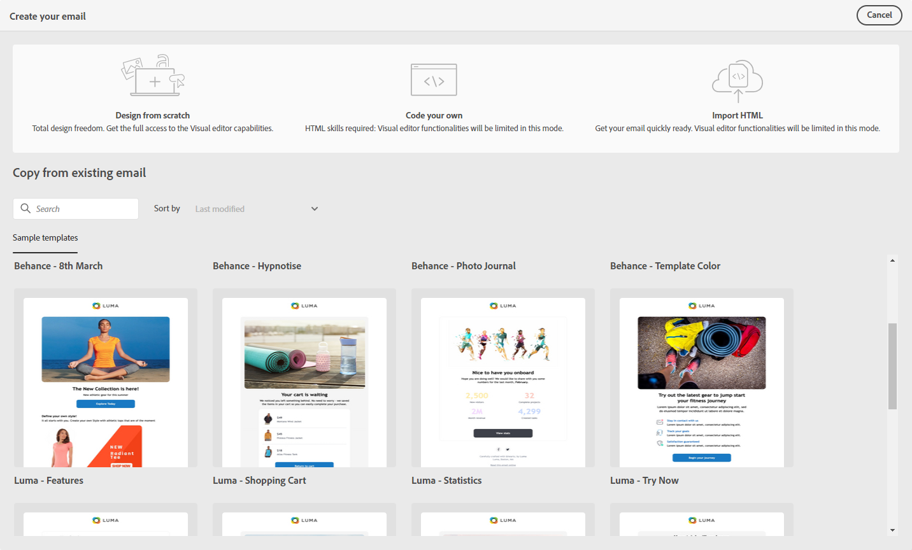

# Get started with email design {#get-started-content-design}

You can import an existing content in [!DNL Journey Optimizer] or leverage content design capabilities:

* Use [!DNL Journey Optimizer] **email designing capabilities** to design or import responsive emails. [Learn more](../design/create-email-content.md)

* Leverage **Adobe Experience Manager Assets Essentials** to enrich your emails, build and manage your own assets database. [Learn more](../design/assets-essentials.md)

* Find **Adobe Stock photos** to build your content and improve your email design. [Learn more](../design/stock.md)

* Enhance customers' experience by creating personalized and dynamic messages based on their profile attributes. Learn more about [personalization]((../personalization/personalize.md)) and [dynamic content](../personalization/get-started-dynamic-content.md).

➡️ [Discover this feature in video](#video)

Once you have [created your message](../messages/get-started-content.md), you can start creating your email content.

1. From your newly created message, select **[!UICONTROL Email designer]** in the **[!UICONTROL Body]** section.

    

1. In the Email Designer home page, choose how you want to design your email from the following options:

    * **Design your email from scratch** through the email designer's interface and leverage images from [Adobe Experience Manager Assets Essentials](assets-essentials.md). Learn how to design your email content or use built-in templates [in this section](create-email-content.md).

    * **Copy from existing email** from a list of sample templates. 

    * **Code or paste raw HTML** directly in the email designer. Learn how to code your own content [in this section](code-content.md).

    * **Import existing HTML content** from a file or a .zip folder. Learn how to import an email content [in this section](existing-content.md).

    

These features are all available when accessing the Email Designer from the message creation screen. [Learn more about message creation](../messages/get-started-content.md).

## How-to video {#video}

Learn how to create email content with the message editor.

>[!VIDEO](https://video.tv.adobe.com/v/334150?quality=12)