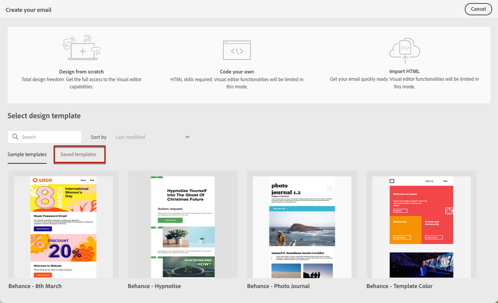

# Work with email templates {#email-templates}

Use the **[!UICONTROL Select design template]** section to start building your content from a template.

You can choose from:
* 20 out-of-the-box email templates.
* Saved templates. [Learn more](#save-as-template)

## Save as template {#save-as-template}

Once you designed your [email content](design-emails.md), you can save it for future reuse. To do this, follow the steps below.

1. Click the ellipsis on top right of the screen.

1. Select **[!UICONTROL Save design template]** from the drop-down menu.

    

1. Add a name for this template.

    

1. Click **[!UICONTROL Save]**.

Next time you create an email, you can use this template to build your content. [Learn how](#use-saved-template)

## Use a saved template {#use-saved-template}

1. Open the [email designer](create-email-content.md).

1. On the **[!UICONTROL Create your email screen]**, the **[!UICONTROL Sample templates]** tab is selected by default. Select the **[!UICONTROL Saved templates]** tab.

    

1.  The list of all previously [saved templates](#save-as-template) displays. You can sort them **[!UICONTROL By name]**, **[!UICONTROL Last modified]** and **[!UICONTROL Last created]**.

    

1. Select the template of your choice from the list.

1. Once selected, you can navigate between all the saved templates using the right and left arrrows.

    

1. Click **[!UICONTROL Use this email]** on top right of the screen.

1. Edit your content as desired using the email designer.
