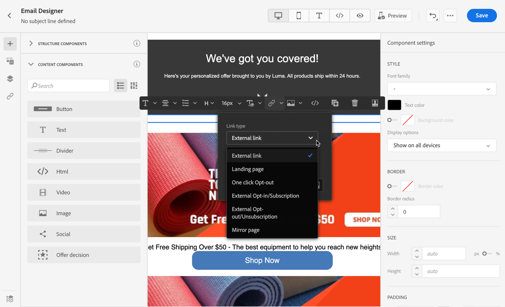
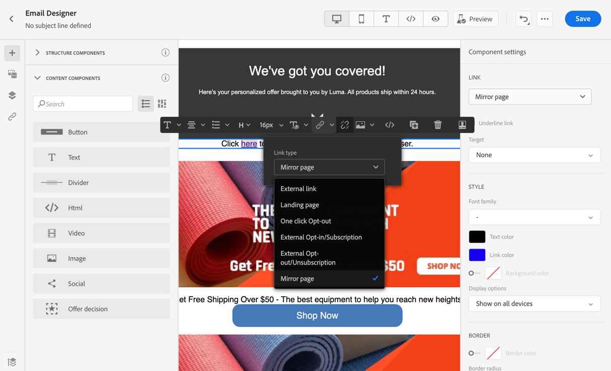

# Add links and track messages {#tracking}

Use [!DNL Journey Optimizer] to add links to your content and track the messages sent in order to monitor the behavior of your recipients.

## Enable tracking {#enable-tracking}

You can enable tracking at the email message level by checking the **[!UICONTROL Email opens]** and/or **[!UICONTROL Click on email]** options when [creating your message](../messages/get-started-content.md).

>[!NOTE]
>
>Both options are enabled by default.

This will let you track the behavior of your recipients through:

* **[!UICONTROL Email opens]**: Messages that have been opened.
* **[!UICONTROL Click on email]**: Clicks on links in an email.

## Insert links {#insert-links}

When designing a message, you can add links to your content.

>[!NOTE]
>
>When [tracking is enabled](#enable-tracking), all links included in the message content are tracked.

To insert links into your email content, follow the steps below:

1. Select an element and click **[!UICONTROL Insert link]** from the contextual toolbar.

    

1. Choose the type of link you want to create:

    * **[!UICONTROL External link]**: Insert a link to an external URL.

    * **[!UICONTROL Landing page]**: Insert a link to a landing page. Learn more in [this section](../landing-pages/get-started-lp.md)

    * **[!UICONTROL One click Opt-out]**: Insert a link to enable users to quickly unsubscribe from your communications without the need to confirm opting out. Learn more in [this section](../messages/consent.md#one-click-opt-out).

    * **[!UICONTROL External Opt-in/Subscription]**: Insert a link to accept receiving communications from your brand.

    * **[!UICONTROL External Opt-out/Unsubscription]**: Insert a link to unsubscribe from receiving communications from your brand. Learn more on opt-out management in [this section](../messages/consent.md#opt-out-management).

    * **[!UICONTROL Mirror page]**: Insert a link to display the email content in a web browser. Learn more in [this section](#mirror-page).

    

1. You can personalize your links. Learn more on personalized URLs in [this section](../personalization/personalization-syntax.md#perso-urls).

1. Save your changes.

1. Once the link is created, you can still modify it from the **[!UICONTROL Component settings]** pane on the right. 

    * You can edit the link and change its type.
    * You can choose to underline the link or not by checking the corresponding option.

    

>[!NOTE]
>
>Marketing-type email messages must include an [opt-out link](../messages/consent.md#opt-out-management), which is not required for transactional messages. The message category (**[!UICONTROL Marketing]** or **[!UICONTROL Transactional]**) is defined at the [message preset level](../configuration/message-presets.md#email-type) and when [creating the message](../messages/get-started-content.md#create-new-message).

## Link to a mirror page {#mirror-page}

The mirror page is an HTML page accessible online via a web browser. Its content is identical to the content of your email.

To add a link to a mirror page in your email, [insert a link](#insert-links) and select **[!UICONTROL Mirror page]** as the type of link.

The mirror page is automatically created.

>[!NOTE]
>
>You cannot edit the auto-generated link.

Once the email is sent, when the recipients click the mirror page link, the content of the email is displayed in their default web browser.

>[!NOTE]
>
>In the [proof](preview.md#send-proofs) sent to the test profiles, the link to the mirror page is not active. It is only activated in the final messages.

The retention period for a mirror page is 60 days. After that delay, the mirror page will no longer be available.

## Manage tracking {#manage-tracking}

The [Email Designer](create-email-content.md) allows you to manage the tracked URLs, such as editing the tracking type for each link.

1. Click the **[!UICONTROL Links]** icon from the left pane to display the list of all the URLs of your content that will be tracked.

    This list enables you to have a centralized view and to locate each URL in the email content.

1. To edit a link, click the corresponding pencil icon.

    

1. You can modify the **[!UICONTROL Tracking Type]** if needed:

   

    For each tracked URL, you can set the tracking mode to one of these values:

    * **[!UICONTROL Tracked]**: Activates tracking on this URL.
    * **[!UICONTROL Opt out]**: Considers this URL as an opt-out or unsubscription URL.
    * **[!UICONTROL Mirror page]**: Considers this URL is a mirror page URL.
    * **[!UICONTROL Never]**: Never activates tracking of this URL. <!--This information is saved: if the URL appears again in a future message, its tracking is automatically deactivated.-->

Reporting on openings and clicks is available in the [Live report](../reports/live-report.md) and in the [Global report](../reports/global-report.md).
