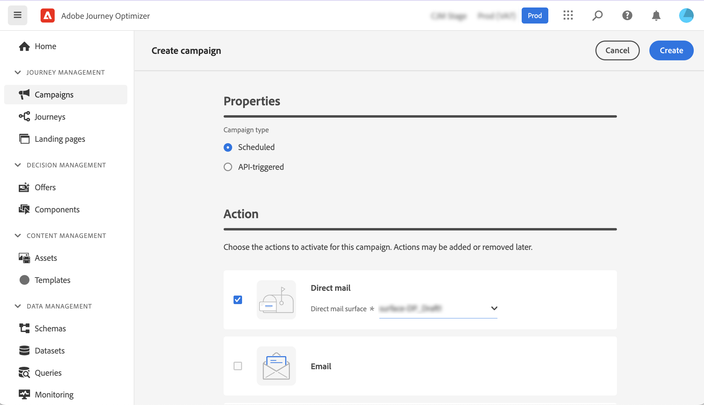
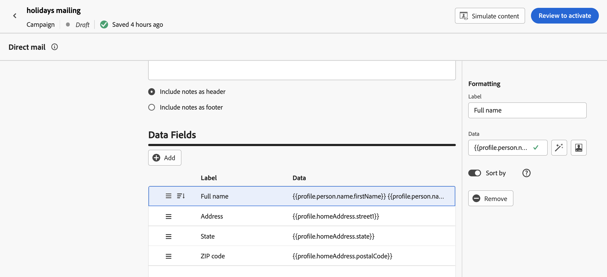
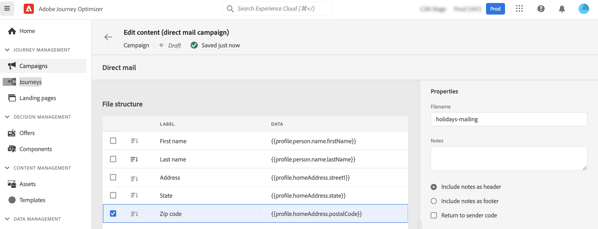

# Create a direct mail message {#create-direct}

>[!CONTEXTUALHELP]
>id="ajo_direct_mail"
>title="Direct mail creation"
>abstract="Create direct mail messages in scheduled campaigns and design the extraction files required by direct mail providers to send mail to your customers."

## Create a direct mail campaign{#create-dm-campaign}

1. Create a new scheduled campaign, select **[!UICONTROL Direct mail]** as your action and choose the **[!UICONTROL Direct mail surface]** to use. [Learn how to create a direct mail surface](direct-mail-configuration.md#direct-mail-surface).

   

1. Click **[!UICONTROL Create]**.

1. From the **[!UICONTROL Properties]** section, edit your Campaign's **[!UICONTROL Title]** and **[!UICONTROL Description]**.

1. Click the **[!UICONTROL Select audience]** button to define the audience to target from the list of available Adobe Experience Platform audiences. [Learn more](../audience/about-audiences.md).

1. In the **[!UICONTROL Identity namespace]** field, choose the namespace to use in order to identify the individuals from the selected audience. [Learn more](../event/about-creating.md#select-the-namespace).

1. Campaigns are designed to be executed on a specific date or on a recurring frequency. Learn how to configure the **[!UICONTROL Schedule]** of your campaign in [this section](../campaigns/create-campaign.md#schedule). 
    
You can now start configuring the extraction file to send to your direct mail provider.

## Configure the extraction file {#extraction-file}

1. From the campaign configuration screen, click the **[!UICONTROL Edit content]** button to configure the extraction file content.

1. Define the name of the extraction file in the **[!UICONTROL Filename]** field.

   Sometimes you may need to add information at the beginning or at the end of the extraction file. To do this, use the **[!UICONTROL Notes]** field then specify if you want to include the note as a header or footer.

   <!--Click on the button to the right of the Output file field and enter the desired label. You can use personalization fields, content blocks and dynamic text (see Defining content). For example, you can complete the label with the delivery ID or the extraction date.-->

   

1. Use the left hand-side area to define the information to be displayed as columns into the extraction file:

   1. Click the **[!UICONTROL Add]** button to add a new column, then select it from the list.

   1. In the **[!UICONTROL Formatting]** section, specify a label for the column then define the profile attributes to display using the [Expression Editor](../personalization/personalization-build-expressions.md).

      
      
   1. To sort the extraction file using the selected column, toggle the **[!UICONTROL Sort by]** option on. The **[!UICONTROL Sort By]** icon will then display next to the column's label in the file structure.

1. Repeat these steps to add as many columns as needed to build your extraction file. Note that you can add up to 50 columns.

   You can delete a column at any time by selecting it and clicking the **[!UICONTROL Remove]** button from the **[!UICONTROL Formatting]** section.

   

You can now test and send your SMS message to your audience. [Learn more](test-send-direct-mail.md)
