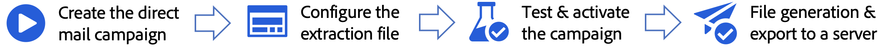

# Get started with direct mail {#create-direct}

>[!AVAILABILITY]
>
>For now, Direct mail channel is not available for organizations that have purchased the Adobe Healthcare Shield add-on offering.
>

Direct mail is an offline channel that allows you to personalize and generate the extraction files required by direct mail providers to send mail to your customers.

When creating a direct mail campaign, Journey Optimizer automatically generates a file containing all the targeted profiles and selected data, such as postal addresses and profile attributes. This file is sent to the server of your choice so that it is accessible by your chosen direct mail provider, who will handle the actual mailing process for you.

The main steps to send direct mail messages are as follows:

Direct mail messages can only be created in the context of scheduled campaigns. They are not available for use in API-triggered campaigns or in journeys.

>[!IMPORTANT]
>
>Before sending a direct mail message, make sure you have configured:
>
>1. A [file routing configuration](../direct-mail/direct-mail-configuration.md#file-routing-configuration) which specifies the server where the extraction file should be uploaded and stored,
>1. A [direct mail message surface](../direct-mail/direct-mail-configuration.md#direct-mail-surface) which will reference the file routing configuration.
