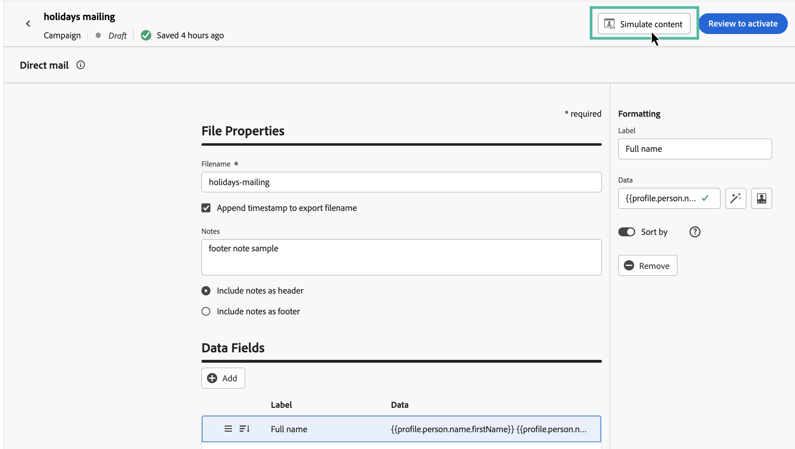
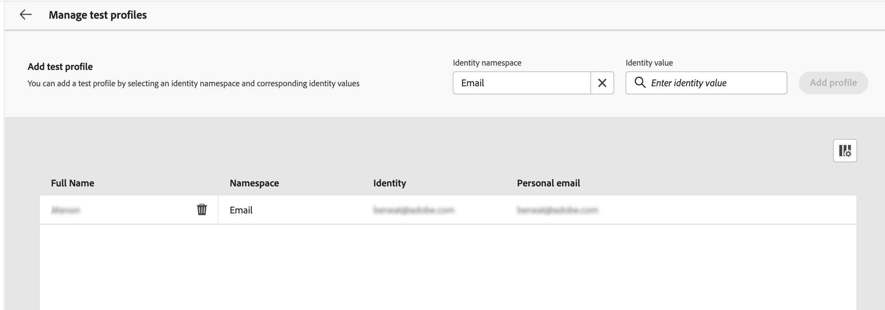
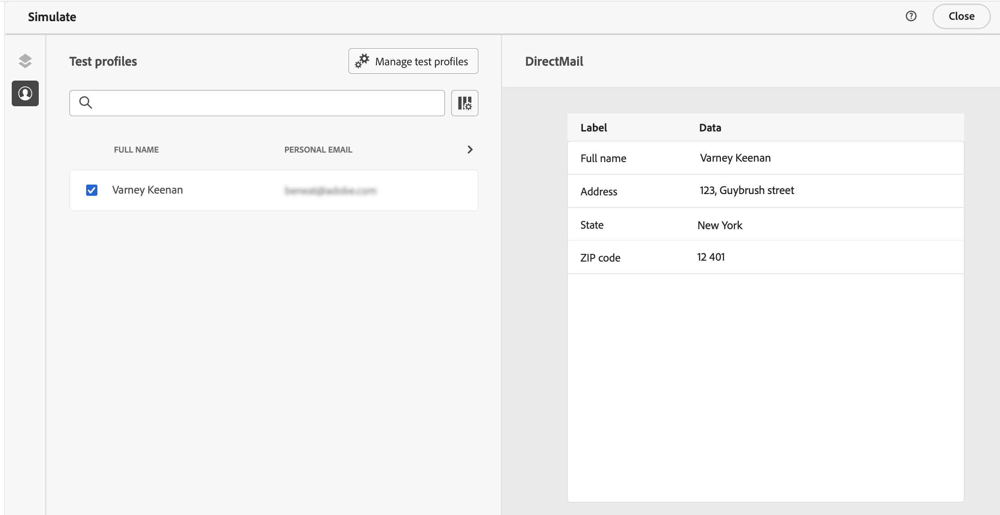
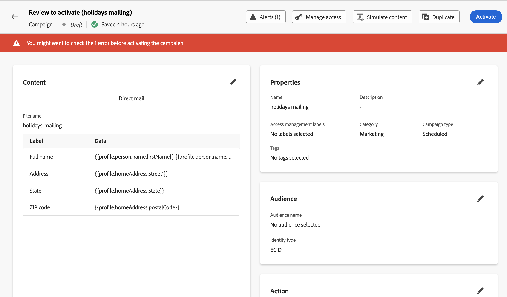

# Test & send a direct mail message {#direct-mail-test-send}

## Preview the extraction file {#preview-dm}

Once the content of the extraction file has been defined, you can use test profiles to preview it. If you inserted personalized content, you can check how this content is displayed in the message, using test profile data.

1. In the extraction file content configuration screen, click **[!UICONTROL Simulate content]**.

      {width="800" align="center"}

1. Click **[!UICONTROL Manage test profiles]** to add a test profile.

1. Find your test profile with the **[!UICONTROL Identity namespace]** and **[!UICONTROL Identity value]** fields. Then, click **[!UICONTROL Add profile]**.

      {width="800" align="center"}

1. Once you selected your test profile, you can close the **[!UICONTROL Add test profile]** window.

1. From the **Preview & test** window, test profile data is added to the extraction file content, allowing you to preview how the file will render.

    {width="800" align="center"}

Once that the file content is ready to be sent, close the simulate screen then click the **[!UICONTROL Review to activate]** button.

## Validate & activate the direct mail campaign {#dm-validate}

Before activating the direct mail campaign, make sure that the campaign and the extraction file are configured properly. To do this, check alerts in the upper section of the editor. Some of them are simple warnings, but others can prevent you from sending the message. Two types of alerts can happen: warnings and errors.

* **Warnings** refer to recommendations and best practices. For example, a warning message is displayed if your SMS message is empty.

* **Errors** prevent you from publishing the campaign, as long as they are not resolved. For example, an error message warns you when the subject line is missing.

{width="800" align="center"}

When your direct mail campaign is ready, click the **[!UICONTROL Activate]** button. When the campaign starts, the extraction file will be automatically generated and exported to the server specified in your [file routing configuration](../direct-mail/direct-mail-configuration.md).

Once sent, you can measure the impact of your direct mail campaign within the Campaign reports. For more on reporting, refer to this section.

## Manage consent for direct mail {#dm-consent-management}

In [!DNL Journey Optimizer], consent is handled by the Experience Platform [Consent schema](https://experienceleague.adobe.com/docs/experience-platform/xdm/field-groups/profile/consents.html){target="_blank"}. By default, the value for the consent field is empty and treated as consent to receive your communications.

If a profile has opted out from receiving direct mail, in the corresponding Experience Platform profile attributes, the value for `consents.marketing.postalMail.val` will be `n` and the corresponding profile will be excluded from subsequent deliveries.

To enable it again, the profile attribute has to be changed back to `consents.marketing.postalMail.val` : `y`.

To manage a profile's attributes, go to Experience Platform and access the profile by selecting an identity namespace and a corresponding identity value. Learn more in the [Experience Platform documentation](https://experienceleague.adobe.com/docs/experience-platform/profile/ui/user-guide.html#getting-started){target="_blank"}.

Learn more on managing opt-out in Journey Optimizer in [this section](../privacy/opt-out.md).
