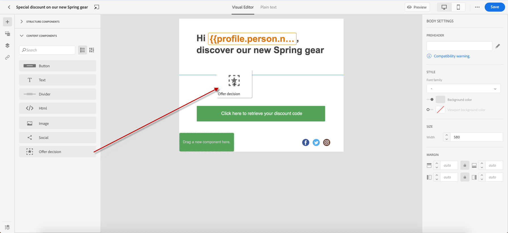
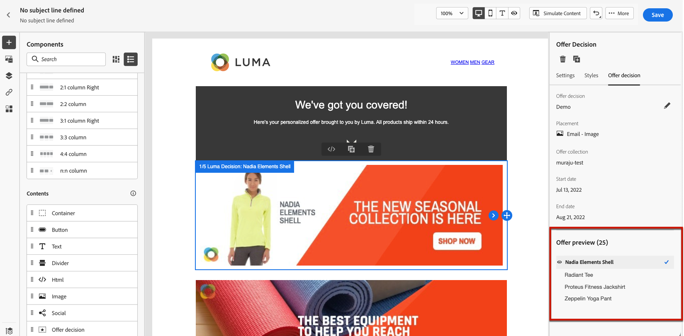
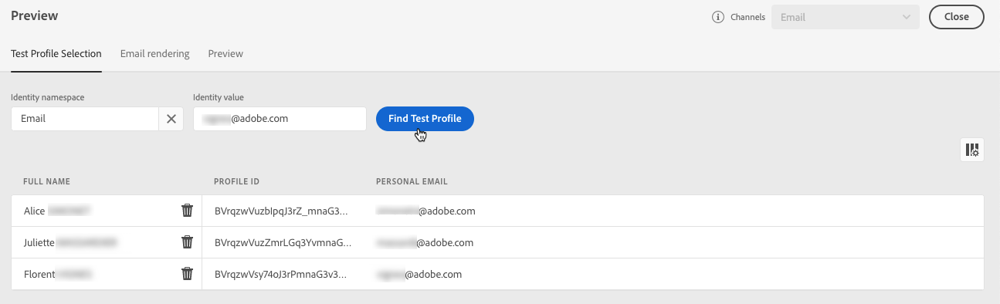
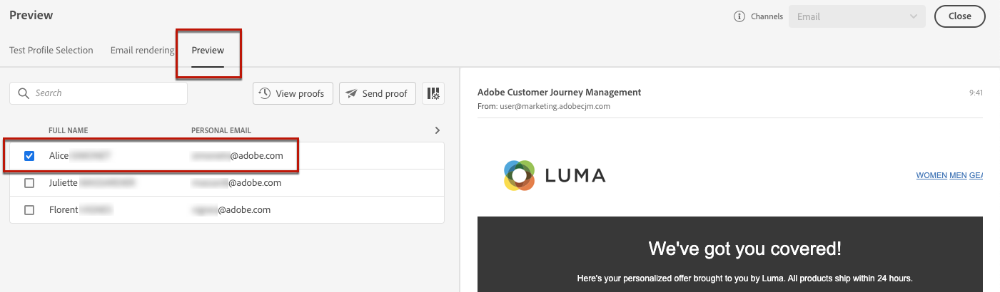

# Add personalized offers {#deliver-personalized-offers}

In [!DNL Journey Optimizer] emails, you can insert decisions that will leverage the Decision management engine in order to pick the best offer to deliver to your customers.

For example, you can add a decision that will display in your email a special discount offer that will vary according to the recipient's loyalty level.

>[!IMPORTANT]
>
>If changes are made to an offer decision which is being used in a journey's message, you need to unpublish the journey and republish it.  This will ensure that the changes are incorporated into the journey's message and that the message is consistent with the latest updates.

* For more on how to create and manage offers, refer to [this section](../offers/get-started/starting-offer-decisioning.md).
* For a **full end-to-end example** showing how to configure offers, use them in a decision and leverage this decision in an email, check out [this section](../offers/offers-e2e.md#insert-decision-in-email).

➡️ [Learn how to add offers as personalization in this video](#video-offers)

## Insert a decision in an email {#insert-offers}

>[!CAUTION]
>
>Before starting, you must [define an offer decision](../offers/offer-activities/create-offer-activities.md).

To insert a decision into an email message, follow the steps below:

1. Create your email, then open the Email Designer to configure its content.

1. Add an **[!UICONTROL Offer decision]** content component.

    

    Learn how to use content components in [this section](content-components.md).

1. The **[!UICONTROL Offer decision]** tab displays in the right palette. Click **[!UICONTROL Select Offer decision]**:

    1. In the window that displays, select the placement corresponding to the offers that you want to display.

        [Placements](../offers/offer-library/creating-placements.md) are containers that are used to showcase your offers. In this example, we will use the "email top image" placement. This placement has been created in the Offer Library to display image-type offers situated to the top of messages.

    1. Decisions matching the selected placement display. Select the decision to use in the content component, then click **[!UICONTROL Add]**.

        >[!NOTE]
        >
        >Only decisions that are compatible with the selected placement display in the list. In this example, only one offer activity matches the "email top image" placement.

        

The decision is now added to the component. After saving your changes, your offers are ready to be displayed to the relevant profiles when sending the message as part of a journey.

>[!NOTE]
>
>When you update an offer, fallback offer, offer collection, or offer decision which is directly or indirectly referenced in message, the updates are automatically reflected in the corresponding message.

## Preview offers in an email {#preview-offers-in-email}

You can preview the different offers that are part of the decision added to the email using the **[!UICONTROL Offer]** section or the content components arrows.

To display the different offers that are part of the decision with a customer profile, follow the steps below.

1. Select the test profiles to use to preview the offer:

    1. Click the **[!UICONTROL Simulate Content button]** button then choose the namespace to use to identify test profiles from the **[!UICONTROL Identity namespace]** field.

        >[!NOTE]
        >
        >In this example, we use the **Email** namespace. Learn more about Adobe Experience Platform identity namespaces [in this section](../audience/get-started-identity.md).

    1. In the **[!UICONTROL Identity value]** field, enter the value to identify the test profile. In this example, enter the email address of a test profile.

    <!--For example enter smith@adobe.com and click the **[!UICONTROL Add profile]** button.-->

    1. Add other profiles so that you can test different variants of the message depending on the profile data.

        

1. Click the **[!UICONTROL Preview]** tab to test your message then select a test profile. The offer corresponding to the selected profile (a woman) is displayed.

    

    You can select other test profiles to preview the email content for each variant of your message. In the message content, the offer corresponding to the selected test profile (now a man) is now displayed.

Learn more on the detailed steps to check message preview in [this section](#preview-your-messages).

## How-to video{#video-offers}

Learn how to add a decision management component to messages in [!DNL Journey Optimizer].

>[!VIDEO](https://video.tv.adobe.com/v/334088?quality=12)
