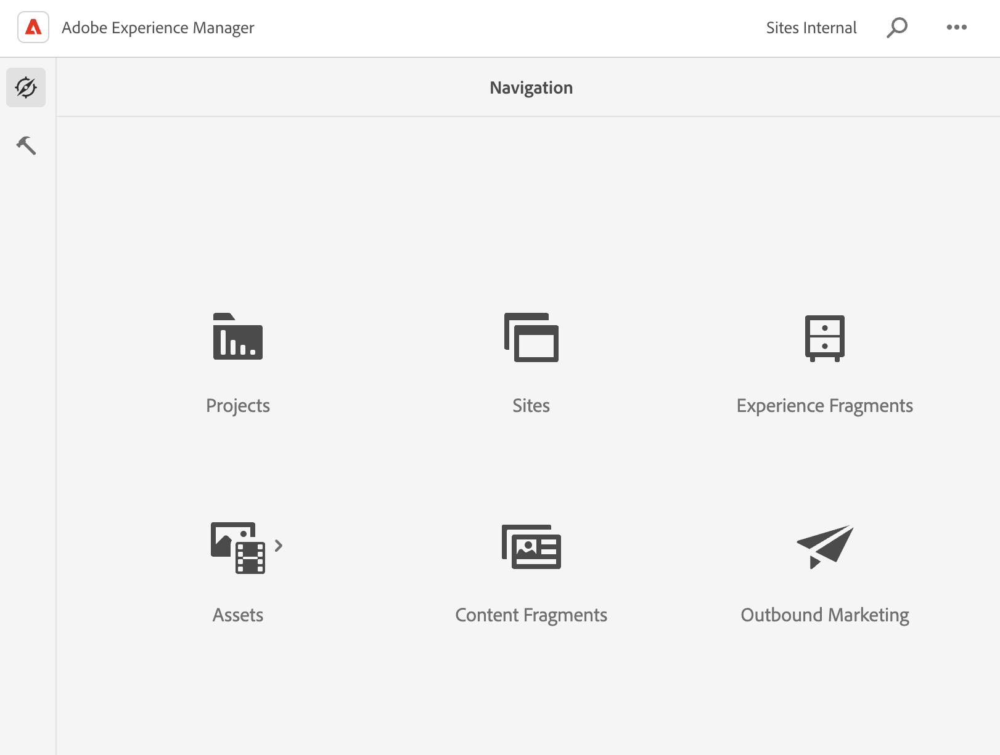
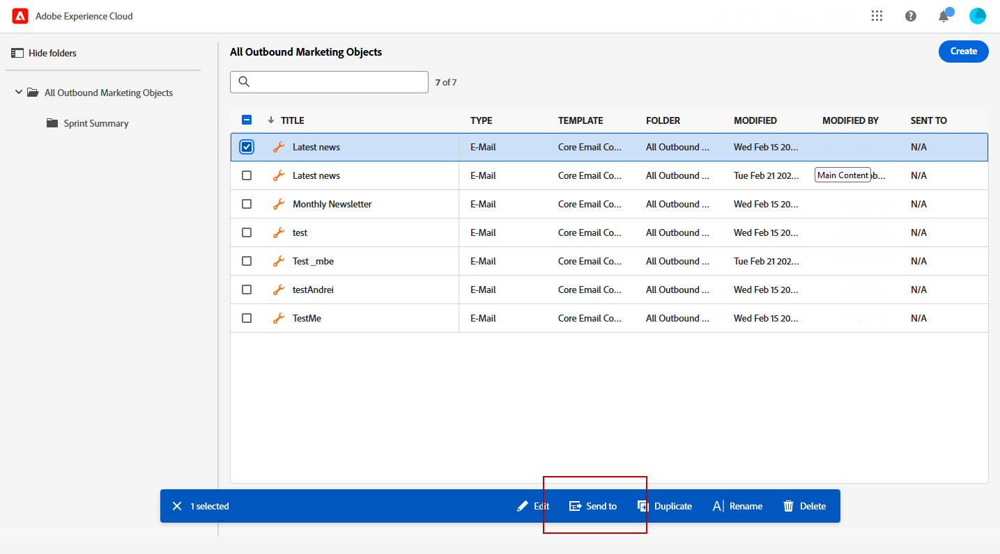
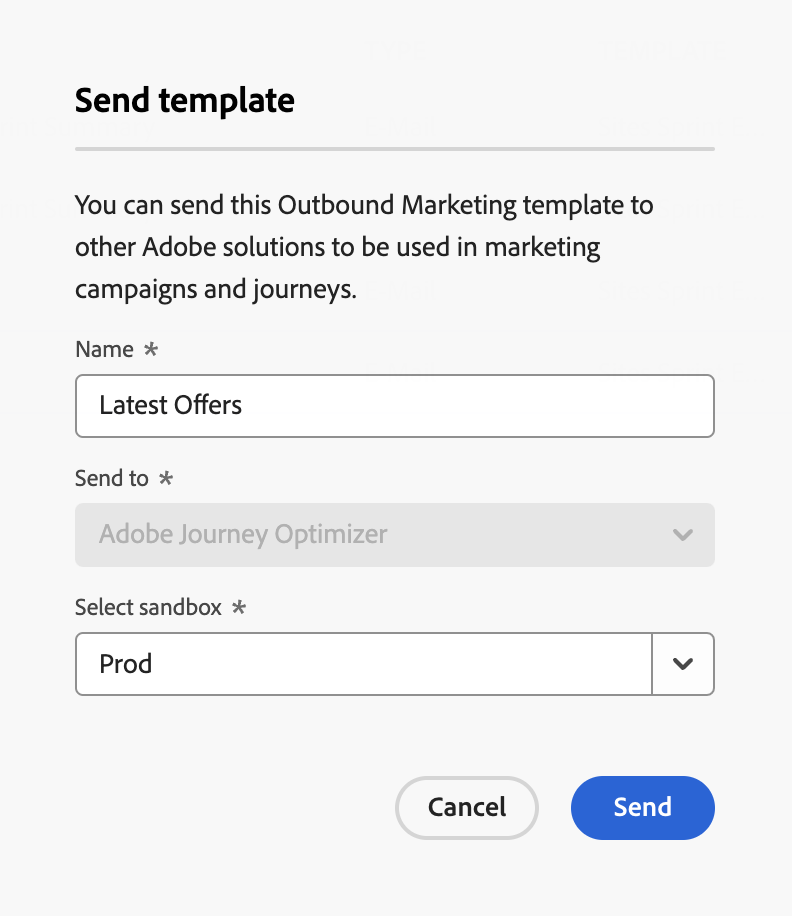
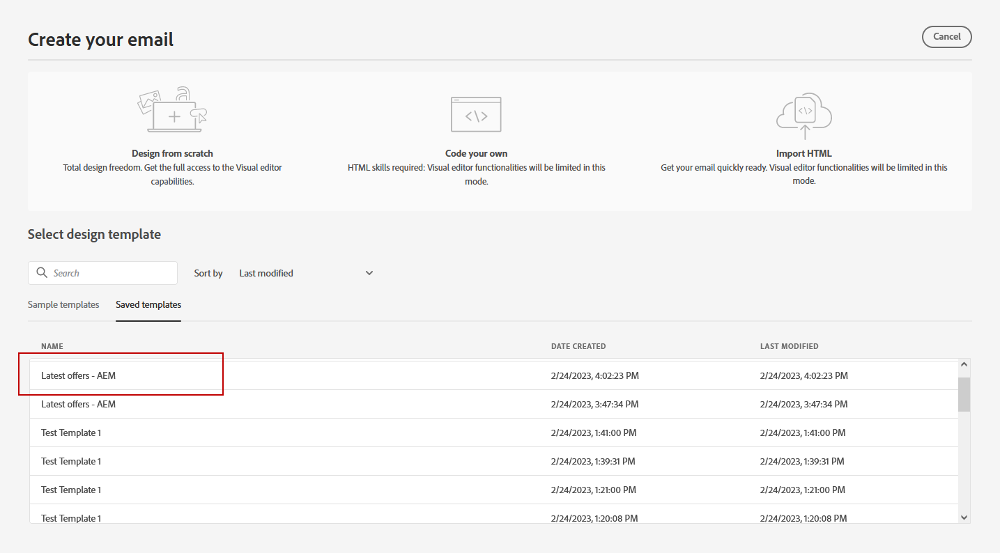
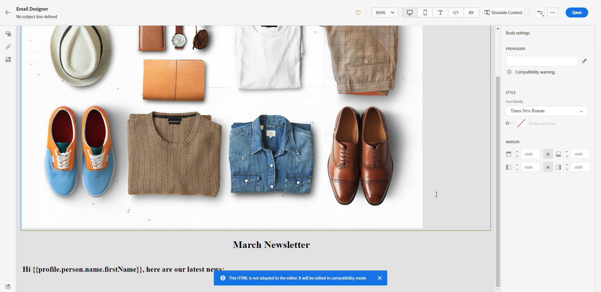
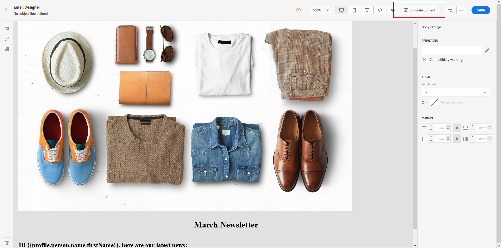

# Work with Adobe Experience Manager templates {#aem-templates}

>[!AVAILABILITY]
>
>Integration with Adobe Experience Manager is currently available as a beta to select users only.
> As a beta user, use [this form](https://forms.office.com/pages/responsepage.aspx?id=Wht7-jR7h0OUrtLBeN7O4Wf0cbVTQ3tCpW_unE-w8-JUN1FaNlAzNkhPSUdaSkJXVFRCNTRJNVRFSy4u){target="_blank"} to share feedback.

With Adobe Journey Optimizer, you can create custom-tailored messages through Adobe Experience Manager sites. Start by designing your templates using Adobe Experience Manager's content sources, then send them to Adobe Journey Optimizer. Once shared, these templates can be accessed in Adobe Journey Optimizer's email designer, simplifying the process of crafting and sending messages to your desired audience.

## Prerequisites {#prerequisites}

Before starting using this capability, make sure you are aligned with the following requirements:

* **Experience Manager settings**

    This capability is available with [Adobe Experience Manager as a Cloud Service](https://experienceleague.adobe.com/docs/experience-manager-cloud-service/content/overview/introduction.html){target="_blank"}.

    As a part of the beta program, the Cloud Service configuration is performed by Adobe in Adobe Experience Manager to connect to Adobe Journey Optimizer. 

* **Permissions**

    To create, edit and delete content templates in Adobe Journey Optimizer, you must have the **[!DNL Manage Library Items]** permission included in the **[!DNL Content Library Manager]** product profile. [Learn more](../administration/ootb-product-profiles.md#content-library-manager)

## Guardrails and limitations{#aem-templates-limitations}

To further optimize your use of Adobe Experience Manager with Adobe Journey Optimizer, it's important to be aware of the following additional guardrails and limitations:

* Proper Journey Optimizer syntax is required for personalization in the Experience Manager template to be effective. [Learn more](../personalization/personalization-syntax.md)

* Bulk template export is not currently supported, templates must be exported individually.

* Syncing between Experience Manager and Journey Optimizer is currently not available. If changes are made to an Experience Manager template after it has been sent to Journey Optimizer, the user will need to re-export the template and re-send it to Journey Optimizer.

## Send a template to Journey Optimizer{#aem-templates-send}

To export an Adobe Experience Manager template to Adobe Journey Optimizer, follow the steps below:

1. From your Adobe Experience Manager homepage, select **[!UICONTROL Outbound Marketing]**.

    

1. From your content library, you can use previously configured templates or create one from scratch. [Learn more](https://experienceleague.adobe.com/docs/experience-manager-65/authoring/authoring/managing-pages.html?lang=en#creating-a-new-page)

1. By incorporating Journey Optimizer personalization syntax into your template, you can enhance its customization capabilities. [Learn more](../personalization/personalization-syntax.md)

    

1. Select the template you want to export to Journey Optimizer and click **[!UICONTROL Send to]** from the advanced menu. 

    

1. Enter the **[!UICONTROL Name]** of the Content template and select the target **[!UICONTROL Sandbox]**.

    
    
1. After you have clicked the **[!UICONTROL Send]** button, the export process will begin. Once the export is complete, you will see the following message in the user interface: "Template "XX" sent successfully to AJO".

The template is added to Adobe Journey Optimizer content templates of the selected sandbox.

## Use and personalize an Adobe Experience Manager template{#aem-templates-perso}

Once the Experience Manager template is available in Journey Optimizer as a content template, you can identify and incorporate the necessary content for the email, including personalization.

1. In Journey Optimizer, from the **[!UICONTROL Content template]** menu, access your imported template.

    

1. By clicking the **[!UICONTROL Alert]** button, you can quickly check if any important settings are missing. This will help ensure that your messages are properly configured and prevent any potential errors or issues.

    

1. In the **[!UICONTROL Template properties]** window, click the **[!UICONTROL Manage access]** button to assign custom or core data usage labels to your template. [Learn more on Object Level Access Control (OLAC)](../administration/object-based-access.md)

1. To further personalize your Experience Manager template and add custom personalization to your content, click **[!UICONTROL Edit content]**. This will allow you to easily make changes and tailor the template to your specific needs. [Learn more](get-started-email-design.md)

    >[!WARNING]
    >
    > If you want to edit and personalize your template, you will only be able to use the compatibility mode. 

1. When your content template is ready, [test and validate it](content-templates.md#test-template).

1. Once your content has been defined, you can use it when creating new email by browsing the **[!UICONTROL Saved templates]** collection. Then, select **[!UICONTROL Use this template]**.

    

1. You can now edit and personalize your content. For more information on how to build your email content, refer to this [page](content-from-scratch.md).

    

1. If you added personalized content to your Experience Manager template, click **[!UICONTROL Simulate Content]** to preview how it will appear in the message using test profiles. 

    [Learn more on preview and test profiles](../email/preview.md)

    

1. When viewing the message preview, any personalized elements are automatically replaced with the corresponding data from the selected test profile. 

    If needed, additional test profiles can be added through the **[!UICONTROL Manage test profiles]** button.

    

When your email is ready, complete the configuration of your [journey](../building-journeys/journey-gs.md) or [campaign](../campaigns/create-campaign.md), and activate it to send the message.
