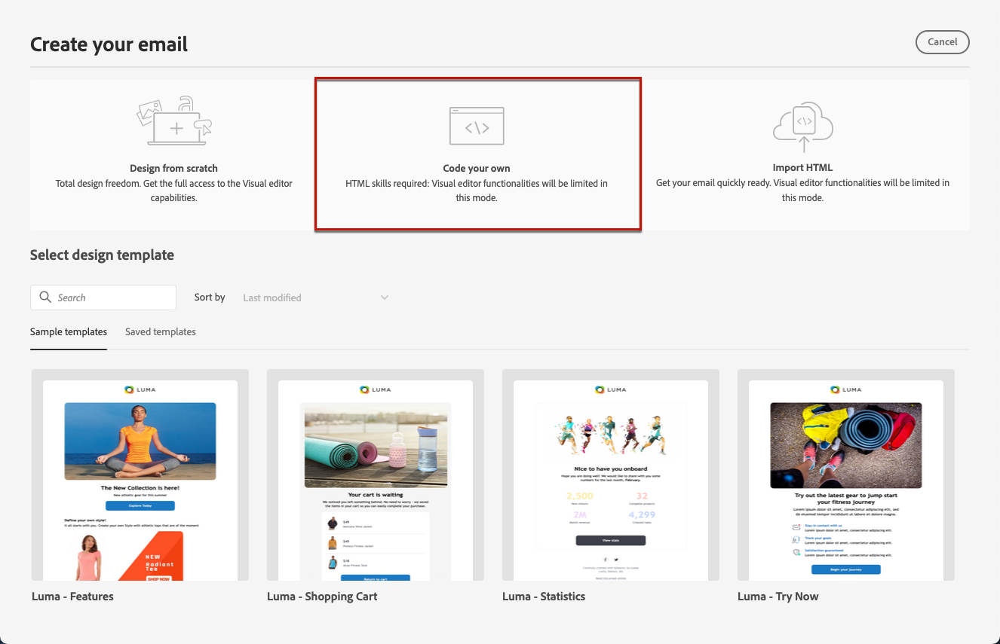

# Code your own content {#code-content}

Use the **[!UICONTROL Code your own]** mode to import raw HTML and/or code your email content. This method requires HTML skills.

➡️ [Discover this feature in video](#video)

>[!CAUTION]
>
> Images from [Adobe Experience Manager Assets Essentials](../content-management/assets-essentials.md) cannot be referenced when using this method. The images referenced in your HTML code must be stored into a public location. 

1. From the Email Designer home page, select **[!UICONTROL Code your own]**.

    

1. Enter or paste your raw HTML code. 

1. Use the left pane to leverage [!DNL Journey Optimizer] personalization capabilities. [Learn more](../personalization/personalize.md)

    

1. If you want to clear your email content and start your email from a new design, select **[!UICONTROL Change your design]** from the options menu.
    
    

    >[!NOTE]
    >
    >This action opens the selected template in the Email Designer. From there, you can either complete the design of your email, or go back to the code editor using the **[!UICONTROL Switch to code editor]** option.

1. Click the **[!UICONTROL Preview]** button to check the message design and personalization using test profiles. [Learn more](preview.md)

    

1. Once your code is ready, click **[!UICONTROL Save]** then go back to the message creation screen to finalize your message.

    
