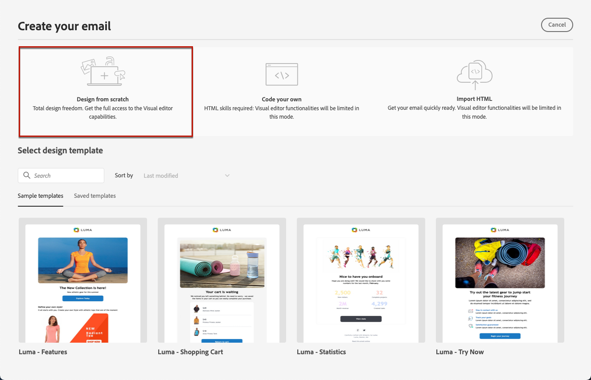
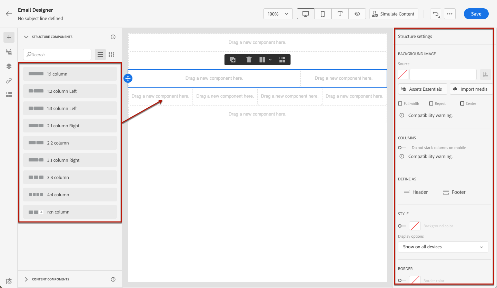
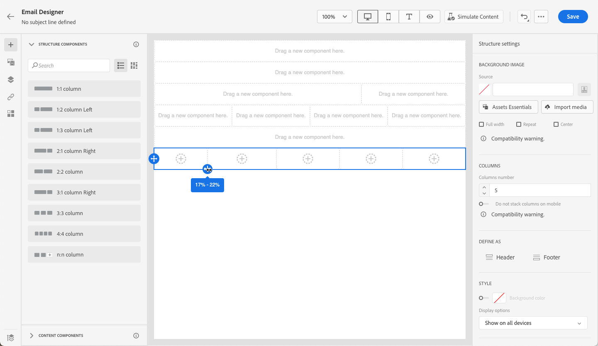
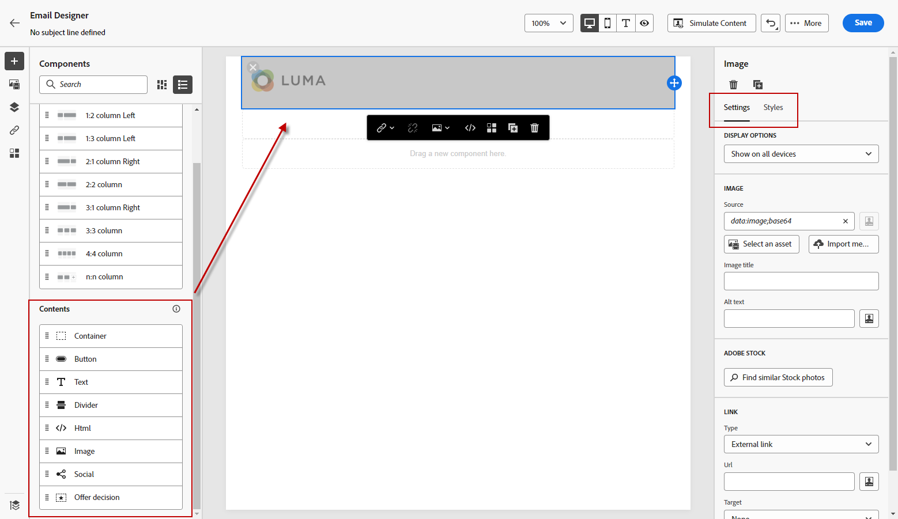
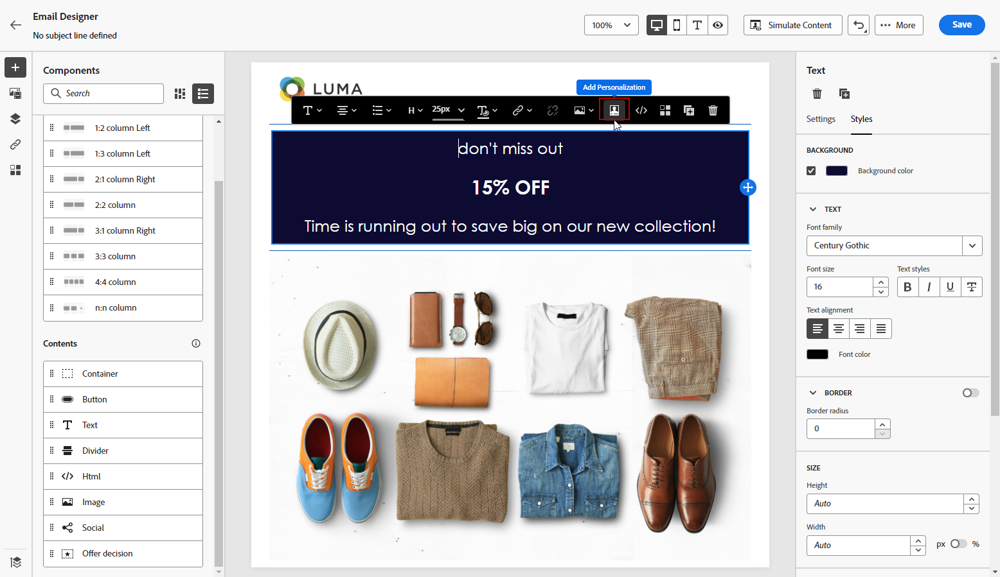
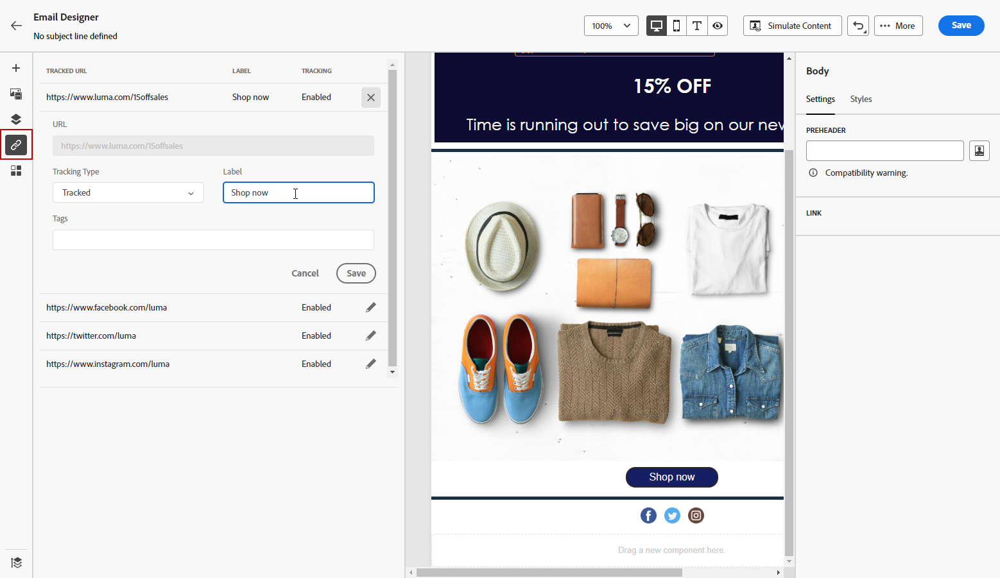
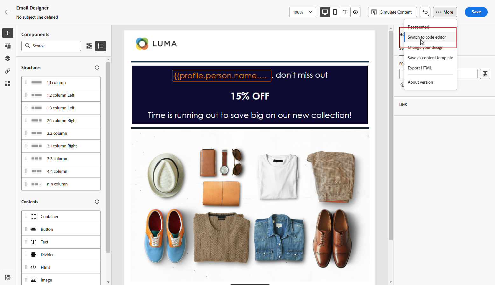
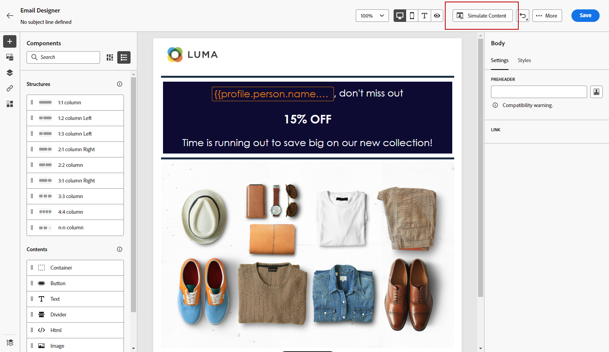

# Start from scratch {#content-from-scratch}

>[!CONTEXTUALHELP]
>id="ac_structure_components_email"
>title="About Structure components"
>abstract="Structure components define the layout of the email."

>[!CONTEXTUALHELP]
>id="ac_structure_components_landing_page"
>title="About Structure components"
>abstract="Structure components define the layout of the landing page."

>[!CONTEXTUALHELP]
>id="ac_structure_components_fragment"
>title="About Structure components"
>abstract="Structure components define the layout of the fragment."

>[!CONTEXTUALHELP]
>id="ac_structure_components_template"
>title="About Structure components"
>abstract="Structure components define the layout of the template."

>[!CONTEXTUALHELP]
>id="ac_edition_columns_email"
>title="Defining email columns"
>abstract="The Email Designer allows you to easily define the layout of your email by defining column structure."

>[!CONTEXTUALHELP]
>id="ac_edition_columns_landing_page"
>title="Defining landing page columns"
>abstract="The Email Designer allows you to easily define the layout of your landing page by defining column structure."

>[!CONTEXTUALHELP]
>id="ac_edition_columns_fragment"
>title="Defining fragment columns"
>abstract="The Email Designer allows you to easily define the layout of your fragment by defining column structure."

>[!CONTEXTUALHELP]
>id="ac_edition_columns_template"
>title="Defining template columns"
>abstract="The Email Designer allows you to easily define the layout of your template by defining column structure."

The Email Designer allows you to easily define the structure of your email. By adding and moving structural elements with simple drag-and-drop actions, you can design the shape of your email within seconds.

To start building your email content, follow the steps below:

1. From the Email Designer home page, select the **[!UICONTROL Design from scratch]** option.

    

1. Start designing your email content by drag and dropping **[!UICONTROL Structure components]** into the canvas to define the layout of your email.

   >[!NOTE]
   >
   >Stacking columns is not compatible with all email programs. When not supported, columns will not be stacked.

    <!--Once placed in the email, you cannot move nor remove your components unless there is already a content component or a fragment placed inside. This is not true in AJO - TBC?-->

1. Add as many **[!UICONTROL Structure components]** as needed and edit their settings in the dedicated pane on the right.

    

    Select the **[!UICONTROL n:n column]** component to define the number of columns of your choice (between 3 and 10). You can also define the width of each column by moving the arrows at the bottom of each column.

    

   >[!NOTE]
   >
   >Each column size cannot be under 10% of the total width of the structure component. You cannot remove a column that is not empty.

1. Expand the **[!UICONTROL Content components]** section and add as many elements as you need into one or more structure components. [Learn more about content components](content-components.md)

1. Each component can be further customized using the **[!UICONTROL Component settings]** pane on the right. For example, you can change the text style, padding or margin of each component. [Learn more about alignment and padding](alignment-and-padding.md)

    

1. From the **[!UICONTROL Asset picker]**, you can directly select assets stored in the **[!UICONTROL Assets library]**. [Learn more about asset management](assets-essentials.md)

    Double-click the folder which contains your assets. Drag and drop them into a structure component.

    

1. Insert personalization fields to customize your email content from profiles data. [Learn more about content personalization](../personalization/personalize.md)

    

1. Add dynamic content to adapt the content to the targeted profiles based on conditional rules. [Get started with dynamic content](../personalization/get-started-dynamic-content.md)

    

1. Click the **[!UICONTROL Links]** tab from the left pane to display all the URLs of your content that will be tracked. You can modify their **[!UICONTROL Tracking Type]** or **[!UICONTROL Label]** and add **[!UICONTROL Tags]** if needed. [Learn more about links and message tracking](message-tracking.md)

    

1. If needed, you can further personalize your email by clicking **[!UICONTROL Switch to code editor]** from the advanced menu. [Learn more about the code editor](code-content.md)

    

    >[!CAUTION]
    >
    >You will not be able to revert back to the visual designer for this email after switching to the code editor.

1. Once your content is ready, click **[!UICONTROL Simulate content]** to check your email rendering. You can choose the desktop or mobile view. [Learn more about previewing your email](preview.md)

    

1. When your email is ready, click **[!UICONTROL Save]**.

