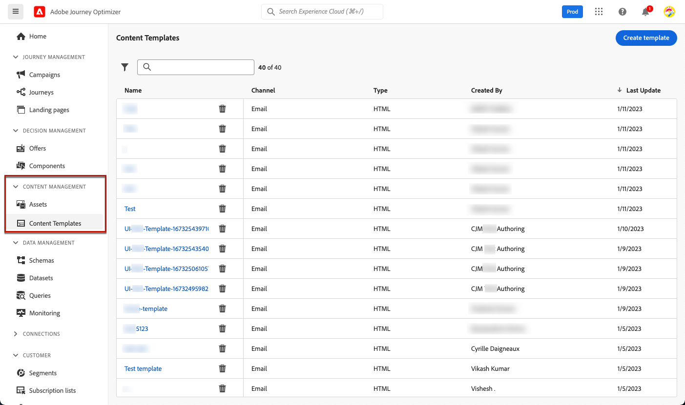
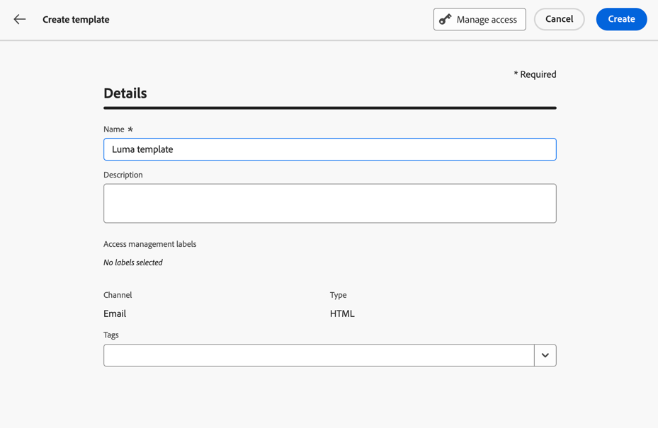
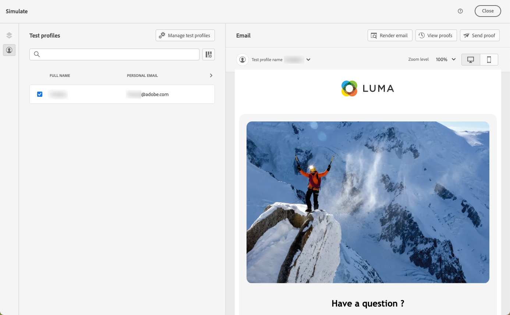
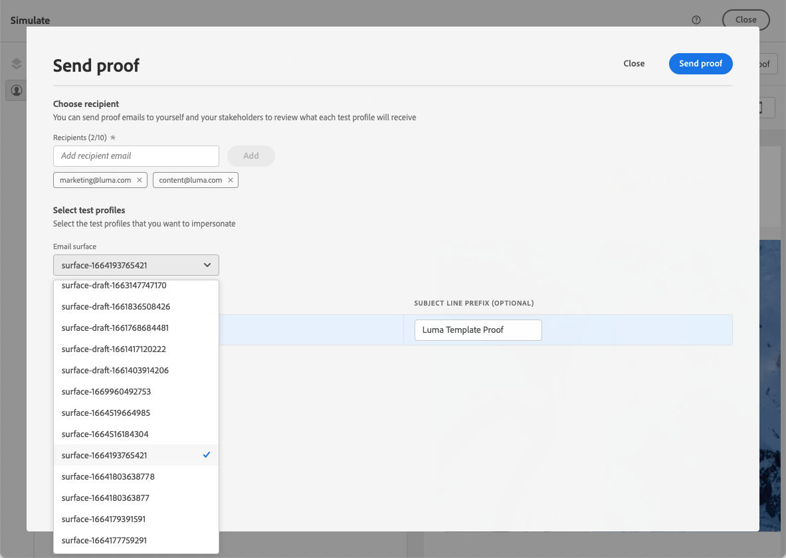
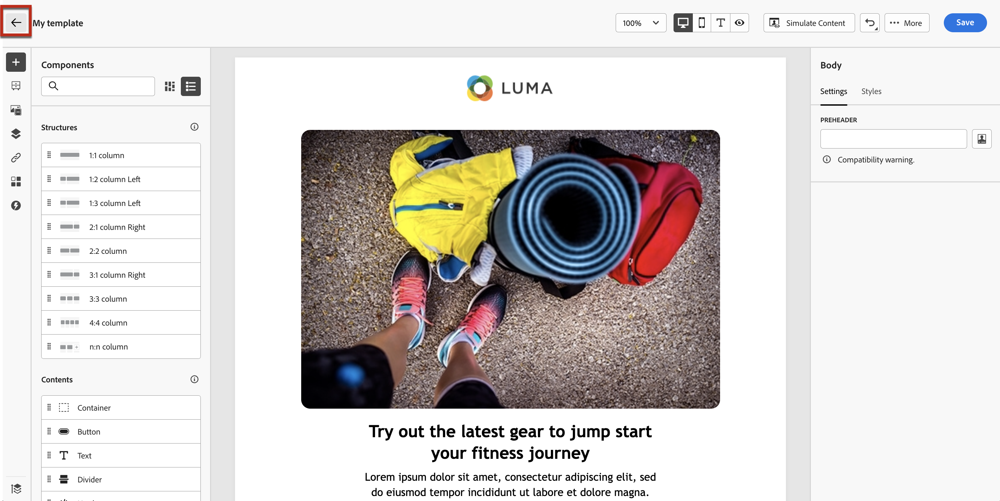

# Create content templates {#content-templates}

>[!CONTEXTUALHELP]
>id="ajo_content_templates"
>title="Create content templates"
>abstract="Create standalone templates to reusa content across journeys and campaigns."

For an acceletared and improved design process, you can create standalone templates to easily reuse custom content across [!DNL Journey Optimizer] campaigns and journeys.

This functionality enables content-oriented users to work on templates outside campaigns or journeys. Marketing users can then reuse and adapt these standalone content templates inside their own journeys or campaigns.

>[!CAUTION]
>
>To create, edit and delete content templates, you must have the **[!DNL Manage Library Items]** permission included in the **[!DNL Content Library Manager]** product profile. [Learn more](../administration/ootb-product-profiles.md#content-library-manager)

For example, a user within your company is in charge of content only, and therefore has no access to campaigns or journeys. However, this user can create an email template that your organization's marketers will be able to select for use in all emails as a starting point.

>[!NOTE]
>
>* Changes made to content templates are not propagated to campaigns or journeys, whether they are live or draft.
>
>* Similarly, when templates are used in a campaign or a journey, any edits you make to your campaign and journey content do not affect the previously used content template.

➡️ [Learn how to create and use templates in this video](#video-templates)

To create a content template, follow the steps below.

1. To access the content template list, select **[!UICONTROL Content Management]** > **[!UICONTROL Content Templates]** from the left menu.

    

1. All the templates that were created on the current sandbox - either from a journey, a campaign or from the **[!UICONTROL Content Templates]** menu - are displayed.

    >[!NOTE]
    >
    >You can sort content templates by creation or modification date.

1. Select **[!UICONTROL Create template]**.

1. Fill in the template details.

    

    >[!NOTE]
    >
    >Currently only the **Email** channel and **HTML** type are supported.

1. To assign custom or core data usage labels to the template, select **[!UICONTROL Manage access]**. [Learn more on Object Level Access Control (OLAC)](../administration/object-based-access.md).

1. Click **[!UICONTROL Create]** and choose how you want to design your email from the following options:

    * **[!UICONTROL Design from scratch]**
    * **[!UICONTROL Code your own]**
    * **[!UICONTROL Import HTML]**
    * **[!UICONTROL Select design template]**

    

    >[!NOTE]
    >
    >If you select a template, you can choose between **[!UICONTROL Sample templates]**, which are out-of-the-box email templates, and **[!UICONTROL Saved templates]**, which are the ones that were created either from a journey, a campaign or from the **[!UICONTROL Content Templates]** menu. [Learn more](email-templates.md#save-as-template)

1. The Email Designer displays. Edit your content as needed, the same way you would do for any email inside a journey or a campaign, according to the option you selected:

    * [Design your email from scratch](content-from-scratch.md) through the designer's interface and leverage images from [Adobe Experience Manager Assets Essentials](assets-essentials.md).

    * [Code or copy-paste raw HTML](code-content.md) directly into the Email Designer.

    * [Import existing HTML content](existing-content.md) from a file or a .zip folder.

    * [Use existing content](email-templates.md) from a list of built-in or custom templates.

    

1. Click **[!UICONTROL Simulate Content]** to check your email rendering. You can choose the desktop or mobile view. [Learn more](preview.md)

    >[!CAUTION]
    >
    >To simulate content, you must have the **[!DNL Manage Simulate Content]** permission included in the **[!DNL Content Library Manager]** product profile. [Learn more](../administration/ootb-product-profiles.md#content-library-manager)

    

1. You can send a proof to test your content and have it approved by some internal users before using it in a journey or a campaign.

    * To do so, click the **[!UICONTROL Send proof]** button and follow the steps described in [this section](preview.md#send-proofs).
    
    * Before sending the proof, you must select the [email surface](../configuration/channel-surfaces.md) that will be used to test your content.

        

1. Once your template is ready, click **[!UICONTROL Save]**.

1. If needed, click the arrow next to the template name to go back to the **[!UICONTROL Details]** screen and edit your template.

    

1. You can now use this content template when building any [email](get-started-email-design.md) within [!DNL Journey Optimizer]. Learn more on [using a saved template](email-templates.md#use-saved-template).

    

## How-to video{#video-templates}

Learn how to create, edit, and use content templates in [!DNL Journey Optimizer].

>[!VIDEO](https://video.tv.adobe.com/v/3413743/?quality=12)