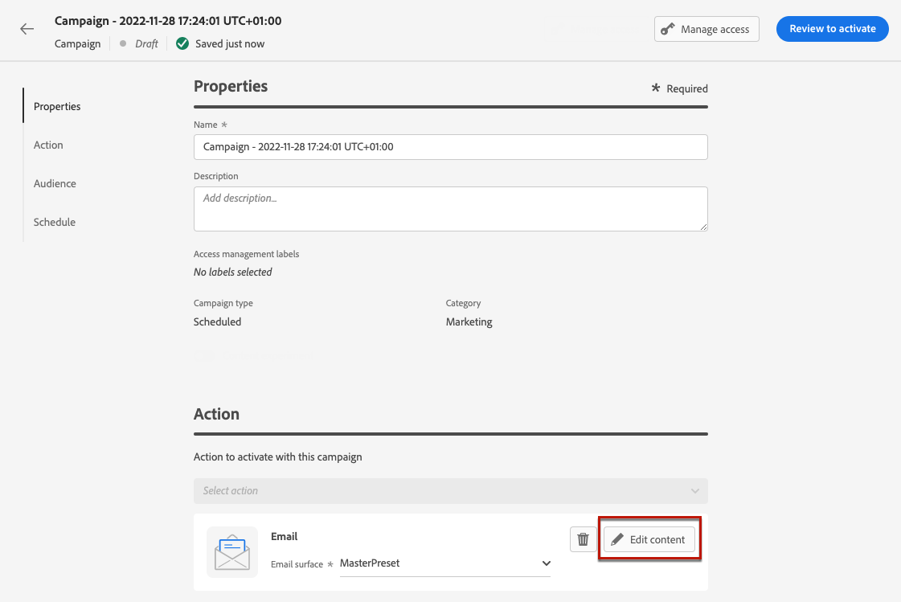
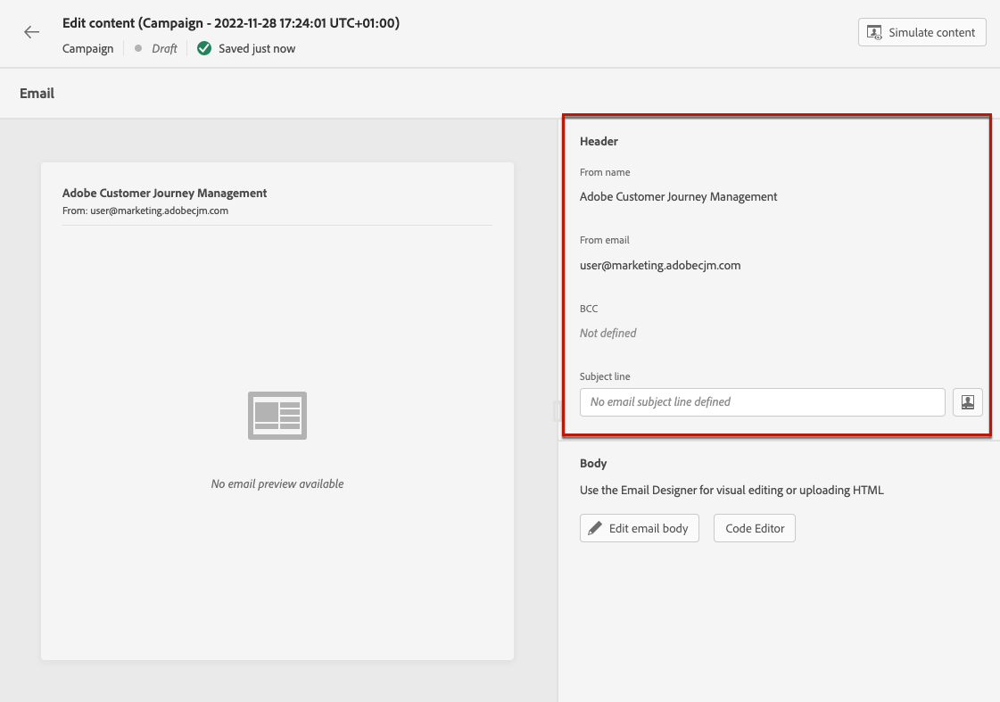
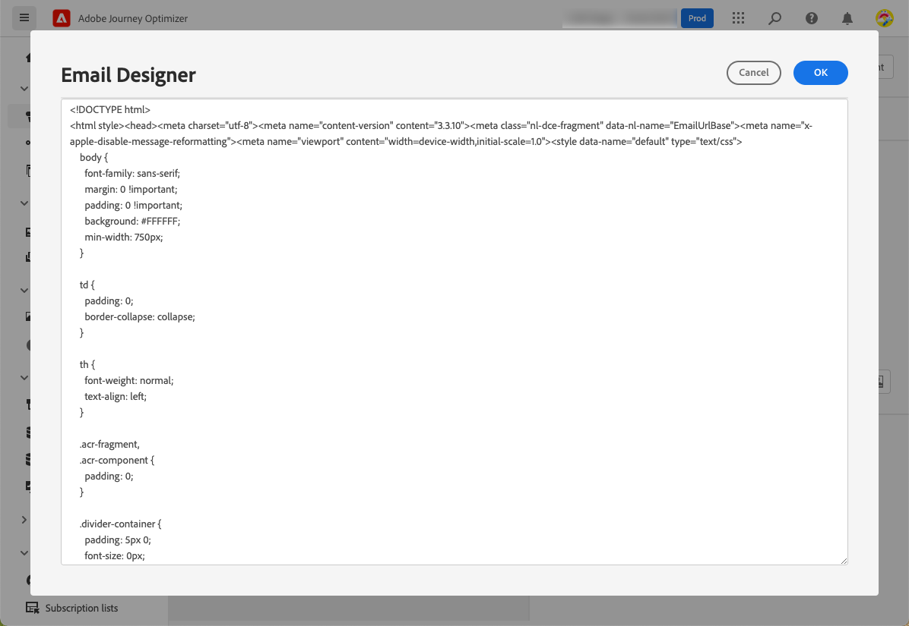
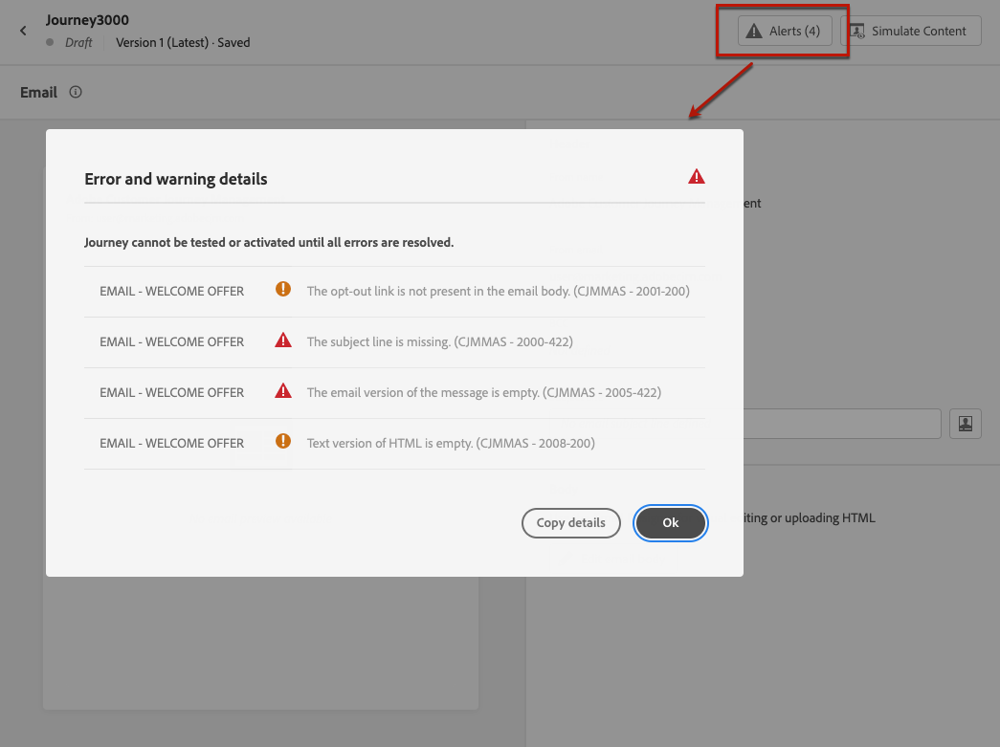

# Create an email {#create-email}

>[!CONTEXTUALHELP]
>id="ajo_message_email"
>title="Email creation"
>abstract="Define your email subject line, and open the Email Designer to create the content of the email."

## Add an email action {#email-action}

To create an email in [!DNL Journey Optimizer], add an **[!UICONTROL Email]** action to a journey or a campaign. Then follow the steps below, according to your case.

>[!BEGINTABS]

>[!TAB Add an email to a journey]

1. Open your journey, then drag and drop an **[!UICONTROL Email]** activity from the **[!UICONTROL Actions]** section of the palette.

1. Provide basic information on your message (label, description, category).

1. Choose the [email surface](email-settings.md) to use.

    

    The field is pre-filled, by default, with the last surface used for that channel by the user.

>[!NOTE]
>
>You can use the Send-Time Optimization option to predict the best time to send the message to maximize engagement based on historical open and click rates. [Learn how to work with Send-Time Optimization](../building-journeys/journeys-message.md#send-time-optimization)  

For more information on how to configure a journey, refer to [this page](../building-journeys/journey-gs.md).

>[!TAB Add an email to a campaign]

1. Create a new scheduled or API-triggered campaign, and select **[!UICONTROL Email]** as your action.

1. Choose the [email surface](email-settings.md) to use.

    

1. Click **[!UICONTROL Create]**.

1. Complete the steps to create an email campaign, such as the campaign properties, [audience](../audience/about-audiences.md), and [schedule](../campaigns/create-campaign.md#schedule).

    

<!--
From the **[!UICONTROL Action]** section, specify if you want to track how your recipients react to your delivery: you can track email opens, and/or clicks on links and buttons in your email.

-->

For more information on how to configure a campaign, refer to [this page](../campaigns/get-started-with-campaigns.md).

>[!ENDTABS]

## Define your email content {#define-email-content}

<!-- update the quarry component with right ID value-->

>[!CONTEXTUALHELP]
>id="test_id"
>title="Configure email content"
>abstract="Create the content of your email. Define its subject, then leverage the Email Designer to build and personalize the body of the email."

1. From the journey or campaign configuration screen, click the **[!UICONTROL Edit content]** button to configure the email content. [Learn more](get-started-email-design.md)

    

    In the **[!UICONTROL Header]** section of the **[!UICONTROL Edit content]** screen, the **[!UICONTROL From name]**, **[!UICONTROL From email]** and **[!UICONTROL BCC]** field are configured in the email surface that you selected. [Learn more](email-settings.md) <!--check if same for journey-->

    

1. Add a subject line for your message. To configure and personalize the subject line with the expression editor, click the **[!UICONTROL Open personalization dialog]** icon. [Learn more](../personalization/personalization-build-expressions.md)

1. Click the **[!UICONTROL Edit email body]** button to access the Email Designer and  start building your content. [Learn more](get-started-email-design.md)

    

1. If you are in a campaign, you can also click the **[!UICONTROL Code Editor]** button to code your own content in plain HTML using the pop-up window that displays.

    

    >[!NOTE]
    >
    >If you already created or imported content through the Email Designer, this content will display in HTML.
    
## Check alerts {#check-email-alerts}

As you are designing your messages, alerts are displayed in the interface (on top right of the screen) when key settings are missing.

>[!NOTE]
>
>If you do not see this button, no alert has been detected.

The settings and elements checked by the system are listed below. You will also find information on how to adapt your configuration to resolve the corresponding issues.

Two types of alerts can happen:

* **Warnings** refer to recommendations and best practices, such as:

    * **[!UICONTROL The opt-out link is not present in the email body]**: adding an unsubscription link into your email body is a best practice. Learn how to configure it in [this section](../privacy/opt-out.md#opt-out-management).

        >[!NOTE]
        >
        >Marketing-type email messages must include an opt-out link, which is not required for transactional messages. The message category (**[!UICONTROL Marketing]** or **[!UICONTROL Transactional]**) is defined at the [channel surface](email-settings.md#email-type) level and when [creating the message](#create-email-journey-campaign) from a journey or a campaign.

    * **[!UICONTROL Text version of HTML is empty]**: do not forget to define a text version of your email body, as it will be used when HTML content cannot be displayed. Learn how to create the text version in [this section](text-version-email.md).

    * **[!UICONTROL Empty link is present in email body]**: check that all the links in your email are correct. Learn how to manage content and links in [this section](content-from-scratch.md).

    * **[!UICONTROL Email size has exceeded the limit of 100KB]**: for optimal delivery, make sure the size of your email does not exceed 100KB. Learn how to edit email content in [this section](content-from-scratch.md).

* **Errors** prevent you from testing or activating the journey/campaign as long as they are not resolved, such as:

    * **[!UICONTROL The subject line is missing]**: email subject line is mandatory. Learn how to define and personalize it in [this section](create-email.md).

    <!--HTML is empty when Amp HTML is present-->

    * **[!UICONTROL The email version of the message is empty]**: this error is displayed when the email content has not been configured. Learn how to design email content in [this section](get-started-email-design.md).

    * **[!UICONTROL Surface doesn't exist]**: you cannot use your message if the surface you have selected is deleted after the message creation. If this error occurs, select another surface in the message **[!UICONTROL Properties]**. Learn more on channel surfaces in [this section](../configuration/channel-surfaces.md).

>[!CAUTION]
>
>To be able to test or activate the journey/campaign using the email, you must resolve all **error** alerts.

## Check and send your email

Once your message content has been defined, you can use test profiles to preview it, send proofs and control its rendering in popular desktop, mobile and web-based clients. If you inserted personalized content, you can check how this content is displayed in the message, using test profile data.

To do this, click **[!UICONTROL Simulate content]** then add a test profile to check your message using the test profile data.

Detailed information on how to select test profiles and preview your content is available in the [Content Management](../content-management/preview-test.md) section.

When your email is ready, complete the configuration of your [journey](../building-journeys/journey-gs.md) or [campaign](../campaigns/create-campaign.md), and activate it to send the message.

>[!NOTE]
>
>To track the behavior of your recipients through email openings and/or interactions, make sure that the dedicated options in the **[!UICONTROL Tracking]** section are enabled in the journey's [email activity](../building-journeys/journeys-message.md) or in the email [campaign](../campaigns/create-campaign.md).<!--to move?-->

<!--

## Define your email content {#email-content}

Use [!DNL Journey Optimizer] Email Designer to [design your email from scratch](../email/content-from-scratch.md). If you have an existing content, you can [import it in the Email Designer](../email/existing-content.md), or [code your own content](../email/code-content.md) in [!DNL Journey Optimizer]. 

[!DNL Journey Optimizer] comes with a set of [built-in templates](email-templates.md) to help you start. Any email can also be saved as a template.

Use [!DNL Journey Optimizer] Expression editor to personalize your messages with profiles' data. For more on personalization, refer to [this section](../personalization/personalize.md).

Adapt the content of your messages to the targeted profiles by using [!DNL Journey Optimizer] dynamic content capabilities. [Get started with dynamic content](../personalization/get-started-dynamic-content.md)

## Email tracking {#email-tracking}

If you want to track the behavior of your recipients through openings and/or clicks on links, enable the following options: **[!UICONTROL Email opens]** and **[!UICONTROL Click on email]**. 

Learn more about tracking in [this section](message-tracking.md).

## Validate your email content {#email-content-validate}

Control the rendering of your email, and check personalization settings with test profiles, using the preview section on the left-hand side. For more on this, refer to [this section](preview.md).

You must also check alerts in the upper section of the editor.  Some of them are simple warnings, but others can prevent you from using the message. 

-->

